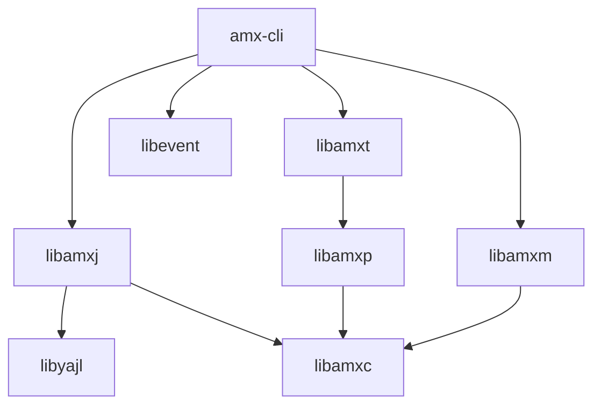

# Interactive Command Line Interface

[[_TOC_]]

## Introduction

The tool `amx-cli` is an interactive command line interface.

It can be extended with commands and features using an add-on system.

The main features are:

- command line history
- tab completion
- recording and playback of commands
- variables can be defined and used
- extensible using libamxm based modules.

## Building, installing and testing

### Docker container

You could install all tools needed for testing and developing on your local machine, but it is easier to just use a pre-configured environment. Such an environment is already prepared for you as a docker container.

1. Install docker

    Docker must be installed on your system.

    If you have no clue how to do this here are some links that could help you:

    - [Get Docker Engine - Community for Ubuntu](https://docs.docker.com/install/linux/docker-ce/ubuntu/)
    - [Get Docker Engine - Community for Debian](https://docs.docker.com/install/linux/docker-ce/debian/)
    - [Get Docker Engine - Community for Fedora](https://docs.docker.com/install/linux/docker-ce/fedora/)
    - [Get Docker Engine - Community for CentOS](https://docs.docker.com/install/linux/docker-ce/centos/)<br /><br />
    
    Make sure you user id is added to the docker group:

    ```
    sudo usermod -aG docker $USER
    ```

1. Fetch the container image

    To get access to the pre-configured environment, all you need to do is pull the image and launch a container.

    Pull the image:

    ```bash
    docker pull registry.gitlab.com/soft.at.home/docker/oss-dbg:latest
    ```

    Before launching the container, you should create a directory which will be shared between your local machine and the container.

    ```bash
    mkdir -p ~/amx_project/applications/
    ```

    Launch the container:

    ```bash
    docker run -ti -d --name oss-dbg --restart always --cap-add=SYS_PTRACE --sysctl net.ipv6.conf.all.disable_ipv6=1 -e "USER=$USER" -e "UID=$(id -u)" -e "GID=$(id -g)" -v ~/amx_project/:/home/$USER/amx_project/ registry.gitlab.com/soft.at.home/docker/oss-dbg:latest
    ```

    The `-v` option bind mounts the local directory for the ambiorix project in the container, at the exact same place.
    The `-e` options create environment variables in the container. These variables are used to create a user name with exactly the same user id and group id in the container as on your local host (user mapping).

    You can open as many terminals/consoles as you like:

    ```bash
    docker exec -ti --user $USER oss-dbg /bin/bash
    ```

### Building

#### Prerequisites

- [libamxc](https://gitlab.com/prpl-foundation/components/ambiorix/libraries/libamxc) - Generic C api for common data containers
- [libamxj](https://gitlab.com/prpl-foundation/components/ambiorix/libraries/libamxj) - JSON parser & generator
- [libamxt](https://gitlab.com/prpl-foundation/components/ambiorix/libraries/libamxt) - Library for adding interactive tty mode to your applications
- [libamxm](https://gitlab.com/prpl-foundation/components/ambiorix/libraries/libamxm) - Modularity api, simplifies creation of add-ons (plug-ins, modules)
- [libamxp](https://gitlab.com/prpl-foundation/components/ambiorix/libraries/libamxp) - Common patterns implementation
- [libevent](https://libevent.org/) - an event notification library
- [libyajl2](https://github.com/lloyd/yajl) 

---
Dependency graph - libraries needed by amx-cli.
For graph simplicity direct dependencies which are also an indirect dependency are not shown.


---

#### Build amx-cli

1. Clone the git repository

    To be able to build it, you need the source code. So open the directory just created for the ambiorix project and clone this library in it (on your local machine).

    ```bash
    cd ~/amx_project/applications
    git clone git@gitlab.com:prpl-foundation/components/ambiorix/applications/amx-cli.git
    ``` 

1. Install dependencies

    Although the container will contain all tools needed for building, it does not contain the libraries needed for building `amx-cli`. To be able to build `amx-cli` you need `libamxc`, `libamxj`, `libamxp`, `libamxt`,`libamxm`, `libyajl2` and `libevent`. These libraries can be installed in the container by executing the following commands. 

    ```bash
    sudo apt update
    sudo apt install libamxc libamxj libamxt libamxm libevent libyajl2
    ```

    Note that you do not need to install all components explicitly. Some components will be installed automatically because other components depend on them.

1. Build it

    ```bash
    cd ~/amx_project/applications/amx-cli
    make
    ```

### Installing

#### Using make target install

You can install your own compiled version easily in the container by running the install target.

```bash
cd ~/amx_project/applications/amx-cli
sudo -E make install
```

#### Using package

From within the container you can create packages.

```bash
cd ~/amx_project/applications/amx-cli
make package
```

The packages generated are:

```
~/amx_project/applications/amx-cli/amx-cli-<VERSION>.tar.gz
~/amx_project/applications/amx-cli/amx-cli-<VERSION>.deb
```

You can copy these packages and extract/install them.

For ubuntu or debian distributions use dpkg:

```bash
sudo dpkg -i ~/amx_project/applications/amx-cli/amx-cli-<VERSION>.deb
```

### Testing

#### Prerequisites

No extra components are needed for testing `amx-cli`.

#### Run tests

You can run the tests by executing the following command.

```bash
cd ~/amx_project/applications/amx-cli/test
make
```

Or this command if you also want the coverage tests to run:

```bash
cd ~/amx_project/applications/amx-cli/test
make run coverage
```

#### Coverage reports

The coverage target will generate coverage reports using [gcov](https://gcc.gnu.org/onlinedocs/gcc/Gcov.html) and [gcovr](https://gcovr.com/en/stable/guide.html).

A summary for each file (*.c files) is printed in your console after the tests are run.
A HTML version of the coverage reports is also generated. These reports are available in the output directory of the compiler used.
Example: using native gcc
When the output of `gcc -dumpmachine` is `x86_64-linux-gnu`, the HTML coverage reports can be found at `~/amx_project/applications/amx-cli/output/x86_64-linux-gnu/coverage/report.`

You can easily access the reports in your browser.
In the container start a python3 http server in background.

```bash
cd ~/amx_project/
python3 -m http.server 8080 &
```

Use the following url to access the reports `http://<IP ADDRESS OF YOUR CONTAINER>:8080/applications/amx-cli/output/<MACHINE>/coverage/report`
You can find the ip address of your container by using the `ip` command in the container.

Example:

```bash
USER@<CID>:~/amx_project/applications/amx-cli$ ip a
1: lo: <LOOPBACK,UP,LOWER_UP> mtu 65536 qdisc noqueue state UNKNOWN group default qlen 1
    link/loopback 00:00:00:00:00:00 brd 00:00:00:00:00:00
    inet 127.0.0.1/8 scope host lo
       valid_lft forever preferred_lft forever
    inet6 ::1/128 scope host 
       valid_lft forever preferred_lft forever
173: eth0@if174: <BROADCAST,MULTICAST,UP,LOWER_UP> mtu 1500 qdisc noqueue state UP group default 
    link/ether 02:42:ac:11:00:07 brd ff:ff:ff:ff:ff:ff link-netnsid 0
    inet 172.17.0.7/16 scope global eth0
       valid_lft forever preferred_lft forever
    inet6 2001:db8:1::242:ac11:7/64 scope global nodad 
       valid_lft forever preferred_lft forever
    inet6 fe80::42:acff:fe11:7/64 scope link 
       valid_lft forever preferred_lft forever
```

in this case the ip address of the container is `172.17.0.7`.
So the uri you should use is: `http://172.17.0.7:8080/applications/amx-cli/output/x86_64-linux-gnu/coverage/report/`
