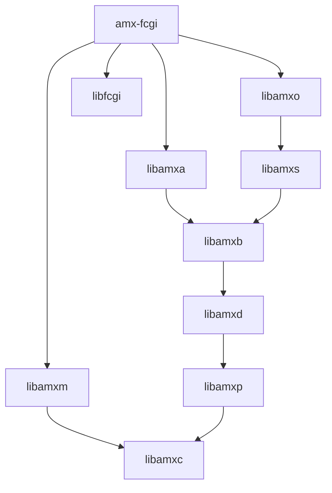

# Fast CGI (amx)

[[_TOC_]]

## Introduction

From [wikipedia](https://en.wikipedia.org/wiki/FastCGI)

> FastCGI is a binary protocol for interfacing interactive programs with a web server. It is a variation on the earlier Common Gateway Interface (CGI). FastCGI's main aim is to reduce the overhead related to interfacing between web server and CGI programs, allowing a server to handle more web page requests per unit of time.

Amx-fcgi provides a fast-cgi interface to bus systems using the bus-agnostic API of Ambiorix (libamxb). It is implemented as an ambiorix data model client, which is launched using the Ambiorix run-time (amxrt).

This application can handle a set of HTTP request, very similar as the USP request, related to BBF data models.

All details of the HTTP request that can be handled and the responses it generates are documented in a confluence page [TR-181 REST API Proposal](https://confluence.softathome.com/display/PRPLWRT/TR-181+REST+API+Proposal)

This application can be used with any web server (HTTP server) that has support for fast-cgi. Some examples of web-servers that support fast-cgi protocol are: (this is not a complete list)

- Apache HTTP Server
- Lighttpd
- Nginx
- Microsoft IIS


## Building, installing and testing

### Docker container

You could install all tools needed for testing and developing on your local machine, but it is easier to just use a pre-configured environment. Such an environment is already prepared for you as a docker container.

1. Install docker

    Docker must be installed on your system.

    If you have no clue how to do this here are some links that could help you:

    - [Get Docker Engine - Community for Ubuntu](https://docs.docker.com/install/linux/docker-ce/ubuntu/)
    - [Get Docker Engine - Community for Debian](https://docs.docker.com/install/linux/docker-ce/debian/)
    - [Get Docker Engine - Community for Fedora](https://docs.docker.com/install/linux/docker-ce/fedora/)
    - [Get Docker Engine - Community for CentOS](https://docs.docker.com/install/linux/docker-ce/centos/)<br /><br />
    
    Make sure you user id is added to the docker group:

    ```
    sudo usermod -aG docker $USER
    ```

1. Fetch the container image

    To get access to the pre-configured environment, all you need to do is pull the image and launch a container.

    Pull the image:

    ```bash
    docker pull registry.gitlab.com/soft.at.home/docker/oss-dbg:latest
    ```

    Before launching the container, you should create a directory which will be shared between your local machine and the container.

    ```bash
    mkdir -p ~/amx_project/applications
    ```

    Launch the container:

    ```bash
    docker run -ti -d --name oss-dbg --restart always --cap-add=SYS_PTRACE --sysctl net.ipv6.conf.all.disable_ipv6=1 -e "USER=$USER" -e "UID=$(id -u)" -e "GID=$(id -g)" -v ~/amx_project/:/home/$USER/amx_project/ registry.gitlab.com/soft.at.home/docker/oss-dbg:latest
    ```

    The `-v` option bind mounts the local directory for the ambiorix project in the container, at the exact same place.
    The `-e` options create environment variables in the container. These variables are used to create a user name with exactly the same user id and group id in the container as on your local host (user mapping).

    You can open as many terminals/consoles as you like:

    ```bash
    docker exec -ti --user $USER oss-dbg /bin/bash
    ```

### Building

#### Prerequisites

- [libamxc](https://gitlab.com/prpl-foundation/components/ambiorix/libraries/libamxc) - Generic C api for common data containers
- [libamxj](https://gitlab.com/prpl-foundation/components/ambiorix/libraries/libamxj) - JSON parser and generator
- [libamxp](https://gitlab.com/prpl-foundation/components/ambiorix/libraries/libamxp) - Common patterns implementation
- [libamxm](https://gitlab.com/prpl-foundation/components/ambiorix/libraries/libamxm) - modularity api, simplifies creation of add-ons (plug-ins, modules)
- [libamxb](https://gitlab.com/prpl-foundation/components/ambiorix/libraries/libamxb) - PCB backend implementation for bus agnostic API
- [libamxd](https://gitlab.com/prpl-foundation/components/ambiorix/libraries/libamxd) - Data model C API
- [libamxa](https://gitlab.com/prpl-foundation/components/ambiorix/libraries/libamxa) - Access control verification
- [libamxo](https://gitlab.com/prpl-foundation/components/ambiorix/libraries/libamxo) - ODL parser library
- [libamxa](https://gitlab.com/prpl-foundation/components/ambiorix/libraries/libamxo) - ACL verification library
- [libfcgi]() - Fast CGI library

---
Dependency graph - libraries needed by amx-fcgi.
For graph simplicity direct dependencies which are also an indirect dependency are not shown.


---

#### Build amx-fcgi

1. Clone the git repository

    To be able to build it, you need the source code. So open the directory just created for the ambiorix project and clone this library in it (on your local machine).

    ```bash
    cd ~/amx_project/applications
    git clone git@gitlab.com:prpl-foundation/components/ambiorix/applications/amx-fcgi.git
    ``` 

1. Install dependencies

    Although the container will contain all tools needed for building, it does not contain the libraries needed for building `amx-fcgi`. These libraries can be installed in the container by executing the following commands. 

    ```bash
    sudo apt update
    sudo apt install libamxo libamxa  
    ```

    Note that you do not need to install all components explicitly. Some components will be installed automatically because other components depend on them. Some of the components are allready preinstalled in the container.

1. Build it
    
    ```bash
    cd ~/amx_project/applications/amx-fcgi
    make
    ```

### Installing

#### Using make target install

You can install your own compiled version easily in the container by running the install target.

```bash
cd ~/amx_project/applications/amx-fcgi
sudo -E make install
```

### Testing

#### Prerequisites

No extra components are needed for testing `amx-fcgi`, all needed tools are installed in the container.

#### Run tests

You can run the tests by executing the following command.

```bash
cd ~/amx_project/applications/amx-fcgi/test
make
```

Or this command if you also want the coverage tests to run:

```bash
cd ~/amx_project/applications/amx-fcgi/test
make run coverage
```

Ot from the root directory of this repository,

```bash
cd ~/amx_project/applications/amx-fcgi
make test
```

This last will run the unit-tests and generate the test coverage reports in one go.

#### Coverage reports

The coverage target will generate coverage reports using [gcov](https://gcc.gnu.org/onlinedocs/gcc/Gcov.html) and [gcovr](https://gcovr.com/en/stable/guide.html).

A summary for each file (*.c files) is printed in your console after the tests are run.
A HTML version of the coverage reports is also generated. These reports are available in the output directory of the compiler used.
Example: using native gcc
When the output of `gcc -dumpmachine` is `x86_64-linux-gnu`, the HTML coverage reports can be found at `~/amx_project/applications/amx-fcgi/output/x86_64-linux-gnu/coverage/report.`

You can easily access the reports in your browser.
In the container start a python3 http server in background.

```bash
cd ~/amx_project/
python3 -m http.server 8080 &
```

Use the following url to access the reports `http://<IP ADDRESS OF YOUR CONTAINER>:8080/applications/amx-fcgi/output/<MACHINE>/coverage/report`
You can find the ip address of your container by using the `ip` command in the container.

Example:

```bash
USER@<CID>:~/applications/amxrt/libamxd$ ip a
1: lo: <LOOPBACK,UP,LOWER_UP> mtu 65536 qdisc noqueue state UNKNOWN group default qlen 1
    link/loopback 00:00:00:00:00:00 brd 00:00:00:00:00:00
    inet 127.0.0.1/8 scope host lo
       valid_lft forever preferred_lft forever
    inet6 ::1/128 scope host 
       valid_lft forever preferred_lft forever
173: eth0@if174: <BROADCAST,MULTICAST,UP,LOWER_UP> mtu 1500 qdisc noqueue state UP group default 
    link/ether 02:42:ac:11:00:07 brd ff:ff:ff:ff:ff:ff link-netnsid 0
    inet 172.17.0.7/16 scope global eth0
       valid_lft forever preferred_lft forever
    inet6 2001:db8:1::242:ac11:7/64 scope global nodad 
       valid_lft forever preferred_lft forever
    inet6 fe80::42:acff:fe11:7/64 scope link 
       valid_lft forever preferred_lft forever
```

in this case the ip address of the container is `172.17.0.7`.
So the uri you should use is: `http://172.17.0.7:8080/applications/amx-fcgi/output/x86_64-linux-gnu/coverage/report/`

## Run

After building and installing, all needed files are installed in your file system.

A symbolic link, called `amx-fcgi`, is installed in `/usr/bin/`. To launch the `amx-fcgi` application use following command:

```bash
$ amx-fcgi
```

The application will create a unix-domain socket to which the HTTP server can connect. The HTTP server will use the fast-cgi protocol to communicate to this application.

### Configuration options

The fast-cgi application can be configured at run-time, using an odl file config section.

The configuration options that can be set are:

- `fcgi-socket`: full path to the unix domain listen socket that must be created. This is the unix domain socket the web-server will connect on. Note that when the web-server is run in a chrooted environment, the socket must be created in this environment.
- `username`: After starting, but before creating the unix domain listen socket, the fast-cgi application can drop user priveleges. You need to make sure this user is the owner of the directory `fcgi-socket`.
- `groupname`: After starting, but before creating the unix domain listen socket, the fast-cgi application can drop group priveleges. You need to make sure this group is the group of the directory created by acl-manager to store role's json file.
- `acl`: a table containing the following settings:
    - `disable`: (default true). When set to false data model ACL verification is enabled.
    - `path`: The path where the merged ACL files for each role can be found. 

Most of the directories and paths can be set using environment variables (see `scripts/amx-fcgi.sh`).

Example:

```bash
export FCGI_SOCKET_DIR=/var/run/http/
export LIGHTTPD_USER=http
export LIGHTTPD_CHROOT=
export FCGI_SOCKET=amx-fcgi.sock
mkdir -p $FCGI_SOCKET_DIR
chown http:www-data $FCGI_SOCKET_DIR
```

```odl
%config {
    name = "amx-fcgi";

    fcgi-socket = "$(LIGHTTPD_CHROOT)$(FCGI_SOCKET_DIR)$(FCGI_SOCKET)";
    username = "$(LIGHTTPD_USER)";
    acl = {
        disable = true,
        path = "/etc/acl/merged/"
    };
}
```
