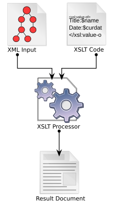

# Ambiorix XML converter

[[_TOC_]]

## Introduction

The Ambiorix XML converter also known as `amxo-xml-to` can be used to generate output files from an input xml and xsl file.



This application is mainly used in combination with the XML generator functionality from [amxo-cg](https://gitlab.com/prpl-foundation/components/ambiorix/applications/amxo-cg), which will generate XML files and their documentation from input ODL files. It is generally more useful to inspect the data model structure and read its documentation when it is available in an HTML page and this tool will facilitate this.

## Building, installing and testing

### Docker container

You could install all tools needed for testing and developing on your local machine, but it is easier to just use a pre-configured environment. Such an environment is already prepared for you as a docker container.

1. Install docker

    Docker must be installed on your system.

    If you have no clue how to do this here are some links that could help you:

    - [Get Docker Engine - Community for Ubuntu](https://docs.docker.com/install/linux/docker-ce/ubuntu/)
    - [Get Docker Engine - Community for Debian](https://docs.docker.com/install/linux/docker-ce/debian/)
    - [Get Docker Engine - Community for Fedora](https://docs.docker.com/install/linux/docker-ce/fedora/)
    - [Get Docker Engine - Community for CentOS](https://docs.docker.com/install/linux/docker-ce/centos/)<br /><br />
    
    Make sure you user id is added to the docker group:

    ```
    sudo usermod -aG docker $USER
    ```

1. Fetch the container image

    To get access to the pre-configured environment, all you need to do is pull the image and launch a container.

    Pull the image:

    ```bash
    docker pull registry.gitlab.com/soft.at.home/docker/oss-dbg:latest
    ```

    Before launching the container, you should create a directory which will be shared between your local machine and the container.

    ```bash
    mkdir -p ~/amx_project/applications
    ```

    Launch the container:

    ```bash
    docker run -ti -d --name oss-dbg --restart always --cap-add=SYS_PTRACE --sysctl net.ipv6.conf.all.disable_ipv6=1 -e "USER=$USER" -e "UID=$(id -u)" -e "GID=$(id -g)" -v ~/amx_project/:/home/$USER/amx_project/ registry.gitlab.com/soft.at.home/docker/oss-dbg:latest
    ```

    The `-v` option bind mounts the local directory for the ambiorix project in the container, at the exact same place.
    The `-e` options create environment variables in the container. These variables are used to create a user name with exactly the same user id and group id in the container as on your local host (user mapping).

    You can open as many terminals/consoles as you like:

    ```bash
    docker exec -ti --user $USER oss-dbg /bin/bash
    ```

### Building

#### Prerequisites

- [libamxc](https://gitlab.com/prpl-foundation/components/ambiorix/libraries/libamxc) - Generic C api for common data containers
- [libamxj](https://gitlab.com/prpl-foundation/components/ambiorix/libraries/libamxj) - JSON parser & generator using yajl and libamxc variants
- [libxslt](https://gitlab.gnome.org/GNOME/libxslt) - XSLT support for libxml2

#### Build amxo-xml-to

1. Clone the git repository

    To be able to build it, you need the source code. So open the directory just created for the ambiorix project and clone this library in it (on your local machine).

    ```bash
    cd ~/amx_project/applications
    git clone git@gitlab.com:prpl-foundation/components/ambiorix/applications/amxo-xml-to.git
    ``` 

1. Install dependencies

    Although the container will contain all tools needed for building, it does not contain the libraries needed for building `amxo-xml-to`. To be able to build `amxo-xml-to` you need `libamxc`, `libamxj` and libxslt. These libraries can be installed in the container by executing the following commands.

    ```bash
    sudo apt update
    sudo apt install libamxc libamxj libxslt1-dev
    ```

1. Build it

    ```bash
    cd ~/amx_project/applications/amxo-xml-to
    make
    ```

### Installing

#### Using make target install

You can install your own compiled version easily in the container by running the install target.

```bash
cd ~/amx_project/applications/amxo-xml-to
sudo -E make install
```

### Testing

No tests are currently available for this component

## Running the application

To run `amxo-xml-to` you need to provide an xsl file type and one or more xml files. For example

```bash
amxo-xml-to -x html $(pwd)/myfile.odl.xml
```

This will generate all HTML files based on the provided input files and place the generated files in the current working directory. The available options will be explained in the following sections. You can already take a look at the help section for more information.

```text
$ amxo-xml-to --help
amxo-xml-to [OPTIONS] <xml files>

Options:

    -h    --help                   Print usage help
    -x    --xsl <xsl file>         Sets xsl file for convertion
    -o    --option <name=value>    Adds a configuration option
```

### Conversion options

It is possible to generate output files with a different file format from the same XML file. All you need is a different XSL file. The available XSL files are listed in the `config/xsl` folder:

- confluence.xsl
- html.xsl
- merge.xsl
- tr181.xsl
- wiki.xsl

### Configuration options

Some configuration options can be passed to `amxo-xml-to` with a configuration file or the `-o` flag. The default options that are used, can be seen in `config/default.conf`. The default output directory that is used, is the current working directory. This can be overriden with the `output-dir` config option.

#### Example

The following example shows how to generate HTML files from XML files and store them in an `output` directory in the current working directory. The `title` option, which is set to `SoftAtHome` by default (from the `config/default.conf` file) is overridden to `foo`.

```bash
amxo-xml-to -x html -o output-dir=$(pwd)/output -o title=foo $(pwd)/gmap-server.odl.xml
```
