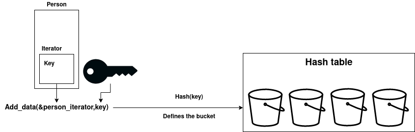
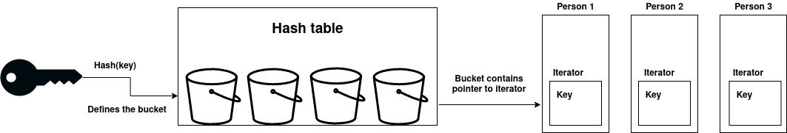

# Hash Table Contacts Example

## Introduction

The contacts example exist in three different implementations. One to demonstrate the **libamxc llist** API, one to demonstrate the **libamxc htable** API and one to demonstrate the **libamxc variants** API. Here the htable (hash table) implementation is threated. The recommended order to study these examples is the following:
- [llist_contacts](https://gitlab.com/soft.at.home/ambiorix/ambiorix/examples/collections/llist_contacts/)
- htable_contacts (this example)
- [variant_contacts](https://gitlab.com/soft.at.home/ambiorix/ambiorix/examples/collections/variant_contacts/)

The goal of these examples is to to demonstrate:
- How to use the llist, htable and variant API.
- What the difference is between a llist, htable and variant implementation.

The goal of these examples is not to explain in detail how the APIs itself are implemented.

This readme will guide you step by step through the hash table example.

### What is a hash table?

>In computing, a hash table (hash map) is a data structure that implements an associative array abstract data type, a structure that can map keys to values. A hash table uses a hash function to compute an index, also called a hash code, into an array of buckets or slots, from which the desired value can be found. During lookup, the key is hashed and the resulting hash indicates where the corresponding value is stored. ~ [Wikipedia](https://en.wikipedia.org/wiki/Hash_table)

The advantages of a hash table are:
- Elements can be added infinitely
- A hash table allocates less memory for possible future items compared to an array (only the buckets take memory)
- Elements are easily removed
- Random access to elements

A hash table has also his disadvantages:
- A hash table takes more space per item compared to an array (data + iterator (which contains the key))
- Every time an item is stored or searched, a hash needs to be calculated.

Taking this advantages and disadvantages into account, it should be clear that hash tables should be used for data collections where the number of items is large and where quick access is desired.

### Contacts example

Before we can start, we should give a brief overview of what our example application is supposed to do.

The goal of our application is to store a list of contacts. These contacts are imported from the file `/data/randomdata.csv` and contains the following information about a person:
- First Name
- Last Name
- Gender
- Age
- Email
- Phone
- Marital Status

We should be able to search a contact by his last name. If multiple contacts share the same last name, we call them a family. The program should always output the whole family.

### Implementation overview

To make things more clear, the use of the hash table for the contacts example is explained.

#### Write to the hash table

The only thing the end user needs to do in order to store a contact in the hash table, is give the location of the iterator of the person and a key. This key is [hashed](https://en.wikipedia.org/wiki/Hash_function) and this hash defines the location (bucket) where the iterator pointer is stored. If we have [hash collisions](https://en.wikipedia.org/wiki/Collision_(computer_science)) (multiple keys hash to the same value), multiple iterators can end up in the same bucket. To be able to find the correct person when we search for a specific key, the key part of the person iterator is also set equal to the given key.



#### Read from the hash table

Reading from a hash table is quite simple for the end user. The only thing you need is the key from the item you are searching for. This key is hashed and this hash defines a bucket in your hash table. This bucket contains a pointer to the iterator of the searched person. If there are multiple iterators in one bucket, all this persons are investigated and the person with the exact same key in his iterator is returned.



## Building and testing

You could install all tools needed for testing and developing on your local machine, but it is easier to just use a pre-configured environment. Such an environment is already prepared for you as a docker container.

1. Install docker

    Docker must be installed on your system.

    If you have no clue how to do this here are some links that could help you:

    - [Get Docker Engine - Community for Ubuntu](https://docs.docker.com/install/linux/docker-ce/ubuntu/)
    - [Get Docker Engine - Community for Debian](https://docs.docker.com/install/linux/docker-ce/debian/)
    - [Get Docker Engine - Community for Fedora](https://docs.docker.com/install/linux/docker-ce/fedora/)
    - [Get Docker Engine - Community for CentOS](https://docs.docker.com/install/linux/docker-ce/centos/)  <br /><br />
    
    Make sure you user id is added to the docker group:

    ```
    sudo usermod -aG docker $USER
    ```

1. Fetch the container image

    To get access to the pre-configured environment, all you need to do is pull the image and launch a container.

    Pull the image:

    ```bash
    docker pull softathome/oss-dbg:latest
    ```

    Before launching the container, you should create a directory wich will be shared between your local machine and the container.

    ```bash
    mkdir -p ~/amx_project/examples/collections
    ```

    Launch the container:

    ```bash
    docker run -ti -d --name oss-dbg --restart always --cap-add=SYS_PTRACE --sysctl net.ipv6.conf.all.disable_ipv6=1 -e "USER=$USER" -e "UID=$(id -u)" -e "GID=$(id -g)" -v ~/amx_project/:/home/$USER/amx_project/ softathome/oss-dbg:latest
    ```

    The `-v` option bind mounts the local directory for the ambiorix project in the container, at the exact same place.
    The `-e` options create environment variables in the container. These variables are used to create a user name with exactly the same user id and group id in the container as on your local host (user mapping).

    You can open as many terminals/consoles as you like:

    ```bash
    docker exec -ti --user $USER oss-dbg /bin/bash
    ```

### Building

#### Prerequisites

- [libamxc](https://gitlab.com/soft.at.home/ambiorix/libraries/libamxc) - Generic C api for common data containers

#### Build llist_contacts

1. Clone the git repository

    To be able to build it, you need the source code. So open the directory just created for the ambiorix project and clone this library in it.

    ```bash
    cd ~/amx_project/examples/collections
    git clone https://gitlab.com/soft.at.home/ambiorix/examples/collections/htable_contacts.git
    ``` 

1. Install dependencies

    Although the container will contain all tools needed for building, it does not contain the libraries needed for building `htable_contacts`. To be able to build `htable_contacts` you need `libamxc`. This library can be installed in the container.

    ```bash
    sudo apt update
    sudo apt install libamxc
    ```

    If you would like to build and install the library manually, you can follow the instructions on the [libamxc repo page](https://gitlab.com/soft.at.home/ambiorix/libraries/libamxc).

1. Build it

    ```bash
    cd ~/amx_project/examples/collections/htable_contacts
    make
    ```

### Testing

#### Prerequisites

No extra components are needed for testing `htable_contacts`.

#### Run tests

You can run the tests by executing the following command.

```bash
cd ~/amx_project/examples/collections/htable_contacts/tests
make
```

Or this command if you also want the coverage reports to be generated:

```bash
cd ~/amx_project/examples/collections/htable_contacts/tests
make run coverage
```

#### Coverage reports

The coverage target will generate coverage reports using [gcov](https://gcc.gnu.org/onlinedocs/gcc/Gcov.html) and [gcovr](https://gcovr.com/en/stable/guide.html).

A summary for each file (*.c files) is printed in your console after the tests are run.
A HTML version of the coverage reports is also generated. These reports are available in the output directory of the compiler used.
Example: using native gcc
When the output of `gcc -dumpmachine` is `x86_64-linux-gnu`, the HTML coverage reports can be found at `~/amx_project/examples/collections/htable_contacts/output/x86_64-linux-gnu/coverage/report.`

You can easily access the reports in your browser.
In the container start a python3 http server in background.

```bash
cd ~/amx_project/
python3 -m http.server 8080 &
```

Use the following url to access the reports `http://<IP ADDRESS OF YOUR CONTAINER>:8080/examples/collections/htable_contacts/output/<MACHINE>/coverage/report`
You can find the ip address of your container by using the `ip` command in the container.

Example:

```bash
USER@<CID>:~/amx_project/examples/collections/htable_contacts$ ip a
1: lo: <LOOPBACK,UP,LOWER_UP> mtu 65536 qdisc noqueue state UNKNOWN group default qlen 1
    link/loopback 00:00:00:00:00:00 brd 00:00:00:00:00:00
    inet 127.0.0.1/8 scope host lo
       valid_lft forever preferred_lft forever
    inet6 ::1/128 scope host 
       valid_lft forever preferred_lft forever
173: eth0@if174: <BROADCAST,MULTICAST,UP,LOWER_UP> mtu 1500 qdisc noqueue state UP group default 
    link/ether 02:42:ac:11:00:07 brd ff:ff:ff:ff:ff:ff link-netnsid 0
    inet 172.17.0.7/16 scope global eth0
       valid_lft forever preferred_lft forever
    inet6 2001:db8:1::242:ac11:7/64 scope global nodad 
       valid_lft forever preferred_lft forever
    inet6 fe80::42:acff:fe11:7/64 scope link 
       valid_lft forever preferred_lft forever
```

in this case the ip address of the container is `172.17.0.7`.
So the uri you should use is: `http://172.17.0.7:8080/examples/collections/htable_contacts/output/x86_64-linux-gnu/coverage/report/`

## Using htable_contacts

As soon as you've build the source code, you can run the program using the following command.

```bash
cd ~/amx_project/examples/collections/htable_contacts
./htable_contacts data/randomdata.csv "Elliott"
```

`"Elliott"` is the last name of the contact/family you are searching for.

The output is in this case:

```bash
Person : Violet Elliott
	Gender = Female
	Age    = 25
	E-Mail = v.elliott@randatmail.com
	Phone  = 896-3242-73
	Status = Married

Person : James Elliott
	Gender = Male
	Age    = 23
	E-Mail = j.elliott@randatmail.com
	Phone  = 412-8887-99
	Status = Married

Person : Max Elliott
	Gender = Male
	Age    = 25
	E-Mail = m.elliott@randatmail.com
	Phone  = 406-1711-61
	Status = Married

Person : Thomas Elliott
	Gender = Male
	Age    = 22
	E-Mail = t.elliott@randatmail.com
	Phone  = 367-6904-83
	Status = Married


Matches found = 4
```

## Code explanation

The first thing to explain is how we will represent a single person. In `/include_prev/contacts.h` you can find the following declaration:

```C
typedef struct person {
    char* first_name;
    char* last_name;
    gender_t gender;
    uint32_t age;
    char* email;
    char* phone;
    marital_status_t mstatus;
    amxc_htable_it_t it;
    amxc_llist_it_t lit;
} person_t;
```

You can find all characteristics of the person plus an `amxc_htable_it_t` type 'it'. This iterator contains the key of the person, which is set as soon as the person is added to a hash table. Altough the implementation of a hash table is quite different than the implementation of a linked list, the use of both is for the end user almost identical. We have alse a linked list iterator to link members of the same family.

We will go step by step through the `main.c` code to make the use of the hash table API clear.

The first step is to define a hash table to store our contacts. Here we create a hash table called 'contacts'.

```C
amxc_htable_t contacts;
```

After the creation of our hash table, we should initialize it. This done by the `contacts_init()` function.

```C
contacts_init(&contacts,200*100/70);
```

If we take a closer look to this function, we see that the only thing it does is calling the `amxc_htable_init()` function. This function allocates memory on the heap to store our iterator pointers (the buckets). This function is used when you declare a hash table on the stack. You should use the `amxc_htable_new()` function if you would like to decalere a hash table on the heap. A recommended value for the number of buckets you will need is the expected amount of elements devided by 0.70. This is just a starting point, you can still exeed the number of items in your table as the number of buckets will grow automatically.

We also define a linked list to store members of the same family later on. 

```C
amxc_llist_t* family = NULL;
```

Check the [llist_contacts example](https://gitlab.com/soft.at.home/ambiorix/ambiorix/examples/collections/llist_contacts/) for more information about linked lists.

The following line is the most important one of this example.

```C
contacts_read(&contacts, argv[1],1);
```

The `contacts_read()` function loops over each line of our file `/data/randomdata.csv` and places each contact in the hash table 'contacts'. We will dive into this function right now.

At the top of the `contacts_read()` function we see again the declaration of a linked list.

```C
amxc_llist_t fields;
```

This list is used to store the data of one single person (first name, last name, age, ...). The details on how this is actually done is not of importance here.

Near the middle of this function we can see the `person_new()` function:

```C
person_new(&person_data, &fields)
```

Here memory is allocated on the heap to store the 'person_data'. Then the new allocated structure is filled with the data stored in the 'fields' linked list. The order of the fields is for each person exactly the same (as defined in the data file), so the fields can be taken from the linked list in that order.

To summerize: we have read out a line of the `/data/randomdata.csv` file and stored this line in the linked list 'fields'. Then, we stored this information in a struct 'person_data'.

The only thing that's left to do is adding this 'person_data' to our hash table 'contacts'. That's exactly what is done near the end of the function `contacts_read()`:

```C
contacts_add_person(contacts, person_data);.
```

The only thing that the `contacts_add_person()` function does is calling the function `amxc_htable_insert()`. This function is typically used to add some data to a hash table. This function will store a pointer to the 'person_data' iterator into the correct bucket. In this example we use the last name of the person as a key. Note that this key does not have to be unique.

This is the first part of our application. We now have a hash table containing all data of our data file. Next thing to do is search for a specific contact/family.

This is implemented in the `contacts_search()` function. If we dive into this function we can see that it calls `amxc_htable_get()` to get the iterator of the first person of our family. Remember that the last name of the person is used as the key.

```C
amxc_htable_get(contacts, last_name);
```

Next, the person is added to the linked list 'family'

```C
person = amxc_htable_it_get_data(it, person_t, it);
amxc_llist_append(family, &person->lit);
```

To get the iterator of our next family member, we call:

```C
amxc_htable_it_get_next_key(it);
```

After the family is stored in the linked list, the linked list is printed out.

The last thing to do is clean our htable and linked list:

```C
contacts_clean(&contacts);
amxc_llist_clean(&family, NULL);
```

The `contacts_clean()` functions calls:

```C
amxc_htable_clean(contacts, contact_person_clean);
```

The first argument is the hash table you want to clean. The second argument provides a function that will clean the memory we allocated ourself (allocated in the `person_new()` function). 

The `contact_person_clean()` function eventually calls the `person_del()` function. This will clear all our allocated memory.