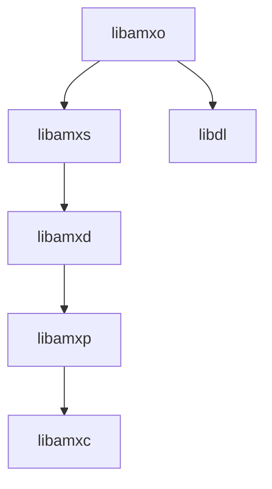

# Object Definition Language (ODL) parsing

[[_TOC_]]

## Introduction

## Building, installing and testing

### Docker container

You could install all tools needed for testing and developing on your local machine, but it is easier to just use a pre-configured environment. Such an environment is already prepared for you as a docker container.

1. Install docker

    Docker must be installed on your system.

    If you have no clue how to do this here are some links that could help you:

    - [Get Docker Engine - Community for Ubuntu](https://docs.docker.com/install/linux/docker-ce/ubuntu/)
    - [Get Docker Engine - Community for Debian](https://docs.docker.com/install/linux/docker-ce/debian/)
    - [Get Docker Engine - Community for Fedora](https://docs.docker.com/install/linux/docker-ce/fedora/)
    - [Get Docker Engine - Community for CentOS](https://docs.docker.com/install/linux/docker-ce/centos/)  <br /><br />
    
    Make sure you user id is added to the docker group:

    ```
    sudo usermod -aG docker $USER
    ```

1. Fetch the container image

    To get access to the pre-configured environment, all you need to do is pull the image and launch a container.

    Pull the image:

    ```bash
    docker pull registry.gitlab.com/soft.at.home/docker/oss-dbg:latest
    ```

    Before launching the container, you should create a directory which will be shared between your local machine and the container.

    ```bash
    mkdir -p ~/amx_project/libraries/
    ```

    Launch the container:

    ```bash
    docker run -ti -d --name oss-dbg --restart always --cap-add=SYS_PTRACE --sysctl net.ipv6.conf.all.disable_ipv6=1 -e "USER=$USER" -e "UID=$(id -u)" -e "GID=$(id -g)" -v ~/amx_project/:/home/$USER/amx_project/ registry.gitlab.com/soft.at.home/docker/oss-dbg:latest
    ```

    If you are using vpn, you need to add `--dns 192.168.16.10 --dns 192.168.16.11` to the docker run command.

    The `-v` option bind mounts the local directory for the ambiorix project in the container, at the exact same place.
    The `-e` options create environment variables in the container. These variables are used to create a user name with exactly the same user id and group id in the container as on your local host (user mapping).

    You can open as many terminals/consoles as you like:

    ```bash
    docker exec -ti --user $USER oss-dbg /bin/bash
    ```

### Building

#### Prerequisites

- [libamxc](https://gitlab.com/prpl-foundation/components/ambiorix/libraries/libamxc) - Generic C api for common data containers
- [libamxp](https://gitlab.com/prpl-foundation/components/ambiorix/libraries/libamxp) - Common patterns implementation
- [libamxd](https://gitlab.com/prpl-foundation/components/ambiorix/libraries/libamxd) - Data model C API
- [libamxs](https://gitlab.com/prpl-foundation/components/ambiorix/libraries/libamxs) - Data model object synchronization library
- [flex](https://packages.debian.org/buster/flex)
- [bison](https://packages.debian.org/buster/bison)

---
Dependency graph - libraries needed by libamxo.
For graph simplicity direct dependencies which are also an indirect dependency are not shown.


---

#### Build libamxo

1. Clone the git repository

    To be able to build it, you need the source code. So open the directory just created for the ambiorix project and clone this library in it (on your local machine).

    ```bash
    cd ~/amx_project/libraries/
    git clone git@gitlab.com:prpl-foundation/components/ambiorix/libraries/libamxo.git
    ``` 

1. Install dependencies

    Although the container will contain all tools needed for building, it does not contain the libraries needed for building `libamxo`. To be able to build `libamxo` you need `libamxc`, `libamxp` and `libamxd`. These libraries can be installed in the container.

    ```bash
    sudo apt update
    sudo apt install libamxd
    ```

    Note that you do not need to install all components explicitly. Some components will be installed automatically because the other components depend on them. Some of the components are allready preinstalled in the container.

1. Build it


    ```bash
    cd ~/amx_project/libraries/libamxo
    make
    ```

1. Build API documentation

   All public API functions are documented with doxygen tags. To generate the documentation (in html format) doxygen must be installed.

   ```bash
    cd ~/amx_project/libraries/libamxo
    make doc
   ```

   The documentation will be available in `./output/doc/doxy-html/`. Open the file `./output/doc/doxy-html/index.html` in your favorite browser.

   Another option is to open the public header files, the documentation is available there as well.

### Installing

#### Using make target install

You can install your own compiled version easily in the container by running the install target.

```bash
cd ~/amx_project/libraries/libamxo
sudo -E make install
```

#### Using package

From within the container you can create packages.

```bash
cd ~/amx_project/libraries/libamxo
make package
```

The packages generated are:

```
~/amx_project/libraries/libamxo/libamxo-<VERSION>.tar.gz
~/amx_project/libraries/libamxo/libamxo-<VERSION>.deb
```

You can copy these packages and extract/install them.

For ubuntu or debian distributions use dpkg:

```bash
sudo dpkg -i ~/amx_project/libraries/libamxo/libamxo-<VERSION>.deb
```

### Testing

#### Prerequisites

No extra components are needed for testing `libamxo`.

#### Run tests

You can run the tests by executing the following command.

```bash
cd ~/amx_project/libraries/libamxo/tests
make
```

Or this command if you also want the coverage tests to run:

```bash
cd ~/amx_project/libraries/libamxo/tests
make run coverage
```

#### Coverage reports

The coverage target will generate coverage reports using [gcov](https://gcc.gnu.org/onlinedocs/gcc/Gcov.html) and [gcovr](https://gcovr.com/en/stable/guide.html).

A summary for each file (*.c files) is printed in your console after the tests are run.
A HTML version of the coverage reports is also generated. These reports are available in the output directory of the compiler used.
Example: using native gcc
When the output of `gcc -dumpmachine` is `x86_64-linux-gnu`, the HTML coverage reports can be found at `~/amx_project/libraries/libamxo/output/x86_64-linux-gnu/coverage/report.`

You can easily access the reports in your browser.
In the container start a python3 http server in background.

```bash
cd ~/amx_project/
python3 -m http.server 8080 &
```

Use the following url to access the reports `http://<IP ADDRESS OF YOUR CONTAINER>:8080/libraries/libamxo/output/<MACHINE>/coverage/report`
You can find the ip address of your container by using the `ip` command in the container.

Example:

```bash
USER@<CID>:~/amx_project/libraries/libamxo$ ip a
1: lo: <LOOPBACK,UP,LOWER_UP> mtu 65536 qdisc noqueue state UNKNOWN group default qlen 1
    link/loopback 00:00:00:00:00:00 brd 00:00:00:00:00:00
    inet 127.0.0.1/8 scope host lo
       valid_lft forever preferred_lft forever
    inet6 ::1/128 scope host 
       valid_lft forever preferred_lft forever
173: eth0@if174: <BROADCAST,MULTICAST,UP,LOWER_UP> mtu 1500 qdisc noqueue state UP group default 
    link/ether 02:42:ac:11:00:07 brd ff:ff:ff:ff:ff:ff link-netnsid 0
    inet 172.17.0.7/16 scope global eth0
       valid_lft forever preferred_lft forever
    inet6 2001:db8:1::242:ac11:7/64 scope global nodad 
       valid_lft forever preferred_lft forever
    inet6 fe80::42:acff:fe11:7/64 scope link 
       valid_lft forever preferred_lft forever
```

in this case the ip address of the container is `172.17.0.7`.
So the uri you should use is: `http://172.17.0.7:8080/libraries/libamxo/output/x86_64-linux-gnu/coverage/report/`

## Using libamxo

This library provides functionality that can be used to build a data model object hierarchy fom an ODL file (object definition language).

During the parsing of odl files the parser can resolve functions and bind them to your data model objects and parameters.

Besides parsing of odl files and building of the data model other functionality provided by this library:

- Subscribe for events on the local data model and bind event handler functions to it.
- Keeps a list of available MIBs which can be added to objects in the data model.
- Set-up object and parameter synchronizations that are declared in odl files and manage them.
- Keeps a list of synchronization templates that are declared in odl files.
- Can save the persistent objects and parameters in the data model in odl format.
- Keeps a list of registered entry-points and provides functionality to invoke them.
- Keeps the configuration variables that are defined in odl files and provides functions to access them or to add new configuration variables.

### Parser Initialization and Cleanup

Before using a parser it must be initialized. When done using the parser it can be cleaned-up. 

Cleaning up the parser will free all allocated memory for the parser. The data model that was built from odl files by the parser will not be removed. Other functional objects (like entry-points, synchronization contexts, list of available MIBs, ...) will not be accessible anymore after cleaning up the parser object.

```C
int amxo_parser_init(amxo_parser_t* parser);

void amxo_parser_clean(amxo_parser_t* parser);
```

Typical use:

```C
#include <amxc/amxc.h>
#include <amxp/amxp.h>
#include <amxd/amxd.h>
#include <amxo/amxo.h>

int main(int argc, char* arg[]) {
    int retval = 0;
    amxd_dm_t dm;
    amxo_parser_t parser;

    amxd_dm_init(&dm);
    amxo_parser_init(&parser);

    // Do something

    amxo_parser_clean(&parser);
    amxd_dm_clean(&dm);

    return retval;
}
```

### Loading and Saving a Data Model

To build a data model either from a file containing a data model definition in `Object Definition Language` or a string containing a valid `Object Definition Language` text use one of the following functions:

```C
int amxo_parser_parse_fd(amxo_parser_t* parser,
                         int fd,
                         amxd_object_t* object);

int amxo_parser_parse_file(amxo_parser_t* parser,
                           const char* file_path,
                           amxd_object_t* object);

int amxo_parser_parse_string(amxo_parser_t* parser,
                             const char* text,
                             amxd_object_t* object);

```

The data model object pointer provided is used as the `root` object, all loaded object definitions are added as a child of that provided object.

Typical use case:

```C
#include <amxc/amxc.h>
#include <amxp/amxp.h>
#include <amxd/amxd.h>
#include <amxo/amxo.h>

int main(int argc, char* arg[]) {
    int retval = 0;
    amxd_dm_t dm;
    amxo_parser_t parser;

    amxd_dm_init(&dm);
    amxo_parser_init(&parser);

    retval = amxo_parser_parse_file(&parser, "my_dm_def.odl", amxd_dm_get_root(&dm));

    /*
    Add the application implementation here:
    Typically this should be done to make the data model available on a bus system
    - If modules are loaded which needs to be initialized by calling it's entrypoint(s) using amxo_parser_invoke_entry_points
    - Create an eventloop (use a library like libevent)
    - Connect to the bus system (using libamxb)
    - Register the data model (using libamxb)
    - Start the event loop
    */

    amxo_parser_clean(&parser);
    amxd_dm_clean(&dm);

    return retval;
}
```

Saving a data model (or a sub-tree of a data model) can be done using:

```C
int amxo_parser_save_object(amxo_parser_t* pctx,
                            const char* filename,
                            amxd_object_t* object,
                            bool append);
```

To save the configuration variables in a separate file use:

```C
int amxo_parser_save_config(amxo_parser_t* pctx,
                            const char* filename,
                            amxc_var_t* config,
                            bool append);
```

### Using MIBs

Mibs can be used to extend existing data model objects with extra parameters, methods or sub-objects. When a mib was added to a data model object, it can be removed very easily.

Scan directories for mib definitions (also defined in odl files). The parser keeps a list of all found odl files that define a mib, but they are not yet loaded.

```C
int amxo_parser_scan_mib_dir(amxo_parser_t* parser,
                             const char* path);

int amxo_parser_scan_mib_dirs(amxo_parser_t* parser,
                              amxc_var_t* dirs);

```

Add or remove a mib to/from a data model object:

```C
int amxo_parser_apply_mib(amxo_parser_t* parser,
                          amxd_object_t* object,
                          const char* mib_name);

int amxo_parser_apply_mibs(amxo_parser_t* parser,
                           amxd_object_t* object,
                           amxo_evaluate_expr_fn_t fn);

int amxo_parser_add_mibs(amxo_parser_t* parser,
                         amxd_object_t* object,
                         amxo_evaluate_expr_fn_t fn);

int amxo_parser_remove_mibs(amxo_parser_t* parser,
                            amxd_object_t* object,
                            amxo_evaluate_expr_fn_t fn);
```

## Other Documentation

- [odl syntax](https://gitlab.com/prpl-foundation/components/ambiorix/libraries/libamxo/-/tree/main/doc?ref_type=heads)
