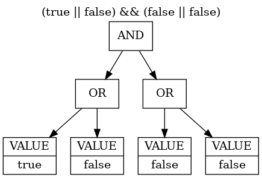
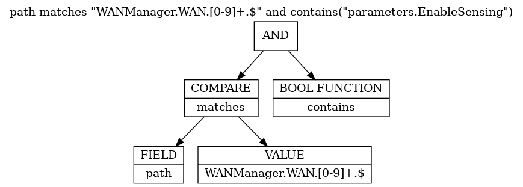
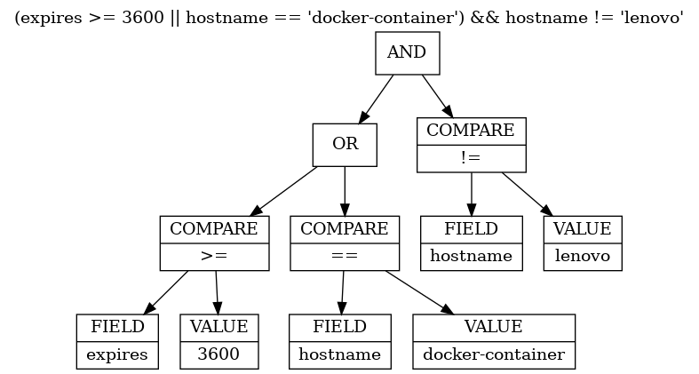

# Boolean Expressions

## __Table of Contents__  

[[_TOC_]]

## Introduction

From [wikipedia - boolean expression](https://en.wikipedia.org/wiki/Boolean_expression)
> In computer science, a Boolean expression is an expression used in programming languages that produces a Boolean value when evaluated. A Boolean value is either true or false. A Boolean expression may be composed of a combination of the Boolean constants true or false, Boolean-typed variables, Boolean-valued operators, and Boolean-valued functions.

The Ambiorix library `libamxp` provides a boolean expression parser and evaluation. Each boolean expression can consists out of:
- A comparison - compares two values
- A boolean value (`true`, `false`)
- A boolean function - this is a function that either returns true or false

All of the above always evaluate to a boolean value (`true`, `false`).

Multiple boolean expressions can be combined with the logical operators `AND` or `OR`.

A boolean value can be reverted using the `NOT` logical operator.

The Ambiorix boolean expressions is only parsed once with the boolean expression parser. During parsing a [binary expression tree](https://en.wikipedia.org/wiki/Binary_expression_tree) is created. During evaluation of the boolean expression this binary expression tree is used.

After parsing the expression can be evaluated many times, without the need of fully parsing the boolean expression string again.

## Boolean expression componentents
### Boolean operators

The boolean expression parser supports the following boolean operators:

- and - The keyword `and` or the symbol `&&` can be used. The `and` operator will return true if the `left` value and the `right` value both evaluate to `true`
- or - The keywordt `or` or the symbol `||` can be used. The `or` operator will return true if one of the `left` value or `right` value evalutes to `true`.

#### Example of boolean operators

- `true || false && false || false`<br>
  This example boolean expression will evaluate to `true`.

- `(true || false) && (false || false)`<br>
  This example boolean expression will evaluate to `false`.

### Comparison

A compare operator always evaluates to `true` or `false` and consists out of a `left value`, the `compare operator` and a `right value`. 

When two values needs to be compared a compare operator can be used. The supported compare operators are:
- `==` - equals
- `!=` - not equals
- `>` - bigger
- `<` - less
- `>=` - bigger or equal
- `<=` - less or equal
-  `matches` - string (`left value`) matches a [regular expression](https://en.wikipedia.org/wiki/Regular_expression) (`right value`)
- `starts with` - string (`left value`) starts with a string (`right value`). When the right value is an array of strings the `starts with` returns true when the string (`left value`) starts with any of the values in the array.
- `ends with` - string (`left value`) ends with a string (`right value`). When the right value is an array of strings the `ends with` returns true when the string (`left value`) ends with any of the values in the array.
- `in` - checks that the `left value` can be found in the `right value`. The right value can be an array of values, comma separated string of strings or a space searated string of strings.
- `~=` - aka as `contains` and is similar to the `in` compare operator with `left` and `right` values swapped
- `^=` - strings are equal ignoring case.

When the `left value` and the `right value` are of a different type, conversion is applied before comparing the values. For most compare operators the `right value` is converted to the same type as the `left value`. For the `matches` and `^=` compare operators the left and right value are converted to a string.  When the `starts with`, `ends with`, `in`, `~=` operators are used the left and right values are converted to a string, if the right (or left for `~=`) is an array, each individual item in the array will be converted to a string.

#### Example of compare operators:

- `"WANManager.WAN.2." matches "WANManager\\.WAN\\.[0-9]+\\.$"`<br>
  Checks if the string "WANManager.WAN.2." is matched with the regular expression "WANManager\\.WAN\\.[0-9]+\\.$". This example will evalueate to `true`.

- `10 >= 5`<br>
  Checks if value `10` is bigger or equal to the value `5`. This example will evaluate to `true`.

- `5 >= 10`<br>
  Checks if value `5` is bigger or equal to the value `10`. This example will evaluate to `false`.

### Values

In a boolean expression or in a comparison values are used. These values can be either a constant (`fixed value`), a field (`variable value`) or a function returning a value.

When a value is used in the boolean expression only values that are or evaluates to `true` or `false` are allowed. 

In comparisons any value can be used. When a field (`variable`) is used the value of that field will be looked-up (`fetched` or `evaluated`) and the result will be used.

Constant or fixed values can be either:
- An integer (any number)
- A string (must be put between quotes, single or double quotes are allowed)
- A boolean (`true` or `false`)

A field or variable value is represented by an unquoted string or optionally when possible misinterpration or conflics can occure in the `boolean expression` a field can be put between `{` and `}`.

When a field (`variable`) is used in the boolean expression, the value of the field (`variable`) is fetched during evaluation of the expression, and not during parsing of the expression.

#### Examples of values:

- `"WANManager.WAN.2." matches "WANManager\\.WAN\\.[0-9]+\\.$"`<br>
  In this example the `left` and `right` value of the comparison or both constant (`fixed`) strings.

- `path matches "WANManager\\.WAN\\.[0-9]+\\.$"`<br>
  In this example the `left` value is a field (`variable`). During evaluation the value of the field `path` is fetched and used in the comparison.

### Functions

Two kinds of functions are supported:

- Functions that return a value - these can be used in comparisons
- Functions that return a boolean - these can be used in the boolean expression directly.

A function has a function name followed by `(` and `)`. Between the `(` and `)` zero, one or more arguments can be passed, separated with a `,`. Each argument is a value. Which and how many arguments can be passed depends on the function. Check the function documentation for more information.

#### Standard supported functions

The `boolean expression` parser provides some standard functions:

The boolean functions supported are:
- is_empty(value) - This function takes one argument which must be an array or a table. When the provided array or table is empty the function will return `true`.
- contains(field) - This function takes one or more arguments, each a field (`variable`) name. The function will return `true` when the field (`variable`) is available. When multiple arguments are provided, and one of them is available, the function will return `true`.

The value functions supported are:
- first_existing(field, field, ...) - This function takes one or more arguments, each argument is a field (`variable`) name. During evaluation the value of the first found field is taken.

---
__NOTE__
> Before using functions in your expressions, consult the documentation of the functions. Some limitations can exists. Depending on the data set being evaluated it is possible some of the functions can not be used as they only work on a specific kind of data set. The default provided function will work on data set that are composite variants (amxc_var_t).
---
#### Example of usage in boolean expressions

- `path matches "WANManager\\.WAN\\.[0-9]+\\.$" and contains("parameters.EnableSensing")`<br>
  In this example the function `contains` will be called to check if the evaluated data set contains a field `parameters.EnableSensing`. If no such field exists in the provided data set the function will return `false`.

### Boolean expression parsing and evaluating

The boolean expression parser doesn't evaluate the expression by itself, during parsing of the string representing the boolean expression a binary expression tree is build.

Parsing of the boolean expression string is more costly then traversing the binary expression tree, and should be done as less as possible. In most circumstances a boolean expression is used many times on different data sets. By using this approach the boolean expression is parsed once and evaluated by using the binary expression tree many times.

Assume we have this boolean expression string `(true || false) && (false || false)`, the parser will create a binary expression tree that can be represented by this graph:



When this boolean expression needs evaluation, the tree will be traversed starting fron the top node and evaluate the left node first, when the left side is evaluated the right node will be evaluated. This is done for all sub-nodes as well.

The evaluation uses lazy-evaluation. For `AND` nodes, if the left node evaluates to `false` the right node is not evaluated anymore. For `OR` nodes, if the left node evaluates to `true` the right node is not evaluated anymore.

The above example will always evaluate to `false` as all values are constants. Consider the following example: `path matches "WANManager\\.WAN\\.[0-9]+\\.$" and contains("parameters.EnableSensing")`, the generated binary expression tree can be represented by this graph:

.

During evaluation, the value for field `path` will be retrieved and compared with the constant string `WANManager.WAN.[0-9]+.$` using the `matches` compare operator. When the compare evaluates to `true` the right node of the `AND` will be evaluated, here the boolean function `contains` will be called with argument "parameters.EnableSensing", if the provided data set contains that field the function will return `true`

## The boolean expression API

### Creating and initializing an epxression

If you want to use a `boolean expression` an `amxp_expr_t` struct must be initialized. The struct can be declared on the stack or allocated on the heap. 

When the struct is delared on the stack it can be initialized by using on of these functions:

- `amxp_expr_status_t amxp_expr_init(amxp_expr_t* expr, const char* expression)`
- `amxp_expr_status_t amxp_expr_buildf(amxp_expr_t* expr, const char* expr_fmt, ...)`

The first second one has support for printf like formatting, with extra checks and some limitations. More information can be found in the documentation of the API's.

To allocate an `amxp_expr_t` struct on the heap use one of these functions:

- `amxp_expr_status_t amxp_expr_new(amxp_expr_t** expr, const char* expression)`
- `amxp_expr_status_t amxp_expr_buildf_new(amxp_expr_t** expr, const char* expr_fmt, ...)`

### Deleting - Cleanup

When a boolean expression is not needed anymore, you need to clean it up (when declared on the stack) or delete it when allocated on the heap.

- `void amxp_expr_delete(amxp_expr_t** expr)`
- `void amxp_expr_clean(amxp_expr_t* expr)`

After calling these functions the boolean expression can not be used anymore.


### Evaluating an expression

After an expression struct has been initialized or created it can be used to evaluate data sets.

The basic function to do an evaluations is:

- `bool amxp_expr_evaluate(amxp_expr_t* expr, amxp_expr_get_field_t fn, void* priv, amxp_expr_status_t* status)`

The first argument of this function is a pointer to the initialized `amxp_expr_t` structure, the second argument to a field (`variable`) fetcher function. This callback function should do a lookup of the field and provides the value of the field if it exists in the data set. The third argument is a pointer to the data set. The last argument is a pointer to a `amxp_expr_status_t`, this is an optional pointer and maybe set to NULL. When the status pointer is provided a status value is set. When the expression evaluates to `false` it is recommended to check the status value. If the status value is equal to `amxp_expr_status_ok`, the expression with the given data set evaluates to false, if the status value is any other value then `amxp_expr_status_ok` an error occured. Most of the time the error will be related to fetching the values of the fields used in the expression (for example `amxp_expr_status_field_not_found` or `amxp_expr_status_invalid_value`).

Specialized evaluation functions are also provided:

- `bool amxp_expr_eval_var(amxp_expr_t* expr, const amxc_var_t* const data, amxp_expr_status_t* status)`
- `bool amxp_expr_eval_set(amxp_expr_t* expr, const amxc_set_t* const data, amxp_expr_status_t* status)`

Both functions will call `amxp_expr_evaluate`. The first one takes as data set a (composite) variant (`amxc_var_t`), the second one takes a set (`amxc_set_t`) as data set.

### Example of usage

Let's assume we have this JSON data file named `data.json`

```json
[
    {
        "expires": 43197,
        "hostname": "lenovo",
        "macaddr": "B4:55:55:55:F3:25",
        "duid": "01:b4:a9:fc:e9:f1:25",
        "ipv4addr": "192.168.1.151"
    },
    {
        "expires": 43199,
        "hostname": "ipad",
        "duid": "0004b4898566451427c446d744da0e563f85",
        "ipv6addr": "fd70:b153:f76f::644",
        "ipv6addrs": [
            "fd70:b153:f76f::644"
        ]
    },
    {
        "expires": 1200,
        "hostname": "docker-container",
        "macaddr": "02:42:AC:11:00:03",
        "duid": "02:42:ac:11:00:03",
        "ipv4addr": "172.17.0.3"
    }
]
```

If we want to find all entries matching certain criteria in the top level array, we could use this code:

```C
#include <stdio.h>
#include <stdlib.h>
#include <string.h>
#include <errno.h>
#include <fcntl.h>

#include <yajl/yajl_gen.h>

#include <amxc/amxc.h>
#include <amxp/amxp.h>
#include <amxj/amxj_variant.h>

static bool verify_args(int argc, char* argv[]) {
    // Check if an argument is provided
    if (argc < 3) {
        printf("Not enough arguments\n");
        printf("Usage: %s <json-file> <boolean expression>", argv[0]);
        return false;
    }

    return true;
}


static int read_data(const char* file, amxc_var_t** data) {
    int fd = -1;
    variant_json_t* reader = NULL;
    // create a json reader
    if (amxj_reader_new(&reader) != 0) {
        printf("Failed to create json file reader");
        return 1;
    }

    // open the json file
    fd = open(file, O_RDONLY);
    if(fd == -1) {
        amxj_reader_delete(&reader);
        printf("File open file %s - error 0x%8.8X", errno);
        return 2;
    }

    // read the json file and parse the json text
    amxj_read(reader, fd);

    // get the variant
    *data = amxj_reader_result(reader);

    // delete the reader and close the file
    amxj_reader_delete(&reader);
    close(fd);

    return 0;
}

int main(int argc, char* argv[]) {
    amxc_var_t* data = NULL;
    amxp_expr_t* expr = NULL;
    amxp_expr_status_t status = amxp_expr_status_ok;

    if (!verify_args(argc, argv)) {
        exit(1);
    }

    if (read_data(argv[1], &data) != 0) {
        printf("Failled to read file %s", argv[1]);
        exit(2);
    }

    if (data == NULL || amxc_var_type_of(data) != AMXC_VAR_ID_LIST) {
        printf("Invalid JSON in file %s", argv[1]);
        exit(3);
    }

    printf("Data loaded.\n");
    if (amxp_expr_new(&expr, argv[2]) != 0) {
        printf("Invalid boolean expression\n");
        exit(4);
    } 
    amxc_var_for_each(var, data) {
        if (amxp_expr_eval_var(expr, var, &status) == true) {
            printf("Matching variant found\n");
            fflush(stdout);
            amxc_var_dump(var, STDERR_FILENO);
        } else {
            if (status != amxp_expr_status_ok) {
                printf("Invalid boolean expression\n");
                exit(4);
            }
        }
    }

exit:
    amxc_var_delete(&data);
    amxp_expr_delete(&expr);
    return 0;
}
```

The above code example can be compiled with the following instuction if the code is stored in the file `evaluate_var.c` and the libraries `libamxc`, `libamxj` and `libamxp` are installed.

```
gcc evaluate_var.c -o evaluate_var -lamxp -lamxj -lamxc
```

After compiling this example can be run by passing at command line the data json file and a boolean expression:

```
./evaluate_var <JSON FILE> <BOOLEAN EXPRESSION>
```

- Find all entries that have a field "macaddr":<br>
  `./evaluate_var ./data.json "contains('macaddr')"`<br>
  Will provide this output:
  ```
  Data loaded.
  Matching variant found
  {
      duid = "01:b4:a9:fc:e9:f1:25",
      expires = 43197,
      hostname = "lenovo",
      ipv4addr = "192.168.1.151",
      macaddr = "B4:55:55:55:F3:25"
  }
  Matching variant found
  {
      duid = "02:42:ac:11:00:03",
      expires = 1200,
      hostname = "docker-container",
      ipv4addr = "172.17.0.3",
      macaddr = "02:42:AC:11:00:03"
  }
  ```

- Find all entries where expire is smaller or equal to 3600:<br>
  `./evaluate_var data.json "expires <= 3600"`<br>
  Will provide this output:
  ```
  Data loaded.
  Matching variant found
  {
      duid = "02:42:ac:11:00:03",
      expires = 1200,
      hostname = "docker-container",
      ipv4addr = "172.17.0.3",
      macaddr = "02:42:AC:11:00:03"
  }
  ```

- Find all entries where expire is bigger then 3600 or where hostname equals "docker-container" but not "lenovo":<br>
  `./evaluate_var data.json "(expires > 3600 || hostname == 'docker-container') && hostname != 'lenovo'"`<br>
  Will provide this output:
  ```
  Data loaded.
  Matching variant found
  {
      duid = "0004b4898566451427c446d744da0e563f85",
      expires = 43199,
      hostname = "ipad",
      ipv6addr = "fd70:b153:f76f::644",
      ipv6addrs = [
          "fd70:b153:f76f::644"
      ]
  }
  Matching variant found
  {
      duid = "02:42:ac:11:00:03",
      expires = 1200,
      hostname = "docker-container",
      ipv4addr = "172.17.0.3",
      macaddr = "02:42:AC:11:00:03"
  }
  ```

### Building a expression tree graph

When the tool `dot` is installed (package graphviz for debian/ubuntu distributions) an image can be generated from the boolean expression tree generated with the expression parser.

Using the following code (saved as dump_tree.c)

```C
#include <stdio.h>
#include <stdlib.h>
#include <string.h>

#include <amxc/amxc.h>
#include <amxp/amxp.h>

int main(int argc, char* argv[]) {
    amxp_expr_t expr;

    if (argc < 2) {
        fprintf(stderr, "Usage: %s \"<LOGICAL EXPRESSION>\"\n", argv[0]);
        goto exit;
    }    
    if (amxp_expr_init(&expr, argv[1]) == amxp_expr_status_ok) {
        amxp_expr_dump_tree(&expr);    
    }
    
    amxp_expr_clean(&expr);
    
exit:
    return 0;
}
```

Which can be compile using the following instruction:<br>
`gcc main.c -o dump_tree -lamxp`

After compilation you could run:

```
./dump_tree "(expires >= 3600 || hostname == 'docker-container') && hostname != 'lenovo'" | dot -Tpng -o myexpression.png
```

Which will generate a file called `myexpression.png`, that can be opened with your favorite image viewer. The image generated should look like this:

.

## Boolean Expression Use Cases

### USP Seach Paths

In [TR-369 - User Services Platform (USP)](https://usp.technology/specification/) search paths are defined:
>  Search Path - This is a Path Name that contains search criteria for addressing a set of Multi-Instance Objects and/or their Parameters. A Search Path may contain a Search Expression or Wildcard.

A search path can be used to `search` for certain objects (instances) in a multi-instance object. The basic notation of a search path is:

```
Device.IP.Interface.[<expression>].Status
```

Some examples of search paths:

- Device.IP.Interface.[Type=="Normal"].Status
- Device.IP.Interface.[Type=="Normal"].IPv4Address.[AddressingType=="Static"].IPAddress
- Device.IP.Interface.[Type=="Normal"&&Stats.ErrorsSent>0].IPv4Address.[AddressingType=="Static"].IPAddress
- Device.PeriodicStatistics.SampleSet.[SampleSeconds~=5].

The search path implementation uses the libamxp boolean expression parser/evaluator to find the correct objects in the data model.

### Data Model Event Filtering

The ambiorix data model library, which can be used to define and implement [TR-181 Data Model](https://usp-data-models.broadband-forum.org/tr-181-2-14-0-usp.html), can send events when something has happened in the data model (like values changed, instance add, instance deleted, ...).

Often the implementation wants to act on these changes and wants to handle certain data model events. It is possible to add callback functions when events happens. These callback functions will be called, when an event happens, but often you only want to handle specific events. Using boolean expression that will evaluate the event data can be used to filter these events. 

The data model object definition language (implemented in libamxo) can be used for this. Some exampes:

- [TR-181 MQTT](https://gitlab.com/prpl-foundation/components/core/plugins/tr181-mqtt/-/blob/main/odl/tr181-mqtt_definition.odl#L201):
  ```
    on event "dm:object-changed" call mqtt_client_toggled
        filter 'path matches "MQTT\\.Client\\.[0-9]+\\.$" &&
                contains("parameters.Enable")';

  ```

- [TR-181 DHCPv4](https://gitlab.com/prpl-foundation/components/core/plugins/tr181-dhcpv4/-/blob/main/odl/dhcpv4-manager_definition.odl#L22)
  ```
    on event "dm:instance-added" call dhcp_server_pool_added
        filter 'path == "DHCPv4.Server.Pool."';
  ```


