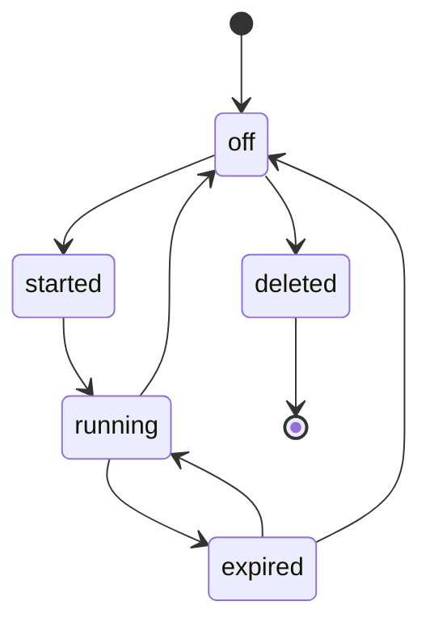
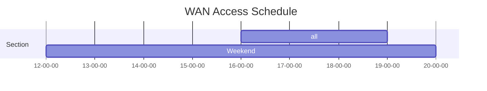

# Timers And Schedules

## __Table of Contents__  

[[_TOC_]]

## Introduction

Often it is needed to perform tasks at some point in time. The point in time could be expressed as a relative time from the current time or more as a specific point in time.

When the time is relative to the current time, a timer can be used. Typically a timer, when started, will expire once. These kind of timers are also known as `single shot timers`. When a certain task needs to be done at regular intervals, an interval timer can be used, these kind of timers will expire at regular intervals.

When the time can be expressed as a certain point in time, a scheduler can be used. A scheduler defines a certain point in time, for example: every Monday at 12:00. A scheduler can define multiple points in time, and will execute the attached task when the points in time are reached.

## Eventloops

To make timers and schedulers work an eventloop is needed. The implementation of timers is using the system signal [SIGALRM](https://man7.org/linux/man-pages/man7/signal.7.html). Only one SIGALRM can be activated for a process, but it is possible to have multiple timers running. The timers implementation will calculate for each activated timer the remaining time, the timer with the smallest remaining time will be used to set when SIGALRM needs to be triggerd. The SIGALRM signal will be set using system call [setitimer](https://linux.die.net/man/2/setitimer).

It is the responsibilty of the eventloop implementation to handle the SIGALRM signal and call the functions `amxp_timers_calculate` and `amxp_timers_check` each time that the `SIGALRM` signal is recieved.

---
> **WARNING**<br>
> Some limitiations exists on the functions that can be used in `sigaction` callbacks.
> Read [signal safety](https://man7.org/linux/man-pages/man7/signal-safety.7.html) for more information about these restrictions.
---

The best way to implement an eventloop is by using one the already available opensource libraries like:

- [libevent](https://libevent.org/)
- [libev](http://software.schmorp.de/pkg/libev.html)
- [libuv](https://libuv.org/)

## Implementation Choices

### SIGALRM versus timerfd

Modern Linux systems provide timer functionality through [timerfd](https://man7.org/linux/man-pages/man2/timerfd_create.2.html). This functionality is available from Linux 2.6.25 and glibc 2.8. With older kernels and c libraries (or other c libraries) this functionality is not available. To make sure that the timer implementation is not depending on the Linux version or the C library used, the choice was made to use SIGALRM instead.

## Timers

A timer can execute a task (callback function) at a relative time from now, only once (single shot timer) or multiple times using a regular interval (interval timer).

### Creating a Timer

Creating a timer is simple and straight forward.

```C
amxp_timer_t* mytimer = NULL;

amxp_timer_new(&mytimer, the_callback_fn, NULL);
```

The above code will allocate a `amxp_timer_t` structure on the heap and initializes it. The timer itself is not started, just created.

When the timer is not needed anymore it must be deleted using the function `amxp_timer_delete`.

It is allowed to delete the timer in the callback function. When calling `amxp_timer_delete` on a running timer, it will be stopped first.

---
> **NOTE**<br>
> When calling the function `amxp_timer_delete` the timer is marked as deleted, and will be really freed in the function `amxp_timers_check` when called from the main event-loop.
---

### Private Data

As the timers work through callback functions and often you need some context in the callback function it is possible to `attach` private data to the timers. This private data is an arbitrary pointer to some data (also known as a handle). The timer implementations will not access this private data and will only pass it to the callback function.

The attached private data must be managed by the caller, this includes that it must be freed by the caller, it will not be freed automatically. The timer will never take ownership of this data or the pointer provided.

The private data (the stored pointer) can be accessed at any time by using the timer structure `priv` member.

```C
struct my_data {
    int x;
    const char* txt;
}

struct my_data* mydata = (struct my_data*)calloc(1,sizeof(struct my_data));
amxp_timer_t* mytimer = NULL;

mydata->x = 100;
mydata->txt = "Hello";

amxp_timer_new(&mytimer, the_callback_fn, mydata);

((struct mydata*)mytimer->priv)->x = 1;
```

### Timer State

Each timer contains its current state and the state can be one of

- `amxp_timer_off`: The timer is created but not started.
- `amxp_timer_started`: The timer is started, activation of the timer is done on the next call to `amxp_timers_calculate`.
- `amxp_timer_running`: The timer is currently running, the remaining time can be fetched using `amxp_timer_remaining_time`. When the remaining time becomes equal or lower than zero, it will be set to `amxp_timer_expired` on the next call to `amxp_timers_calculate`.
- `amxp_timer_expired`: The timer is expired and its callback function will be called on the next call `amxp_timers_check`.
- `amxp_timer_deleted`: The timer is marked for deletion, the memory will be freed on the next call to `amxp_timers_calculate` from the main eventloop.

The following diagram shows the possible state changes of a timer:



### Single Shot Timers

A single shot timer is a timer that is started and when it has expired will go back to the `amxp_timer_off` state. These timers will only expire once and can be restarted when needed.

To start a single shot timer use the function `amxp_timer_start`.

```C
amxp_timer_t* mytimer = NULL;

amxp_timer_new(&mytimer, the_callback_fn, NULL);
amxp_timer_start(mytimer, 10000);
```

In above code a timer is created and started. The callback function will be called after 10 seconds.

Due to limitations of `setitimer` it is not possible to set a time-out value of `0`. 

From [setitimer](https://linux.die.net/man/2/setitimer) man page
> Timers decrement from it_value to zero, generate a signal, and reset to it_interval. A timer which is set to zero (it_value is zero or the timer expires and it_interval is zero) stops.

When specifying a timeout of zero, the function `amxp_timer_start` will set the timeout value to 1 ms.

### Interval Timers

Interval timers can expire at regular intervals. It is recommended to set the interval before starting the timer. Altough it is possible to set or change the interval after the timer has been started. 

Setting the interval after the timer has started could have no effect when the timer already expired.

```C
amxp_timer_t* mytimer = NULL;

amxp_timer_new(&mytimer, the_callback_fn, NULL);
amxp_timer_set_interval(mytimer, 5000);
amxp_timer_start(mytimer, 10000);
```

In above code a timer is created and started. The callback function will be called the first time after 10 seconds and then every 5 seconds until the timer is stopped.

### Timer Example

Simple timer example with an eventloop implemented using [libevent](https://libevent.org/)

---
> **NOTE**<br>
> For code simplicity no error handling was added to the code.
---

```C
#include <event2/event.h>

#include <amxc/amxc_macros.h>
#include <amxc/amxc.h>
#include <amxp/amxp.h>

typedef struct _my_data {
    struct event_base* base;
    int counter;
} my_data_t;

//-----------------------------------------------------------------------------
// event loop functions
//-----------------------------------------------------------------------------
static void el_handle_sigalrm(UNUSED evutil_socket_t fd,
                              UNUSED short event,
                              UNUSED void* arg) {
    amxp_timers_calculate();
    amxp_timers_check();
}

static void el_create(struct event_base** base, 
                      struct event** sigalrm_event) {
    *base = event_base_new();
    *sigalrm_event = evsignal_new(*base, SIGALRM, el_handle_sigalrm, NULL);
    event_add(*sigalrm_event, NULL);
}

static int el_start(struct event_base* base) {
    int retval = -1;
    if(base != NULL) {
        retval = event_base_dispatch(base);
    }
    return retval;
}

static int el_stop(struct event_base* base) {
    int retval = -1;
    if(base != NULL) {
        retval = event_base_loopbreak(base);
    }
    return retval;
}

static void el_destroy(struct event_base** base,
                       struct event** sigalrm_event) {
    if (*sigalrm_event != NULL) {
        event_del(*sigalrm_event);
        free(*sigalrm_event);
        *sigalrm_event = NULL;
    }
    
    if(*base != NULL) {
        event_base_free(*base);
        *base = NULL;
    }
}
//-----------------------------------------------------------------------------

//-----------------------------------------------------------------------------
// Utility function
//-----------------------------------------------------------------------------
static void ts_print(const char* msg, int counter) {
    amxc_ts_t now;
    char timestamp[40];

    amxc_ts_now(&now);
    amxc_ts_format_precision(&now, timestamp, 40, 0);

    if (counter != 0) {
        printf("[%s] - %s [%d]\n", timestamp, msg, counter);
    } else {
        printf("[%s] - %s\n", timestamp, msg);
    }
}
//-----------------------------------------------------------------------------

//-----------------------------------------------------------------------------
// Timer callback function
//-----------------------------------------------------------------------------
static void mytimer_callback(UNUSED amxp_timer_t* timer, void *priv) {
    my_data_t* mydata = (my_data_t*) priv;
    
    mydata->counter++;    
    ts_print("Timer callback called", mydata->counter);

    if (mydata->counter >= 10) {
        ts_print("Stop eventloop", 0);    
        el_stop(mydata->base);
    }
}
//-----------------------------------------------------------------------------

//-----------------------------------------------------------------------------
int main(UNUSED int argc, UNUSED char* argv[]) {
    amxp_timer_t* mytimer = NULL;
    my_data_t mydata = { NULL, 0 };
    struct event* sigalrm_event = NULL;
    
    amxp_timer_new(&mytimer, mytimer_callback, &mydata);
    amxp_timer_set_interval(mytimer, 5000);
    amxp_timer_start(mytimer, 10000);

    ts_print("Start eventloop", 0);
    
    el_create(&mydata.base, &sigalrm_event);
    el_start(mydata.base);
    el_destroy(&mydata.base, &sigalrm_event);

    ts_print("Eventloop stopped", 0);
    
    amxp_timer_delete(&mytimer);

    return 0;
}
//-----------------------------------------------------------------------------
```

Above example can be compiled using (assuming that libamxp, libamx and libevent are installed and available at the compiler default paths):

```bash
gcc main.c -lamxc -lamxp $(pkg-config --libs libevent) -o timers
```

After compiling the example can be run and should output something similar as shown below:

```bash
$ ./timers
[2023-11-23T13:11:40Z] - Start eventloop
[2023-11-23T13:11:50Z] - Timer callback called [1]
[2023-11-23T13:11:55Z] - Timer callback called [2]
[2023-11-23T13:12:00Z] - Timer callback called [3]
[2023-11-23T13:12:05Z] - Timer callback called [4]
[2023-11-23T13:12:10Z] - Timer callback called [5]
[2023-11-23T13:12:15Z] - Timer callback called [6]
[2023-11-23T13:12:20Z] - Timer callback called [7]
[2023-11-23T13:12:25Z] - Timer callback called [8]
[2023-11-23T13:12:30Z] - Timer callback called [9]
[2023-11-23T13:12:35Z] - Timer callback called [10]
[2023-11-23T13:12:35Z] - Stop eventloop
[2023-11-23T13:12:35Z] - Eventloop stopped
```

## Schedulers

### Cron Expressions

A scheduler is a collection of certain fixed points in time, called scheduler items.

Each scheduler item defines a point in time that can be expressed as a [cron](https://en.wikipedia.org/wiki/Cron) expression.

A cron expression is a string consisting of six subexpressions (fields) that describe the individual details of the schedule. These fields, separated by white space, can contain any of the allowed values with various combinations of the allowed characters for that field.

The allowed values for each field are:

- second: 0-59
- minute: 0-59
- hour: 0-23
- day of month: 1-31
- month: 1-12 or the name of the months
- day of week: 0-7 where 0 and 7 are both sunday.

Each field can contain a single value, a list of values, a range, and an incrementor.
   - single value: "<number>"
   - list of values: "<number>,<number>,<number>"
   - range: "<number>-<number>"
   - incrementor: "/<number>"

---
> **NOTE**<br>
> - When using a range, make sure that the smallest value is put first.
> - For day of week Sunday can be indicated as 0 or 7.
> - Do not use white space characters in a field, white space characters are used as delimiter between fields.
---

To indicate all possible value for that field the * symbol can be used.

Months can be specified using ordinals:
"JAN", "FEB", "MAR", "APR", "MAY", "JUN", "JUL", "AUG", "SEP", "OCT", "NOV", "DEC"

Days of week can be specified using ordinals:
"SUN", "MON", "TUE", "WED", "THU", "FRI", "SAT"

When using "SUN" to indicate sunday, index 0 for the day of week will be used.

Ordinals are case insensitive. For day of week the full weekday name can be used as well (case insensitive).


```text
┌───────────── seconds (0–59)
│ ┌───────────── minute (0–59)
│ │ ┌───────────── hour (0–23)
│ │ │ ┌───────────── day of the month (1–31)
│ │ │ │ ┌───────────── month (1–12)
│ │ │ │ │ ┌───────────── day of the week (0–7)
│ │ │ │ │ │  
│ │ │ │ │ │
│ │ │ │ │ │
* * * * * *
```

The libary `libamxp` provides a [cron](https://en.wikipedia.org/wiki/Cron) expression parser. The API of the cron expression parser can be found in the file `amxp/amxp_cron.h`

Examples of cron expressions:

- Every 2 hours on Sunday: "0 0 0/2 * * 0"
- Every Saterday at 23:45:00 (11:45 PM): "0 45 23 * * SAT"
- All weekdays at midnight: "0 0 0 * * MON-FRI"
- Every first Monday of the month at 12:00:00: "0 0 12 1-7 JAN-DEC MON"
- Every first Monday of the months June, August, December at midnight: "0 0 0 1-7 JUN,8,DEC MON"
- Every 15 minutes every day: "0 0/15 * * * *"

### Defining a Scheduler

A scheduler can contain multiple schedule items. The scheduler will callculate when the next occurence will happen for each item and sorts the list of items. 

Each time an item is added the list of items is updated and sorted again. The first item in the list is the item that will be triggered first.

A scheduler always works on the current time (UTC or local time). So make sure that time synchronization has happend before using a scheduler. When the system time changes it is recommended to force each scheduler instance to re-calculate all items. When NTP synchronization didn't happen yet, it is recommened to disable the scheduler and enable it again when time synchronization has happened.

A scheduler can be enabled or disabled. A disabled scheduler will not trigger any items, when a disabled scheduler is enabled again it will automatically recalculate the next occurrence time for all items and resort the list of items if needed.

A scheduler contains a signal manager. This signal manager will be used to emit the signals `trigger:ID`, `start:ID`, `stop:ID`. (Here the ID is the schedule item identifier). When these signals are emitted, the signal data will contain the schedule item identifier and the reason (trigger, start, stop). When the `start` signal is emitted, the signal data will also contain the duration in seconds before the `stop` signal will be emitted.

Multiple callback functions can be added for the signals of the scheduler's signal manager. These callback functions can either be added by using the scheduler API or by using the signal/slot API. 

---
> **NOTE**<br>
> By default a scheduler will use UTC time and not local time. To use local time the function `amxp_scheduler_use_local_time` must be called.
>
> Assume a scheduler with the following item:
> - All weekdays at midnight: "0 0 0 * * MON-FRI"
> 
> When using UTC time, the scheduler will trigger the item at 00:00:00 UTC on all week days. Assume you are in the New-York timezone (GMT -5), it will be triggered at 19:00 local time. If it is the intention that the item must be triggered at midnight local time, the scheduler must be set to use local time.
>
> When a scheduler is set to local time, all items in the scheduler will be triggered using local time.
---

### Scheduler Items

In a scheduler one or more schedule items can be added. Each item defines a point in time that can be expressed as a [cron](https://en.wikipedia.org/wiki/Cron) expression when the item must be triggered.

When a schedule item is added the scheduler will automatically recalculate the next occurence time for the item and resort the list of items if needed.

Optionally a duration can be specified for the item. An item with a duration different from zero will emit two signals, the `start` and `stop` signal.

Each schedule item has an identier, this identifier is used in the signals that are emitted.

### Using the Scheduler API

All scheduler API functions are documented using doxygen tags. You can generate the HTML documentation (or use the already generated documentation) or read the documentation in the header file. For more details on the use of the mentioned functions it is recommended to read the API documentation itself.

#### Creating a Scheduler

Two functions are available to create a scheduler, the first one allocates a scheduler structure on the heap and initializes it, the second one takes an already allocated scheduler (either declared on the stack or as a member in an other allocated structure) and initialzes it. This document tries to give a quick overview of the most common used functions.

```C
int amxp_scheduler_new(amxp_scheduler_t** scheduler);

int amxp_scheduler_init(amxp_scheduler_t* scheduler);
```

A newly allocated scheduler will not contain any schedule items and will therefore never trigger or emit any signals.

#### Adding Items

Scheduler items can be added using one of the following functions:

```C
int amxp_scheduler_set_cron_item(amxp_scheduler_t* scheduler, const char* id, const char* cron_expr, uint32_t duration);

int amxp_scheduler_set_cron_begin_end_item(amxp_scheduler_t* scheduler, const char* id, const char* cron_begin, const char* cron_end);

int amxp_scheduler_set_weekly_item(amxp_scheduler_t* scheduler, const char* id, const char* time, const char* days_of_week, uint32_t duration);

int amxp_scheduler_set_weekly_begin_end_item(amxp_scheduler_t* scheduler, const char* id, const char* start_time, const char* end_time, const char* days_of_week);
```

The first two functions take `cron` expressions that defines the point in time, where the first one can take a duration in seconds and the second one defines the duration also as a `cron` expression.

The last two functions can be used to declare weekly occuring schedule items. These functions take as point in time definition only a time in "HH:MM:SS" format (where the seconds can be omitted) and the days of the week as a comma separated list or a range of days of the week.

When the duration is 0 seconds the scheduler will only emit `trigger:ID` signal for that item, if the duration is different from 0, the scheduler will emit `start:ID` signal at the defined point in time and `stop:ID` signal after the duration.

As soon as a schedule item is added to the scheduler it becomes active. The scheduler can emit signals for any active item that has been added.

Each item has an unique identifier within the scheduler object. When one of the set functions is called again using an identifier that already exists, the item will be updated.

#### Removing Items

Items can be removed at any time, all you need is the pointer to the scheduler and the ID of the schedule item.

```C
int amxp_scheduler_remove_item(amxp_scheduler_t* scheduler, const char* id);
```

As soon as the item is removed, any connected callback functions for that item will not be called anymore, even when a schedule item is re-added with the same id.

Instead of removing an item it is also possible to disable an item. When an item is disabled the connected callback functions will not be removed but not called any more for that item.

An item can be enabled or disabled by using:

```C
int amxp_scheduler_enable_item(amxp_scheduler_t* scheduler, const char* id, bool enable);

```

#### Adding Callback Functions

When a scheduler is allocated and initialized and contains items, callback functions can be added to it. As a scheduler uses the signal/slot mechanism, multiple callbacks (with or without a filter) can be added.

```C
int amxp_scheduler_connect(amxp_scheduler_t* scheduler, const char* id, amxp_slot_fn_t fn, void* priv);
```

The above function will set your callback function on the signals that will be emitted for the scheduler item with the given id.

As an alternative the amxp signal/slot API can be used:

```C
int amxp_slot_connect(amxp_signal_mngr_t* const sig_mngr, const char* const sig_name, const char* const expression, amxp_slot_fn_t fn, void* const priv);

int amxp_slot_connect_filtered(amxp_signal_mngr_t* const sig_mngr, const char* const sig_reg_exp, const char* const expression, amxp_slot_fn_t fn, void* const priv);
```

For more information about signal/slots please read [Signa/Slot](https://gitlab.com/prpl-foundation/components/ambiorix/libraries/libamxp/-/blob/main/doc/signal_slot.md) documentation.

When using the signal/slot API directy you will need a pointer to the scheduler's signal manager, the signal manager can be retrieved by using the function:

```C
amxp_signal_mngr_t* amxp_scheduler_get_sigmngr(amxp_scheduler_t* scheduler);
```

Example:
```C
amxp_scheduler_t myscheduler;

amxp_scheduler_init(&myscheduler);
amxp_scheduler_set_weekly_item(&myscheduler, "1", "12:00:00", "sunday", 0);
amxp_slot_connect(amxp_scheduler_get_sigmngr(scheduler), "trigger:1", NULL, my_callback_fn, NULL);
```
---
> **NOTE**<br>
> It is not possible to add callback functions for scheduler items that are not yet added. If more dynamic behavior is needed it is possible to connect on all items, even if they are not yet added by using `amxp_slot_connect_filtered` and specify as signal regular expression '*'.
---

#### Deleting a Scheduler

When done with the scheduler instance it can be deleted:

```C
void amxp_scheduler_delete(amxp_scheduler_t** scheduler);

void amxp_scheduler_clean(amxp_scheduler_t* scheduler);
```

Make sure that at some point during the lifetime of you application when a scheduler is created it is deleted as well. Always use the matching functions.

When the function `amxp_scheduler_init` was used at some point the function `amxp_scheduler_clean` is needed.

There is no need to first remove all added schedule items, when the scheduler is deleted it will also remove all items added to the scheduler.

#### Scheduler Implementation Details

A scheduler keeps a ordered list of schedule items, the items are ordered on the time of the next occurence in time. 

The scheduler will calculate the number of seconds from the current time to the time of the first occurrence (that is the first item in the list) and will start a timer. When the timer expires the scheduler will emit the correct signals and will take into account all items that define the same point in time.

Each time an item is added, updated or removed the list will be sorted again and if needed the timer is restarted.

Items with a duration will start their own timer for the duration, when that timer expires the scheduler will emit the stop signal.

When items are added with a duration and the start time is in the past but the start time + duration is in the future, the scheduler will emit the start signal and a timer is started for the remaining duration of that item.

When an item is removed for which a duration timer is running, the scheduler will emit the stop signal and stop the duration timer.

### Considerations

#### System Time Changes

As the scheduler is starting timers, which are system time agnostic, system time changes will not have any impact on the running timers. To have correct behavior of the scheduler it is recommended that when system time changes are detected that the recalculation of the schedule items next occurrences is forced. The scheduler API provides a function to do this full recalculation:

```C
int amxp_scheduler_update(amxp_scheduler_t* scheduler)
```

#### Overlapping Schedule Items

Assume that you want to enable WAN access at some points in time for some of the devices in your home network, like your childeren's tables or smartphones. 

Let's assume the following schedule has been defined:

- "0 0 16 * * *" - duration 3 * 3600 seconds
  
  Such a schedule item can be added to a scheduler using one of these calls:

  ```C
  amxp_scheduler_set_weekly_item(&myscheduler, "all", "16:00:00", "monday-sunday", 3 * 3600);

  amxp_scheduler_set_cron_item(&myscheduler, "all", "0 0 16 * * *", 3 * 3600);
  ```

- "0 0 12 * * *" - duration 8 * 3600 seconds

  Such a schedule item can be added to a scheduler using one of these calls:

  ```C
  amxp_scheduler_set_weekly_item(&myscheduler, "weekend", "12:00:00", "saterday-sunday", 8 * 3600);

  amxp_scheduler_set_cron_item(&myscheduler, "weekend", "0 0 12 * * *", 8 * 3600);
  ```
The above defined scheduler will result in the following:
 


Will emit the signals `start:all` at 16:00 and `stop:all` at 19:00 on every day and `start:weekend` at 12:00 and `stop:weekend` at 20:00 on all saterdays and sundays.

So during weekend days two start and two stop signals will be received, depending on how these signals are handled the behavior can be different:

- Each time a start is recieved the devices are allowed to access the internet and each time a stop is recieved the devices are blocked.

Or

- Each time a start signal is recieved a counter is increased and the devices are allowed to access the internet. Each time a stop signal is recieved the counter is decreased. When the counter reaches 0 the devices are blocked.

The last one will create a union of the overlapping schedule items.

This is of course a simple example; in real life the schedules can be more complex and often overlap can occur. A strategy must be defined on how to handle overlapping schedule items. This is all depending on the use case, overlapping detection is not handled by the scheduler API.

### Example

```C
#include <event2/event.h>

#include <amxc/amxc_macros.h>
#include <amxc/amxc.h>
#include <amxp/amxp.h>
#include <amxp/amxp_scheduler.h>

typedef struct _my_data {
    int counter;
} my_data_t;

//-----------------------------------------------------------------------------
// event loop functions
//-----------------------------------------------------------------------------
static int el_stop(struct event_base* base);

static void el_handle_sigalrm(UNUSED evutil_socket_t fd,
                              UNUSED short event,
                              UNUSED void* arg) {
    amxp_timers_calculate();
    amxp_timers_check();
}

static void el_signal_sigstop(UNUSED evutil_socket_t fd,
                              UNUSED short event,
                              void* arg) {
    struct event_base* base = (struct event_base*)arg;
    el_stop(base);
}

static void el_handle_amxp_signals(UNUSED evutil_socket_t fd,
                                   UNUSED short flags,
                                   UNUSED void* arg) {
    amxp_signal_read();
}

static void el_create(struct event_base** base, 
                      struct event** sigalrm_event,
                      struct event** sigint_event,
                      struct event** sigterm_event,
                      struct event** amxp_signals) {
    *base = event_base_new();
    // Handle SIGARM
    *sigalrm_event = evsignal_new(*base, SIGALRM, el_handle_sigalrm, NULL);
    event_add(*sigalrm_event, NULL);
    // Handle SIGINT, SIGTERM
    *sigint_event = evsignal_new(*base, SIGINT, el_signal_sigstop, *base);
    event_add(*sigint_event, NULL);
    *sigterm_event = evsignal_new(*base, SIGTERM, el_signal_sigstop, *base);
    event_add(*sigterm_event, NULL);
    // Handle AMXP signals
    *amxp_signals = event_new(*base,
                              amxp_signal_fd(),
                              EV_READ | EV_PERSIST,
                              el_handle_amxp_signals,
                              NULL);
    event_add(*amxp_signals, NULL);

}

static int el_start(struct event_base* base) {
    int retval = -1;
    if(base != NULL) {
        retval = event_base_dispatch(base);
    }
    return retval;
}

static int el_stop(struct event_base* base) {
    int retval = -1;
    if(base != NULL) {
        retval = event_base_loopbreak(base);
    }
    return retval;
}

static void el_destroy(struct event_base** base,
                       struct event** sigalrm_event,
                       struct event** sigint_event,
                       struct event** sigterm_event,
                       struct event** amxp_signals) {
    if (*sigalrm_event != NULL) {
        event_del(*sigalrm_event);
        free(*sigalrm_event);
        *sigalrm_event = NULL;
    }

    if (*sigint_event != NULL) {
        event_del(*sigint_event);
        free(*sigint_event);
        *sigint_event = NULL;
    }
    if (*sigterm_event != NULL) {
        event_del(*sigterm_event);
        free(*sigterm_event);
        *sigterm_event = NULL;
    }

    if (*amxp_signals != NULL) {
        event_del(*amxp_signals);
        free(*amxp_signals);
        *amxp_signals = NULL;
    }

    if(*base != NULL) {
        event_base_free(*base);
        *base = NULL;
    }
}
//-----------------------------------------------------------------------------

//-----------------------------------------------------------------------------
// Utility function
//-----------------------------------------------------------------------------
static void ts_print(const char* msg) {
    amxc_ts_t now;
    char timestamp[40];

    amxc_ts_now(&now);
    amxc_ts_format_precision(&now, timestamp, 40, 0);
    printf("[%s] - %s\n", timestamp, msg);
}
//-----------------------------------------------------------------------------

//-----------------------------------------------------------------------------
// Timer callback function
//-----------------------------------------------------------------------------
static void handle_scheduler_signal(const char* const sig_name,
                                    const amxc_var_t* const data,
                                    UNUSED void* const priv) {
    ts_print(sig_name);
    fflush(stdout);
    ts_print("Signal data = ");
    amxc_var_dump(data, STDOUT_FILENO);
}

//-----------------------------------------------------------------------------

//-----------------------------------------------------------------------------
int main(UNUSED int argc, UNUSED char* argv[]) {
    amxp_scheduler_t myscheduler;
    struct event_base* base = NULL;
    struct event* sigalrm_event = NULL;
    struct event* sigint_event = NULL;
    struct event* sigterm_event = NULL;
    struct event* amxp_signals = NULL;

    amxp_scheduler_init(&myscheduler);
    amxp_scheduler_set_cron_item(&myscheduler, "Item1", "*/5 * * * * MON-FRI", 0);
    amxp_scheduler_set_cron_item(&myscheduler, "Item2", "0 */5 * * * MON-FRI", 10);
    amxp_slot_connect_filtered(amxp_scheduler_get_sigmngr(&myscheduler),
                               ".*",
                               NULL,
                               handle_scheduler_signal,
                               NULL);

    el_create(&base, &sigalrm_event, &sigint_event, &sigterm_event, &amxp_signals);
    ts_print("Start eventloop");
    el_start(base);
    ts_print("Eventloop stopped");
    el_destroy(&base, &sigalrm_event, &sigint_event, &sigterm_event, &amxp_signals);

    amxp_scheduler_clean(&myscheduler);

    return 0;
}
//-----------------------------------------------------------------------------
```

The above code can be compile using (assuming that libamxc, libamxp and libevent are installed):

```bash
gcc main.c -lamxc -lamxp $(pkg-config --libs libevent) -o scheduler
```

This example keeps on running until it is stopped by SIGINT or SIGTERM. 

When running the example output similar to this one should be printed:
```text
$ ./scheduler
[2023-11-24T13:24:46Z] - Start eventloop
[2023-11-24T13:24:50Z] - trigger:Item1
[2023-11-24T13:24:50Z] - Signal data = 
{
    id = "Item1",
    reason = "trigger"
}
[2023-11-24T13:24:55Z] - trigger:Item1
[2023-11-24T13:24:55Z] - Signal data = 
{
    id = "Item1",
    reason = "trigger"
}
[2023-11-24T13:25:00Z] - trigger:Item1
[2023-11-24T13:25:00Z] - Signal data = 
{
    id = "Item1",
    reason = "trigger"
}
[2023-11-24T13:25:00Z] - start:Item2
[2023-11-24T13:25:00Z] - Signal data = 
{
    duration = 10,
    id = "Item2",
    reason = "start"
}
[2023-11-24T13:25:05Z] - trigger:Item1
[2023-11-24T13:25:05Z] - Signal data = 
{
    id = "Item1",
    reason = "trigger"
}
[2023-11-24T13:25:10Z] - stop:Item2
[2023-11-24T13:25:10Z] - Signal data = 
{
    id = "Item2",
    reason = "stop"
}
[2023-11-24T13:25:10Z] - trigger:Item1
[2023-11-24T13:25:10Z] - Signal data = 
{
    id = "Item1",
    reason = "trigger"
}
[2023-11-24T13:25:15Z] - trigger:Item1
[2023-11-24T13:25:15Z] - Signal data = 
{
    id = "Item1",
    reason = "trigger"
}
^C[2023-11-24T13:25:15Z] - Eventloop stopped
```