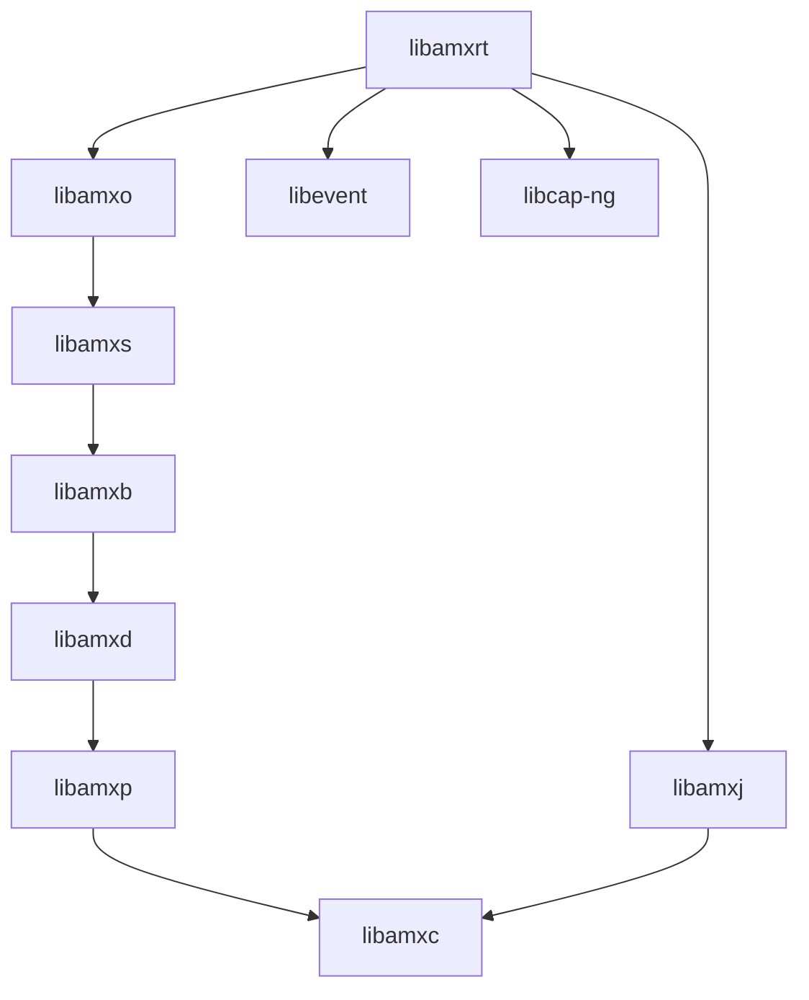
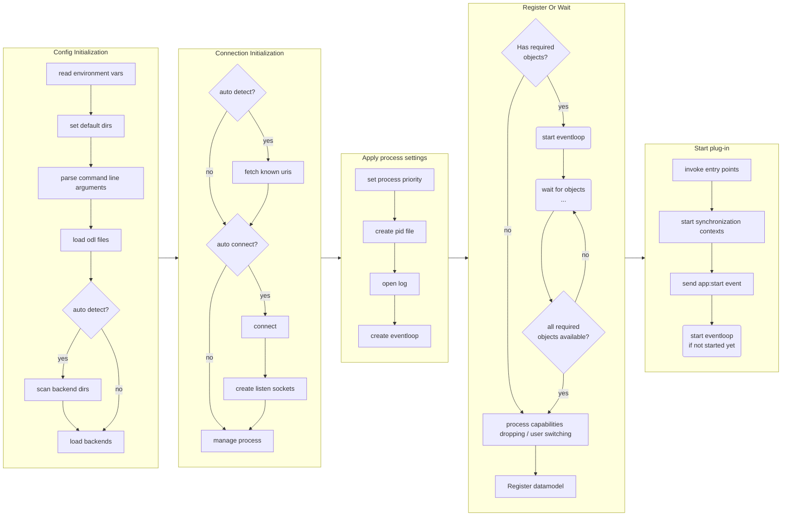

# Ambiorix Run Time Library

[[_TOC_]]

## Introduction

Using this library it will be easy to create an ambiorix application with an eventloop.

This library provides the full implementation of the Ambiorix Run Time and is used by the [amxrt application](https://gitlab.com/prpl-foundation/components/ambiorix/applications/amxrt).

This library provides:

- command line parsing, supports the default ambiorix runtime command line options
- auto detection of bus backends and well known sockets
- loading of odl files to create a (tr181) data model
- registering of the data model objects to the used bus system
- waiting for data model objects
- setting up an event-loop (and monitors all needed file descriptors)

All the necessary details are available in the [Doxygen-based documentation for the latest release](https://prpl-foundation.gitlab.io/components/ambiorix/libraries/libamxrt/doxygen),
which is a static website served via [GitLab Pages](https://docs.gitlab.com/ee/user/project/pages) using automated CI job.

## Building, installing and testing

### Docker container

You could install all tools needed for testing and developing on your local machine, but it is easier to just use a pre-configured environment. Such an environment is already prepared for you as a docker container.

1. Install docker

    Docker must be installed on your system.

    If you have no clue how to do this here are some links that could help you:

    - [Get Docker Engine - Community for Ubuntu](https://docs.docker.com/install/linux/docker-ce/ubuntu/)
    - [Get Docker Engine - Community for Debian](https://docs.docker.com/install/linux/docker-ce/debian/)
    - [Get Docker Engine - Community for Fedora](https://docs.docker.com/install/linux/docker-ce/fedora/)
    - [Get Docker Engine - Community for CentOS](https://docs.docker.com/install/linux/docker-ce/centos/)  <br /><br />
    
    Make sure you user id is added to the docker group:

    ```
    sudo usermod -aG docker $USER
    ```

1. Fetch the container image

    To get access to the pre-configured environment, all you need to do is pull the image and launch a container.

    Pull the image:

    ```bash
    docker pull registry.gitlab.com/soft.at.home/docker/oss-dbg:latest
    ```

    Before launching the container, you should create a directory which will be shared between your local machine and the container.

    ```bash
    mkdir -p ~/amx_project/libraries/
    ```

    Launch the container:

    ```bash
    docker run -ti -d --name oss-dbg --restart always --cap-add=SYS_PTRACE --sysctl net.ipv6.conf.all.disable_ipv6=1 -e "USER=$USER" -e "UID=$(id -u)" -e "GID=$(id -g)" -v ~/amx_project/:/home/$USER/amx_project/ registry.gitlab.com/soft.at.home/docker/oss-dbg:latest
    ```

    If you are using vpn, you need to add `--dns 192.168.16.10 --dns 192.168.16.11` to the docker run command.

    The `-v` option bind mounts the local directory for the ambiorix project in the container, at the exact same place.
    The `-e` options create environment variables in the container. These variables are used to create a user name with exactly the same user id and group id in the container as on your local host (user mapping).

    You can open as many terminals/consoles as you like:

    ```bash
    docker exec -ti --user $USER oss-dbg /bin/bash
    ```

### Building

#### Prerequisites

- [libamxc](https://gitlab.com/prpl-foundation/components/ambiorix/libraries/libamxc) - Generic C api for common data containers
- [libamxj](https://gitlab.com/prpl-foundation/components/ambiorix/libraries/libamxj) - JSON parser & generator using yajl and libamxc variants
- [libamxp](https://gitlab.com/prpl-foundation/components/ambiorix/libraries/libamxp) - Common patterns implementation
- [libamxd](https://gitlab.com/prpl-foundation/components/ambiorix/libraries/libamxd) - Data model C-API
- [libamxo](https://gitlab.com/prpl-foundation/components/ambiorix/libraries/libamxo) - Ambiorix Object Definition Language library
- [libamxb](https://gitlab.com/prpl-foundation/components/ambiorix/libraries/libamxb) - Bus agnostic C API (mediator)
- [libevent](https://libevent.org/) - an event notification library
- [libcap-ng](https://github.com/stevegrubb/libcap-ng) - a library for controlling process capabilities

---
Dependency graph - libraries needed by libamxrt.
For graph simplicity direct dependencies which are also an indirect dependency are not shown.


---

#### Build libamxrt

1. Clone the git repository

    To be able to build it, you need the source code. So open the directory just created for the ambiorix project and clone this library in it (on your local machine).

    ```bash
    cd ~/amx_project/libraries/
    git clone git@gitlab.com:prpl-foundation/components/ambiorix/libraries/libamxrt.git
    ``` 

1. Install dependencies

    Although the container will contain all tools needed for building, it does not contain the libraries needed for building `libamxrt`. To be able to build `libamxrt` you need `libamxc`. This library can be installed in the container.

    ```bash
    sudo apt update
    sudo apt install libamxc libamxj libamxp libamxd libamxb libamxs libamxo libevent libcap-ng-dev
    ```

    Note that some of the components are allready preinstalled in the container.

1. Build it

    When using the internal gitlab, you must define an environment variable `VERSION_PREFIX` before building.

    ```bash
    export VERSION_PREFIX="master_"
    ```

    After the variable is set, you can build the package.

    ```bash
    cd ~/amx_project/libraries/libamxrt
    make
    ```

### Installing

#### Using make target install

You can install your own compiled version easily in the container by running the install target.

```bash
cd ~/amx_project/libraries/libamxrt
sudo -E make install
```

#### Using package

From within the container you can create packages.

```bash
cd ~/amx_project/libraries/libamxrt
make package
```

The packages generated are:

```
~/amx_project/libraries/libamxrt/libamxrt-<VERSION>.tar.gz
~/amx_project/libraries/libamxrt/libamxrt-<VERSION>.deb
```

You can copy these packages and extract/install them.

For ubuntu or debian distributions use dpkg:

```bash
sudo dpkg -i ~/amx_project/libraries/libamxrt/libamxrt-<VERSION>.deb
```

### Testing

#### Prerequisites

No extra components are needed for testing `libamxrt`.

#### Run tests

You can run the tests by executing the following command.

```bash
cd ~/amx_project/libraries/libamxrt/tests
make
```

Or this command if you also want the coverage tests to run:

```bash
cd ~/amx_project/libraries/libamxrt/tests
make run coverage
```

#### Coverage reports

The coverage target will generate coverage reports using [gcov](https://gcc.gnu.org/onlinedocs/gcc/Gcov.html) and [gcovr](https://gcovr.com/en/stable/guide.html).

A summary for each file (*.c files) is printed in your console after the tests are run.
A HTML version of the coverage reports is also generated. These reports are available in the output directory of the compiler used.
Example: using native gcc
When the output of `gcc -dumpmachine` is `x86_64-linux-gnu`, the HTML coverage reports can be found at `~/amx_project/libraries/libamxrt/output/x86_64-linux-gnu/coverage/report.`

You can easily access the reports in your browser.
In the container start a python3 http server in background.

```bash
cd ~/amx_project/
python3 -m http.server 8080 &
```

Use the following url to access the reports `http://<IP ADDRESS OF YOUR CONTAINER>:8080/libraries/libamxrt/output/<MACHINE>/coverage/report`
You can find the ip address of your container by using the `ip` command in the container.

Example:

```bash
USER@<CID>:~/amx_project/libraries/libamxrt$ ip a
1: lo: <LOOPBACK,UP,LOWER_UP> mtu 65536 qdisc noqueue state UNKNOWN group default qlen 1
    link/loopback 00:00:00:00:00:00 brd 00:00:00:00:00:00
    inet 127.0.0.1/8 scope host lo
       valid_lft forever preferred_lft forever
    inet6 ::1/128 scope host 
       valid_lft forever preferred_lft forever
173: eth0@if174: <BROADCAST,MULTICAST,UP,LOWER_UP> mtu 1500 qdisc noqueue state UP group default 
    link/ether 02:42:ac:11:00:07 brd ff:ff:ff:ff:ff:ff link-netnsid 0
    inet 172.17.0.7/16 scope global eth0
       valid_lft forever preferred_lft forever
    inet6 2001:db8:1::242:ac11:7/64 scope global nodad 
       valid_lft forever preferred_lft forever
    inet6 fe80::42:acff:fe11:7/64 scope link 
       valid_lft forever preferred_lft forever
```

in this case the ip address of the container is `172.17.0.7`.
So the uri you should use is: `http://172.17.0.7:8080/libraries/libamxrt/output/x86_64-linux-gnu/coverage/report/`

## Configuration Options

The `amxrt` library already provides defaults for most configuration options. All these run-time configuration options can be changed using the `%config` section in the ODL files and most of them can be set using the commandline arguments.

### Defaults

The defaults configuration options provided by `libamxrt` can be dumped to stdout using `amxrt -d`, all options are printed in alhabetical order:

```bash
$ amxrt -d

Configuration:  
{                
    auto-connect = true,
    auto-detect = true,
    auto-resolver-order = [               
        "ftab",                               
        "import",        
        "*" 
    ],                         
    backend-dir = "/usr/bin/mods/amxb",
    backends = [
        "/usr/bin/mods/amxb/mod-amxb-pcb.so",
        "/usr/bin/mods/amxb/mod-amxb-dummy.so",
        "/usr/bin/mods/amxb/mod-amxb-jsonrpc.so",
        "/usr/bin/mods/amxb/mod-amxb-ubus.so"
    ],
    cfg-dir = "/etc/amx",
    daemon = false,
    data-uris = [
    ],
    dm-eventing-enabled = true,
    dummy = {
        register-name = "amxrt"
    },
    dump-caps = false,
    dump-config = true,
    extensions-dir = "extensions",
    import-dbg = false,
    import-dirs = [
        ".",
        "${prefix}${plugin-dir}/${name}",
        "${prefix}${plugin-dir}/modules",
        "${prefix}/usr/local/lib/amx/${name}",
        "${prefix}/usr/local/lib/amx/modules"
    ],
    include-dirs = [
        ".",
        "${prefix}${cfg-dir}/${name}",
        "${prefix}${cfg-dir}/modules"
    ],
    jsonrpc = {
        register-name = "amxrt"
    },
    listen = [
    ],
    log = false,
    mib-dirs = [
        "${prefix}${cfg-dir}/${name}/mibs"
    ],
    name = "amxrt",
    pcb = {
        acl-dir = "/cfg/etc/acl/",
        register-name = "amxrt"
    },
    pid-file = true,
    plugin-dir = "/usr/lib/amx",
    prefix = "",
    priority = 0,
    requires = [
    ],
    rw_data_path = "${prefix}/etc/config",
    storage-path = "${rw_data_path}/${name}/",
    storage-type = "odl",
    ubus = {
        register-name = "amxrt"
    },
    uris = [
        "ubus:/var/run/ubus/ubus.sock",
        "pcb:/var/run/pcb_sys"
    ]
}
```

### Default Command Line Argument Options

- auto-connect: (boolean) when set to true (default), the application will automatically connect to all uris specified in config option `uris`. If one of the connections fail, an error is printed to stderr. At least one connection must be available.
- auto-detect: (boolean) when set to true (default), the back-end directory is scanned and all found back-ends are loaded. A search is done for all known bus unix domain sockets, all found are added to the `uris` list and will be connected to when `auto-connect` is set to true.
- auto-resolver-order: (array) Used by the ODL parser function resolver. Defines in which order the function resolvers must be called to resolve a function name into a function pointer. More information about the ODL parser function resolving can be found in the ODL documentation.
- backend-dir: (string or list) Directory or directires that must be scanned for valid back-end implementations. When `auto-detect` is set to true, this directory or directores will be scanned and all valid back-end implementations found are added to the option `backend`.
- backends: (array) Array of back-ends that need to be loaded. When `auto-detect` option and `backend-dir` option are set this list is filled automatically.
- cfg-dir: (string) The base directory where ODL files are stored. Typically a subdirectoy is added with the same name of the application.  
- daemon: (boolean) When set to true, the application daemonizes after all ODL files are loaded (except post includes) and before the entry-points are invoked.
- data-uris: (array) Array of data uris that are used to connect on, but which are not used to register the data model on. These connections are only used to retrieve data from other data models..
- dm-eventing-enabled: (boolean) When set to true (default is false), data model eventing is enabled during the load of the ODL files provided at command line.
- dm-events-before-start: (boolean) When set the data model events are handled before `app:start` event is triggered. Default is false.
- dm-events-suspend-when-requires: (boolean) When set the data model events will be suspended until all required objects are available, when not set the data model events can occur before the entry-points are called, if required objects are not yet available. Default is false.
- dump-caps: (boolean) When set to true (default is false), the remaining linux capabilities of the process are dumped to stdout.
- dump-config: (boolean) This configuration option is mostly automatically set or using the command line option `-d`. When an error occurs during start-up this option is set and the `current` configuration is dumped to stdout. 
- extensions-dir: (string) Directory where data model extensions can be stored in odl format. These extension odls will be loaded in alphabetical order after all other (definition) odl are loaded but before the entry-points are called or post-includes are loaded.
- import-dbg: (boolean) Used by the ODL import resolver. When set to true (default is false), the import ODL resolver will print more information to stdout when resolving functions and loading shared objects.
- import-dirs: (array) Used by the ODL import resolver. It contains a list of directories where the import resolver should search for shared objects (plug-ins). Plug-ins (aka addons) are no ordinary libraries, and are loaded at run-time by the ODL import resolver, when the keyword `import` is encountered in the ODL file. Extra directories can be added using commandline option `-L`.
- include-dirs: (array) List of include directories. These directories are used by the ODL parser. When an `include` keyword is encountered in the ODL files and it does not contain an absolute path, the include file is searched in these include directories, in the order specified. Extra include directories can be added to the list with the commandline option `-I`
- listen: (array) List of listen sockets that must be created.
- log: (boolean) When set to true, `amxrt` will open the system log (syslog) and can write messages to it.
- mib-dirs: (array) List of directories. Each of these directories will be scanned for ODL files. The ODL files in that directory should only define a MIB.
- name: (string) The name of the application. When using a symbolic link to `amxrt` the name of the symbolic link is used as the `name` option.
- pid-file: (boolean) When set to true (default), a pid-file is created, with the name of the application (using the `name` configuration option).
- plugin-dir: (string) Base directory for plug-ins (aka addons). Typically a subdirectory is created with the name of the application. 
- prefix: (string) By default this is empty. When set (using commandline option `-o`) all paths are prefixed with this string. This option is mainly used for debugging reasons.
- priority: (integer) Sets the nice level of the application (default = 0)
- rw_data_path: (string) Base path were persistent storage files are saved. Typically a sub-directory is created in this directory with the name of the application.
- storage-path: (string) The (base) directory where the application will store the persistent storage files.
- storage-type: (string) The persistent storage type. This configuration option defines in which format the saved files should be written (default is "odl" format). The Ambiorix run-time can only handle the `odl` format to store persistent data. If another format is needed, a module (plug-in) is needed that can support the needed format.
- uris: (array) List of uris that are used to create the connections. These connections are used to register the data model on. Typically these are bus uri's. Other processes can access the data model of this process using the same uri's.
- requires: (array) Array of required data model objects. Using the command line option `-R` or `--requires` extra objects can be added to the list. When the list is not empty, the Ambiorix run-time will wait until all objects in the list are available before calling the entry points and triggering the event `app:start`.

#### Forcing Options From Commandline

When in odl files configuration options are specified (in `%config` section) the values specified in the odl file are taken. Using the `-F` or `--forced-option`, you can force a specific value for a configuration option from command line. The `forced options` can not be overwritten by odl files.

---
> **NOTE**<br>
> In odl files the `%config` sections are scoped and are only valid in the odl file where they are defined, and in all odl files that are included in that file after the `%config` section. If the file where the `%config` section is defined is included by another odl file (the parent odl file), the parent will not see these values for the config options, unless the config options was declared with `%global`
---

#### Required Objects

Using the command line option `-R` or `--requires` object paths can be added to the list of required objects. These objects are mostly provided by other processes and it is possible that these objects are not yet available. Ambiorix run-time will wait until all objects in the `required` list are available before calling any entry-point and triggering the event `app:start`. The data model of your application will not be registered to the bus systems until all `required` objects are available.

When the command line option `-D` or configuration option `daemon` is set, the run-time will daemonize itself even if not all required objects are available.

When all required objects are available, the `requires` array is reset to an empty array. 

### ODL Persistent Storage 

The Ambiorix run-time can store persistent data in `ODL` format save files.

By default no persistent data is saved. To enable this on configuration a table must be added to the configuration section of your main ODL file.

The `ODL` storage format is only active when the `storage-type` configuration option is set to `odl`.

#### ODL Load And Save Options

All ODL persistent storage options must be set in the `odl` and can be divided in 3 logical parts:

1. Common Setting

- odl.directory: (string) The directory where the persistent storage files are saved. This directory is also used to load the stored files (or can be used in an include) 

2. Load Settings

    ---
    >**NOTE**<br>
    >When using `include` in the `ODL` files to load the previously saved files, these settings should not be used.
    >
    >It is not recommended to use `include` and the `load` functionality toghether.
---

- odl.dm-load: (boolean) When set to true, all ODL files in the `odl.directory` are loaded.
- odl.dm-defaults: (string) String containing a directory or file. When no saved `ODL` files are found or exist, the defaults will be loaded defined by this configuration option.
- odl.load-dm-events: (boolean) When set to true data model eventing will be enabled when loading the saved files (or the defaults).

3. Save settings

- odl.dm-save: (boolean) When set to true, `amxrt` will save the persistent data at exit.
- odl.dm-save-on-changed: (boolean) When set to true `amxrt` will save the persistent data when the data has been changed.
- odl.dm-save-init-delay: (integer, default is 30000ms) Time in milliseconds to wait before writing the changes the first time. 
- odl.dm-save-delay: (integer, default is 500ms) Time in milliseconds to wait before writing the changes. Each time a change occurs before the time expires, the timer is reset. So at least no changes should occur to persistent data before the changes are saved. 
- odl.dm-objects: (csv string) Object paths that must be saved, when this option is set only the data model (sub)trees are saved that are specified. The name of the file will be the object path of the object.

#### Example

```odl
%config {
    odl = {
        dm-save = true,
        dm-save-on-changed = true,
        dm-save-init-delay = 10000,
        dm-save-delay = 1000,
        directory = "${storage-path}/odl"
    };
}
```

Using above example the Ambiorix run-time (`amxrt`) will save all `persistent` objects and parameters (they must have the `%persistent` attribute) to a file with the name `${name}.odl` in the directory specified with `odl.directory` option. The save will be done when the application exits and only when `odl.dm-save` is set to true.

When odl.dm-save-on-changed is set, changes are saved immediatly after the datamodel did not receive changes in odl.dm-save-delay time to the file and not only when the applications exits.

When persistent data changes and not other changes occur for at least `odl.dm-save-delay` the persistent data is saved.

### User Privileges and Capabilities

libamxrt is capable to drop user privileges and capabilities. 

By default all capabilities are dropped unless otherwise configured. The user and group will be retained unless otherwise configured.

---
> **NOTE**
> Initially the process amxrt (and libamxrt) didn't drop any capabilites or was not able to drop user privileges. This behavior is not good in respect to security. This behavior is kept until 01/09/2023, from then by default all capabilities will be dropped. This will provide time to update the configuration of services and applications that are using libamxrt (or the amxrt process). 
---


The user and group to which the process must switch after initializing can be configured with:
- privileges.user
- privileges.group

The set of capabilities that must be kept can be specified in a list:
- privileges.capabilites

The list must contain the names of the capabilities that needs to be kept or the identifier of that capability. The name of the capabilities must match the definitions in `linux/capabiliy.h` with or without the `CAP_` prefix. The string case is ignored (lower and upper case is allowed).

When only user/group switching is needed but all capabilities must be kept set:
- privileges.keep-all = true

Example:

This example config will switch to user `webui` and group `webui` and drops all capabilities except `CAP_CHOWN` (`chown`)
```
%config {
    privileges = {
        user = "webui",
        group = "webui",
        capabilities = [ "CAP_CHOWN" ]
    }
}
```

More information about capabilities can be found at [manpage Capabilities](https://man7.org/linux/man-pages/man7/capabilities.7.html)

---
> **NOTE**<br>
> Capabilities can only be dropped and not added.
---

### Connection retry mechanism

There are scenarios where a plugin needs to connect to a backend socket that is not yet available. This can occur, for instance, when the service responsible for creating the socket starts up after the service attempting to connect to it. In such cases, a connection retry mechanism is useful, as the listening socket will likely become available a few moments later. Additionally, the socket connection between the two processes might be disrupted, for example, if the process creating the listening socket crashes. While such failures should ideally not happen in the first place, it's better to have an extra safeguard in place. That's why `libamxrt` provides a connection retry mechanism, which can be configured with a few options.

Firstly, it is essential that the retry mechanism can be enabled or disabled for each loaded backend, as different backends may require distinct behaviors. Additionally, to prevent all services from attempting to reconnect simultaneously, each service should try to reconnect at a random time within a specified interval. This interval's minimum and maximum values will double after each failed connection attempt, and a new random value within this interval will be selected for the next retry, implementing an exponential backoff strategy. Lastly, the retry mechanism should cease after a reasonable number of attempts, as it becomes increasingly unlikely that the connection will be successfully established.

- `<backend-name>.connect-retry`: (boolean, default is false) When set to true, the connection retry mechanism is enabled for all `uris` and `data-uris` that correspond to this backend.
- `connect-retry-timeout-min`: (integer, default is 5000 ms) Minimum value in milliseconds of the retry time interval. Value will double on each failed connection attempt.
- `connect-retry-timeout-max`: (integer, default is 10000 ms) Maximum value in milliseconds of the retry time interval. Value will double on each failed connection attempt.
- `connect-retry-max-count`: (integer, default is 10) The amount of times the reconnect is retried before giving up.

## Using libamxrt

### The default behavior is fine for me

By calling the function `amxrt` an ambiorix runtime is created. It will parse the command line arguments using the default ambiorix command line arguments:

```
$ amxrt -h
amxrt [OPTIONS] <odl files>

Options:

    -h    --help                          Print usage help and exit
    -H    --HELP                          Print extended help and exit
    -B    --backend <so file>             Loads the shared object as bus backend
    -u    --uri <uri>                     Adds an uri to the list of uris
    -A    --no-auto-detect                Do not auto detect unix domain sockets and back-ends
    -C    --no-connect                    Do not auto connect the provided or detected uris
    -I    --include-dir <dir>             Adds include directory for odl parser, multiple allowed
    -L    --import-dir <dir>              Adds import directory for odl parser, multiple allowed
    -o    --option <name=value>           Adds a configuration option
    -F    --forced-option <name=value>    Adds a configuration option, which can not be overwritten by odl files
    -O    --ODL <odl-string>              An ODL in string format, only one ODL string allowed
    -D    --daemon                        Daemonize the process
    -p    --priority <nice level>         Sets the process nice level
    -N    --no-pid-file                   Disables the creation of a pid-file in /var/run
    -E    --eventing                      Enables eventing during loading of ODL files
    -d    --dump-config                   Dumps configuration options at start-up
    -l    --log                           Write to syslog instead of stdout and stderr
    -R    --requires <root object>        Checks if datamodel objects are available or waits until they are available
    -V    --version                       Print version
```

After parsing the command line arguments, it will load the ambiorix backends, looks for well known unix domain sockets (ubus, pcb, ....) and connectes to them.

Loads the odl files, that are provided after the command line options, or loads the odl file that matches the application's name (by default `/etc/amx/<appname>/<appname>.odl`).

Creates and starts the event-loop.

```c
#include <amxrt/amxrt.h>

int main(int argc, char* argv[]) {
    int retval = 0;
    
    amxrt_new();
    retval = amxrt(argc, argv, NULL);
    amxrt_delete();

    return retval;
}
```

---
The above code will follow this initialization flow:

---
Optionally extra command line arguments (options) and an option handler function can be added.

```c
#include <stdio.h>

#include <amxrt/amxrt.h>

#define VERSION_MAJOR 1
#define VERSION_MINOR 0
#define VERSION_BUILD 0

static int handle_cmd_line_arg(amxc_var_t* config, int arg_id, const char* value) {
    int rv = -1;
    const char* name = GET_CHAR(amxrt_get_config(), "name");
    switch(arg_id) {
    case 'V': {
        printf("%s %d.%d.%d\n", name, VERSION_MAJOR, VERSION_MINOR, VERSION_BUILD);
    }
    break;
    default:
        rv = -2;
        break;
    }

    return rv;
}

int main(int argc, char* argv[]) {
    int retval = 0;
    
    amxrt_new()
    amxrt_cmd_line_add_option(0, 'V', "version", no_argument, "Print version", NULL);
    retval = amxrt(argc, argv, handle_cmd_line_arg);
    amxrt_delete();

    return retval;
}
```

Alternativly you could just use the [amxrt app](https://gitlab.com/prpl-foundation/components/ambiorix/applications/amxrt), which implements exactly the above.

### I want a bit more control

Still easy to use, but with the possibility to do other actions in between.

```c
#include <amxrt/amxrt.h>

int main(int argc, char* argv[]) {
    int retval = 0;
    
    amxrt_new();

    // read env vars (AMXB_BACKENDS, AMXRT_PREFIX_PATH, AMXRT_PLUGIN_DIR, AMXRT_CFG_DIR)
    // set default directories configuration options (include-dirs, import-dirs, mib-dirs)
    // set name configuration option (name)
    // parse command line options (index is set to command line options where parsing has stopped)
    // search for backends and known unix domain sockets, if auto-detect is set
    // parse odl string provided with command line argument -O 
    // parse odl files passed with command line after the options 
    // add the auto save - needs configuration in config section
    // load all backends
    // connect to all sockets (if any)
    // create listen sockets (if any)
    // apply process settings (daemonize, set nice level, create pid file, open syslog)
    // enable linux signals
    // create event loop
    retval = amxrt_init(argc, argv, NULL);
    when_failed(retval, leave);
 
    // register data model or wait for required objects
    // if all required objects are available the data model will be registered 
    // (after starting the event loop)
    // call entry points when data model is registered
    // start object & parameter synchronization if any was defined in one of the loaded odl files
    // send app:start ambiorix signal when data model is registered
    retval = amxrt_register_or_wait();
    when_failed(retval, leave);
 
    // start the event loop
    retval = amxrt_run();
    
leave:
    amxrt_stop();
    amxrt_delete();
    return retval;
}
```

### I want even more control

The example below will create a data model provider application. This implementation provides the default implementation of the `amxrt` function. 

If you need to create a data model client application (that is an application that doesn't provide a data model), you can remove the following calls:

- `amxrt_load_odl_files`
- `amxrt_register_or_wait`

```c
#include <amxrt/amxrt.h>

int main(int argc, char* argv[]) {
    int retval = 0;
    int index = 0;
    amxc_var_t* syssigs = NULL;
    amxc_var_t* config = NULL;
    amxd_dm_t* dm = NULL;
    amxo_parser_t* parser = NULL;
    
    amxrt_new();

    config = amxrt_get_config();
    dm = amxrt_get_dm();
    parser = amxrt_get_parser();

    // read env vars (AMXB_BACKENDS, AMXRT_PREFIX_PATH, AMXRT_PLUGIN_DIR, AMXRT_CFG_DIR)
    // set default directories configuration options (include-dirs, import-dirs, mib-dirs)
    // set name configuration option (name)
    // parse command line options (index is set to command line options where parsing has stopped)
    // the index will be set to the first non option command line argument
    retval = amxrt_config_init(argc, argv, &index, NULL);
    when_failed(retval, leave);
     
    // parse odl string provided with command line argument -O 
    // parse odl files passed with command line after the options 
    // the index should point to the first odl file in the command line arguments
    // or set to argc when no odl files are passed at the command line
    retval = amxrt_load_odl_files(argc, argv, index);
    when_failed(retval, leave);

    // search for backends and known unix domain sockets, if auto-detect is set
    amxrt_config_scan_backend_dirs();

    // add the auto save - needs configuration in config section
    amxo_parser_add_entry_point(parser, amxrt_dm_save_load_main);
    
    // load all backends
    // connect to all sockets (if any)
    // create listen sockets (if any)
    // apply process settings (daemonize, set nice level, create pid file, open syslog)
    retval = amxrt_connect();
    when_failed(retval, leave);

    // enable linux signals
    syssigs = GET_ARG(config, "system-signals");
    if(syssigs != NULL) {
        amxrt_enable_syssigs(syssigs);
    }

    // create event loop
    retval = amxrt_el_create();
    when_failed(retval, leave);
    
    // register data model or wait for required objects
    // if all required objects are available the data model will be registered 
    // (after starting the event loop)
    // call entry points when data model is registered
    // start object & parameter synchronization if any was defined in one of the loaded odl files
    // send app:start ambiorix signal when data model is registered
    retval = amxrt_register_or_wait();
    when_failed(retval, leave);
    
    // the app:start signal will be triggered when registration is done
    // this can be immediatly or when all required objects are available.

    // start the event loop
    amxrt_el_start(); // will block until amxrt_el_stop is called
    // app:stop ambiorix signal is send when the above function exits
    
leave:
    // stop amx runtime and cleanup
    amxrt_stop();
    amxrt_delete();
    return retval;
}
```

### I want to do everything myself

In this case this library can not help you. Look at the other ambiorix libraries and use the functions you need.
