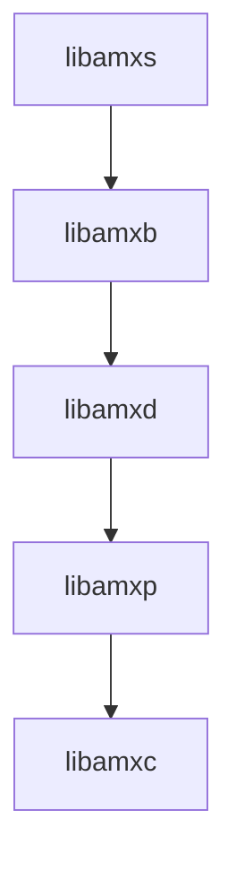
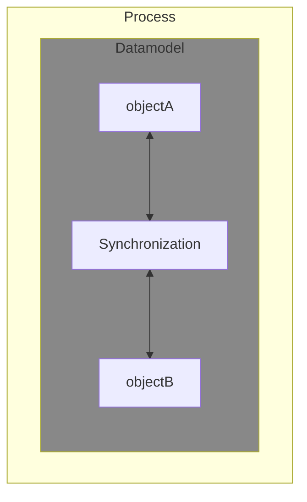
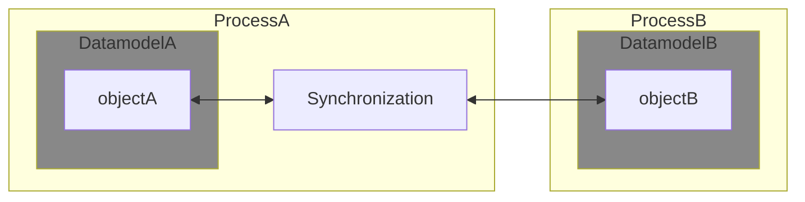
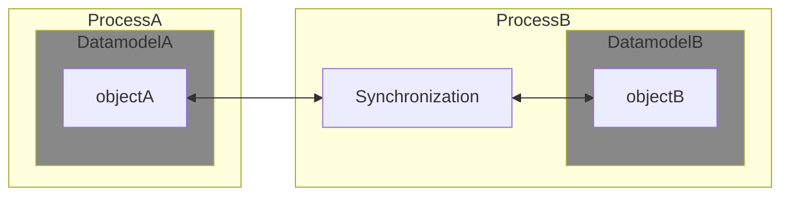
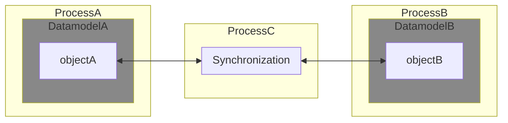

# Data Model Synchronization C API

[[_TOC_]]

## Introduction

The goal of this library is to provide an API that makes it possible to keep information in sync between two data models

## Building, installing and testing

### Docker container

You could install all tools needed for testing and developing on your local machine, but it is easier to just use a pre-configured environment. Such an environment is already prepared for you as a docker container.

1. Install docker

    Docker must be installed on your system.

    If you have no clue how to do this here are some links that could help you:

    - [Get Docker Engine - Community for Ubuntu](https://docs.docker.com/install/linux/docker-ce/ubuntu/)
    - [Get Docker Engine - Community for Debian](https://docs.docker.com/install/linux/docker-ce/debian/)
    - [Get Docker Engine - Community for Fedora](https://docs.docker.com/install/linux/docker-ce/fedora/)
    - [Get Docker Engine - Community for CentOS](https://docs.docker.com/install/linux/docker-ce/centos/)  <br /><br />

    Make sure you user id is added to the docker group:

    ```
    sudo usermod -aG docker $USER
    ```

1. Fetch the container image

    To get access to the pre-configured environment, all you need to do is pull the image and launch a container.

    Pull the image:

    ```bash
    docker pull registry.gitlab.com/soft.at.home/docker/oss-dbg:latest
    ```

    Before launching the container, you should create a directory which will be shared between your local machine and the container.

    ```bash
    mkdir -p ~/amx_project/libraries/
    ```

    Launch the container:

    ```bash
    docker run -ti -d --name oss-dbg --restart always --cap-add=SYS_PTRACE --sysctl net.ipv6.conf.all.disable_ipv6=1 -e "USER=$USER" -e "UID=$(id -u)" -e "GID=$(id -g)" -v ~/amx_project/:/home/$USER/amx_project/ registry.gitlab.com/soft.at.home/docker/oss-dbg:latest
    ```

    The `-v` option bind mounts the local directory for the ambiorix project in the container, at the exact same place.
    The `-e` options create environment variables in the container. These variables are used to create a user name with exactly the same user id and group id in the container as on your local host (user mapping).

    You can open as many terminals/consoles as you like:

    ```bash
    docker exec -ti --user $USER oss-dbg /bin/bash
    ```

### Building

#### Prerequisites

- [libamxc](https://gitlab.com/prpl-foundation/components/ambiorix/libraries/libamxc) - Generic C api for common data containers
- [libamxp](https://gitlab.com/prpl-foundation/components/ambiorix/libraries/libamxp) - common patterns implementation
- [libamxb](https://gitlab.com/prpl-foundation/components/ambiorix/libraries/libamxb) - Bus Agnostic C API
- [libamxd](https://gitlab.com/prpl-foundation/components/ambiorix/libraries/libamxd) - Data Model Manager

---
Dependency graph - libraries needed by libamxs.
For graph simplicity direct dependencies which are also an indirect dependency are not shown.


---

#### Build libamxs

1. Clone the git repository

    To be able to build it, you need the source code. So open the directory just created for the ambiorix project and clone this library in it (on your local machine).

    ```bash
    cd ~/amx_project/libraries/
    git clone git@gitlab.com:prpl-foundation/components/ambiorix/libraries/libamxs.git
    ```

1. Install dependencies

    Although the container will contain all tools needed for building, it does not contain the libraries needed for building `libamxs`. To be able to build `libamxs` you need `libamxc`, `libamxp`, `libamxb` and `libamxd`. These libraries can be installed in the container.

    ```bash
    sudo apt update
    sudo apt install libamxb
    ```

    Note that you do not need to install all components explicitly. Some components will be installed automatically because the other components depend on them. Some of the components are allready preinstalled in the container.

1. Build it

    When using the internal gitlab, you must define an environment variable `VERSION_PREFIX` before building.

    ```bash
    cd ~/amx_project/libraries/libamxs
    make
    ```

1. Build Documentation (optional)

    ```bash
    cd ~/amx_project/libraries/libamxs
    make doc
    ```
    
    The documentation will be available in the directory `./output/doc/doxy-html`. The generated documenation can be viewed in your favorite browser, open the file `index.html`.

### Installing

#### Using make target install

You can install your own compiled version easily in the container by running the install target.

```bash
cd ~/amx_project/libraries/libamxs
sudo -E make install
```

#### Using package

From within the container you can create packages.

```bash
cd ~/amx_project/libraries/libamxs
make package
```

The packages generated are:

```
~/amx_project/libraries/libamxs/libamxs-<VERSION>.tar.gz
~/amx_project/libraries/libamxs/libamxs-<VERSION>.deb
```

You can copy these packages and extract/install them.

For ubuntu or debian distributions use dpkg:

```bash
sudo dpkg -i ~/amx_project/libraries/libamxs/libamxs-<VERSION>.deb
```

### Testing

#### Prerequisites

- [libamxo](https://gitlab.com/prpl-foundation/components/ambiorix/libraries/libamxo) - The ODL compiler library

#### Run tests

1. Install dependencies

    Most of the packages needed for testing are allready preinstalled in the container. To be able to test `libamxs` you need to extra install `libamxo`.

    ```bash
    sudo apt update
    sudo apt install libamxo
    ```

1. Run tests

    You can run the tests by executing the following command.

    ```bash
    cd ~/amx_project/libraries/libamxs/tests
    make
    ```

    Or this command if you also want the coverage tests to run:

    ```bash
    cd ~/amx_project/libraries/libamxs/tests
    make run coverage
    ```

#### Coverage reports

The coverage target will generate coverage reports using [gcov](https://gcc.gnu.org/onlinedocs/gcc/Gcov.html) and [gcovr](https://gcovr.com/en/stable/guide.html).

A summary for each file (*.c files) is printed in your console after the tests are run.
A HTML version of the coverage reports is also generated. These reports are available in the output directory of the compiler used.
Example: using native gcc
When the output of `gcc -dumpmachine` is `x86_64-linux-gnu`, the HTML coverage reports can be found at `~/amx_project/libraries/libamxs/output/x86_64-linux-gnu/coverage/report.`

You can easily access the reports in your browser.
In the container start a python3 http server in background.

```bash
cd ~/amx_project/
python3 -m http.server 8080 &
```

Use the following url to access the reports `http://<IP ADDRESS OF YOUR CONTAINER>:8080/libraries/libamxs/output/<MACHINE>/coverage/report`
You can find the ip address of your container by using the `ip` command in the container.

Example:

```bash
USER@<CID>:~/amx_project/libraries/libamxs$ ip a
1: lo: <LOOPBACK,UP,LOWER_UP> mtu 65536 qdisc noqueue state UNKNOWN group default qlen 1
    link/loopback 00:00:00:00:00:00 brd 00:00:00:00:00:00
    inet 127.0.0.1/8 scope host lo
       valid_lft forever preferred_lft forever
    inet6 ::1/128 scope host
       valid_lft forever preferred_lft forever
173: eth0@if174: <BROADCAST,MULTICAST,UP,LOWER_UP> mtu 1500 qdisc noqueue state UP group default
    link/ether 02:42:ac:11:00:07 brd ff:ff:ff:ff:ff:ff link-netnsid 0
    inet 172.17.0.7/16 scope global eth0
       valid_lft forever preferred_lft forever
    inet6 2001:db8:1::242:ac11:7/64 scope global nodad
       valid_lft forever preferred_lft forever
    inet6 fe80::42:acff:fe11:7/64 scope link
       valid_lft forever preferred_lft forever
```

in this case the ip address of the container is `172.17.0.7`.
So the uri you should use is: `http://172.17.0.7:8080/libraries/libamxs/output/x86_64-linux-gnu/coverage/report/`

## Using libamxs

This library provides functions to make it easy to synchronize parts of a data model with each other.

### Use Cases

- Synchronize legacy data models with standardized data model:<br>

  The standard data models evolve and often data model part were implemented before they were available in the BBF standards. When the standard is adapted it is often not in-line with what was already implemented. To be able to quickly adapt to the updated standard it is often sufficient to define the standard data model and set-up synchronization between them.

   ---
   > **NOTE**
   > Most of the time this is a temporary solution, in the end the legacy data model should be replaced with the standard data model.
   > The synchronization provides a way to create a transition period were the legacy data model is still used, but declared deprecated until all other applications are switched to the standard data model.
   ---

- Prefixed objects and parameters:

  Often vendor specific parameters are added to standard data model definitions to be able to add extra functionality or keep track of some internal state. These parameters are prefixed with a vendor specific identifier. One of the problems with these prefixes is that they can change in the future or these extra objects and parameters get standarized, so the prefix must be removed. Other applications that depend on these non-standardized objects and parameters must be updated each time that happens, which is a huge maintenance task that must be avoided at all costs.
  Using synchronization it is possible to define objects and parameters without the prefix and the same with the prefix. The ones without the prefix must be not visible to external applications (like USP-controlles, webui, ...) and therefor should be defined protected.

### Synchronization Combinations

The following diagrams show some of the possible combinations of synchronization, but it is not limited to these combinations. Other combinations are possible, these are the most common ones.

#### Synchronization objects within the same data model and process

Objects and parameters that are defined in the same data model can be synchronized with each other.


---
> **NOTE**
> The above synchronization can update read-only parameters in objectA and objectB
---

#### Synchronization objects from different data models and processes

Objects and parameters that are defined in different data models can be synchronized with each other. The synchronization implementation must be done in only one of the processes (not in both).


---
> **NOTE**
> The above synchronization can update read-only parameters in objectA
---


---
> **NOTE**
> The above synchronization can update read-only parameters in objectB
---

#### Synchronization objects from different data models and processes using synchronization process.

Objects and parameters that are defined in different data models can be synchronized with each other. The synchronization implementation can be done in a separate processes 


---
> **NOTE**
> The above synchronization can not update any read-only parameters
---

## Implementing a Synchronization

Creating a synchronization context is easy:
1. Create a synchronization context using one of the functions `amxs_sync_ctx_new` or `amxs_sync_ctx_init`.
1. Create the synchronization objects and parameters using `amxs_sync_object_new`, `amxs_sync_object_new_copy`, `amxs_sync_param_new` or `amxs_sync_param_new_copy`.
2. Add objects and the parameters to the synchronization context or to synchronization objects using `amxs_sync_ctx_add_object`, `amxs_sync_ctx_add_param`, `amxs_sync_object_add_param`, `amxs_sync_object_add_object`.
4. Start the synchronization with `amxs_sync_ctx_start_sync`. 

---
> **NOTE**<br>
> Other functions exist to make it easier to create synchronization context. Check the API documentation to find out more details about the available functions.
---

### Small example 

Consider this data model definition in [odl](https://gitlab.com/prpl-foundation/components/ambiorix/libraries/libamxo/-/blob/main/doc/odl.md) format:

```odl
%define {
    object A {
        object A_template[] {
            uint32 uint_A = 1;
            string string_A = "I am A";
        }

        uint32 param_A = 2;
    }

    object B {
        object B_template[] {
            uint32 uint_B = 3;
            string string_B = "I am B";
        }

        uint32 param_B = 4;
    }
}
```

To create a full synchronization between object `A.` and `B.` the following code is needed:

```C
amxs_sync_ctx_t* start_sync(void) {
    amxs_sync_t*ctx = NULL;
    amxs_sync_object_t* obj = NULL;
    amxs_status_t status = amxs_status_ok;

    status = amxs_sync_ctx_new(&ctx, "A.", "B.", AMXS_SYNC_DEFAULT);
    status |= amxs_sync_ctx_add_new_copy_param(ctx, "param_A", "param_B", AMXS_SYNC_DEFAULT);

    status |= amxs_sync_object_new_copy(&obj, "A_template.", "B_template.", AMXS_SYNC_DEFAULT);
    status |= amxs_sync_object_add_new_copy_param(obj, "uint_A", "uint_B", AMXS_SYNC_DEFAULT);
    status |= amxs_sync_object_add_new_copy_param(obj, "string_A", "string_B", AMXS_SYNC_DEFAULT);
    status |= amxs_sync_ctx_add_object(ctx, obj);

    status = amxs_sync_ctx_start_sync(ctx);
    if (status != amxs_status_ok) {
        amxs_sync_ctx_delete(&ctx);
    }
    return ctx;
}
```

## Considerations

- When a read-only parameter is part of a synchronization the synchronization implementation must be running in the same process that provides that parameter. Before starting the synchronization the function `amxs_sync_ctx_set_local_dm` must be called to set the local data model on the synchronization context.


