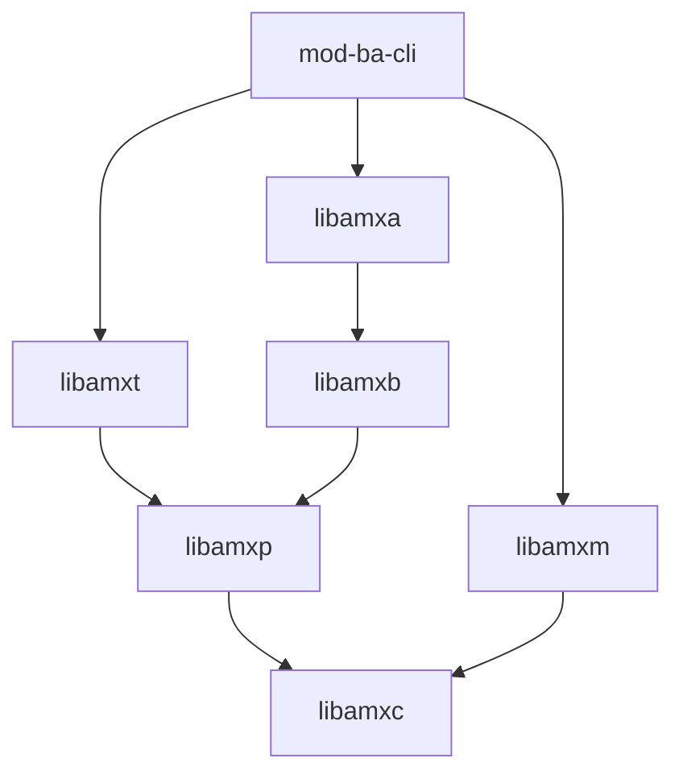

z# Bus Agnostic Interactive Command Line Interface

[[_TOC_]]

## Introduction

This module is an extension to [amx-cli](https://gitlab.com/prpl-foundation/components/ambiorix/applications/amx-cli) with 3 major functions:

- Loading Ambiorix backends
- Connecting to backend sockets
- Invoking RPCs over these backend connections


## Building

### Prerequisites

- [libamxc](https://gitlab.com/prpl-foundation/components/ambiorix/libraries/libamxc) - Generic C api for common data containers
- [libamxt](https://gitlab.com/prpl-foundation/components/ambiorix/libraries/libamxt) - Library for adding interactive tty mode to your applications
- [libamxm](https://gitlab.com/prpl-foundation/components/ambiorix/libraries/libamxm) - Modularity api, simplifies creation of add-ons (plug-ins, modules)
- [libamxp](https://gitlab.com/prpl-foundation/components/ambiorix/libraries/libamxp) - Common patterns implementation
- [libamxd](https://gitlab.com/prpl-foundation/components/ambiorix/libraries/libamxd) - Data model C API
- [libamxb](https://gitlab.com/prpl-foundation/components/ambiorix/libraries/libamxb) - Bus agnostic API
- [libamxa](https://gitlab.com/prpl-foundation/components/ambiorix/libraries/libamxa) - ACL verification library

---
Dependency graph - libraries needed by mod-ba-cli.
For graph simplicity direct dependencies which are also an indirect dependency are not shown.



You can install these libraries from source or using their debian packages. To install them from source, refer to their corresponding repositories for more information. To install them using debian packages, you can run

```bash
sudo apt update
sudo apt install libamxc libamxt libamxm libamxp libamxd libamxb libamxa
```

### Build and install mod-ba-cli

1. Clone the git repository

    To be able to build it, you need the source code. So open the directory for the ambiorix project and clone this library in it.

    ```bash
    mkdir ~/amx_project/modules/amx_cli/mod-ba-cli
    cd ~/amx_project/modules/amx_cli/mod-ba-cli
    git clone git@gitlab.com:prpl-foundation/components/ambiorix/modules/amx_cli/mod-ba-cli.git
    ``` 

1. Build it

    ```bash
    cd ~/amx_project/modules/amx_cli/mod-ba-cli
    make
    ```

1. Install it

    You can use the install target in the makefile to install the module

    ```bash
    cd ~/amx_project/modules/amx_cli/mod-ba-cli
    sudo -E make install
    ```

## Configuring the module

During installation a symbolic link is created to `amx-cli`:

```text
/usr/bin/ba-cli -> /usr/bin/amx-cli
```

There is also a config file and an init file installed:

- config/ba-cli.conf is installed in /etc/amx/cli/ba-cli.conf
- config/ba-cli.init is installed in /etc/amx/cli/ba-cli.init

These files are used for configuring this module. Whenever you launch `ba-cli`, you will launch
`amx-cli` due to the symbolic link and `amx-cli` will use the zeroth argument to load the
corresponding config and init file for this module. The `ba-cli.init` will auto detect all available bus back-ends installed in directory `/usr/bin/mods/amxb/` and auto-connect to the default sockets for each of them, if the back-end provides the default uris.

Depending on the build configuration that was used other configuration and initialization files are installed:

- config/ubus-cli.conf
- config/ubus-cli.init
- config/pcb-cli.conf
- config/pcb-cli.init

These initialization files will only load a specific bus back-end and only creates a specific connection.
These configuration files also disables some functionality of `amx-cli`, `!history`, `!addon` and `!record` are disabled, the `AMX` logo at startup will not be printed.

When some of the disabled features are needed, you can modify these files or create your own configuration and initialization files.

When these files are installed extra symbolic links to `amx-cli` are installed as well:

- /usr/bin/ubus-cli -> /usr/bin/amx-cli
- /usr/bin/pcb-cli -> /usr/bin/amx-cli

### Applying different CLI config options

The `ba-cli.conf` file contains a lot of settings to customize the CLI based on personal
preferences. You can for example disable printing the AMX logo on startup or diable colors with the
options:

```text
    "no-logo": true,
    "no-colors": true,
```

You generally don't need to update the config file. The init file is more important and will be
discussed in more detail.

### Configuring the init script

The `ba-cli.init` file lists all commands that will be executed by `amx-cli` on startup. Note
that every command listed in this file could also be used interactively inside the CLI.

The first line encountered in `ba-cli.init` is used to suppress the output during
initialization.

```text
!amx silent true
```

This is disabled again at the end of the file.

```text
!amx silent false
```

The only things that are printed between these 2 statements are the comments, which are prefixed
with a `#`. This gives you a brief overview of which actions are performed on startup.

`amx-cli` allows loading new modules using the `load` operation. This operation is used to load the
bus agnostic cli module which is defined in this repository.

```text
# Load Ambiorix Bus Agnostic CLI
!addon load mod_ba /usr/lib/amx/amx-cli/mod-ba-cli.so
```

This module has 3 submodules:

- backend: allows dynamic loading and unloading of Ambiorix backends
- connection: allows opening connections to backend sockets and selecting a socket for communication
- cli: allows invoking RPCs on open backend connections

Adding the PCB and uBus backend is done with the next 2 commands.

```text
# Load PCB back-end
backend add /usr/bin/mods/amxb/mod-amxb-pcb.so

# Loading uBus back-end 
backend add /usr/bin/mods/amxb/mod-amxb-ubus.so
```

Connections are opened to both buses using the `connection` module

```text
# Connecting to PCB sysbus ...
connection open pcb:/var/run/pcb_sys

# Connecting to uBus ...
connection open ubus:
```

And finally the `cli` module is selected for communicating with `pcb_cli` syntax.

```text
# Set mode cli
!addon select mod_ba cli
```

The CLI is now ready for use, but some additional aliases are added for convenience. You can add
your own aliases to this list whenever you need them. The pre-defined aliases are:

- `printenv`: print the environment variables.
- `setenv`: set an environment variable.
- `mode-cli`: select the cli module.
- `connections`: select connection module.
- `pcb-connection`: select the pcb sysbus socket for communication and select the cli module.
- `ubus-connection`: select the ubus socket for communication and select the cli module.
- `any-connection`: select any connection for communicating. This feature is still experimental.
- `exit`: exit the CLI.
- `quit`: exit the CLI.

## Using the CLI module

When launching `ba-cli` you will see the comments from the init script being printed as
explained above and you will be presented with an interface that looks like this:

```text
username - socket - [module] (0)
 > 
```

The meaning of `username` is straightforward. It is the name of the user that started the process.
The `socket` is the current back-end socket that is selected for invoking RPCs. When using the pcb
or ubus backend it will either be `pcb:/var/run/pcb_sys` or `ubus:`. The `module` is the current
module that is selected. On startup this should be `pcb_cli`, because this was selected during the
init script. The `(0)` at the end of the line indicates the last command was executed successfully.
It will update after each command you execute.
A practical example of the startup interface would be:

```text
root - pcb:/var/run/pcb_sys - [pcb-cli] (0)
 > 
```

### Finding help

There are typically 2 `help` commands available:

- `!help`: provides help about the ambiorix cli
- `help`: provides help about the current module (granted that the help function was implemented for this module)

The output of `!help` will look similar to this:

```text
 > !help
amx modules:
	Use ! prefix to execute amx modules commands

	record - record and playback cli commands
	amx - Ambiorix Interactive Command Line Control.
	history - Can display, clear, save and load the command history
	addon - loads & unloads add-ons - adds or removes functionality
	help - Shows help

aliases:
	any-connection = connections; select *; mode-cli;
	connections = !addon select mod_ba connection
	exit = !amx exit
	mode-cli = !addon select mod_ba cli
	pcb-connection = connections; select pcb:/var/run/pcb_sys; mode-cli;
	printenv = !amx variable
	quit = !amx exit
	setenv = !amx variable
	ubus-connection = connections; select ubus:; mode-cli;

Available addons: 
	 mod_ba - /usr/lib/amx/amx-cli/mod-ba-cli.so
		backend - Manage backends
		connection - Manage connections
		cli - Bus Agnostic cli.

Select addon with !addon select <ADDON> [<MODULE>]
```

It may look slightly different for you if you have different aliases defined. The first section of
this `!help` command contains information about the `amx-cli` modules. The `addon` module has
already been used a few times in the init script. You can use `!addon help` to get more information
about the specific module.

```text
 > !addon help

help [<CMD>]
	Prints help

load <ALIAS> <ADDON>
	loads an add-on shared object.

remove <ALIAS>
	Removes an add-on shared-object.

select <ALIAS> [<MODULE>]
	Selects an add-on as the acrive add-on.

list
	Lists all loaded add-on
```

The `load` function was used in the init script to load the `mod-ba-cli.so` shared object as an
addon named `mod_ba`. 
You can see the `mod_ba` addon under the available addons at the bottom of the `!help` section. Its
3 modules are also shown here. The select function was used to select module `cli` from addon `mod_ba`. There is an alias defined to easily select this module again at runtime. It is listed under the aliases of the `!help` output as

```text
mode-cli = !addon select mod_ba cli
```

These aliases provide a convenient way of grouping a set of commands together.
Another good example to take a look at is the `ubus-connection` alias.

```text
ubus-connection = connections; select ubus:; mode-cli;
```

This alias is built up from some other aliases and can be expanded to

```text
ubus-connection = !addon select mod_ba connection; select ubus:; !addon select mod_ba cli;
```

So this is a sequence of 3 different commands:

1. Select the connection module from addon mod_ba.
2. This connection module has its own `select` function. Use this function to select the `ubus:` uri.
3. Select the cli module from addon mod_ba.

Something similar is done in the `pcb-connection` alias.

### Bus CLI mode quick reference

When the `cli` module is selected, use the `help` command to get more information about the
commands you can use with this module.

```text
root - ubus: - [pcb-cli] (0)
 > help

help [<CMD>]
        Print this help

cd <PATH>
        Sets the default object path

list [<OPTIONS>] [<PATH>] | ls <SEARCH PATH>
        List objects.

ls [<OPTIONS>] [<PATH>]
        List objects.

dump [<OPTIONS>] <PATH>
        Dump object details

resolve <PATH>
        Expand a search path to all matching object paths

subscriptions
        List all open event subscriptions

requests
        List all pending RPC requests

gsdm [<OPTIONS>] <PATH>
        Get supported data model

gi [<OPTIONS>] <PATH>
        Get instances

<PATH>.[<PARAM>]? [<DEPTH>] [<PARAM-FILTER-EXPR>]|& [<EVENT-FILTER-EXPR>]|$]
        Get object parameters

<PATH>.<PARAM>=<VALUE> | <PATH>.{<PARAM>=<VALUE>, ...}
        Changes the value of parameter(s)

<PATH>.+ [{<PARAM>=<VALUE>}, ...]
        Adds a new instance of a multi-instance object

<PATH>.-
        Deletes an instance of a multi-instance object

<PATH>.<METHOD>([<ARG1>=<VALUE>][,<ARG2>=<VALUE>]...)
        Calls a method on the specified object path
```

#### Example get

You can get object parameters with the `?` operator

```text
root - ubus: - [pcb-cli] (0)
 > Greeter.?
Greeter.
Greeter.HistorySize=1
Greeter.MaxHistory=10
Greeter.State="Idle"
Greeter.History.1.
Greeter.History.1.From="odl parser"
Greeter.History.1.Message="Welcome to the Greeter App"
Greeter.History.1.Retain=true
Greeter.Statistics.
Greeter.Statistics.AddHistoryCount=0
Greeter.Statistics.DelHistoryCount=0
Greeter.Statistics.EventCount=2
```

Use `help ?` for more information.

> Note that this doens't work on native ubus objects, because they don't have a get operation by
> default. You can use the `ls` command for introspection purposes instead.

#### Example set

You can set a parameter value with the `=` operator

```text
root - ubus: - [pcb-cli] (0)
 > Greeter.State="Start"
Greeter.
Greeter.State="Start"
```

You can set multiple parameters:

```text
root - ubus: - [pcb-cli] (0)
 > Phonebook.Contact.1.{FirstName="John",LastName="Doe"}
Phonebook.Contact.1.
Phonebook.Contact.1.FirstName="John"
Phonebook.Contact.1.LastName="Doe"
```

Use `help =` for more information.

#### Example add

You can use the `+` operator to add an instance of a multi-instance object.

```text
root - ubus: - [pcb-cli] (0)
 > Phonebook.Contact.+
Phonebook.Contact.1.
```

Use `help +` for more information.

#### Example delete

You can use the `-` operator to delete an instance of a multi-instance object.

```text
root - ubus: - [pcb-cli] (0)
 > Phonebook.Contact.1.-
Phonebook.Contact.1.
Phonebook.Contact.1.PhoneNumber.
Phonebook.Contact.1.E-Mail.
```

Use `help -` for more information.

#### Example list

You can use the `ls` command to list objects

```text
root - ubus: - [pcb-cli] (0)
 > ls -rnpf Greeter.
Greeter.say
Greeter.setMaxHistory
Greeter.save
Greeter.load
Greeter.echo
Greeter.History.
Greeter.History.clear
Greeter.History.1.
Greeter.Statistics.
Greeter.Statistics.periodic_inform
Greeter.Statistics.reset
```

Use `help ls` for more information.

***
> **NOTE**<br>
> The list command only works correctly without a `PATH` when a specific connection is selected. 
***

#### Example dump

You can use `dump` to dump an object's details.

```text
root - ubus: - [pcb-cli] (0)
 > dump -rnpf Greeter.
P....... <public>      singleton Greeter.
PR...... <public>         uint32 Greeter.MaxHistory=10
.R...C.. <public>         uint32 Greeter.NumberOfHistoryEntries=1
........ <public>         string Greeter.State=Idle
........ <public>           bool Greeter.save(I.S. string file)
........ <public>           void Greeter.send_event(I..M any data)
........ <public>         string Greeter.say(I..M string from, I..M string message, I... bool retain)
........ <public>         uint32 Greeter.setMaxHistory(I..M uint32 max)
........ <public>            any Greeter.echo(I..M any data)
........ <public>           bool Greeter.load(I.S. string file)
.......A <public>            any Greeter.deferred_echo(I..M any data, I... uint32 time)
PR...... <public>     multi-inst Greeter.History.
PR...... <public>       instance Greeter.History.1.
PR...... <public>         string Greeter.History.1.Message=Welcome to the Greeter App
P....... <public>           bool Greeter.History.1.Retain=1
PR...... <public>         string Greeter.History.1.From=odl parser
.R...C.. <public>         uint32 Greeter.History.1.NumberOfInfoEntries=0
........ <public>     multi-inst Greeter.History.1.Info.
.R...... <public>      singleton Greeter.Statistics.
.R....V. <public>         uint32 Greeter.Statistics.EventCount=2
.R....V. <public>         uint32 Greeter.Statistics.DelHistoryCount=0
.R....V. <public>         uint32 Greeter.Statistics.AddHistoryCount=0
........ <public>           void Greeter.Statistics.periodic_inform(I... uint32 secs)
........ <public>           void Greeter.Statistics.reset()
```

Use `help dump` for more information.

### Testing

#### Prerequisites

- [mod-amxb-ubus](https://gitlab.com/prpl-foundation/components/ambiorix/modules/amxb_backends/amxb_ubus)
- [mod-amxb-pcb](https://gitlab.com/prpl-foundation/components/ambiorix/modules/amxb_backends/amxb_pcb)

#### Run tests

1. Install dependencies

    Most of the packages needed for testing are allready preinstalled in the container. To be able to test `mod-ba-cli` you need to extra install `mod-amxb-ubus` and `mod-amxb-pcb`.

    ```bash
    sudo apt update
    sudo apt install mod-amxb-ubus mod-amxb-pcb
    ```

1. Run tests

    You can run the tests by executing the following command.

    ```bash
    cd ~/amx_project/modules/amx_cli/mod-ba-cli/test
    sudo make
    ```

    Or this command if you also want the coverage tests to run:

    ```bash
    cd ~/amx_project/modules/amx_cli/mod-ba-cli/test
    make run coverage
    ```

#### Coverage reports

The coverage target will generate coverage reports using [gcov](https://gcc.gnu.org/onlinedocs/gcc/Gcov.html) and [gcovr](https://gcovr.com/en/stable/guide.html).

A summary for each file (*.c files) is printed in your console after the tests are run.
A HTML version of the coverage reports is also generated. These reports are available in the output directory of the compiler used.
Example: using native gcc
When the output of `gcc -dumpmachine` is `x86_64-linux-gnu`, the HTML coverage reports can be found at `~/amx_project/modules/amx_cli/mod-ba-cli/output/x86_64-linux-gnu/coverage/report.`

You can easily access the reports in your browser.
In the container start a python3 http server in background.

```bash
cd ~/amx_project/
python3 -m http.server 8080 &
```

Use the following url to access the reports `http://<IP ADDRESS OF YOUR CONTAINER>:8080/~/amx_project/modules/amx_cli/mod-ba-cli/output/<MACHINE>/coverage/report`
You can find the ip address of your container by using the `ip` command in the container.

Example:

```bash
USER@<CID>:~/amx_project/modules/amx_cli/mod-ba-cli$ ip a
1: lo: <LOOPBACK,UP,LOWER_UP> mtu 65536 qdisc noqueue state UNKNOWN group default qlen 1
    link/loopback 00:00:00:00:00:00 brd 00:00:00:00:00:00
    inet 127.0.0.1/8 scope host lo
       valid_lft forever preferred_lft forever
    inet6 ::1/128 scope host 
       valid_lft forever preferred_lft forever
173: eth0@if174: <BROADCAST,MULTICAST,UP,LOWER_UP> mtu 1500 qdisc noqueue state UP group default 
    link/ether 02:42:ac:11:00:07 brd ff:ff:ff:ff:ff:ff link-netnsid 0
    inet 172.17.0.7/16 scope global eth0
       valid_lft forever preferred_lft forever
    inet6 2001:db8:1::242:ac11:7/64 scope global nodad 
       valid_lft forever preferred_lft forever
    inet6 fe80::42:acff:fe11:7/64 scope link 
       valid_lft forever preferred_lft forever
```

in this case the ip address of the container is `172.17.0.7`.
So the uri you should use is: `http://172.17.0.7:8080/modules/amx_cli/mod-ba-cli/output/x86_64-linux-gnu/coverage/report/`
