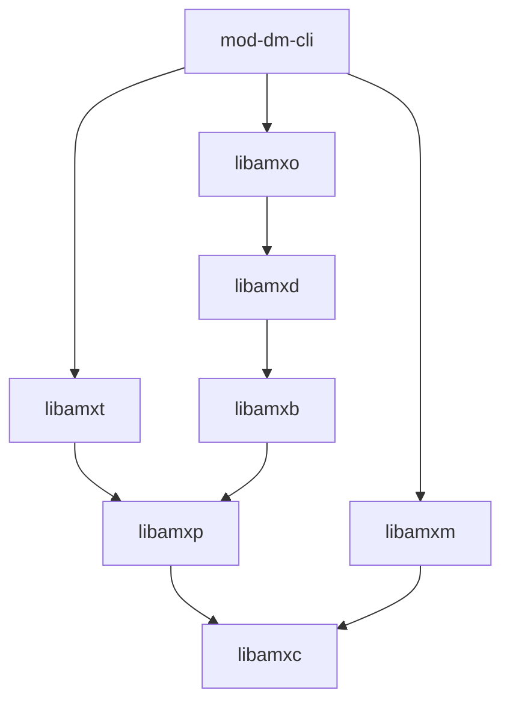

# Data Model Interactive Command Line Interface

[[_TOC_]]

## Introduction

This module is an extension to [amx-cli](https://gitlab.com/prpl-foundation/components/ambiorix/applications/amx-cli) with one major function:

- Loading Ambiorix Data Models

## Building

### Prerequisites

- [libamxc](https://gitlab.com/prpl-foundation/components/ambiorix/libraries/libamxc) - Generic C api for common data containers
- [libamxt](https://gitlab.com/prpl-foundation/components/ambiorix/libraries/libamxt) - Library for adding interactive tty mode to your applications
- [libamxm](https://gitlab.com/prpl-foundation/components/ambiorix/libraries/libamxm) - Modularity api, simplifies creation of add-ons (plug-ins, modules)
- [libamxp](https://gitlab.com/prpl-foundation/components/ambiorix/libraries/libamxp) - Common patterns implementation
- [libamxd](https://gitlab.com/prpl-foundation/components/ambiorix/libraries/libamxd) - Data model C API
- [libamxb](https://gitlab.com/prpl-foundation/components/ambiorix/libraries/libamxb) - Bus agnostic API
- [libamxo](https://gitlab.com/prpl-foundation/components/ambiorix/libraries/libamxo) - ODL parser library

---
Dependency graph - libraries needed by mod-dm-cli.
For graph simplicity direct dependencies which are also an indirect dependency are not shown.



You can install these libraries from source or using their debian packages. To install them from source, refer to their corresponding repositories for more information. To install them using debian packages, you can run

```bash
sudo apt update
sudo apt install libamxc libamxt libamxm libamxp libamxd libamxb libamxo
```

### Build and install mod-dm-cli

1. Clone the git repository

    To be able to build it, you need the source code. So open the directory for the ambiorix project and clone this library in it.

    ```bash
    mkdir ~/workspace/ambiorix/modules/amx_cli/
    cd ~/workspace/ambiorix/modules/amx_cli/
    git clone git@gitlab.com:prpl-foundation/components/ambiorix/modules/amx_cli/mod-dm-cli.git
    ``` 

1. Build it

    ```bash
    cd ~/workspace/ambiorix/modules/amx_cli/mod-dm-cli
    make
    ```

1. Install it

    You can use the install target in the makefile to install the module

    ```bash
    cd ~/workspace/ambiorix/modules/amx_cli/mod-dm-cli
    sudo -E make install
    ```

## Using the module


For this module no symbolic link is created or configuration files are installed. Altough it can be used stand-alone, it is best used in combination with [mod-ba-cli](https://gitlab.com/prpl-foundation/components/ambiorix/modules/amx_cli/mod-ba-cli).

This module can load `odl` files into the cli application and it will then act as a data model provider. When `odl` files are loaded the data model will be registered to every open bus connection, which will allow remote services and applications to access it. 

When a new connection is opened the data model will be registered on the new connection as well.

The module can be loaded using `!addon load <ALIAS> <MODLE>`.

Example:
```text
sah4009 - ubus: - [ubus-cli] (0)
 > !help addon                                

help [<CMD>]                      
        Prints help                     
                                  
load <ALIAS> <ADDON>                          
        loads an add-on shared object.

remove <ALIAS>
        Removes an add-on shared-object.
                                                        
select <ALIAS> [<MODULE>]                               
        Selects an add-on as the active add-on.
         
list
        Lists all loaded add-on                 
  


sah4009 - ubus: - [ubus-cli] (0)
 > !addon load mod_dm /usr/lib/amx/amx-cli/mod-dm-cli.so
Loading shared object /usr/lib/amx/amx-cli/mod-dm-cli.so
Loading successful
mod_dm dm

2021-04-22T13:02:12Z - sah4009 - [mod_dm dm] (0)
 >
```

---
> **NOTE**<br>
> When a cli module is loaded it will become the active cli module, you can change the active cli module by using `!addon select`
---

### The Data Model CLI module

When the cli module is loaded and active you can use `help` to see all available commands:

```
2021-04-22T13:02:12Z - sah4009 - [mod_dm dm] (0)
 > help

help [<CMD>]
        Print this help

load [<OPTIONS>] <ODL FILE>
        Loads an odl file.

save <ODL FILE> [<OBJECT PATH>]
        saves persistent data to an odl file.

reset
        Resets the data model.


2021-04-22T13:06:27Z - sah4009 - [mod_dm dm] (0)
 >
```

To get more detailed help about a specific command use `help <CMD>`

```text
021-04-22T13:06:27Z - sah4009 - [mod_dm dm] (0)
 > help load

Loads an odl file.
Usage: load [<OPTIONS>] <ODL FILE>

Loads an odl file and registers the data model objects toall open bus connections. All import plugins and modules will be loaded as well. When loading is successfull the new data modelobjects can be used ans should be fully functional

Available options
        -e  --events     Enable data model events during loading


2021-04-22T13:07:38Z - sah4009 - [mod_dm dm] (0)
 >
```

### Loading An Odl File

Any ODL file can be loaded, but make sure that you first load the definition odl files before loading any data model population odl files. As a general rule, when the data model can be launched with [amxrt](https://gitlab.com/prpl-foundation/components/ambiorix/applications/amxrt) it can be loaded in the cli.

Keep in mind that the function resolving is active as well, so after loading the odl file you should have a fully functional data model, if the loading was successfull.

```text
2021-04-22T13:18:18Z - sah4009 - [mod_dm dm] (0)
 > load /etc/amx/greeter/greeter.odl
[IMPORT-DBG] - dlopen - greeter.so (0x55a220288230)
[IMPORT-DBG] - symbols used of greeter = 0
[IMPORT-DBG] - dlopen - greeter.so (0x55a22028a870)
[IMPORT-DBG] - symbol _State_check_change resolved (for check_change) from greeter
[IMPORT-DBG] - symbol _Greeter_say resolved (for say) from greeter
[IMPORT-DBG] - symbol _Greeter_setMaxHistory resolved (for setMaxHistory) from greeter
[IMPORT-DBG] - symbol _Greeter_save resolved (for save) from greeter
[IMPORT-DBG] - symbol _Greeter_load resolved (for load) from greeter
[IMPORT-DBG] - symbol _History_clear resolved (for clear) from greeter
[IMPORT-DBG] - symbol _periodic_inform resolved (for periodic_inform) from greeter
[IMPORT-DBG] - symbol _Statistics_reset resolved (for reset) from greeter
[IMPORT-DBG] - symbol _stats_read resolved (for stats_read) from greeter
[IMPORT-DBG] - symbol _stats_list resolved (for stats_list) from greeter
[IMPORT-DBG] - symbol _stats_describe resolved (for stats_describe) from greeter
[IMPORT-DBG] - symbol _enable_greeter resolved (for enable_greeter) from greeter
[IMPORT-DBG] - symbol _disable_greeter resolved (for disable_greeter) from greeter
[IMPORT-DBG] - symbol _print_event resolved (for print_event) from greeter
[IMPORT-DBG] - symbol _function_dump resolved (for echo) from greeter
[IMPORT-DBG] - symbols used of greeter = 15
/etc/amx/greeter/greeter.odl loaded

2021-04-22T13:18:21Z - sah4009 - [mod_dm dm] (0)
 >
```

---
> **NOTE**<br>
> If the implementation files (imported shared objects) print information to stdout or stderr it will be shown in the cli application.
----

---
> **NOTE**<br>
> When entry-points are defined in the odl files, these are called as well with the correct reason code (AMXO_START). When the cli application is stopped or the data model is reset they will be called again with the reason code AMXO_STOP.
>
> Make sure when loading multiple odl files that the load order is correct.
---

### Interacting With The Loaded Data Model

This cli module by itself doesn't provide any means to interact with the loaded data model. The cli module [mod-ba-cli](https://gitlab.com/prpl-foundation/components/ambiorix/modules/amx_cli/mod-ba-cli) provides commands to do this.

If the module `mod-ba-cli` is loaded, you can set that module as active and interact with the loaded data model.

Check if module `mod-ba-cli` is loaded:

Using `!help`

```text
sah4009 - ubus: - [ubus-cli] (0)
 > !help
amx modules:
        Use ! prefix to execute amx modules commands

        amx - Ambiorix Interactive Command Line Control.
        addon - loads & unloads add-ons - adds or removes functionality
        help - Shows help

aliases:
        exit = !amx exit
        printenv = !amx variable
        quit = !amx exit
        setenv = !amx variable

Available addons:
         mod_ba - /usr/lib/amx/amx-cli/mod-ba-cli.so
                backend - Manage backends
                connection - Manage connections
                cli - Bus Agnostic cli.
         mod_dm - /usr/lib/amx/amx-cli/mod-dm-cli.so
                dm - Data Model cli.

Select addon with !addon select <ADDON> [<MODULE>]

```

Under available addons all loaded modules and their sub-modules are listed. Alternatively you can use `!addon list` to simply list the loaded cli modules.

```text
2021-04-22T13:23:54Z - sah4009 - [mod_dm dm] (0)
 > !addon list

mod_ba - /usr/lib/amx/amx-cli/mod-ba-cli.so
mod_dm - /usr/lib/amx/amx-cli/mod-dm-cli.so
```

In this case the module is loaded with alias `mod_ba`.

Select `mod_ba` as active module and select sub-module `cli`

```text
2021-04-22T13:27:46Z - sah4009 - [mod_dm dm] (0)
 > !addon select mod_ba cli

sah4009 - ubus: - [ubus-cli] (0)
 >
```

Now you should be able to interact with your loaded data model:

```text
sah4009 - ubus: - [ubus-cli] (0)
 > dump -rp Greeter.
P..... <public>      singleton Greeter.
PR.... <public>         uint32 Greeter.MaxHistory=10
...... <public>         string Greeter.State=Idle
.R..C. <public>         uint32 Greeter.HistorySize=0
PR.... <public>     multi-inst Greeter.History.
PR.... <public>       instance Greeter.History.1.
P..... <public>           bool Greeter.History.1.Retain=true
P..... <public>         string Greeter.History.1.Message=Welcome to the Greeter App
P..... <public>         string Greeter.History.1.From=odl parser
.R.... <public>      singleton Greeter.Statistics.
.R...V <public>         uint32 Greeter.Statistics.EventCount=0
.R...V <public>         uint32 Greeter.Statistics.DelHistoryCount=0
.R...V <public>         uint32 Greeter.Statistics.AddHistoryCount=0

```

### Other Commands

#### Save

Using the `save` command any object can be saved to an odl file. Only objects and parameters that have the `persistent` attribute are saved.

```text
2021-04-22T13:34:11Z - sah4009 - [mod_dm dm] (0)
 > save /tmp/test.odl Greeter.History.
```

#### Reset

It is possible to remove (reset) the loaded data model. All loaded object definitions will be removed.

```text
2021-04-22T13:34:33Z - sah4009 - [mod_dm dm] (0)
 > reset

2021-04-22T13:43:04Z - sah4009 - [mod_dm dm] (0)
 >
```
