[[_TOC_]]

## Usage

mod-busstats allows to fetch the statistics on usage of the inter-process communication bus connections of a component.

1. Make sure `#include "mod-busstats.odl";` is included in the .odl file of the component.
2. The bus statistics can be obtained by calling the function `GetBusStats()` on a topmost object of the component.

Example:

```
$ cat test-stats.odl 
%define {
	object MyObject {
	}
}

#include "mod-busstats.odl";

$ amxrt test-stats.odl  &
[1] 180285
$ ba-cli 'MyObject.GetBusStats()'
> MyObject.GetBusStats()
MyObject.GetBusStats() returned
[
    {
        pcb:/var/run/pcb_sys = {
            rx = {
                operation = {
                    add = 0,
                    close_request = 0,
                    del = 0,
                    get = 2,
                    invoke = 1,
                    set = 0
                }
            },
            tx = {
                operation = {
                    add = 0,
                    async_invoke = 0,
                    del = 0,
                    describe = 0,
                    get = 0,
                    get_filtered = 0,
                    get_instances = 0,
                    get_supported = 0,
                    has = 0,
                    invoke = 0,
                    list = 0,
                    set = 0,
                    subscribe = 0,
                    unsubscribe = 0,
                    wait_for = 0
                }
            }
        }
    }
]
```

The statistics are per connection. This is also the case when multiple connections are using the
same bus backends:
```
$ ba-cli 'MyObject.GetBusStats()'
> MyObject.GetBusStats()
MyObject.GetBusStats() returned
[
    {
        pcb:/var/run/mysocket1 = {
            rx = {
                operation = {
                    add = 0,
                    ...
                }
            },
            tx = {
                operation = {
                    add = 0,
                    ...
                }
            }
        }
        pcb:/var/run/mysocket2 = {
            rx = {
                operation = {
                    add = 0,
                    ...
                }
            },
            tx = {
                operation = {
                    add = 0,
                    ...
                }
            }
        }
    }
]
```

The available counters for incoming requests depend on the bus used.
For example, ubus does not have native support for "get" operations, so there is no `rx.operation.get` number in the statistics for connections that use ubus:
```
        ubus:/var/run/ubus/ubus.sock = {
            rx = {
                operation = {
                    invoke = 0
                }
            },
            tx = {
                ...
            }
```

Note: the format/structure of the output of `GetBusStats()` is not guaranteed to stay the same or be backwards/forwards compatible.

## Implementation

### Create the stats


The statistics for outgoing requests are taken care of by amxb itself. The statistics for incoming requests are taken care of by each bus adapter individually.

The `amxb_get_stats` function combines these two.


### Fetch stats for components

```mermaid
sequenceDiagram
    Somebody 😎 ->> ba_cli: [cli] SomeComponent.GetBusStats()
    ba_cli ->> SomeComponent's mod-busstats.so: [bus] GetBusStats()
    SomeComponent's mod-busstats.so ->> amxb: get_stats()
    activate amxb
    amxb -->> SomeComponent's mod-busstats.so: { nb_... }
    deactivate amxb
    SomeComponent's mod-busstats.so -->> ba_cli : { nb_... }
    ba_cli -->> Somebody 😎: { nb_... }
```




In order to retrieve the statistics of a component, the module mod-busstats implements an RPC function `GetBusStats` that returns the stats from `amxb_get_stats`. mod-busstats can be loaded by any component by adding `#include "mod-busstats.odl";` in the .odl file of the component. mod-busstats will then add the `GetBusStats` function under each top object in the component's provided datamodel.

For example, if the component provides a datamodel under `DHCPv4Server`, then mod-busstats makes `DHCPv4Server.GetBusStats()` available.

This RPC function is protected, so it will not show up in tab-completion.

### Possible extension: stats for clients

For components that do not provide a datamodel, it is not possible to invoke a GetBusStats()
function on the datamodel of the component, because there is none.

In case it becomes needed to fetch statistics for such components, it is possible to extend
the mechanism for fetching statistics as shown in the figure below.

```mermaid
sequenceDiagram
    participant Somebody 😎
    participant ba_cli
    mod-busstats.so ->> StatsCollector: [bus] subscribe<br>for notifications
    Somebody 😎 ->> ba_cli: [cli] Stats.GetStats()
    ba_cli ->> StatsCollector: [bus] GetStats()
    StatsCollector ->> mod-busstats.so: [bus] notification
    activate mod-busstats.so
    mod-busstats.so ->> amxb: amxb_stats_get()
    activate amxb
    amxb -->> mod-busstats.so: { nb_... }
    deactivate amxb
    mod-busstats.so -->> Stats: { nb_... }
    deactivate mod-busstats.so
    StatsCollector -->> ba_cli : { nb_... }
    ba_cli -->> Somebody 😎: { nb_... }
```



So instead of asking the component directly what its stats are, the component listens to events from a StatsCollector component. When such an event is received, the component gives stats to the StatsCollector, who in turn can give those stats to the user.

Currently this is not implemented.