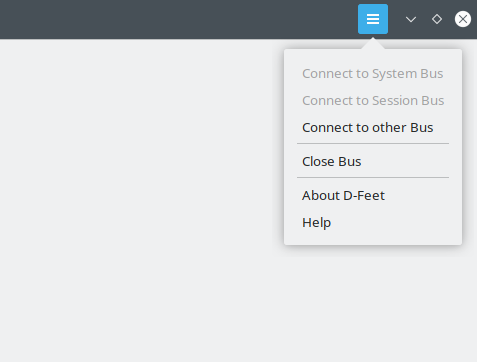
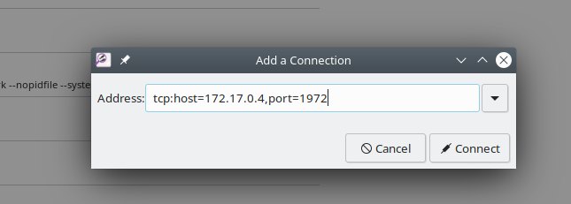
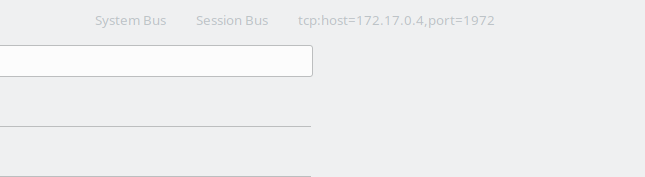
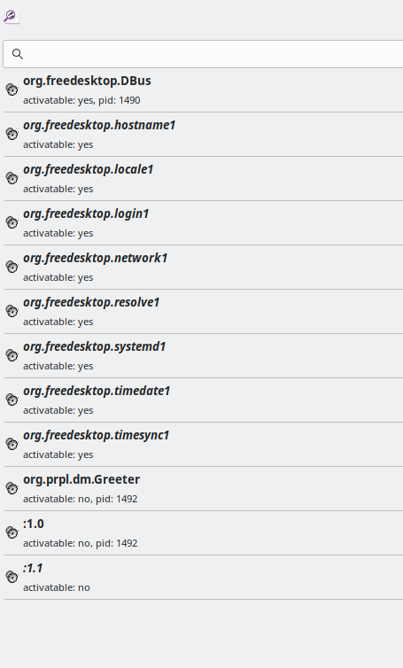
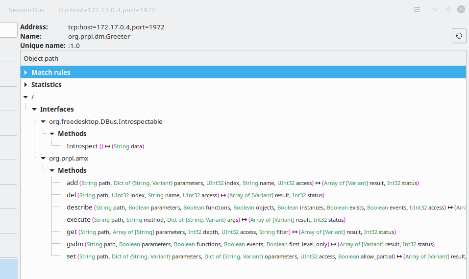

# A DBus back-end for Ambiorix.

Incomplete DBus ambiorix back-end implementation. This back-end can be loaded using the `amxb_be_lad` function which is implemented in [libamxb](https://gitlab.com/prpl-foundation/components/ambiorix/libraries/libamxb).

As of this writing, the backend covers most of the features needed except:
- waiting for a request to be completed (wait request)
- unsubscribe (remove event subscriptions) 
- get instances 

Some limitations still apply:
- It is not possible to subscribe for events of native DBus services
- Wait-for functionality only works on root objects

The initial purpose of this backend is to make it possible for ambiorix based services and applications to expose and use TR181 like data models over DBus. 

It should be possible to access `native` DBus application as well.

## Building, installing and testing

### Docker container

You could install all tools needed for testing and developing on your local machine, but it is easier to just use a pre-configured environment. Such an environment is already prepared for you as a docker container.

1. Install docker

    Docker must be installed on your system.

    If you have no clue how to do this here are some links that could help you:

    - [Get Docker Engine - Community for Ubuntu](https://docs.docker.com/install/linux/docker-ce/ubuntu/)
    - [Get Docker Engine - Community for Debian](https://docs.docker.com/install/linux/docker-ce/debian/)
    - [Get Docker Engine - Community for Fedora](https://docs.docker.com/install/linux/docker-ce/fedora/)
    - [Get Docker Engine - Community for CentOS](https://docs.docker.com/install/linux/docker-ce/centos/)  <br /><br />
    
    Make sure you user id is added to the docker group:

    ```
    sudo usermod -aG docker $USER
    ```

1. Fetch the container image

    To get access to the pre-configured environment, all you need to do is pull the image and launch a container.

    Pull the image:

    ```bash
    docker pull registry.gitlab.com/soft.at.home/docker/oss-dbg:latest
    ```

    Before launching the container, you should create a directory which will be shared between your local machine and the container.

    ```bash
    mkdir -p ~/amx_project/modules/amxb_backends/
    ```

    Launch the container:

    ```bash
    docker run -ti -d --name oss-dbg --restart always --cap-add=SYS_PTRACE --sysctl net.ipv6.conf.all.disable_ipv6=1 -e "USER=$USER" -e "UID=$(id -u)" -e "GID=$(id -g)" -v ~/amx_project/:/home/$USER/amx_project/ registry.gitlab.com/soft.at.home/docker/oss-dbg:latest
    ```

    The `-v` option bind mounts the local directory for the ambiorix project in the container, at the exact same place.
    The `-e` options create environment variables in the container. These variables are used to create a user name with exactly the same user id and group id in the container as on your local host (user mapping).

    You can open as many terminals/consoles as you like:

    ```bash
    docker exec -ti --user $USER oss-dbg /bin/bash
    ```

---
> **NOTE**<br>
> All commands provided in this readme should be executed in the container unless otherwise specified
---


### Building

#### Prerequisites

- [libamxc](https://gitlab.com/prpl-foundation/components/ambiorix/libraries/libamxc) - Generic C api for common data containers
- [libamxp](https://gitlab.com/prpl-foundation/components/ambiorix/libraries/libamxp) - Common patterns implementation
- [libamxd](https://gitlab.com/prpl-foundation/components/ambiorix/libraries/libamxd) - 
- [libamxb](https://gitlab.com/prpl-foundation/components/ambiorix/libraries/libamxb) - PCB backend implementation for bus agnostic API
- libdbus-1-dev

These can be installed using

```bash
sudo apt update
sudo apt install libamxc libamxp libamxd libamxb libdbus-1-dev
```
#### Build amxb_dbus

1. Clone the git repository

    To be able to build it, you need the source code. So open the directory just created for the ambiorix project and clone this library in it (on your local machine).

    ```bash
    cd ~/amx_project/modules/amxb_backends/
    git clone git@gitlab.com:prpl-foundation/components/ambiorix/modules/amxb_backends/amxb_dbus.git
    ``` 

1. Install dependencies

    Although the container will contain all tools needed for building, it does not contain the libraries needed for building `amxb_dbus`. To be able to build `amxb_dbus` you need `libamxc`, `libamxp`, `libamxc`, `libamxb` and `libdbus-1-dev`. These libraries can be installed in the container.

    ```bash
    sudo apt update
    sudo apt install libamxc libamxp libamxd libamxb libdbus-1-dev
    ```

    Note that you do not need to install all components explicitly. Some components will be installed automatically because the other components depend on them. Some of the components are allready preinstalled in the container.

1. Build it

    ```bash
    cd ~/amx_project/modules/amxb_backends/amxb_dbus
    make
    ```

### Installing

#### Using make target install

You can install your own compiled version easily in the container by running the install target.

```bash
cd ~/amx_project/modules/amxb_backends/amxb_dbus
sudo -E make install
```

## Tips And Tricks

### Allow all access

To make it easier to debug and develop a service on top of DBus it is recommended to allow all access to DBus in the container.

Create a file `/etc/dbus-1/system.d/dbus.conf` with following content:

```xml
<!DOCTYPE busconfig PUBLIC
          "-//freedesktop//DTD D-BUS Bus Configuration 1.0//EN"
          "http://www.freedesktop.org/standards/dbus/1.0/busconfig.dtd">
<busconfig>
  <!-- Make dbus-daemon listen on tcp port - can be used for d-feet -->
  <listen>tcp:host=0.0.0.0,port=1972</listen>

  <auth>ANONYMOUS</auth>

  <allow_anonymous/>

  <policy context="default">
    <!-- Allow everything to be sent -->
    <allow send_destination="*" eavesdrop="true"/>
    <!-- Allow everything to be received -->
    <allow eavesdrop="true"/>
    <!-- Allow anyone to own anything -->
    <allow own="*"/>
    <!-- XXX: Allow all users to connect -->
    <allow user="*"/>
  </policy>

</busconfig>
```

### Start a DBus Daemon

In the container by default no DBus daemon is running, You can start one using this command:

```bash
sudo mkdir -p /run/dbus
sudo dbus-daemon --system --nosyslog --nopidfile
```

### Launch An Ambiorix Based Data Model Provider

To be able to run an ambiorix based data model provider the following library and tool must be installed:

- [libamxrt](https://gitlab.com/prpl-foundation/components/ambiorix/libraries/libamxrt)
- [amxrt](https://gitlab.com/prpl-foundation/components/ambiorix/applications/amxrt)

```bash
sudo apt install libamxrt amxrt
```

As an example the [greeter-plugin](https://gitlab.com/prpl-foundation/components/ambiorix/examples/datamodel/greeter_plugin) will be used.

Clone the example git repository on your local machine.

```bash
mkdir -p ~/amx_project/examples/datamodel/
cd ~/amx_project/examples/datamodel/
git git@gitlab.com:prpl-foundation/components/ambiorix/examples/datamodel/greeter_plugin.git
``` 

Build and install it in the container

```bash
cd ~/amx_project/examples/datamodel/greeter_plugin
make
sudo -E make install
```

Launch the example and make it connect to the DBus daemon

```bash
sudo greeter -D -u dbus:
```

### Using D-Feet

D-Feet is an easy to use D-Bus debugger. D-Feet can be used to inspect D-Bus interfaces of running programs and invoke methods on those interfaces.

---
> **NOTE**<br>
> D-Feet is no longer maintained (but still available at the moment of writing). As an alternative D-Spy can be used.
---

D-Feet has a GUI and therefor can not be run in the container. On your host install D-Feet.

```bash
sudo apt install d-feet
```

Launch D-Feet on your host

```bash
sudo d-feet
```

When launched it will by default connect to your local DBus system and session daemon. It is possible to connect to other DBus daemons as well.

1. add connection
  Select `Connect to other bus` in the drop down.<br>
  

1. Enter connection
  Replace the ip address with the ip address of your container. To find out the ip address of your container use `ip a`. The port number used can be changed in the file `/etc/dbus-1/system.d/dbus.conf`<br>
  

1. Select connection<br>
  When connected, the new connection will be shown on top, click the new connection.<br>
  

If all went well, you should now be connected to the DBus daemon that is running in the container.

If the `greeter-plugin` example is running you should see it on the left.



Select it and on the right expand the tree named `/`. You should see two interfaces:

- `org.freedesktop.DBus.Introspectable`
- `org.prpl.amx`

You should be able to invoke any of the methods available.



### Using amx-cli

Using the init script `scripts/dbus-cli.init` [amx-cli](https://gitlab.com/prpl-foundation/components/ambiorix/applications/amx-cli) can be launched to interact with services connected to DBus.

To be able to launch [amx-cli](https://gitlab.com/prpl-foundation/components/ambiorix/applications/amx-cli) you will need:

- [amx-cli](https://gitlab.com/prpl-foundation/components/ambiorix/applications/amx-cli)
- [mod-ba-cli](https://gitlab.com/prpl-foundation/components/ambiorix/modules/amx_cli/mod-ba-cli)

Launch `amx-cli` using the init script:

```bash
$ amx-cli -s dbus-cli.init
```

All services providing the amx dbus interface can be accessed.

Example:

```
!amx silent true

                   _  ___  ____
  _ __  _ __ _ __ | |/ _ \/ ___|
 | '_ \| '__| '_ \| | | | \___ \
 | |_) | |  | |_) | | |_| |___) |
 | .__/|_|  | .__/|_|\___/|____/
 |_|        |_| based on OpenWrt
 -----------------------------------------------------
 dbus - cli
 -----------------------------------------------------

sah4009 - dbus: - [dbus-cli] (0)
 > Greeter.?
Greeter.
Greeter.MaxHistory=10
Greeter.NumberOfHistoryEntries=2
Greeter.State="Running"
Greeter.History.1.
Greeter.History.1.From="odl parser"
Greeter.History.1.Message="Welcome to the Greeter App"
Greeter.History.1.NumberOfInfoEntries=0
Greeter.History.1.Retain=false
Greeter.History.2.
Greeter.History.2.From="test"
Greeter.History.2.Message="test"
Greeter.History.2.NumberOfInfoEntries=0
Greeter.History.2.Retain=false
Greeter.Statistics.
Greeter.Statistics.AddHistoryCount=0
Greeter.Statistics.DelHistoryCount=0
Greeter.Statistics.EventCount=4

sah4009 - dbus: - [dbus-cli] (0)
 > 
```

#### The amx-cli DBus init script

The init script is used to initialize amx-cli. 

For more information see: 

- [Using Ambiorix Interactive Command Line Interface](https://gitlab.com/prpl-foundation/components/ambiorix/applications/amx-cli/-/blob/main/doc/using_amx_cli.md)
- [mod-ba-cli](https://gitlab.com/prpl-foundation/components/ambiorix/modules/amx_cli/mod-ba-cli/-/blob/main/README.md)

The import lines in the init script are:

```
!amx variable cli-name = "dbus-cli"
!amx variable dbus = { destination-prefix = "org.prpl.dm.", dm-interface="org.prpl.amx" }
!addon load mod_ba /usr/lib/amx/amx-cli/mod-ba-cli.so
backend add /usr/bin/mods/amxb/mod-amxb-dbus.so
connection open dbus:
!addon select mod_ba cli
```

The line `!amx variable dbus = { destination-prefix = "org.prpl.dm.", dm-interface="org.prpl.amx" }` will set the default destination prefix and interface for ambiorix based services.

`!addon load mod_ba /usr/lib/amx/amx-cli/mod-ba-cli.so` loads the command interpreter.

The DBus backend is loaded by `backend add /usr/bin/mods/amxb/mod-amxb-dbus.so` and a connection to the DBus daemon is created using `connection open dbus:`

The the bus agnostic command line interface is activated: `!addon select mod_ba cli`

#### Calling Native DBus Services

It is possible to access native dbus services as well. When calling a method of a native dbus service, extra arguments must be provided: `interface` and `object`.

Example:

```
sah4009 - dbus: - [dbus-cli] (0)
 > org.freedesktop.DBus.ListNames(interface = "org.freedesktop.DBus", object = "/org/freedesktop/DBus")
org.freedesktop.DBus.ListNames() returned
[
    [
        "org.freedesktop.DBus",
        ":1.92",
        ":1.81",
        ":1.83",
        ":1.41",
        ":1.85",
        ":1.97",
        ":1.87",
        ":1.99",
        "org.prpl.dm.Greeter",
        ":1.88",
        ":1.12",
        ":1.13",
        ":1.100",
        ":1.90",
        ":1.80"
    ]
]
```

Current restrictions:

- It is not possible to recieve events from native DBus services
