# RBus Backend Internals

## __Table of Contents__  

[[_TOC_]]

## Ambiorix RBus Back-ends Introduction

An ambiorix back-end is an adapter and mediator between the API provided by libamxb and a bus system API or communication protocol.

---
**🪧 Adapter**
> The adapter pattern is a software design pattern that allows the interface of an existing API to be used as another interface. It is often used to make existing API work with others without modifying their source code.
---

---
**🪧 Mediator**
> With the mediator pattern, communication between software parts is encapsulated within a mediator. Software parts (objects, modules) no longer communicate directly with each other, but instead communicate through the mediator. This reduces the dependencies between the different software parts, thereby reducing coupling.
---

There are three major-parts in a back-end implementation:
- Common functionality - connect/disconnect from the bus system, provide filedescriptor and a callback function for event-loops (which is called when data is available for read on the provided filedescriptor)
- Client side (data model consumer) functionality
- Server side (data model provider) functionality.

The common part, is implemented in `src/amxb_rbus.c` and provides following back-end interface functions:

- `amxb_rbus_connect` - allocates back-end specific data structure, which is used to store connection specific and internal management data, connects to the bus system and in the case of rbus provides a socket pair so the connection can be added to an event-loop.
- `amxb_rbus_disconnect` - clean-up of connection specific data and disconnects from the bus system.
- `amxb_rbus_get_fd`- returns the file descriptor that can be used by an event-loop implementation (read-end of the socket pair)
- `amxb_rbus_read` - will be called when data is available on the provided file descriptor. Typically this function will be called by the event-loop implementation (indirectly through `amxb_read`).
- `amxb_rbus_set_config` - An application can provide back-end specific configuration options. These can be set by calling `amxb_set_config`. Libamxb will pass the correct sub-section of the configuration to the correct back-end. It will use the name of the backend to find the correct back-end config section in the applications configuration settings.

The common part is used by data model providers and data model consumers.

The server side part, is implemented in the files `src/amxb_rbus_handler_get.c`, `src/amxb_rbus_handler_set.c`, `src/amxb_rbus_handler_call.c`, `src/amxb_rbus_handle_subscribe.c`, `src/amxb_rbus_handler_row.c` and `src/amxb_rbus_register.c`.

The only back-end interface function provided in these source files is `amxb_rbus_register`, most other functions are bus specific and are typically registered as callback functions to the bus using the bus specific APIs (in this case librbus).

All the registered callback functions will be called by the bus system, and most of them are taking the provided data, translates them into libamxd function calls and translate the result back into bus specific data structures. It is up to the bus system to send the data back to the requester.

The last part of a back-end implementation is the client side implementation, which back-end interface methods needs to be implemented is highly dependant on the bus system itself. In case of rbus, most of them will be needed as rbus itself is providing a data model. The client side interface functions are mostly called through the libamxb functions like `amxb_set`, `amxb_get`, `amxb_add`, `amxb_del`, ...

When requesting something from a data model, the application will use libamxb API functions, libamxb will pass the data and request information to the back-end which will make sure that the correct message is send using the bus system (in this case RBus). When a reply is received, the received data must be translated back into ambiorix data (typically a `amxc_var_t`). It is important that the data stored in the returned variant(s) is always matching the expected structure and can be different depending on the type of request.

The following sequence diagrams illustrates this:

---
> **🪧 NOTE**<br>
> All sequence diagrams in this document are provided for clarity and to provide an overview of how different components/parts of the code are interacting with each other. Not all details of the implementation are provided in these sequence diagrams. It is recommended to look at them next to code, if more details are needed.
---

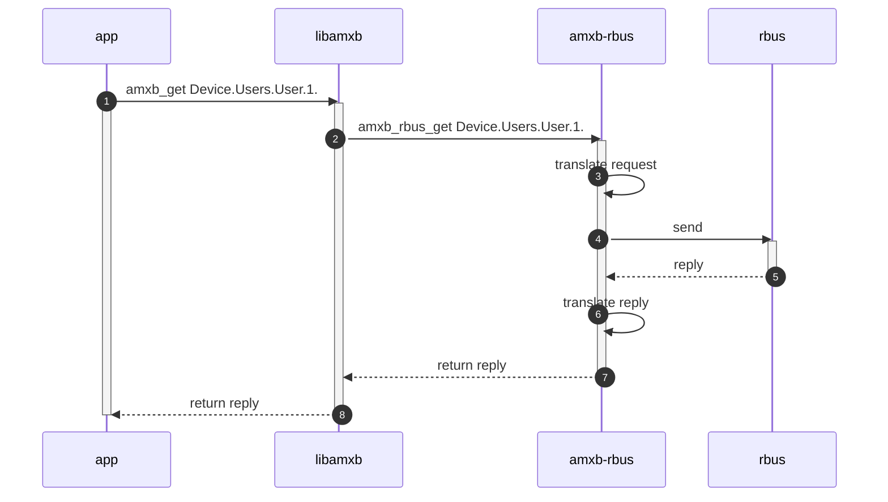
```mermaid
sequenceDiagram
    autonumber
    participant app
    participant libamxb
    participant amxb-rbus
    participant rbus
    app->>libamxb: amxb_get Device.Users.User.1.
    activate app
    activate libamxb
    libamxb->>amxb-rbus: amxb_rbus_get Device.Users.User.1.
    activate amxb-rbus
    amxb-rbus->>amxb-rbus: translate request
    amxb-rbus->>rbus: send
    activate rbus
    rbus-->>amxb-rbus: reply
    deactivate rbus
    amxb-rbus->>amxb-rbus: translate reply
    amxb-rbus-->>libamxb: return reply
    deactivate amxb-rbus
    libamxb-->>app: return reply
    deactivate libamxb
    deactivate app
```

For a data model provider, typically some information must be registered to the bus system and some callbacks must be provided to the bus as well. The callbacks will be called when needed by the bus system and is done typically when requests are received.
In the case of rbus the full supported data model must be registered. This includes parameters, events, methods. Depending on the registration type different callback methods can be provided. It is the back-ends responsibility to do the registration to the bus system when requested and when the provided callback functions are called, translate the provided data and information into data structures and function calls. Typically libamxd (Data model engine) functions will be called. The back-end must translate the result back into something the bus system can understand.

The following sequence diagrams illustrates this:

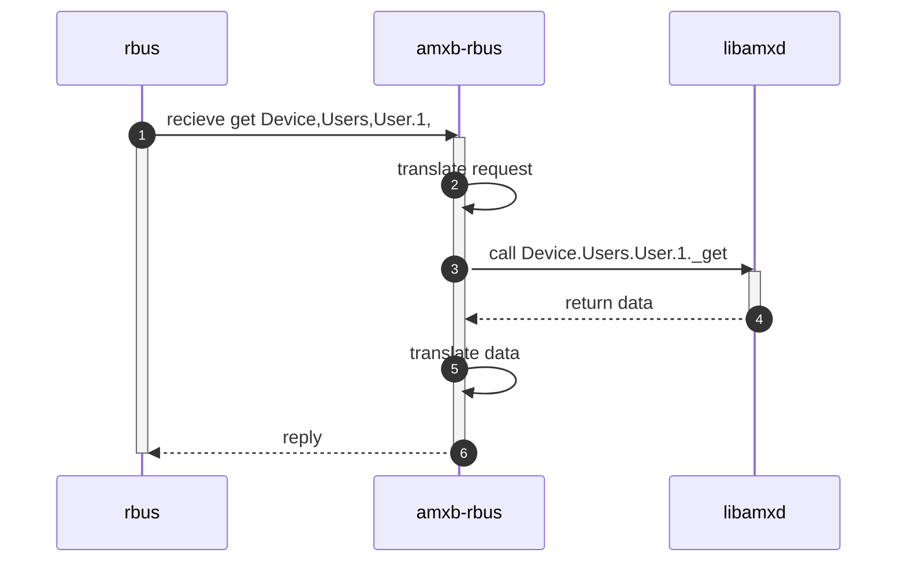
```mermaid
sequenceDiagram
    autonumber
    participant rbus
    participant amxb-rbus
    participant libamxd
    rbus->>amxb-rbus: recieve get Device,Users,User.1,
    activate rbus
    activate amxb-rbus
    amxb-rbus->>amxb-rbus: translate request
    amxb-rbus->>libamxd: call Device.Users.User.1._get
    activate libamxd
    libamxd-->>amxb-rbus: return data
    deactivate libamxd
    amxb-rbus->>amxb-rbus: translate data
    amxb-rbus-->>rbus: reply
    deactivate amxb-rbus
    deactivate rbus
```

## Multi-threading

RBus uses multi-threading to handle I/O operations (read & write). It starts a dedicated reader thread for opened connections. When messages are received it will parse the message and call one of the registered callback functions in the context of the reader thread or any other arbitrary thread.

As everything in the ambiorix framework is designed to work single-threaded and event driven, handling these messages in an arbitrary thread context will lead to unspecified behavior as data models and internal structures can be modified by multiple threads at once.

### Solving Concurrency

To avoid this concurrency all received messages are added to a message queue and will be handled in the main thread by the event-loop. The implementation chosen is based on the producers-consumer pattern. Many threads can create data and only one thread will handle them in a controlled manner.

This removes the need of protection with mutexes and locks all over the code, the only part that needs protection is the queue where the parsed messages are added in.

The source file `src/amxb_rbus_ctrl.c` handles the queue.

The even-loop is mainly watching file descriptors and uses a system call (like select or poll) to monitor if data is available on any of the watched file descriptors. The event-loop is implemented using [libevent](https://libevent.org/). For each file descriptor that is added to the event-loop to be watched a callback functions is added. Whenever data is available on one of the file descriptors, the correct callback function is called. It is the responsibility of the callback function to read (all) data from the file descriptor and if needed do the dispatching.

As the queue where the received rbus messages are stored isn't related to any file descriptor, the event-loop will not be triggered when an item is added to the queue. Therefor a socket-pair is created (can be replaced with a pipe as well) where one socket is the read-end and the other socket is the write-end. Each time when a new item is added to the queue, a byte is written to the write-end of the socket pair. This will trigger the event-loop and will call the registered callback function, in this case that is `amxb_rbus_read`, which will call the `amxb_rbus_ctrl_read` function. The `amxb_rbus_ctrl_read` function will read exactly one byte from the read-end socket and pulls one item from the queue. This item will then be handled in the main thread.

The file descriptor representing the read-end of the socket pair is returned by `amxb_rbus_get_fd` and will be added to the event-loop.

Following flowchart illustrates what is done when rbus calls a callback function to execute an data model operations:
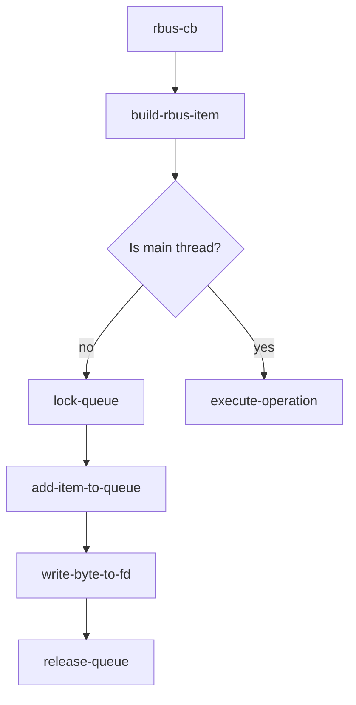
```mermaid
flowchart TD
    rbus-cb
    build-rbus-item
    check-tid{Is main thread?}
    lock-queue
    release-queue
    add-item-to-queue
    write-byte-to-fd
    execute-operation

    rbus-cb --> build-rbus-item
    build-rbus-item --> check-tid
    check-tid --> |no|lock-queue --> add-item-to-queue --> write-byte-to-fd -->release-queue
    check-tid --> |yes|execute-operation
```

This sequence diagram gives more details

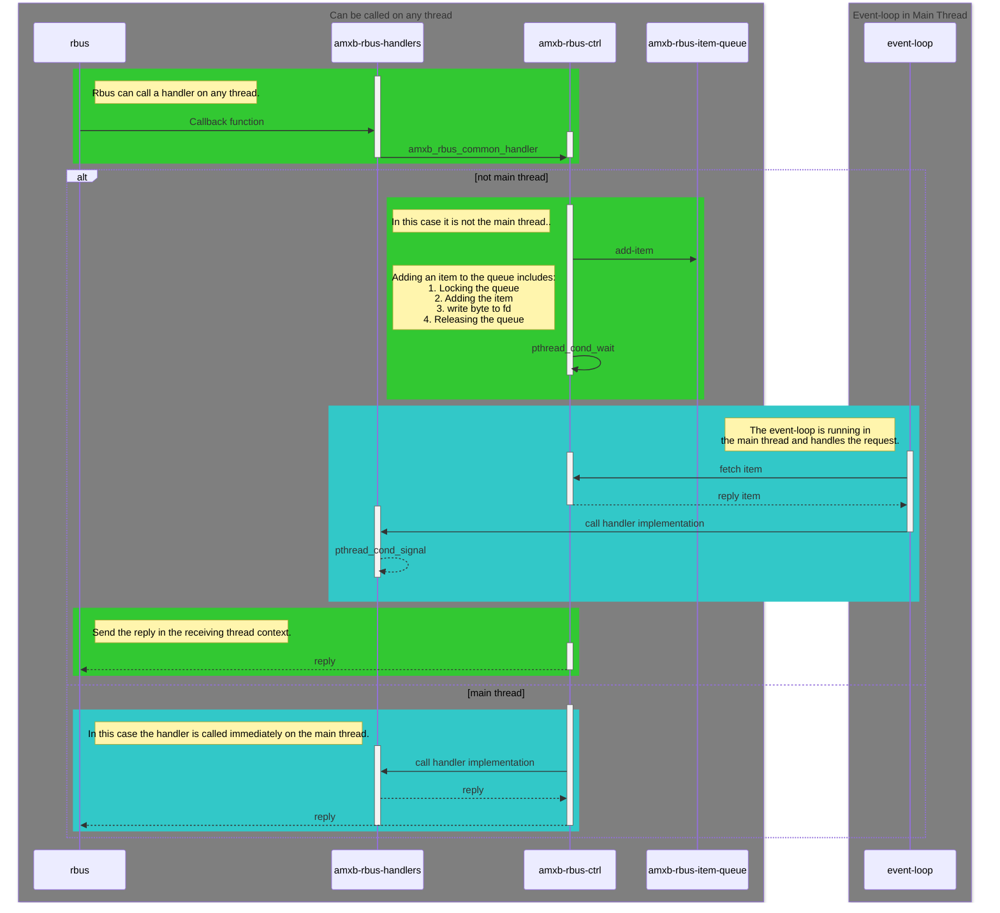
```mermaid
sequenceDiagram
    box rgb(127,127,127) Can be called on any thread
    participant rbus
    participant amxb-rbus-handlers
    participant amxb-rbus-ctrl
    participant amxb-rbus-item-queue
    end
    box rgb(127,127,127) Event-loop in Main Thread
    participant event-loop
    end

    rect rgb(50, 200, 50)
        activate amxb-rbus-handlers
        note right of rbus: Rbus can call a handler on any thread. 
        rbus ->> amxb-rbus-handlers: Callback function
        activate amxb-rbus-ctrl
        amxb-rbus-handlers ->> amxb-rbus-ctrl: amxb_rbus_common_handler
        deactivate amxb-rbus-ctrl
        deactivate amxb-rbus-handlers
    end

    alt not main thread
        rect rgb(50, 200, 50)
            activate amxb-rbus-ctrl
            note right of amxb-rbus-handlers: In this case it is not the main thread.. 
            amxb-rbus-ctrl ->> amxb-rbus-item-queue: add-item
            Note left of amxb-rbus-ctrl: Adding an item to the queue includes:<br>1. Locking the queue<br>2. Adding the item<br>3. write byte to fd<br>4. Releasing the queue
            amxb-rbus-ctrl ->> amxb-rbus-ctrl: pthread_cond_wait
            deactivate amxb-rbus-ctrl
        end
        rect rgb(50, 200, 200)
            note left of event-loop: The event-loop is running in<br>the main thread and handles the request. 
            activate event-loop
            activate amxb-rbus-ctrl
            event-loop ->> amxb-rbus-ctrl: fetch item
            amxb-rbus-ctrl -->> event-loop: reply item
            deactivate amxb-rbus-ctrl
            activate amxb-rbus-handlers
            event-loop ->> amxb-rbus-handlers: call handler implementation
            deactivate event-loop
            amxb-rbus-handlers -->> amxb-rbus-handlers: pthread_cond_signal
            deactivate amxb-rbus-handlers
        end
        rect rgb(50, 200, 50)
            note right of rbus: Send the reply in the receiving thread context. 
            activate amxb-rbus-ctrl
            amxb-rbus-ctrl -->> rbus: reply
            deactivate amxb-rbus-ctrl
        end
    else main thread
        activate amxb-rbus-ctrl
        rect rgb(50, 200, 200)
            note right of rbus: In this case the handler is called immediately on the main thread. 
            activate amxb-rbus-handlers
            amxb-rbus-ctrl ->> amxb-rbus-handlers: call handler implementation
            amxb-rbus-handlers -->> amxb-rbus-ctrl: reply
            amxb-rbus-ctrl -->> rbus: reply
            deactivate amxb-rbus-handlers
            deactivate amxb-rbus-ctrl
        end
    end
```

## Data Model Provider

### Data Model Registering

The RBus backend provides a function that is used to register the loaded data model to RBus: `amxb_rbus_register`. This function is provided in the back-end function table and is an optional function. If the function pointer is set to NULL in the function table, the RBus back-end will not be able to register a data model.

The RBus back-end can register the data model immediately or can delay registration until the event `app:start` is received. When it is delayed and the `app:start` event is not triggered the data model will not get registered to the RBus daemon.

An ambiorix data model provider can support three kinds of data elements:

1. Public data model elements - these are data model elements that are defined in TR181 (USP or CWMP) or vendor specific data elements (must be prefixed) and can be accessed (if ACLs allow it), by external services. 
1. Protected data model elements - these are non-standard data model elements and are not available to external services, but can be accessed by internal services, if these protected data model elements are registered and made available on the bus system.
1. Private data model elements - these are non-standard data model elements and are only available to the service itself. Private data model elements are never exposed or registered to the bus system.

The RBus back-end will go over the full supported data model definition and registers all data elements encountered (tables, parameters, events, methods), except objects that are marked as `private` or `protected`. Private objects are for internal use only and should never be made available on the bus system. When protected objects are registered to the RBus system they become publicly available, external services will be able to access them. This is not the intention, therefor protected objects are also not registered to RBus. 

To register protected objects to the RBus system, the functions `amxb_rbus_filter_objects` and `amxb_rbus_register_add_object` must be adapted. These functions can be found in the file `src/amxb_rbus_register.c`

If the object is a multi-instance object (aka table) the following callback are provide to RBus:
- `amxb_rbus_add_row` - will be called when a new instance must be created, this callback will not be set when the table is defined as read-only.
- `amxb_rbus_remove_row` - will be called when an instance must be deleted, this callback will not be set when the table is defined as read-only.
- `amxb_rbus_row_subscribe_handler` - will be called when a subscription is taken on the table or a specific row.

All public defined parameters in the supported data model are registered as well and for each parameter two callbacks are given to RBus:
- `amxb_rbus_get_value` - will be called when the current value needs to be retrieved.
- `amxb_rbus_set_value` - will be called when the value needs to be changed, this callback will not be set when the parameter is defined as read-only.

All defined events in the supported data model are registered to RBus and one callback function is provided: `amxb_rbus_row_subscribe_handler`. This callback function is called when a data model consumer subscribes for this event. Besides the defined events in the data model an extra event is registered for each object in the supported data model: `amx_notify!`. This event is used to send Ambiorix data model events like `dm:object-changed`, `dm:instance-added`, `dm:instance-deleted`, ....
Although Rbus provides changed, add and delete events, the Ambiorix specific event is added as the RBus native events are lacking information. To make all Ambiorix based services and applications work without the need to change them and to keep them bus-agnostic that extra information is needed. 

The ambiorix data model provider will respect the native RBus events as well, and will make sure that the native RBus events are send when needed. An native Rbus data model consumer has the possibility to subscribe for the ambiorix specific `amx_notify!` event as well, but typically this will be done only by ambiorix data model consumers. If an ambiorix data model consumer wants to subscribe for events from a native RBus data model provider, the amxb-rbus backend will make sure that subscriptions are taken on the native RBus events.

All public and protected defined methods in the data model are registered to Rbus daemon, for each method a callback function is provided to RBus `amxb_rbus_call_method`.
The registered methods include the internal ambiorix data model methods that are available. These internal methods all start with an `_` and can be ignored by a consumer.
These methods are: `_get`, `_set`, `_add`, `_del`, `_get_instances`, _`get_supported`,  `_list`, `_describe`, `_exec`. These methods are provided in the ambiorix data model engine and provides an easy way to circumvent limitations of bus systems. All bus systems have one major thing in common (the ones supported anyway), they all support remote procedure calls.

It is possible to turn off registration of the `protected` methods (that includes the internal ambiorix methods), by setting the `use-amx-calls` in the configuration to false.

If during registration of tables (in the supported data model) rows (instances) are encountered for that table, these instances (rows) are registered using `rbus_table_register_row`. This will inform the rbus-daemon that these rows exits.

If singleton objects (not a table) are encountered in the supported data model, all parameters, events, methods of that object are registered as well, these objects will not provide any extra callback function to RBus.

The data model tree is always registered top-down.

The full registration process is implemented in `src/amxb_rbus_register.c`

The callback functions `amxb_rbus_row`, `amxb_bus_remove_row` are implemented in file `src/amxb_rbus_handler_row.c` and `amxb_rbus_row_subscribe_handler` can be found in `src/amxb_rbus_subscriber.c`. The callback function `amxb_rbus_get_value` is implemented in `src/amxb_rbus_handler_get.c` and callback function `amxb_rbus_set_value` is implemented in `src/amxb_rbus_handler_set.c`.

When the application has loaded or created the data model it can call `amxb_register` of the libamxb abstraction layer. The abstraction layer will call `amxb_rbus_register` of the amxb-rbus back-end. The amxb-rbus back-end will walk over the full data model and register all the data model elements to the rbus daemon (rtrouted) using the RBus API `rbus_regDataElements`. The same functions are used to un-register the data model elements, but this time the amxb-rbus backend will use `rbus_unregDataElements` to unregister the data model elements.

The data model tree is traversed using the data model engine (libamxd) function `amxd_object_hierarchy_walk`. This will call two functions, a filter function which can indicate if the other function must be called. The second function will do the real work.

The amxb-rbus backend will register a callback function for each registered object. This callback function will be called when the object is deleted.

The following sequence diagrams gives an overview of the registration process. When the application the same flow is followed, the main difference is that the RBus API function `rbus_regDataElements` is replaced with `rbus_unregDataElements`. The RBus API function used is set in the method `amxb_rbus_register_object_impl` and depends on the argument `reg`.

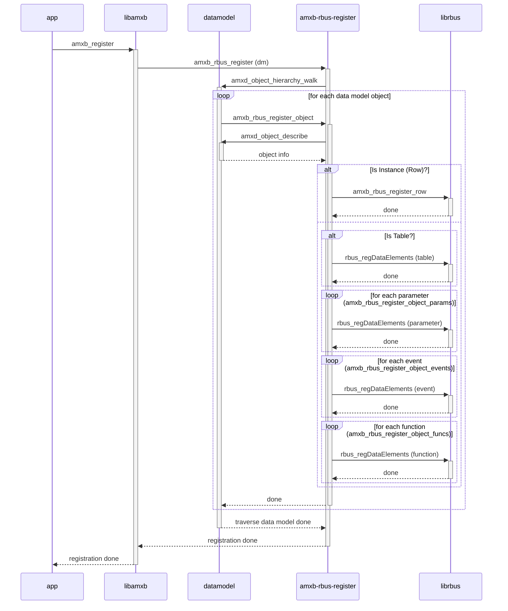
```mermaid
sequenceDiagram
    participant app
    participant libamxb
    participant datamodel
    participant amxb-rbus-register
    participant librbus

    app->>+libamxb: amxb_register
    libamxb->>+amxb-rbus-register: amxb_rbus_register (dm)
    amxb-rbus-register->>+datamodel: amxd_object_hierarchy_walk
    loop for each data model object
        datamodel->>+amxb-rbus-register: amxb_rbus_register_object
        amxb-rbus-register->>+datamodel: amxd_object_describe
        datamodel-->>-amxb-rbus-register: object info
        alt Is Instance (Row)?
            amxb-rbus-register->>+librbus: amxb_rbus_register_row
                librbus-->>-amxb-rbus-register: done
        else
            alt Is Table?
                amxb-rbus-register->>+librbus: rbus_regDataElements (table)
                librbus-->>-amxb-rbus-register: done
            end
            loop for each parameter<br>(amxb_rbus_register_object_params)
                amxb-rbus-register->>+librbus: rbus_regDataElements (parameter)
                librbus-->>-amxb-rbus-register: done
            end
            loop for each event<br>(amxb_rbus_register_object_events)
                amxb-rbus-register->>+librbus: rbus_regDataElements (event)
                librbus-->>-amxb-rbus-register: done
            end
            loop for each function<br>(amxb_rbus_register_object_funcs)
                amxb-rbus-register->>+librbus: rbus_regDataElements (function)
                librbus-->>-amxb-rbus-register: done
            end
        end
        amxb-rbus-register-->>-datamodel: done
    end
    datamodel-->>-amxb-rbus-register: traverse data model done
    amxb-rbus-register-->>-libamxb: registration done
    libamxb-->>-app: registration done
```

### Handling Requests

#### Common Request Handler

The `get`, `set`, `add` and `delete` requests all have the initial part of handling a request in common. When one of these requests is received (their callback is called by rbus), they initialize a data structure `rbus_condition_wait_t` and call the function `amxb_rbus_common_handler`. This function will create a request item (`amxb_rbus_item_t` structure) and fills it with the needed data. One of the fields in `amxb_rbus_item_t` is a function pointer to the real implementation. 

If this common handler is called from the main thread, it will call the real implementation immediately. If the common handler is not called on the main thread, it adds the request item to the request queue and makes sure that the eventloop (which is running in the main thread) is triggered. After adding it on the request queue it will block the thread until the requests is handled and finished, by using a thread conditional wait, see [pthread_cond_wait](https://linux.die.net/man/3/pthread_cond_wait).

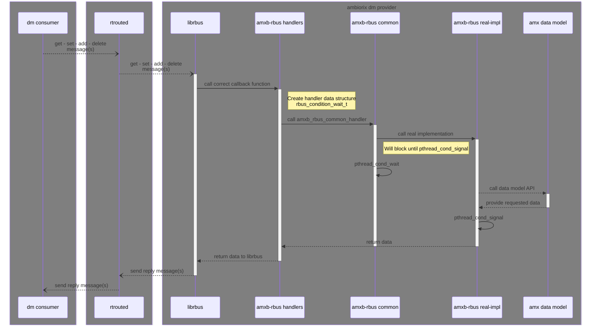
```mermaid
sequenceDiagram
    box rgb(127,127,127)
        participant dm consumer
    end
    box rgb(127,127,127)
        participant rtrouted
    end
    box rgb(127,127,127) ambiorix dm provider
        participant librbus
        participant amxb-rbus handlers
        participant amxb-rbus common
        participant amxb-rbus real-impl
        participant amx data model
    end
    dm consumer--)rtrouted: get - set - add - delete<br/>message(s)
    rtrouted--)+librbus: get - set - add - delete<br/>message(s)
    librbus->>+amxb-rbus handlers: call correct callback function
    Note right of amxb-rbus handlers: Create handler data structure<br/>rbus_condition_wait_t
    amxb-rbus handlers->>+amxb-rbus common: call amxb_rbus_common_handler
    amxb-rbus common->>+amxb-rbus real-impl: call real implementation
    Note right of amxb-rbus common: Will block until pthread_cond_signal
    amxb-rbus common->>amxb-rbus common: pthread_cond_wait
    amxb-rbus real-impl-->>+amx data model: call data model API 
    amx data model-->>-amxb-rbus real-impl: provide requested data 
    amxb-rbus real-impl->>amxb-rbus real-impl: pthread_cond_signal
    amxb-rbus real-impl-->>-amxb-rbus handlers: return data
    deactivate amxb-rbus common
    amxb-rbus handlers-->>-librbus: return data to librbus
    librbus--)-rtrouted: send reply message(s)
    rtrouted--)dm consumer: send reply message(s)
```

#### Get Requests

A get request is typically initiated by a data model consumer by using one of these RBus API functions:

- `rbus_get` - to fetch a single parameter value
- `rbus_getExt` - to fetch one or more parameter values
- `rbus_getBoolean`, `rbus_getInt`, `rbus_getUint`, `rbus_getStr` - same as `rbus_get` but only if the parameter is of the type as stated in the function name.

If such GET request is done on an ambiorix data model provider, RBus will make sure that the `amxb_rbus_get_value` callback function is called with the correct information. The `amxb_rbus_get_value` function is using the `amxb_rbus_common_handler` to correctly handle the request and provide a reply.

The get request handling is implemented in `src/amxb_rbus_handler_get.c` and contains two functions:

- `amxb_rbus_get_value` - provided to rbus as callback function for all parameter data model elements
- `amxb_rbus_get_value_impl` - implements the real get and must be executed on the main thread.

The value of the parameter is provided back to rbus in a `rbusValue_t` structure. The conversion of the data model value, which is stored in a `amxc_var_t` is done by the function `amxb_rbus_var_to_rvalue`, which is capable of translating all `amxc_var_t` values into a `rbusValue_t`.

After retrieving and translating the parameter value the thread conditional signal is triggered, which will make the original thread continue.

Sequence diagram

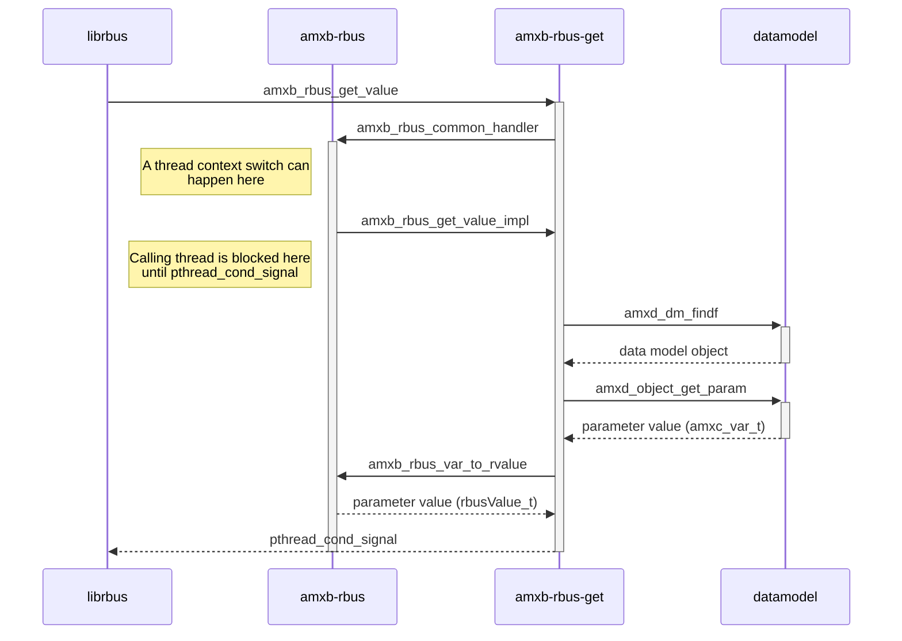
```mermaid
sequenceDiagram
    participant librbus
    participant amxb-rbus
    participant amxb-rbus-get
    participant datamodel
    librbus->>+amxb-rbus-get: amxb_rbus_get_value
    amxb-rbus-get->>+amxb-rbus: amxb_rbus_common_handler
    Note left of amxb-rbus: A thread context switch can<br>happen here
    amxb-rbus->>amxb-rbus-get: amxb_rbus_get_value_impl
    Note left of amxb-rbus: Calling thread is blocked here<br>until pthread_cond_signal
    amxb-rbus-get->>+datamodel: amxd_dm_findf
    datamodel-->>-amxb-rbus-get: data model object
    amxb-rbus-get->>+datamodel: amxd_object_get_param
    datamodel-->>-amxb-rbus-get: parameter value (amxc_var_t)
    amxb-rbus-get->>amxb-rbus: amxb_rbus_var_to_rvalue
    amxb-rbus-->>amxb-rbus-get: parameter value (rbusValue_t)
    amxb-rbus-get-->>-librbus: pthread_cond_signal 
    deactivate amxb-rbus
```

#### Set Requests

A set request is typically initiated by a data model consumer by using one of these RBus API functions:

- `rbus_set` - set a single parameter value
- `rbus_setMulti` - set multiple parameters
- `rbus_setBoolean`, `rbus_setInt`, `rbus_setUInt`, `rbus_setStr` - same as `rbus_set` but only if the parameter is of the type as stated in the function name.

If such SET request is done on an ambiorix data model provider, RBus will make sure that the `amxb_rbus_set_value` callback function is called with the correct information. The `amxb_rbus_set_value` function is using the `amxb_rbus_common_handler` to correctly handle the request and provide a reply. The `amxb_rbus_common_handler` creates a transaction id using the id of the requester and id of the session as provided by rbus. This transaction id is of importance for the handling of the set requests.

The get request handling is implemented in `src/amxb_rbus_handler_set.c` and contains the following functions:

- `amxb_rbus_set_value` - provided to rbus as callback function for all writable parameter data model elements
- `amxb_rbus_add_to_transaction` - adds the set parameter request to a data model transaction
- `amxb_rbus_set_validate` - validates the new value, will return an error to rbus if the provided value is invalid.
- `amxb_rbus_set_apply` - applies the created transaction for the session id.

If the data model consumer is setting multiple parameters of the same provider with one request, RBus will provide all these parameters one by one to the data model provider. With the last parameter of the request RBus will set the `commit` flag. To make the set operation behave atomic the amx-rbus backend will create a data model transaction and add all provided parameters to this transaction. When the last parameter value is received (commit flag is set), the transaction will be applied and the data model is updated.

Each provided value will first be validated before it is added to the transaction, if an invalid value is provided the transaction is aborted and an error code is returned back to rbus.

All provided values are received in a `rbusValue_t` structure and are translated to a `amxc_var_t` so it can be passed to the data model. 

To keep track of the open transactions some utility function are added:

- `amxb_rbus_open_transaction` - opens or retrieves an existing transaction using a transaction id.
- `amxb_rbus_get_transaction` - retrieves an existing transaction using a transaction id.
- `amxb_rbus_close_transaction` - closes and cleans-up a transaction.

Sequence diagram

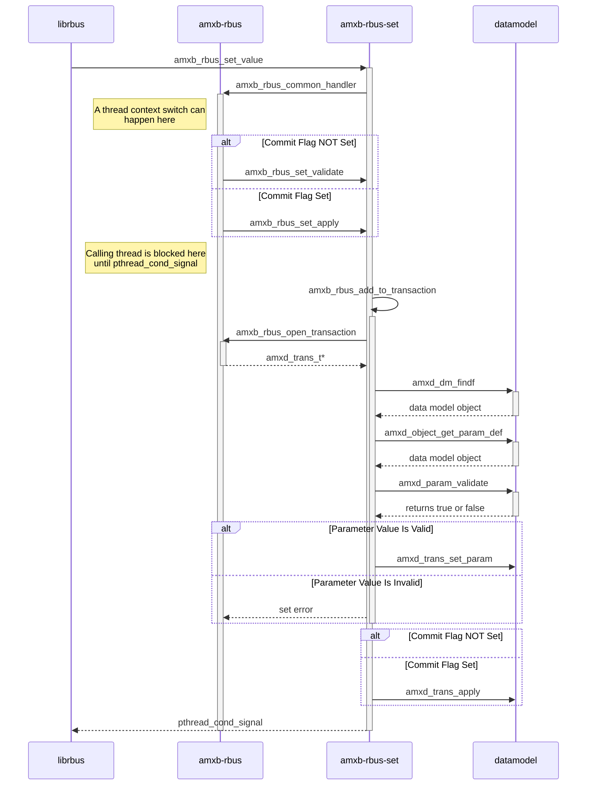
```mermaid
sequenceDiagram
    participant librbus
    participant amxb-rbus
    participant amxb-rbus-set
    participant datamodel
    librbus->>+amxb-rbus-set: amxb_rbus_set_value
    amxb-rbus-set->>+amxb-rbus: amxb_rbus_common_handler
    Note left of amxb-rbus: A thread context switch can<br>happen here
    alt Commit Flag NOT Set
        amxb-rbus->>amxb-rbus-set: amxb_rbus_set_validate
    else Commit Flag Set
        amxb-rbus->>amxb-rbus-set: amxb_rbus_set_apply
    end
    Note left of amxb-rbus: Calling thread is blocked here<br>until pthread_cond_signal
    amxb-rbus-set->>+amxb-rbus-set: amxb_rbus_add_to_transaction
    amxb-rbus-set->>+amxb-rbus: amxb_rbus_open_transaction
    amxb-rbus-->>-amxb-rbus-set: amxd_trans_t*
    amxb-rbus-set->>+datamodel: amxd_dm_findf
    datamodel-->>-amxb-rbus-set: data model object
    amxb-rbus-set->>+datamodel: amxd_object_get_param_def
    datamodel-->>-amxb-rbus-set: data model object
    amxb-rbus-set->>+datamodel: amxd_param_validate
    datamodel-->>-amxb-rbus-set: returns true or false
    alt Parameter Value Is Valid
        amxb-rbus-set->>datamodel: amxd_trans_set_param
    else Parameter Value Is Invalid
        amxb-rbus-set-->>amxb-rbus: set error
    end
    deactivate amxb-rbus-set
    alt Commit Flag NOT Set
    else Commit Flag Set
        amxb-rbus-set->>datamodel: amxd_trans_apply
    end    
    amxb-rbus-set-->>-librbus: pthread_cond_signal
    deactivate amxb-rbus
```

#### Add Requests

An add (row) request is typically initiated by a data model consumer by using this RBus API functions `rbusTable_addRow`.

If such ADD request is done on an ambiorix data model provider, RBus will make sure that the `amxb_rbus_add_row` callback function is called with the correct information. The `amxb_rbus_add_row` function is using the `amxb_rbus_common_handler` to correctly handle the request and provide a reply.

The add request handling is implemented in `src/amxb_rbus_handler_row.c` and contains the following functions that are used to handle add requests:

- `amxb_rbus_add_row` - provided to rbus as callback function for all multi-instance object data model elements (aka tables)
- `amxb_rbus_add_row_impl` - implements the real add row and must be executed on the main thread.

An ambiorix data model provider will inform RBus when a row has been added by using `rbusTable_registerRow`, if a row was added by rbus itself the ambiorix data model provider should not inform rbus that the row is added as rbus itself is requesting to add a new row. To keep track of the rows that were added by rbus through this `amxb_rbus_add_row` callback, amxb-rbus backend keeps track of these added instances, to avoid the rows are registered twice to rbus.

To make the ambiorix eventing work correctly the implementation will add an instance to the multi-instance object using data model transaction API.

---
> ⚠️ **WARNING**<br>
> Multi-instance objects with key parameters could cause a problem when trying to add an instance using the rbus api `rbusTable_addRow`. Key parameters can only be set at creation time and identify the instance uniquely. It is possible that creating an instance without providing the key values will fail, this is dependant on the data model provider implementation.<br>
> It is not possible with the rbus API to provide values for the key parameters when invoking `rbusTable_addRow`.
---

Sequence diagram


```mermaid
sequenceDiagram
    participant librbus
    participant amxb-rbus
    participant amxb-rbus-row
    participant datamodel
    librbus->>+amxb-rbus-row: amxb_rbus_add_row
    amxb-rbus-row->>+amxb-rbus: amxb_rbus_common_handler
    Note left of amxb-rbus: A thread context switch can<br>happen here
    amxb-rbus->>amxb-rbus-row: amxb_rbus_add_row_impl
    Note left of amxb-rbus: Calling thread is blocked here<br>until pthread_cond_signal
    amxb-rbus-row->>+datamodel: amxd_dm_findf
    datamodel-->>-amxb-rbus-row: data model object
    amxb-rbus-row->>datamodel: amxd_trans_add_inst
    amxb-rbus-row->>+datamodel: amxd_trans_apply
    datamodel-->>-amxb-rbus-row: status code
    amxb-rbus-row-->>-librbus: pthread_cond_signal 
    deactivate amxb-rbus
```

#### Delete Requests

A delete (row) request is typically initiated by a data model consumer by using this RBus API functions `rbusTable_removeRow`.

If such DELETE request is done on an ambiorix data model provider, RBus will make sure that the `amxb_rbus_remove_row` callback function is called with the correct information. The `amxb_rbus_remove_row` function is using the `amxb_rbus_common_handler` to correctly handle the request and provide a reply.

The delete request handling is implemented in `src/amxb_rbus_handler_row.c` and contains the following functions that are used to handle delete requests:

- `amxb_rbus_remove_row` - provided to rbus as callback function for all multi-instance object data model elements (aka tables)
- `amxb_rbus_remove_row_impl` - implements the real remove row and must be executed on the main thread.

An ambiorix data model provider will inform RBus when a row has been deleted by using `rbusTable_unregisterRow`, if a row was removed by rbus itself the ambiorix data model provider should not inform rbus that the row is deleted as rbus itself is requesting to delete the row. To keep track of the rows that were deleted by rbus through this `amxb_rbus_remove_row` callback, amxb-rbus backend keeps track of these deleted instances, to avoid the rows are unregistered twice from rbus.

To make the ambiorix eventing work correctly the implementation will delete an instance from the multi-instance object using data model transaction API.

Sequence diagram

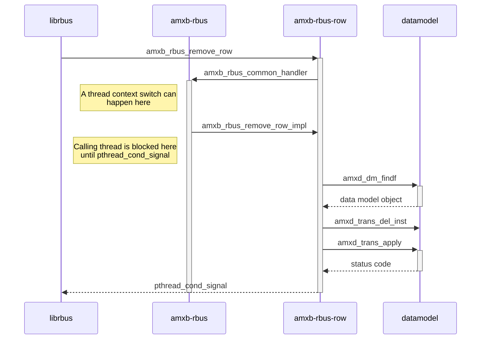
```mermaid
sequenceDiagram
    participant librbus
    participant amxb-rbus
    participant amxb-rbus-row
    participant datamodel
    librbus->>+amxb-rbus-row: amxb_rbus_remove_row
    amxb-rbus-row->>+amxb-rbus: amxb_rbus_common_handler
    Note left of amxb-rbus: A thread context switch can<br>happen here
    amxb-rbus->>amxb-rbus-row: amxb_rbus_remove_row_impl
    Note left of amxb-rbus: Calling thread is blocked here<br>until pthread_cond_signal
    amxb-rbus-row->>+datamodel: amxd_dm_findf
    datamodel-->>-amxb-rbus-row: data model object
    amxb-rbus-row->>datamodel: amxd_trans_del_inst
    amxb-rbus-row->>+datamodel: amxd_trans_apply
    datamodel-->>-amxb-rbus-row: status code
    amxb-rbus-row-->>-librbus: pthread_cond_signal 
    deactivate amxb-rbus
```

#### Call Requests

A set request is typically initiated by a data model consumer by using one of these RBus API functions:

- `rbusMethod_Invoke` -  Invokes a remote method and blocks the data model consumer while waiting for the result.
- `rbusMethod_InvokeAsync` - Invokes a remote method without blocking the data model consumer.

If such INVOKE request is done on an ambiorix data model provider, RBus will make sure that the `amxb_rbus_call_method` callback function is called with the correct information. The `amxb_rbus_call_method` implementation will create a new `amxb_rbus_item_t` and add it to the queue which will be handled by the main thread's eventloop. The method will always return `RBUS_ERROR_ASYNC_RESPONSE` to inform rbus that the response will be send later using `rbusMethod_SendAsyncResponse`. All received invoke requests will be handled on the ambiorix data model provider side asynchronously.

The invoke request handling is implemented in `src/amxb_rbus_handler_call.c` and contains the following functions that are used to handle invoke requests:

- `amxb_rbus_call_method` - provided to rbus as callback function for all method data model elements.
- `amxb_rbus_call_impl` - implements the real invoke and must be executed on the main thread.
- `amxb_rbus_exec_done` - called when the operation is done fetches the return value and out arguments and passes it to `amxb_rbus_send_call_reply`. This method is only used for data model methods that are deferred (return `amxd_status_deferred`)
- `amxb_rbus_send_call_reply` - builds the response and uses `rbusMethod_SendAsyncResponse` and instructs rbus to send the reply.

Sequence Diagram

---
> **🪧 NOTE**<br>
> When the data model method is returning the status `amxd_status_deferred`, the callback function `amxb_rbus_exec_done` is attached to the pending method call. When the data model method implementation is done, it will call this callback function. It will then handle the creation of the response message and sending the response back, through `amxb_rbus_send_call_reply`.<br>
> The sequence diagram below is showing the flow of the calls when the data model method is returning `amxd_status_ok` or any other error code that is not `amxd_status_deferred`.

---

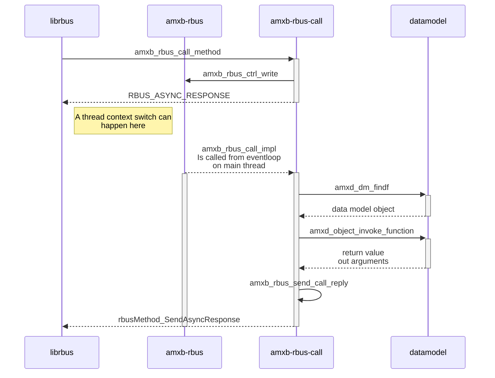
```mermaid
sequenceDiagram
    participant librbus
    participant amxb-rbus
    participant amxb-rbus-call
    participant datamodel
    librbus->>+amxb-rbus-call: amxb_rbus_call_method
    amxb-rbus-call->>amxb-rbus: amxb_rbus_ctrl_write
    amxb-rbus-call-->>-librbus: RBUS_ASYNC_RESPONSE
    Note left of amxb-rbus: A thread context switch can<br>happen here
    amxb-rbus-->>+amxb-rbus-call: amxb_rbus_call_impl<br>Is called from eventloop<br>on main thread
    activate amxb-rbus
    amxb-rbus-call->>+datamodel: amxd_dm_findf
    datamodel-->>-amxb-rbus-call: data model object
    amxb-rbus-call->>+datamodel: amxd_object_invoke_function
    datamodel-->>-amxb-rbus-call: return value<br>out arguments
    amxb-rbus-call->>amxb-rbus-call: amxb_rbus_send_call_reply
    amxb-rbus-call-->>-librbus: rbusMethod_SendAsyncResponse
    deactivate amxb-rbus
```

#### Subscribe and Unsubscribe Requests

A subscribe request is typically initiated by a data model consumer by using one of these RBus API functions:

- `rbusEvent_Subscribe`
- `rbusEvent_SubscribeAsync`
- `rbusEvent_SubscribeEx`
- `rbusEvent_SubscribeExAsync`

An unsubscribe request is typically initiated by a data model consumer by using one of these RBus API functions:

- `rbusEvent_Unsubscribe`
- `rbusEvent_UnsubscribeEx`

If a subscribe or unsubscribe is done on an ambiorix data model provider, RBus will make sure that either `amxb_rbus_row_subscribe_handler` or `amxb_rbus_subscribe_handler` is called. Which of these callback functions will be called depends on the type of object the subscription or unsubscription was done on. The ambiorix data model provider will register `amxb_rbus_row_subscribe_handler` as a callback function for (un)subscribe handling on multi-instance objects (aka tables), and registers `amxb_rbus_subscribe_handler` as a callback function for (un)subscribe handling on event data elements.

As ambiorix data models have their own default data model events, the data model provider will register an extra event for all data model objects, this event is named `amx_notify!`. This event is needed to make sure that the interaction between ambiorix based implementations can work on top of RBus.

An ambiorix data model provider will make sure that all RBus native supported events are respected and send when needed.

The subscribe and unsubscribe handling is implemented in `src/amxb_rbus_handle_subscribe.c`.

The data model provider keeps track of the number of subscriptions that are taken on a specific object using reference counting. If multiple subscriptions are created on the same object, the provider will only send one event to RBus, it is up to the bus system to make sure that the event is dispatched to all subscribers. When all subscriptions on a specific path are closed (unsubscribe and reference count reaches 0) the ambiorix data model provider will stop sending events for that subscription.

When a subscription is taken on a specific data model event, the provider will only send that specific event on the provided path. When a subscription request is received on an object path or on the special ambiorix event `amx_notify!`, the provider will send all events for the given path and all of its sub-objects recursively.

The amxb-rbus back-end implementation is using the [signal/slot mechanism](https://gitlab.com/prpl-foundation/components/ambiorix/libraries/libamxp/-/blob/main/doc/signal_slot.md) and the data model signal manager (libamxd) to get notified when data model events occurred on objects for which a subscription was opened by a data model consumer. The function `amxb_rbus_send_notification` is used as callback function (slot) and will create, when called, the Rbus message and publishes the event to RBus.

The following sequence diagram illustrates to flow that is followed when a subscription is taken:

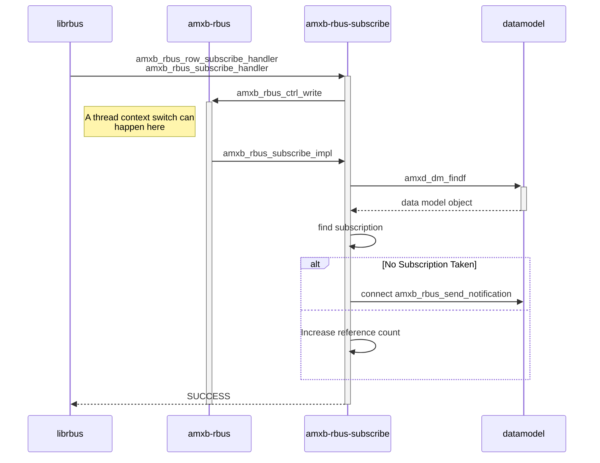
```mermaid
sequenceDiagram
    participant librbus
    participant amxb-rbus
    participant amxb-rbus-subscribe
    participant datamodel
    librbus->>+amxb-rbus-subscribe: amxb_rbus_row_subscribe_handler<br/>amxb_rbus_subscribe_handler
    amxb-rbus-subscribe->>+amxb-rbus: amxb_rbus_ctrl_write
    Note left of amxb-rbus: A thread context switch can<br>happen here
    amxb-rbus->>amxb-rbus-subscribe: amxb_rbus_subscribe_impl
    amxb-rbus-subscribe->>+datamodel: amxd_dm_findf
    datamodel-->>-amxb-rbus-subscribe: data model object
    amxb-rbus-subscribe->>amxb-rbus-subscribe: find subscription
    alt No Subscription Taken 
        amxb-rbus-subscribe->>datamodel: connect amxb_rbus_send_notification
    else
        amxb-rbus-subscribe->>amxb-rbus-subscribe: Increase reference count
    end
    amxb-rbus-subscribe-->>-librbus: SUCCESS
    deactivate amxb-rbus
```

When the data model triggers or emits a signal on the data model signal manager the function `amxb_rbus_send_notification` is called.

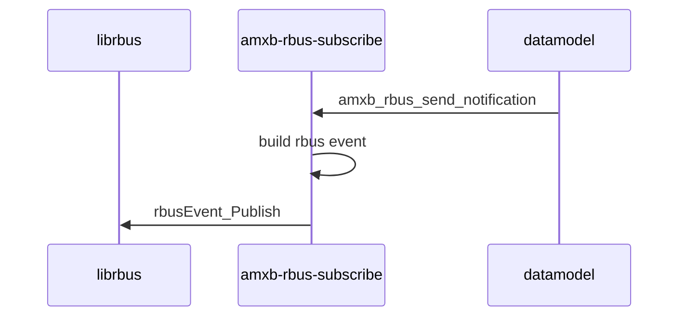
```mermaid
sequenceDiagram
    participant librbus
    participant amxb-rbus-subscribe
    participant datamodel
    datamodel->>amxb-rbus-subscribe: amxb_rbus_send_notification
    amxb-rbus-subscribe->>amxb-rbus-subscribe: build rbus event
    amxb-rbus-subscribe->>librbus: rbusEvent_Publish
```

## Data Model Consumer

The back-end interface can provide functions that are used by data model consumers (client processes). To make existing ambiorix data model consumers (data model clients) work and interact with rbus and rbus native data models, this client side interface must be available as well.

Most of the ambiorix bus agnostic API is based on USP specifications and requirements, although it is not implementing fully the USP specification by itself. The API provides a way to use the underlying bus system in a similar way that an USP controller would interact with an USP agent. This implies that to make rbus usable for ambiorix data model clients, either rbus must support a set of features that match with the requirements of USP or the amxb rbus back-end must make sure that these are available.

One of the main requirements is the usage of search and wild-card paths as specified in [TR-369 USP](https://usp.technology/specification/) section [2.5 Path Names](https://usp.technology/specification/#sec:path-names). RBus has support for wildcards but the semantics are different then what is specified in TR-369 USP, with RBus a wildcard symbol `*` can be put anywhere in the path, while with USP it is only valid after a multi-instance object (table name). Search expressions are totally not supported by rbus.

Besides the path requirements, rbus must support the equivalent of these data model operations as specified in TR-369, to make it usable for ambiorix data model consumers. If one of these operations are not directly supported by rbus itself, the back-end can implement it if it is possible to retrieve the needed information from rbus.

- GET
- SET
- ADD
- DEL
- GET SUPPORTED DM
- GET INSTANCES
- OPERATE (aka call, invoke)

The following data model operations are ambiorix specific extensions and are a nice to have but no real hard requirements, these are mainly used for introspection and discovery mechanisms:

- DESCRIBE
- LIST
- HAS
- WAIT FOR

When the amxb-rbus backend run-time configuration option `use-amx-calls` is enabled, the backend will try to verify if the remote (data model provider) is an ambiorix based data model provider. This check uses `rbusElementInfo_get` to retrieve the element information from rbus. If the element provides the following 3 methods `_exec`, `_list`, `_get`, the amxb-rbus backend assumes the remote end does understand amxbiorix calls and it will use these calls to invoke the operation instead of the rbus native API. These methods will be invoked using `rbusMethod_Invoke`. In some situations using the amx calls instead of the rbus native API can provide more information from the data model, this is typically meta-data that can not be registered to rbus or passed to rbus. If the remote (data model provider) is an ambiorix based implementation but the support for the amx calls is turned of in that process, the amxb-rbus backend on consumer side will revert back to the native RBus API calls.

All amx-rbus backend consumer functions can not be called directly, but must be called through the common API provided by `libamxb`. The `libamxb` implementation provides an abstraction layer on top of the bus systems and will forward the call to the backend.

For each back-end functionality described here a corresponding `ba-cli` command example is provided. The examples are taken using a RDK-B running on a Turris Omnia with RBus version 2.0.5.

```
root@TurrisOmnia-GW:~# ba-cli 
Copyright (c) 2020 - 2024 SoftAtHome
amxcli version : 0.3.3

!amx silent true

                   _ _____  _____  _  __
                  | |  __ \|  __ \| |/ /
  _ __  _ __ _ __ | | |__) | |  | | ' /
 | '_ \| '__| '_ \| |  _  /| |  | |  <
 | |_) | |  | |_) | | | \ \| |__| | . \
 | .__/|_|  | .__/|_|_|  \_\_____/|_|\_\
 | |        | |
 |_|        |_| based on RDK-B
 -----------------------------------------------------
 Bus Agnostic CLI - powered by Ambiorix
 -----------------------------------------------------

 Load Ambiorix Bus Agnostic CLI
 Load all available back-ends
 Open connections ...
 Set mode cli
 Disable ACL verification by default
 Define some aliases
 Reset history

root - * - [bus-cli] (0)
 > 
```

### RESOLVING

As rbus doesn't support search paths amxb-rbus backend implements that functionality. Resolving of search paths (and wild card paths) is implemented in `src/amxb_rbus_resolve.c`. The main function is `amxb_rbus_resolve`. Ths function will fill a list of all matching object paths. Resolving search paths (and wild card paths) is done in different steps:

1. Fetch all objects and their parameters recursively, starting from the "fixed path". (that is the path in front of the first search expression or wild card symbol). Build a hierarchical structure representing all objects and parameters under the "fixed path". (see `amxb_rbus_fetch_params`)
1. Filter the hierarchical structure by removing all objects that are not matching the search expression. (see `amxb_rbus_filter_objects`)
1. Flatten the hierarchical structure, so it matches the expected output. (see `amxb_rbus_build_response`)
1. Filter out all parameters that are not needed (if a specific parameter was requested). (see `amxb_rbus_filter_parameters`)

All data model operations that must support search and wild card paths will first call `amxb_rbus_resolve` and then execute the needed operation on all of the found matching objects.

To fetch all required objects and their parameters (and parameter values), the function `amxb_rbus_fetch_params` uses `rbus_getExt`.

While filtering the non-matching objects, each time a wild card symbol `*` or search expression is encountered the amxb-rbus backend verifies if the current object is a multi-instance object (table) by calling `rbusElementInfo_get`.  (see `amxb_rbus_is_table`)

---
> ⚠️ **WARNING**<br>
> Some native rbus data model providers don't register their data model correctly, they don't register multi-instance objects as a table to rbus. This will cause some problems when filtering the matching objects as the information returned by rbus is not correct. The amxb rbus backend provides a run-time configuration option `skip-verify-type` that allows to disable the "table" check in the filtering process. This will allow to circumvent the issue/limitation but has as a side effect that search paths and wild card symbols can be used anywhere in the path, which is not according to the USP specifications.
---

The object resolving functionality could be improved in performance when a path is given that doesn't contain a search expression. In this case it is not needed to build the hierarchical structure and filter out the objects. For simplicity and uniformity of the code, the current choice is to do it always.

The method `amxb_rbus_resolve` can not be called directly by any of the libamxb abstraction API methods directly, but is used by the back-end to be able to provide a correct response for each upper layer method that can use search and wildcard paths. E.g. the method `amxb_get` will call the back-end function `amxb_rbus_get` which must be able to handle search and wildcard paths, this back-end function will call `amxb_rbus_resolve` to get all matching objects paths. 

Example of the resolve functionality using ba-cli:

```
root - * - [bus-cli] (0)
 > resolve Device.IP.Interface.*.IPv6Address.[Origin=="AutoConfigured"].
Device.IP.Interface.1.IPv6Address.1.
Device.IP.Interface.4.IPv6Address.1.
```

The resolve functionality is implemented in `src/amxb_rbus_resolve.c`.

The function available are:

- `amxb_rbus_resolve` - The main resolver function, this returns an data structure containing all matching objects for the provided path.
- `amxb_rbus_filter_parameters` - Removes all parameters that are not matching the parameter name provided in a parameter path.
- `amxb_rbus_build_response` - Flattens the hierarchical data structure and removes all data elements that are passed the requested depth.
- `amxb_rbus_filter_objects` - Uses the provided path and filters out all objects that are not matching the given path. This function is a recursive function. Uses `amxb_rbus_filter_sub_objects`, `amxb_rbus_is_table`.
- `amxb_rbus_is_table` - Verifies if an object is a table or not, used by `amxb_rbus_filter_objects`.
- `amxb_rbus_filter_sub_objects` - Filters out sub-objects that are not matching, used by `amxb_rbus_filter_objects`.
- `amxb_rbus_fetch_params` - Fetches all data model parameters from Rbus and build a hierarchical data structure, uses `amxb_rbus_add_param`.
- `amxb_rbus_add_param` - Adds a parameter to the hierarchical data structure, used by `amxb_rbus_fetch_params`

This sequence diagram gives a overview of the resolve functionality. In all other sequence diagrams where the `amxb_rbus_resolve` is used the sequence diagram is simplified.

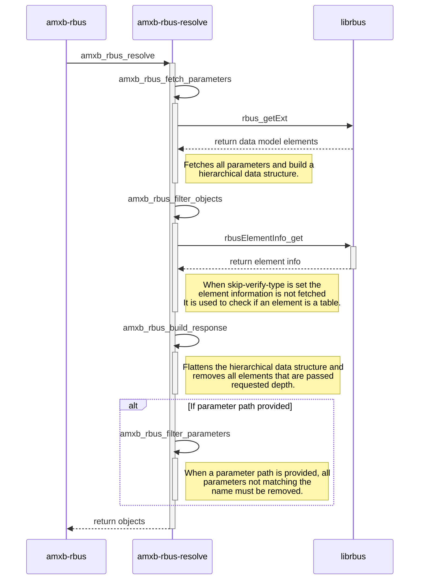
```mermaid
sequenceDiagram
    participant amxb-rbus
    participant amxb-rbus-resolve
    participant librbus
    amxb-rbus->>+amxb-rbus-resolve: amxb_rbus_resolve

    amxb-rbus-resolve->>amxb-rbus-resolve: amxb_rbus_fetch_parameters
    activate amxb-rbus-resolve
    amxb-rbus-resolve->>librbus: rbus_getExt
    librbus-->>amxb-rbus-resolve: return data model elements
    note right of amxb-rbus-resolve: Fetches all parameters and build a<br>hierarchical data structure.
    deactivate amxb-rbus-resolve

    amxb-rbus-resolve->>amxb-rbus-resolve: amxb_rbus_filter_objects
    activate amxb-rbus-resolve
    amxb-rbus-resolve->>+librbus: rbusElementInfo_get
    librbus-->>-amxb-rbus-resolve: return element info
    note right of amxb-rbus-resolve: When skip-verify-type is set the<br>element information is not fetched<br>It is used to check if an element is a table.
    deactivate amxb-rbus-resolve
    
    amxb-rbus-resolve->>amxb-rbus-resolve: amxb_rbus_build_response
    activate amxb-rbus-resolve
    note right of amxb-rbus-resolve: Flattens the hierarchical data structure and<br>removes all elements that are passed<br>requested depth.
    deactivate amxb-rbus-resolve

    alt If parameter path provided
        amxb-rbus-resolve->>amxb-rbus-resolve: amxb_rbus_filter_parameters
        activate amxb-rbus-resolve
        note right of amxb-rbus-resolve: When a parameter path is provided, all<br>parameters not matching the<br>name must be removed.
        deactivate amxb-rbus-resolve
    end
    amxb-rbus-resolve-->>-amxb-rbus: return objects
```

### GET Requests

The get request invocation is very simple, all it does is calling `amxb_rbus_resolve`. The output provided by `amxb_rbus_resolve` is already in the correct format, so no extra conversions or translations needs to be done.

If the consumer and the remote data model provider are both ambiorix based and the run-time configuration option `use-amx-calls` is set on both sides, the data model method `_get` is called through the rbus API `rbusMethod_Invoke`.

Example of a get request using ba-cli:

```
root - * - [bus-cli] (0)
 > Device.IP.Interface.*.IPv6Address.[Origin=="AutoConfigured"].?       
Device.IP.Interface.1.IPv6Address.1.
Device.IP.Interface.1.IPv6Address.1.Alias="IPv6Address1"
Device.IP.Interface.1.IPv6Address.1.Anycast=false
Device.IP.Interface.1.IPv6Address.1.Enable=true
Device.IP.Interface.1.IPv6Address.1.IPAddress="fe80::da58:d7ff:fe01:d483"
Device.IP.Interface.1.IPv6Address.1.IPAddressStatus="Preferred"
Device.IP.Interface.1.IPv6Address.1.Origin="AutoConfigured"
Device.IP.Interface.1.IPv6Address.1.PreferredLifetime="9999-12-31T23:59:59Z"
Device.IP.Interface.1.IPv6Address.1.Prefix=""
Device.IP.Interface.1.IPv6Address.1.Status="Enabled"
Device.IP.Interface.1.IPv6Address.1.ValidLifetime="9999-12-31T23:59:59Z"
Device.IP.Interface.1.IPv6Address.1.X_CISCO_COM_PreferredLifetime=0
Device.IP.Interface.1.IPv6Address.1.X_CISCO_COM_ValidLifetime=0
Device.IP.Interface.4.IPv6Address.1.
Device.IP.Interface.4.IPv6Address.1.Alias="IPv6Address1"
Device.IP.Interface.4.IPv6Address.1.Anycast=false
Device.IP.Interface.4.IPv6Address.1.Enable=true
Device.IP.Interface.4.IPv6Address.1.IPAddress="fe80::da58:d7ff:fe01:d482"
Device.IP.Interface.4.IPv6Address.1.IPAddressStatus="Preferred"
Device.IP.Interface.4.IPv6Address.1.Origin="AutoConfigured"
Device.IP.Interface.4.IPv6Address.1.PreferredLifetime="9999-12-31T23:59:59Z"
Device.IP.Interface.4.IPv6Address.1.Prefix=""
Device.IP.Interface.4.IPv6Address.1.Status="Enabled"
Device.IP.Interface.4.IPv6Address.1.ValidLifetime="9999-12-31T23:59:59Z"
Device.IP.Interface.4.IPv6Address.1.X_CISCO_COM_PreferredLifetime=0
Device.IP.Interface.4.IPv6Address.1.X_CISCO_COM_ValidLifetime=0
```

The implementation of get request in the ambiorix rbus backend is in `src/amxb_rbus_get.c`.

The functions available are:

- `amxb_rbus_call_get` - Calls the data model method `_get`, this can only be used on ambiorix data model providers.
- `amxb_rbus_get` - Either calls `amxb_rbus_call_get` or calls `amxb_rbus_resolve` to get the matching objects and their parameters.

The backend interface function is `amxb_rbus_get` and will be invoked through a call to `amxb_get`.

---
> 🪧**NOTE**<br>
> To keep the sequence diagram simple and understandable not all function calls are added, the main goal of the added sequence diagram is to make the flow and interaction between the different components/parts clear and understandable.
---

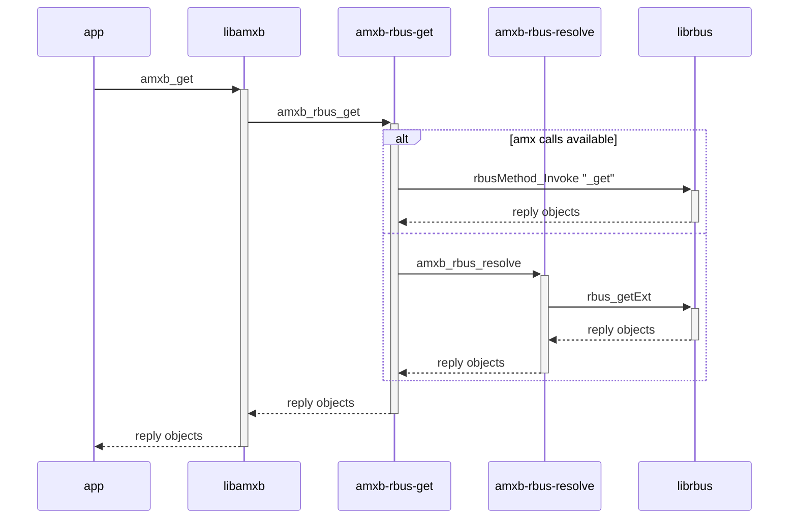
```mermaid
sequenceDiagram
    participant app
    participant libamxb
    participant amxb-rbus-get
    participant amxb-rbus-resolve
    participant librbus
    app->>+libamxb: amxb_get
    libamxb->>+amxb-rbus-get: amxb_rbus_get
    alt amx calls available
      amxb-rbus-get->>+librbus: rbusMethod_Invoke  "_get"
      librbus-->>-amxb-rbus-get: reply objects
    else
      amxb-rbus-get->>+amxb-rbus-resolve: amxb_rbus_resolve
      amxb-rbus-resolve->>+librbus: rbus_getExt
      librbus-->>-amxb-rbus-resolve: reply objects
      amxb-rbus-resolve-->>-amxb-rbus-get: reply objects
    end
    amxb-rbus-get-->>-libamxb: reply objects
    libamxb-->>-app: reply objects
```

### SET Requests

The set request invocation is a bit more complicated. Following the USP specification a set can be done partial or can contain optional parameters.

When a partial set is allowed, it is allowed that some sets are failing. When optional parameters are set, they are always allowed to fail. So depending on the request arguments the set operation can become more complex.

For optional parameters each parameter needs to be set individually, when the set fails the correct error code must be added to the response for the failed parameter. When partial sets are allowed, each parameter must be set individually as the correct error code must be added to the response for the failed parameter.

A set can be done using a search path or a wild card path, as rbus doesn't have full support for this, for each set operation the matching objects needs to be resolved. The set is invoked on all of the returned matching objects if any found.

If the consumer and the remote data model provider are both ambiorix based and the run-time configuration option `use-amx-calls` is set on both sides, the data model method `_set` is called through the rbus API `rbusMethod_Invoke`.

Example of set request using ba-cli:

```
root - * - [bus-cli] (0)
 > Device.Firewall.X_RDKCENTRAL-COM_Security.V6.{BlockFragIPPkts=true,IPFloodDetect=true}        
Device.Firewall.X_RDKCENTRAL-COM_Security.V6.
Device.Firewall.X_RDKCENTRAL-COM_Security.V6.BlockFragIPPkts=true
Device.Firewall.X_RDKCENTRAL-COM_Security.V6.IPFloodDetect=true
```

The implementation of set request in the ambiorix rbus backend is in `src/amxb_rbus_set.c`.

The functions implemented are:

- `amxb_rbus_set` - the backend interface called by amxb_set.
- `amxb_rbus_check_resolved` - loops over all resolved object paths and calls `amxb_rbus_send_set_request` or `amxb_rbus_set_values` depending on mandatory, optional parameters and request flags(AMXB_FLAG_PARTIAL)
- `amxb_rbus_set_values` -  loops over all parameters that needs to be set and calls `amxb_rbus_set_request`, builds the amx response structure for the failed sets. This method is called when setting optional parameters or when partial is allowed. It will add an error code to the response for each failed parameter, so the caller gets the correct information back.
- `amxb_rbus_send_set_request` - Does translation to and from rbus, calls the rbus API to instruct rbus to set the parameters values. Uses `rbus_setMulti`.
- `amxb_rbus_normalize` - Updates the result data structure to be conform with `amxb_set` expectations.

The backend interface function is `amxb_rbus_set` and will be invoked through a call to `amxb_set`.

---
> 🪧**NOTE**<br>
> - In the following sequence diagram the alternative of using the amx call `_set` is not added. Please look at the sequence diagram of the GET request as a reference.<br>
---

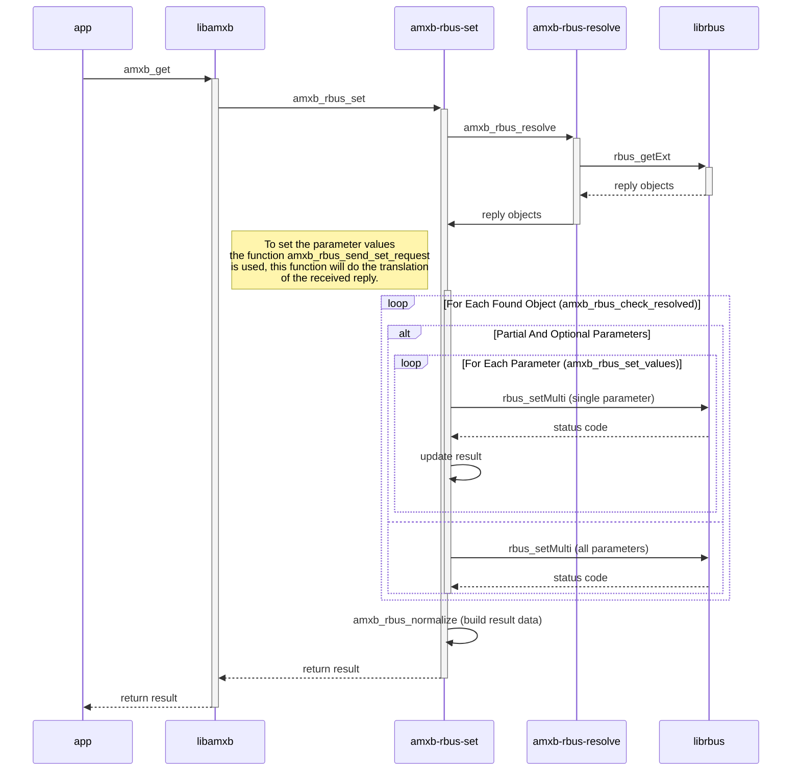
```mermaid
sequenceDiagram
    participant app
    participant libamxb
    participant amxb-rbus-set
    participant amxb-rbus-resolve
    participant librbus
    app->>+libamxb: amxb_get
    libamxb->>+amxb-rbus-set: amxb_rbus_set
    amxb-rbus-set->>+amxb-rbus-resolve: amxb_rbus_resolve
    amxb-rbus-resolve->>+librbus: rbus_getExt
    librbus-->>-amxb-rbus-resolve: reply objects
    amxb-rbus-resolve->>-amxb-rbus-set: reply objects
    note left of amxb-rbus-set: To set the parameter values<br>the function amxb_rbus_send_set_request<br>is used, this function will do the translation<br>of the received reply.
    activate amxb-rbus-set
    loop For Each Found Object (amxb_rbus_check_resolved)
       alt Partial And Optional Parameters
           loop For Each Parameter (amxb_rbus_set_values)
               amxb-rbus-set->>librbus: rbus_setMulti (single parameter)
               librbus-->>amxb-rbus-set: status code
               amxb-rbus-set->>amxb-rbus-set: update result
           end
       else
           amxb-rbus-set->>librbus: rbus_setMulti (all parameters)
           librbus-->>amxb-rbus-set: status code
       end
       deactivate amxb-rbus-set
    end
    amxb-rbus-set->>amxb-rbus-set: amxb_rbus_normalize (build result data)
    amxb-rbus-set-->>-libamxb: return result
    libamxb-->>-app: return result
```

### ADD Requests (add-row)

Any data model consumer can add new rows (instance objects) to a table (multi-instance object), if the table is writable. An ambiorix based data model consumer can add rows using the function `amxb_add`. The `libamxb` adaptor implementation will call the back-end interface to request the addition of the row(s). The amxb-rbus back-end provides the function `amxb_rbus_add` which will be called through `amxb_add`.

As the ambiorix function accepts search and wildcards paths it is possible to add multiple instances with one call. As RBus doesn't support search paths the resolve functionality is used to first resolve all matching (table) objects and then the amxb-rbus backend will use `rbusTable_addRow` for each of the resolved object paths.

With USP add requests it is possible to set parameter values. RBus doesn't support this feature. The ambiorix rbus back-end implementation works around this limitation of RBus by first creating the new row and then tries to set the parameter values using `amxb_rbus_add_set_values` which uses `rbus_setMulti` to set the provided values for the parameters. If setting the values has failed, the amxb-rbus back-end will remove the added row using `rbusTable_removeRow`.

---
> ⚠️ **WARNING**<br>
> As it is not possible to pass parameter values when calling `rbusTable_addRow` it is possible that the creation of the row fails when key parameter values are not provided. This depends on the data model provider implementation and will only cause problems when using an Ambiorix based data model provider as these implementation almost always assume/expect the key parameter values are provided at creation time. If this is the case it is recommended that the ambiorix data model provider and ambiorix data model consumer both have the run-time configuration option `use-amx-calls` set. In that case the the amxb-rbus backend will use `_add` protected method to add the new instances (rows).
---

It is a requirement of USP that all key parameters and their values are returned in the ADD request response. As RBus is not aware of key parameters this can not be done when using RBus. When using the native RBus functions no key parameters and their values are returned, only the object paths of the newly created instances.

---
> 🪧**NOTE**<br>
> A possible work-around for this limitation of Rbus is to fetch the full description/definition of the newly created instance and filter out the key parameters and add them to the response. This will imply extra messages that needs to be send over the RBus system. When using an ambiorix data model consumer to create new rows on native RBus data model providers this is not a real issue as they don't have support for key parameters, when both sides (consumer and provider) are ambiorix based it is recommended to use the protected method `_add` by setting the run-time configuration option `use-amx-calls`.
---

Example of add request using ba-cli:

```
root - * - [bus-cli] (0)
 > Device.Users.User.+{Username="Test", Language="English", RemoteAccessCapable=true}
Device.Users.User.4.

root - * - [bus-cli] (0)
 > Device.Users.User.4.?
Device.Users.User.4.
Device.Users.User.4.Enable=false
Device.Users.User.4.Language="English"
Device.Users.User.4.NumOfFailedAttempts=0
Device.Users.User.4.Password=""
Device.Users.User.4.RemoteAccessCapable=true
Device.Users.User.4.Username="User4"
Device.Users.User.4.X_CISCO_COM_AccessPermission="HomeUser"
Device.Users.User.4.X_CISCO_COM_Password=""
Device.Users.User.4.X_RDKCENTRAL-COM_ComparePassword=""
Device.Users.User.4.X_RDKCENTRAL-COM_LockOutRemainingTime=0
Device.Users.User.4.X_RDKCENTRAL-COM_LoginCounts=0
Device.Users.User.4.X_RDKCENTRAL-COM_PasswordReset=false
Device.Users.User.4.X_RDKCENTRAL-COM_RemainingAttempts=0

root - * - [bus-cli] (0)
 > Device.Users.User.4.Username="Test"
ERROR: set Device.Users.User.4.Username failed (10)

root - * - [bus-cli] (10)
 > Device.Users.User.4.Language="French"
Device.Users.User.4.
Device.Users.User.4.Language="French"
```

---
> 🪧**NOTE**<br>
> In above example the RDK User-management implementation doesn't accept the username, the retuned code matches with `Invalid Value`. While setting the language is not a problem.
---


The implementation of add request in the ambiorix rbus backend is in `src/amxb_rbus_add.c`.

The functions implemented are:

- `amxb_rbus_add` - the backend interface called by amxb_add.
- `amxb_rbus_check_resolved` - loops over all resolved object paths and calls `rbusTable_addRow` and `amxb_rbus_add_set_values`.
- `amxb_rbus_add_set_values` - sets the values of the parameters of the newly created instance. Reuses part of the `amxb_rbus_set` implementation.
- `amxb_rbus_call_add` - Uses a RPC method call `_del` to delete the instances, if the data model provider that provides these is an ambiorix base implementation.

The backend interface function is `amxb_rbus_del` and will be invoked through a call to `amxb_del`.

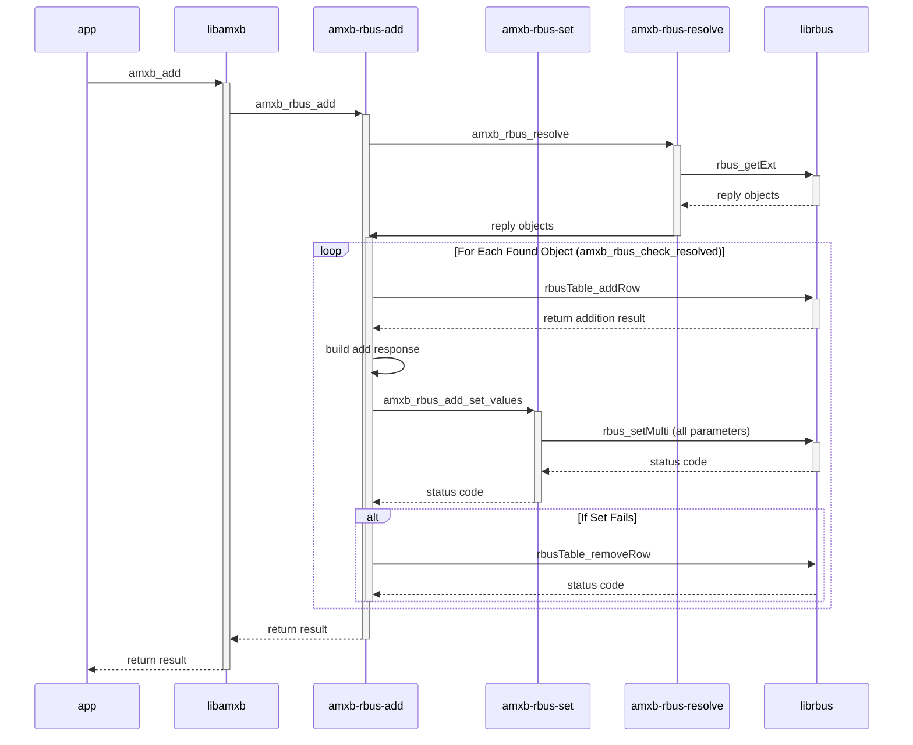
```mermaid
sequenceDiagram
    participant app
    participant libamxb
    participant amxb-rbus-add
    participant amxb-rbus-set
    participant amxb-rbus-resolve
    participant librbus
    app->>+libamxb: amxb_add
    libamxb->>+amxb-rbus-add: amxb_rbus_add
    amxb-rbus-add->>+amxb-rbus-resolve: amxb_rbus_resolve
    amxb-rbus-resolve->>+librbus: rbus_getExt
    librbus-->>-amxb-rbus-resolve: reply objects
    amxb-rbus-resolve->>-amxb-rbus-add: reply objects
    activate amxb-rbus-add
    loop For Each Found Object (amxb_rbus_check_resolved)
        amxb-rbus-add->>+librbus: rbusTable_addRow
        librbus-->>-amxb-rbus-add: return addition result
        amxb-rbus-add->>amxb-rbus-add: build add response
        amxb-rbus-add->>+amxb-rbus-set: amxb_rbus_add_set_values
        amxb-rbus-set->>+librbus: rbus_setMulti (all parameters)
        librbus-->>-amxb-rbus-set: status code
        amxb-rbus-set-->>-amxb-rbus-add: status code
        alt If Set Fails
            amxb-rbus-add->>librbus: rbusTable_removeRow
            librbus-->>amxb-rbus-add: status code
        end
        deactivate amxb-rbus-add
    end
    amxb-rbus-add-->>-libamxb: return result
    libamxb-->>-app: return result
```

### DEL Requests (del-row)

Any data model consumer can delete existing rows (instance objects) from a table (multi-instance object), if the table is writable. An ambiorix based data model consumer can delete rows using the function `amxb_del`. The `libamxb` adaptor implementation will call the back-end interface to request the deletion of the row(s). The amxb-rbus back-end provides the function `amxb_rbus_del` which will be called through `amxb_del`.

As the ambiorix function accepts search and wildcards paths it is possible to delete multiple instances with one call. As RBus doesn't support search paths the resolve functionality is used to first resolve all matching (instance) objects and then the amxb-rbus backend will use `rbusTable_removeRow` for each of the resolved object paths.

It is a requirement of USP that all deleted object paths are returned in the response of the delete request. An ambiorix data model consumer also expects that all deleted object paths are returned. This includes all sub-objects of the delete objects.

To be able to achieve this, the amxb-rbus backend will first get the list of all objects that will be deleted, before deleting the objects, this extra get request is done because RBus doesn't provide the needed feedback by itself.

Normally when multiple objects are deleted using `amxb_del`, for instance when using a search path or a wildcard path, they will be all delete or non of them will be deleted. Using RBus native methods this will not be possible. The amxb-rbus backend will delete the resolved objects one by one and stops as soon as one of them fails. This is not completely in line with the USP specifications.

When the data model consumer and data model provider are both an ambiorix based implementation, and both have the `use-amx-calls` run-time configuration option enabled, the amxb-rbus backend will delete the objects using the protected method `_del`. This will make sure that the deletion of the instances (rows) is according the USP specifications.

Example of delete request using ba-cli:

```
root - * - [bus-cli] (0)
 > Device.Users.User.4-                 
Device.Users.User.4.

root - * - [bus-cli] (10)
 > Device.Users.User.?  
Device.Users.User.1.
Device.Users.User.1.Enable=false
Device.Users.User.1.Language=""
Device.Users.User.1.NumOfFailedAttempts=0
Device.Users.User.1.Password=""
Device.Users.User.1.RemoteAccessCapable=false
Device.Users.User.1.Username="mso"
Device.Users.User.1.X_CISCO_COM_AccessPermission="HomeUser"
Device.Users.User.1.X_CISCO_COM_Password="Invalid_PWD"
Device.Users.User.1.X_RDKCENTRAL-COM_ComparePassword=""
Device.Users.User.1.X_RDKCENTRAL-COM_LockOutRemainingTime=0
Device.Users.User.1.X_RDKCENTRAL-COM_LoginCounts=0
Device.Users.User.1.X_RDKCENTRAL-COM_PasswordReset=false
Device.Users.User.1.X_RDKCENTRAL-COM_RemainingAttempts=0
Device.Users.User.2.
Device.Users.User.2.Enable=false
Device.Users.User.2.Language=""
Device.Users.User.2.NumOfFailedAttempts=0
Device.Users.User.2.Password=""
Device.Users.User.2.RemoteAccessCapable=false
Device.Users.User.2.Username="cusadmin"
Device.Users.User.2.X_CISCO_COM_AccessPermission="HomeUser"
Device.Users.User.2.X_CISCO_COM_Password="WebUI"
Device.Users.User.2.X_RDKCENTRAL-COM_ComparePassword=""
Device.Users.User.2.X_RDKCENTRAL-COM_LockOutRemainingTime=0
Device.Users.User.2.X_RDKCENTRAL-COM_LoginCounts=0
Device.Users.User.2.X_RDKCENTRAL-COM_PasswordReset=false
Device.Users.User.2.X_RDKCENTRAL-COM_RemainingAttempts=0
Device.Users.User.3.
Device.Users.User.3.Enable=false
Device.Users.User.3.Language=""
Device.Users.User.3.NumOfFailedAttempts=0
Device.Users.User.3.Password=""
Device.Users.User.3.RemoteAccessCapable=false
Device.Users.User.3.Username="admin"
Device.Users.User.3.X_CISCO_COM_AccessPermission="HomeUser"
Device.Users.User.3.X_CISCO_COM_Password=""
Device.Users.User.3.X_RDKCENTRAL-COM_ComparePassword=""
Device.Users.User.3.X_RDKCENTRAL-COM_LockOutRemainingTime=0
Device.Users.User.3.X_RDKCENTRAL-COM_LoginCounts=0
Device.Users.User.3.X_RDKCENTRAL-COM_PasswordReset=false
Device.Users.User.3.X_RDKCENTRAL-COM_RemainingAttempts=0
```

The implementation of delete request in the ambiorix rbus backend is in `src/amxb_rbus_del.c`.

The functions implemented are:

- `amxb_rbus_del` - the backend interface called by amxb_del.
- `amxb_rbus_check_resolved` - loops over all resolved object paths and calls `amxb_rbus_send_del_request`.
- `amxb_rbus_send_del_request` - Collects the objects that will be deleted using `amxb_rbus_collect_deleted` and the calls `rbusTable_removeRow`. If the call to `rbusTable_removeRow` succeeds the collected object paths are added to the response.
- `amxb_rbus_collect_deleted` - Builds the list of objects that will be deleted with the call to `rbusTable_removeRow`
- `amxb_rbus_call_del` - Uses a RPC method call `_del` to delete the instances, if the data model provider that provides these is an ambiorix base implementation.

The backend interface function is `amxb_rbus_del` and will be invoked through a call to `amxb_del`.

---
> 🪧**NOTE**<br>
> - In the following sequence diagram the alternative of using the amx call `_del` is not added. Please look at the sequence diagram of the GET request as a reference.<br>
---

---
> ⚠️ **WARNING**<br>
> When a search path or wildcard paths is used, it it possible that a partial deletion is done, as it is not possible with RBus to do a rollback if one of them fails to be deleted. The amxb-rbus backend stops deletion of the objects as soon as one of them fails.
---

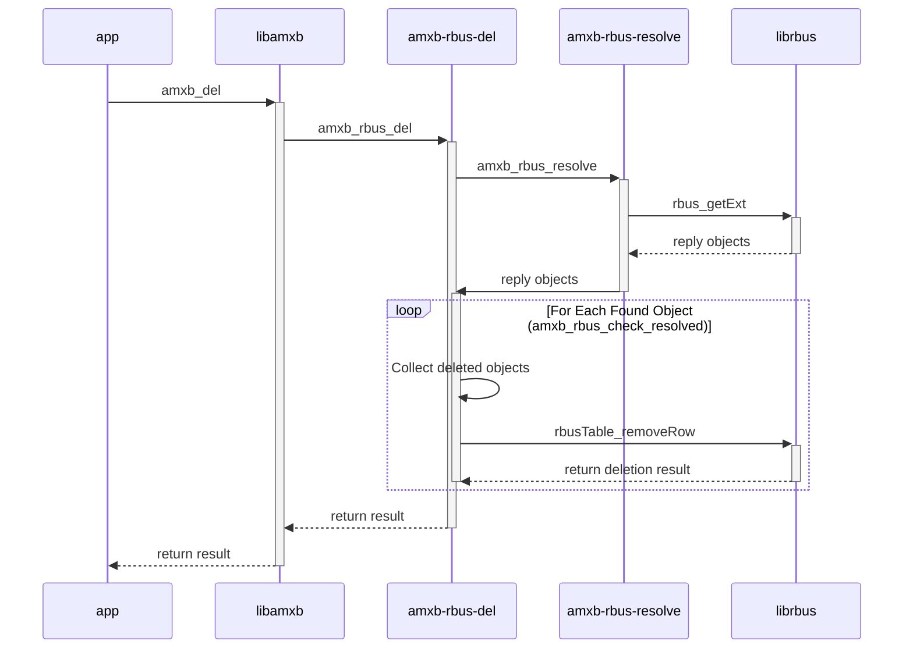
```mermaid
sequenceDiagram
    participant app
    participant libamxb
    participant amxb-rbus-del
    participant amxb-rbus-resolve
    participant librbus
    app->>+libamxb: amxb_del
    libamxb->>+amxb-rbus-del: amxb_rbus_del
    amxb-rbus-del->>+amxb-rbus-resolve: amxb_rbus_resolve
    amxb-rbus-resolve->>+librbus: rbus_getExt
    librbus-->>-amxb-rbus-resolve: reply objects
    amxb-rbus-resolve->>-amxb-rbus-del: reply objects
    activate amxb-rbus-del
    loop For Each Found Object (amxb_rbus_check_resolved)
        amxb-rbus-del->>amxb-rbus-del: Collect deleted objects
        amxb-rbus-del->>+librbus: rbusTable_removeRow
        librbus-->>-amxb-rbus-del: return deletion result
        deactivate amxb-rbus-del
    end
    amxb-rbus-del-->>-libamxb: return result
    libamxb-->>-app: return result
```

### CALL Requests (invoke method)

Data model objects can provide methods that can be invoked by any data model consumer. Amxbiorix bus-agnostic API (libaxmb) provides two methods that can invoke these methods:

- `amxb_call` - calls the data model method and blocks until reply is received or a timeout occurs.
- `amxb_async_call` - calls the data model method and continues. When reply is received, a callback functions is called, if it was provided.

Calling these functions will result in libamxb calling the corresponding back-end interface functions, for amxb-rbus backend these are:

- `amxb_rbus_invoke` - will call `rbusMethod_Invoke` and converts the returned data to ambiorix data structures.
- `amxb_rbus_async_invoke` - will start a thread and calls `rbusMethod_Invoke`, converts the the returned data to ambiorix data structures and calls the callback if one once provided.

The amxb-rbus backend implementation of these functions can be found in `src/amxb_rbus_invoke.c`.

#### Synchronous Calls

Synchronous calls are the easiest. When `amxb_call` is used it will call the amxb-rbus backend interface function `amxb_rbus_invoke` the will make sure that `rbusMethod_Invoke` is called with the correct argument.

The return values and out arguments are converted into amx data structures that can be used by the original caller.

The rbus API `rbusMethod_Invoke` will return when either the operation (method call) is done or it times-out.

The process (thread) calling `amxb_call` will be blocked until `amxb_call` returns.

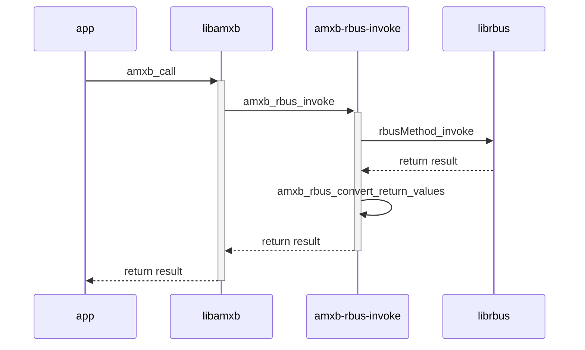
```mermaid
sequenceDiagram
    participant app
    participant libamxb
    participant amxb-rbus-invoke
    participant librbus
    app->>+libamxb: amxb_call
    libamxb->>+amxb-rbus-invoke: amxb_rbus_invoke
    amxb-rbus-invoke->>librbus: rbusMethod_invoke
    librbus-->>amxb-rbus-invoke: return result
    amxb-rbus-invoke->>amxb-rbus-invoke: amxb_rbus_convert_return_values
    amxb-rbus-invoke-->>-libamxb: return result
    libamxb-->>-app: return result
```

#### Asynchronous Calls

RBus provides an API to call RPC methods (data model methods) in an asynchronous way. The API is `rbusMethod_InvokeAsync`. It is possible to provide a callback function, which will be called when the RPC method is done, with the final result.

However there are some issues with this API function:
- It can not be stopped afterwards
- It is not possible to wait until it finishes at a later point.
- It is not possible to provide a context (user or private data), which will be passed to the callback function.

This API is not compatible with the ambiorix `amxb_async_call`. The ambiorix API returns a pointer which represents the asynchronous RPC request. When the caller wants to stop (cancel) the call or wants to wait until it has finished, libamxb provides two functions `amxb_close_request` and `amxb_wait_for_request`. The top level ambiorix functions will call the matching real implementation of the back-end, but in this case it is not possible using the RBus API.

To work around this issue a thread is started which will invoke the RPC method in a synchronous way, the thread by itself is blocking, the main thread will continue. The same mechanism with the RBus item queue is used to pass the result back to the main thread. Using the pthread functions `pthread_cancel` and `pthread_timedjoin_np` can be used to cancel the thread (which corresponds with canceling the asynchronous operations) and waiting with a time-out until the thread finishes.

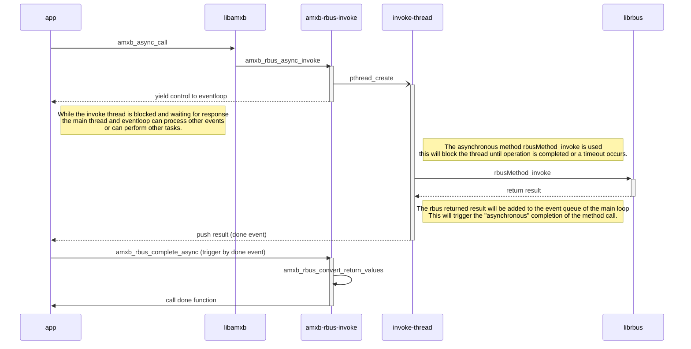
```mermaid
sequenceDiagram
    participant app
    participant libamxb
    participant amxb-rbus-invoke
    participant invoke-thread
    participant librbus
    app->>libamxb: amxb_async_call
    libamxb->>amxb-rbus-invoke: amxb_rbus_async_invoke
    activate amxb-rbus-invoke
    amxb-rbus-invoke-)+invoke-thread: pthread_create
    amxb-rbus-invoke-->>app: yield control to eventloop
    deactivate amxb-rbus-invoke
    note right of app: While the invoke thread is blocked and waiting for response<br>the main thread and eventloop can process other events<br>or can perform other tasks.
    note left of librbus: The asynchronous method rbusMethod_invoke is used<br>this will block the thread until operation is completed or a timeout occurs.
    invoke-thread->>+librbus: rbusMethod_invoke
    librbus-->>-invoke-thread: return result
    note left of librbus: The rbus returned result will be added to the event queue of the main loop<br>This will trigger the "asynchronous" completion of the method call.
    invoke-thread-->>-app: push result  (done event)
    app->>amxb-rbus-invoke: amxb_rbus_complete_async (trigger by done event)
    activate amxb-rbus-invoke
    amxb-rbus-invoke->>amxb-rbus-invoke: amxb_rbus_convert_return_values
    amxb-rbus-invoke->>app: call done function
    deactivate amxb-rbus-invoke
```

### GET INSTANCES

Any data model consumer can get the list of the existing rows (instance objects) from a table (multi-instance object). An ambiorix based data model consumer can fetch this list using the function `amxb_get_instances`. The `libamxb` adaptor implementation will call the back-end interface to request the list of the available row(s). The amxb-rbus back-end provides the function `amxb_rbus_get_instances` which will be called through `amxb_get_instances`.

USP requires that for each returned instance, the key parameters and their values is returned as well in the response. As RBus is not aware of key parameters no key parameters are added to the response, except for the 'Alias' parameter. The amxb-rbus back-end assumes when a parameter is found with the name `Alias` it is a key parameter. When both sides (data model consumer and data model provider) are ambiorix based implementations, the `use-amx-calls` run-time configuration option can be used to work-around this limitation.

An extra check is performed to check that the path for which the instances are requested is a table (multi-instance object). If the provided path is not a table anm error is returned. Sometimes RBus provides wrong information about the object type (due to incorrect implementation of the native Rbus data model provider) and amxb-rbus is returning an error while the path provided is be a table. To circumvent this issue the extra check can be skipped by setting the run-time option `skip-verify-type`. As a side effect of skipping this extra check, non-table paths will be accepted. To make sure that only instances are returned a check is done to see if the returned object path is ending with a numeric value (instance index). The end-result should be that only instances are returned.

The `amxb_rbus_get_instances` relies on the `amxb_rbus_resolve` implementation to get all the instances. As the `amxb_rbus_resolve` is returning to much information, it is filtered using method `amxb_rbus_filter_instances` which will remove all information that is not needed. There is no native RBus API that provides the functionality needed for this operation.

Example of get instances request using ba-cli:

```
root - * - [bus-cli] (0)
 > gi Device.Users.User.
Device.Users.User.1.
Device.Users.User.2.
Device.Users.User.3.
```

The implementation of get instances request in the ambiorix rbus backend is in `src/amxb_rbus_get_instances.c`.

The functions implemented are:

- `amxb_rbus_get_instances` - the backend interface called by amxb_get_instances.
- `amxb_rbus_filter_instances` - filters out all not instances and unwanted data.
- `amxb_rbus_is_table` - Checks if the provided path is referencing a multi-instance (table) object

```mermaid
sequenceDiagram
    participant app
    participant libamxb
    participant amxb-rbus-get-instances
    participant amxb-rbus-resolve
    participant librbus
    app->>+libamxb: amxb_get_instances
    libamxb->>+amxb-rbus-get-instances: amxb_rbus_get_instances
    alt amx calls available
      amxb-rbus-get-instances->>+librbus: rbusMethod_Invoke  "_get_instances"
      librbus-->>-amxb-rbus-get-instances: reply objects
    else
      amxb-rbus-get-instances->>+amxb-rbus-resolve: amxb_rbus_resolve
      amxb-rbus-resolve->>+librbus: rbus_getExt
      librbus-->>-amxb-rbus-resolve: reply objects
      amxb-rbus-resolve-->>-amxb-rbus-get-instances: reply objects
      activate amxb-rbus-get-instances
      loop For Each Found Object<br>(amxb_rbus_filter_instances)
        alt Is Not Instance
            amxb-rbus-get-instances->>amxb-rbus-get-instances: Remove Object From Response
        else
            amxb-rbus-get-instances->>amxb-rbus-get-instances: Remove Parameters From Response
        end
        deactivate amxb-rbus-get-instances
      end
    end
    amxb-rbus-get-instances-->>-libamxb: reply objects
    libamxb-->>-app: reply instances
```

### GET SUPPORTED

The Get Supported Data Model request is the only request that interacts with the supported data model, all others are interacting with the instantiated data model. RBus support to query the available data model elements (supported data model) is very limited, it can only list the path names of each element in the supported data model, no extra information is provided. 

As an ambiorix data model consumer must be able to get the supported data model (full or starting from a object path), it is not possible to use `amx-calls` here, as that would only work on ambiorix data model providers. The data model consumer side "get supported data model" is fully implemented using RBus APIs. Due to the limitations of RBus only the path names provided are correct, all other information added to the response by the amxb-rbus backend is not correct and is added by the back-end to complete the response.

The information added by the back-end is:
- parameter type is always of the string type, although this often not correct, no type information is provided by RBus on the supported data model.
- all parameters are indicated as read-write, although this is often not correct, no parameter access information is provided by RBus on the supported data model.
- all tables (multi-instance objects) will indicate that a consumer can add or delete instances, which is often not correct, no table access information is provided by RBus on the supported data model.
- no argument information is provided for commands (data model methods), as RBus doesn't provide that information on the supported data model. The back-end is not adding any information about the in and out arguments, it only makes sure that the returned data structure contains empty lists of the in and out arguments.

When querying the instantiated data model using RBus APIs like `rbusElementInfo_get` that information is provided by RBus, but for the "Get Supported Data Model" these API's can not be used. When the path names are registered to RBus but no instances exist for tables, no information about the data model element or any data model element underneath it in the hierarchy as nothing is found in the instantiated data model. As all available data model elements in the supported data model must be provided the API that returns more information regarding type and access can not be used in this case.

The amxb-rbus back-end guarantees that all data elements that are available in the "Supported Data Model" are returned, but doesn't guarantee that all information is correct.

To illustrate the differences between using RBus and uBus regarding the "get supported data model" request, please look at following output:

Example get supported data model using ba-cli over rbus:

```
root - rbus: - [bus-cli] (0)
 > gsdm -pl Device.SoftwareModules.ExecutionUnit.
MAD (Object      ) Device.SoftwareModules.ExecutionUnit.{i}.
.RW (cstring_t   ) Device.SoftwareModules.ExecutionUnit.{i}.VendorConfigList
.RW (cstring_t   ) Device.SoftwareModules.ExecutionUnit.{i}.MemoryInUse
.RW (cstring_t   ) Device.SoftwareModules.ExecutionUnit.{i}.RunLevel
.RW (cstring_t   ) Device.SoftwareModules.ExecutionUnit.{i}.AvailableMemory
.RW (cstring_t   ) Device.SoftwareModules.ExecutionUnit.{i}.AutoStart
.RW (cstring_t   ) Device.SoftwareModules.ExecutionUnit.{i}.ExecEnvLabel
.RW (cstring_t   ) Device.SoftwareModules.ExecutionUnit.{i}.ExecutionFaultMessage
.RW (cstring_t   ) Device.SoftwareModules.ExecutionUnit.{i}.VendorLogList
.RW (cstring_t   ) Device.SoftwareModules.ExecutionUnit.{i}.Status
.RW (cstring_t   ) Device.SoftwareModules.ExecutionUnit.{i}.AllocatedDiskSpace
.RW (cstring_t   ) Device.SoftwareModules.ExecutionUnit.{i}.ExecutionEnvRef
.RW (cstring_t   ) Device.SoftwareModules.ExecutionUnit.{i}.Name
.RW (cstring_t   ) Device.SoftwareModules.ExecutionUnit.{i}.AssociatedProcessList
.RW (cstring_t   ) Device.SoftwareModules.ExecutionUnit.{i}.ExecutionFaultCode
.RW (cstring_t   ) Device.SoftwareModules.ExecutionUnit.{i}.AvailableDiskSpace
.RW (cstring_t   ) Device.SoftwareModules.ExecutionUnit.{i}.Vendor
.RW (cstring_t   ) Device.SoftwareModules.ExecutionUnit.{i}.Description
.RW (cstring_t   ) Device.SoftwareModules.ExecutionUnit.{i}.AllocatedMemory
.RW (cstring_t   ) Device.SoftwareModules.ExecutionUnit.{i}.DiskSpaceInUse
.RW (cstring_t   ) Device.SoftwareModules.ExecutionUnit.{i}.AllocatedCPUPercent
.RW (cstring_t   ) Device.SoftwareModules.ExecutionUnit.{i}.EUID
.RW (cstring_t   ) Device.SoftwareModules.ExecutionUnit.{i}.References
.RW (cstring_t   ) Device.SoftwareModules.ExecutionUnit.{i}.Alias
.RW (cstring_t   ) Device.SoftwareModules.ExecutionUnit.{i}.Version
MAD (Object      ) Device.SoftwareModules.ExecutionUnit.{i}.EnvVariable.{i}.
... (Object      ) Device.SoftwareModules.ExecutionUnit.{i}.Extensions.
MAD (Object      ) Device.SoftwareModules.ExecutionUnit.{i}.HostObject.{i}.
... (Object      ) Device.SoftwareModules.ExecutionUnit.{i}.NetworkConfig.
```

The same using ba-cli over ubus:

```
root - ubus:/var/run/ubus/ubus.sock - [bus-cli] (0)
 > gsdm -pl SoftwareModules.ExecutionUnit.
MAD (Object      ) SoftwareModules.ExecutionUnit.{i}.
.R. (csv_string_t) SoftwareModules.ExecutionUnit.{i}.VendorConfigList
.R. (int32_t     ) SoftwareModules.ExecutionUnit.{i}.MemoryInUse
.RW (uint16_t    ) SoftwareModules.ExecutionUnit.{i}.RunLevel
.R. (int32_t     ) SoftwareModules.ExecutionUnit.{i}.AvailableMemory
.RW (bool        ) SoftwareModules.ExecutionUnit.{i}.AutoStart
.R. (cstring_t   ) SoftwareModules.ExecutionUnit.{i}.ExecEnvLabel
.R. (cstring_t   ) SoftwareModules.ExecutionUnit.{i}.ExecutionFaultMessage
.R. (csv_string_t) SoftwareModules.ExecutionUnit.{i}.VendorLogList
.R. (cstring_t   ) SoftwareModules.ExecutionUnit.{i}.Status
.R. (int32_t     ) SoftwareModules.ExecutionUnit.{i}.AllocatedDiskSpace
.R. (cstring_t   ) SoftwareModules.ExecutionUnit.{i}.ExecutionEnvRef
.R. (cstring_t   ) SoftwareModules.ExecutionUnit.{i}.Name
.R. (csv_string_t) SoftwareModules.ExecutionUnit.{i}.AssociatedProcessList
.R. (cstring_t   ) SoftwareModules.ExecutionUnit.{i}.ExecutionFaultCode
.R. (int32_t     ) SoftwareModules.ExecutionUnit.{i}.AvailableDiskSpace
.R. (cstring_t   ) SoftwareModules.ExecutionUnit.{i}.Vendor
.R. (cstring_t   ) SoftwareModules.ExecutionUnit.{i}.Description
.R. (int32_t     ) SoftwareModules.ExecutionUnit.{i}.AllocatedMemory
.R. (int32_t     ) SoftwareModules.ExecutionUnit.{i}.DiskSpaceInUse
.R. (int32_t     ) SoftwareModules.ExecutionUnit.{i}.AllocatedCPUPercent
.R. (cstring_t   ) SoftwareModules.ExecutionUnit.{i}.EUID
.R. (csv_string_t) SoftwareModules.ExecutionUnit.{i}.References
.R. (cstring_t   ) SoftwareModules.ExecutionUnit.{i}.Alias
.R. (cstring_t   ) SoftwareModules.ExecutionUnit.{i}.Version
M.. (Object      ) SoftwareModules.ExecutionUnit.{i}.EnvVariable.{i}.
... (Object      ) SoftwareModules.ExecutionUnit.{i}.Extensions.
M.. (Object      ) SoftwareModules.ExecutionUnit.{i}.HostObject.{i}.
... (Object      ) SoftwareModules.ExecutionUnit.{i}.NetworkConfig.
```

Example get supported data model using ba-cli on RBus native object:

```
root - * - [bus-cli] (0)
 > gsdm -pl Device.IP.Interface.
MAD (Object      ) Device.IP.Interface.{i}.
.RW (cstring_t   ) Device.IP.Interface.{i}.Enable
.RW (cstring_t   ) Device.IP.Interface.{i}.Status
.RW (cstring_t   ) Device.IP.Interface.{i}.Alias
.RW (cstring_t   ) Device.IP.Interface.{i}.Name
.RW (cstring_t   ) Device.IP.Interface.{i}.LastChange
.RW (cstring_t   ) Device.IP.Interface.{i}.LowerLayers
.RW (cstring_t   ) Device.IP.Interface.{i}.Router
.RW (cstring_t   ) Device.IP.Interface.{i}.Reset
.RW (cstring_t   ) Device.IP.Interface.{i}.MaxMTUSize
.RW (cstring_t   ) Device.IP.Interface.{i}.Type
.RW (cstring_t   ) Device.IP.Interface.{i}.Loopback
.RW (cstring_t   ) Device.IP.Interface.{i}.IPv4AddressNumberOfEntries
.RW (cstring_t   ) Device.IP.Interface.{i}.AutoIPEnable
.RW (cstring_t   ) Device.IP.Interface.{i}.IPv4Enable
.RW (cstring_t   ) Device.IP.Interface.{i}.IPv6Enable
.RW (cstring_t   ) Device.IP.Interface.{i}.ULAEnable
.RW (cstring_t   ) Device.IP.Interface.{i}.IPv6AddressNumberOfEntries
.RW (cstring_t   ) Device.IP.Interface.{i}.IPv6PrefixNumberOfEntries
.RW (cstring_t   ) Device.IP.Interface.{i}.X_CISCO_COM_TTL
.RW (cstring_t   ) Device.IP.Interface.{i}.X_CISCO_COM_ARPCacheTimeout
.RW (cstring_t   ) Device.IP.Interface.{i}.X_CISCO_COM_UPnPIGDEnabled
.RW (cstring_t   ) Device.IP.Interface.{i}.X_CISCO_COM_IPv6_IANA_IAID
.RW (cstring_t   ) Device.IP.Interface.{i}.X_CISCO_COM_IPv6_IANA_T1
.RW (cstring_t   ) Device.IP.Interface.{i}.X_CISCO_COM_IPv6_IANA_T2
.RW (cstring_t   ) Device.IP.Interface.{i}.X_CISCO_COM_IPv6_IAPD_IAID
.RW (cstring_t   ) Device.IP.Interface.{i}.X_CISCO_COM_IPv6_IAPD_T1
.RW (cstring_t   ) Device.IP.Interface.{i}.X_CISCO_COM_IPv6_IAPD_T2
MAD (Object      ) Device.IP.Interface.{i}.IPv4Address.{i}.
MAD (Object      ) Device.IP.Interface.{i}.IPv6Address.{i}.
MAD (Object      ) Device.IP.Interface.{i}.IPv6Prefix.{i}.
... (Object      ) Device.IP.Interface.{i}.Stats.
```

To get the supported data model starting from a path name, multiple calls to RBus are needed:

1. `rbus_discoverWildcardDestinations` - get the list of all data model providers that can provide the path name
1. `rbus_discoverComponentDataElements` - get the list of the data model elements that are provided by a provider.

When the list of data model elements is fetched from each provider that can provider this path name, the "Get Supported Data Model" structure is build, by filtering out unneeded elements and adding missing information. 

The implementation of get instances request in the ambiorix rbus backend is in `src/amxb_rbus_get_supported_dm.c`.

The functions implemented are:

- `amxb_rbus_gsdm` - the backend interface called by amxb_get_supported.
- `amxb_rbus_find_providers` - Fetches the list of all providers that can provide the given path.
- `amxb_rbus_get_data_elements` - Fetches the data elements provided by a provider.
- `amxb_rbus_add_data_elements` - Filters out unneeded data elements and add others to the data element set that will be returned.
- `amxb_rbus_add_object` - Fill the data model element that will be added to the returned set.
- `amxb_rbus_add_element` - Utility function that adds missing data.
- `amxb_rbus_get_element_type` - Utility function to identify the element type (parameter, event or command).

In the below sequence diagram the utility functions that completes the information for each data element are not explicitly mentioned. These methods are called directly or indirectly by the method `amxb_rbus_add_object`

```mermaid
sequenceDiagram
    participant app
    participant libamxb
    participant amxb-rbus-get-supported-dm
    participant librbus
    app->>+libamxb: amxb_get_supported
    libamxb->>+amxb-rbus-get-supported-dm: amxb_rbus_gsdm
    amxb-rbus-get-supported-dm->>+librbus: rbus_discoverWildcardDestinations
    librbus-->>-amxb-rbus-get-supported-dm: provider list
    loop For Each Provider<br>(amxb_rbus_get_data_elements)
        amxb-rbus-get-supported-dm->>+librbus: rbus_discoverComponentDataElements
        librbus-->>-amxb-rbus-get-supported-dm: data element list
        loop For Each Data Element<br>(amxb_rbus_add_data_elements)
            amxb-rbus-get-supported-dm->>amxb-rbus-get-supported-dm: amxb_rbus_add_object<br>Adds an object to the set that will be returned.
        end
    end
    amxb-rbus-get-supported-dm-->>-libamxb: return supported dm elements
    libamxb-->>-app: return supported dm elements
```

### Subscriptions and Events

Data model events are very important for ambiorix data model consumers. The ambiorix framework is mainly event-driven, this avoids the need to continuously polling for changes, deletions or additions in the data model. To avoid that to many events are transmitted, causing to many events, each consumer (ambiorix based or RBus native) must subscribe for specific events on specific parts of the data model.

Ambiorix data model consumers that subscribe for specific events can additionally provide an event filter. When subscribing for events the data model consumer must provide a callback function. When an event filter is provided the callback will only be called when the received event is matching the filter.

To subscribe for events the amxb-rbus back-end uses the RBus API. Reading and dispatching the events to the correct callbacks is managed by RBus itself. Filtering the events and check that the event must be passed to the application/service that created the event subscription, is done by the ambiorix framework in the [signal/slot](https://gitlab.com/prpl-foundation/components/ambiorix/libraries/libamxp/-/blob/main/doc/signal_slot.md) functionality.

A data model consumer should also unsubscribe for the events when they are not needed anymore.

RBus will send some default events related to data model changes:

- RBUS_EVENT_OBJECT_CREATED - when a data model consumer added an instance
- RBUS_EVENT_OBJECT_DELETED - when a data model consumer deleted an instance
- RBUS_EVENT_VALUE_CHANGED - when a data model consumer changed a value.

The disadvantage of the RBus provided events is that RBus will not send these events if the data model provider itself is changing a value or adding/removing instances.

An ambiorix data model provider will send a separate event when he changes the data model itself: `amx_notify!` event. 
The ambiorix data model provider event will also contain more information then the standard RBus data model events. The amxb-rbus back-end will always first try to subscribe on the `amx_notify!` event, if that fails it will try to open a subscription on the object path provided.

The amxb-rbus back-end will use the RBus API methods `rbusEvent_Subscribe` and `rbusEvent_Unsubscribe` to subscribe and unsubscribe for events.

Subscribe for events, unsubscribing and event handling is implemented in `src/amxb_rbus_subscribe.c`.

The functions implemented are:

- `amxb_rbus_subscribe` - subscribe for events on an object path.
- `amxb_rbus_unsubscribe` - unsubscribe from an object path.
- `amxb_rbus_event_handler` - the callback function passed to RBus. RBus will call this function when an event is received. This function uses `amxp_sigmngr_emit_signal` to filter the events and when needed call the callback functions of the application

The following sequence diagram shows the main flow of the subscribe and unsubscribe implementation

```mermaid
sequenceDiagram
    participant app
    participant libamxb
    participant amxb-rbus-subscribe
    participant librbus
    app->>+libamxb: amxb_(un)subscribe
    libamxb->>+amxb-rbus-subscribe: amxb_rbus_(un)subscribe
    amxb-rbus-subscribe->>+librbus: rbusEvent_(Un)Subscribe
    librbus-->-amxb-rbus-subscribe: status
    amxb-rbus-subscribe-->>-libamxb: status
    libamxb-->>-app: return supported dm elements
```

The following sequence diagram shows the main flow when an event is received

```mermaid
sequenceDiagram
    participant app
    participant amxb-rbus-subscribe
    participant librbus
    librbus->>+amxb-rbus-subscribe: amxb_rbus_event_handler
    amxb-rbus-subscribe-->>app: dispatch events
    note left of app: Event dispatching is done by the eventloop<br>The signal/slot functionality is used.<br>Thread context switches can happen here.
    amxb-rbus-subscribe-->>-librbus: done
```

### Ambiorix Specific - Data Model Discovery And Introspection

##### Describe

An ambiorix data model provider can do deep data model introspection. The describe method works on a single object and will return the full object definition and must work on ambiorix data model providers or native RBus data model providers. This functionality is mainly available for debugging and introspection, sometimes it is used in operational code to take correct branches in the code depending on the type of objects or parameters.

Tools like `dmtui` are using the information provided by the describe every extensively to be able to validate input. Using `ba-cli` it is possible to fetch the full description of an object using the command `dump`.

When the run-time configuration option `use-amx-calls` is enabled for the data model consumer and the object for which the full description is requested is provided by an ambiorix data model provider for which the `use-amx-calls` is enabled as well, the amxb-rbus back-end will use the ambiorix protected data model method `_describe` to fetch the information. 

The caller of `amxb_describe` can provide in the flags (bitmap) which information about the object path must be returned.

For native RBus data model providers (or when `use-amx-calls` is disabled) the object information is fetched using the RBus API call `rbusElementInfo_get`. RBus provides less detailed information then the ambiorix data model. When the RBus API is used to do the deep introspection following information will not be available as it is not available in the RBus response:

- if a parameter is a (unique or mutable) key parameter.
- if a parameter is boot persistent,
- if a parameter is an instance counter.
- Information about input and output arguments of data model methods (aka commands).
- Parameter constrains information (not all ambiorix data model providers return this information when using `amx-calls` either, this is dependant on the implementation).
- Information if a data model method is operating asynchronously (provide the result later).
- Information about arguments provided in events (not all ambiorix data model providers return this information, this is dependant on the implementation).

The following example using ba-cli shows the differences when using `amx-calls` or native RBus API. This example uses tool `ba-cli` and the ambiorix example data model provider `Greeter`.

Output using `amx-calls`
```
vagrant - * - [bus-cli] (0)
 > dump -pfe Greeter.History.1.
PR...... <public>       instance Greeter.History.1.
PR...... <public>         string Greeter.History.1.Message=Welcome to the Greeter App
                                     check_maximum_length 256
P....... <public>           bool Greeter.History.1.Retain=true
PR...... <public>         string Greeter.History.1.From=odl parser
                                     check_maximum_length 64
.R...C.. <public>         uint32 Greeter.History.1.NumberOfInfoEntries=0
........ <public>     multi-inst Greeter.History.1.Info.
```

Output using native RBus API
```
vagrant - * - [bus-cli] (0)
 > dump -pfe Greeter.History.1.     
........ <public>       instance Greeter.History.1.
.R...... <public>         string Greeter.History.1.Message=Welcome to the Greeter App
........ <public>           bool Greeter.History.1.Retain=true
.R...... <public>         string Greeter.History.1.From=odl parser
.R...... <public>         uint32 Greeter.History.1.NumberOfInfoEntries=0
........ <public>     multi-inst Greeter.History.1.Info.
```

The describe functionality is implemented in the amxb-rbus back-end in the file `src/amxb_rbus_describe.c`. The describe method doesn't accept search or wildcard paths.

The functions implemented are:

- `amxb_rbus_describe` - the backend interface called by amxb_describe.
- `amxb_rbus_call_describe` - Used to fetch the information when `use-amx-calls` is set and the data model provider accesses is an ambiorix data model. Invokes the protected ambiorix data model method `_describe`
- `amxb_rbus_collect_info` - The main function when using RBus API `rbusElementInfo_get`. This function fetches information about the available data model elements for the given object path and builds the ambiorix required `amxc_var_t` structures that will be returned to the caller. 
- `amxb_rbus_add_object_info` - Adds object information to the data structure that will be returned to the caller. Is used by `amxb_rbus_collect_info`.
- `amxb_rbus_add_event` - Adds event information to the data structure that will be returned to the caller. Is used by `amxb_rbus_collect_info`.
- `amxb_rbus_add_method` - Adds data model method (aka command) to the data structure that will be returned to the caller. Is used by `amxb_rbus_collect_info`.
- `amxb_rbus_add_parameter` - Adds parameter information to the data structure that will be returned to he caller. Is used by `amxb_rbus_collect_info`.
- `amxb_rbus_add_object_name` - Extracts the object name from the RBus information. Is used by `amxb_rbus_add_object_info`.
- `amxb_rbus_get_row_info` - Extracts row (instance) information from the RBus information. Is used by `amxb_rbus_add_object_info`.
- `amxb_rbus_add_sub_name` - Extract the name of the sub-object or the index of an row. Is used by `amxb_rbus_add_object_info`.

Most of these functions are used to build an ambiorix compatible data structure from the Rbus provided information.

The following sequence diagram is simplified, all functions called by `amxb_rbus_collect_info` to add the different data model elements are not added to the sequence diagram.

```mermaid
sequenceDiagram
    participant app
    participant libamxb
    participant amxb-rbus-describe
    participant librbus
    app->>+libamxb: amxb_describe
    libamxb->>+amxb-rbus-describe: amxb_rbus_describe
    alt Can use amx calls?
        amxb-rbus-describe->>amxb-rbus-describe: amxb_rbus_call_describe
        amxb-rbus-describe->>+librbus: rbusMethod_Invoke (_describe)
        librbus-->>-amxb-rbus-describe: return object information
    else
        amxb-rbus-describe->>amxb-rbus-describe: amxb_rbus_collect_info
        amxb-rbus-describe->>+librbus: rbusElementInfo_get
        librbus-->>-amxb-rbus-describe: return element info
        loop For each data model element
            amxb-rbus-describe->>amxb-rbus-describe: extract information<br>(uses one of the element specific functions)
        end
    end
    amxb-rbus-describe-->>-libamxb: return object information
    libamxb-->>-app: return object information
```

##### List

An ambiorix data model consumer can query the list of all available data elements available in an object path. This is the only operation on the data model that can be performed with an empty path (or NULL string). 
The amxb-rbus back-end must be able to provide the list of all available data elements under the given path, this includes parameter names, event names, command names and instances or sub-object names.

When the given path is an empty path (or NULL) the back-end must provide a list of all "root" objects, that are objects without a parent. This is known as level 0 of the data model. When the root is queried all flags can be ignored and only the names of the root objects may be returned.

The list functionality is the back-end function that makes autocompletion work in ba-cli.

When querying the root objects available on rbus, it is needed to first fetch all registered components and from each component the elements it provides at level 0. To achieve that the amxb-rbus backend will first call the RBus API function `rbus_discoverRegisteredComponents`, filter out all INBOX components from the reply and on the remaining components on the list call the RBus API function `rbus_discoverComponentDataElements`. This is implemented in the amxb-rbus backend function `amxb_rbus_list_collect_root` and `amxb_rbus_get_component_elements`.

When querying non-root data model objects, it is a bit simpler. The data elements under a certain path are fetched using the RBus API function `rbusElementInfo_get`, using the list of returned elements it gets filtered according to the specified flags. Fetching the elements and filtering them is implemented in amxb-rbus backend function `amxb_rbus_list_collect`.

The implementation of list request in the ambiorix rbus backend is in `src/amxb_rbus_list.c`.

The functions implemented are:

- `amxb_rbus_list` - the backend interface called by amxb_list.
- `amxb_rbus_list_collect` - Fetches the data elements available under a certain path.
- `amxb_rbus_list_collect_root` - Fetches the objects available in the root (level 0) of the data model.
- `amxb_rbus_get_component_elements` - Fetches the elements provided by a component.

```mermaid
sequenceDiagram
    participant app
    participant libamxb
    participant amxb-rbus-list
    participant librbus
    app->>+libamxb: amxb_list
    libamxb->>+amxb-rbus-list: amxb_rbus_list
    alt Empty path or NULL
        amxb-rbus-list->>librbus: rbus_discoverRegisteredComponents
        librbus-->>amxb-rbus-list: return list of components
        loop For each component<br>(amxb_rbus_list_collect_root)
            amxb-rbus-list->>librbus: rbus_discoverComponentDataElements
            librbus-->>amxb-rbus-list: return list of elements
            loop For each element<br>(amxb_rbus_get_component_elements)
                amxb-rbus-list->>amxb-rbus-list: add to list of data elements
            end
        end
    else
        amxb-rbus-list->>librbus: rbusElementInfo_get
        librbus-->>amxb-rbus-list: return list of elements
        loop For each element<br>(amxb_rbus_list_collect)
            amxb-rbus-list->>amxb-rbus-list: add to list of data elements
        end
    end
    amxb-rbus-list-->>-libamxb: return list of elements
    libamxb-->>-app: return list of elements 
```

##### Has

As an ambiorix data model consumer can be connected to multiple bus systems at any point in time, it must be possible to find the connection that can provide an certain object. The abstraction library (libamxb) provides a function that returns a connection context that can provide a object path or NULL if no connection context can provide that object. To be able to achieve this the abstraction layer is depending on the back-ends. When a back-end provides a `has` function the abstraction layer will use that, otherwise it uses a simple `get`. Often a back-end can implement this kind of look-up mechanism in a more efficient manner than just relying on a full object get method.

The amxb-rbus back-end provides an implementation for the `has` back-end interface: `amb_rbus_has`. 

The implementation uses the RBus API `rbusElementInfo_get` to check with the bus daemon (rtrouted) if the object is known to the bus system. This eliminates a full end-to-end message exchange from the data model consumer to the data model provider.

The implementation of lookup request in the ambiorix rbus backend is in `src/amxb_rbus_has.c`.

The functions implemented are:

- `amxb_rbus_capabilites` - Informs the abstraction layer about which lookup mechanisms can be used with this back-end
- `amxb_rbus_has` - verifies if the given object path can be reached using the given connection of this back-end.

```mermaid
sequenceDiagram
    participant app
    participant libamxb
    participant amxb-rbus-has
    participant librbus
    app->>+libamxb: amxb_be_who_has
    libamxb->>+amxb-rbus-has: amxb_rbus_has
    amxb-rbus-has->>+librbus: rbusElementInfo_get
    librbus-->>amxb-rbus-has: reply
    amxb-rbus-has-->>-libamxb: true when available<br>false when not available
    libamxb-->>-app: true or false
```

##### Wait For

Often an application/service is depending on information that can be fetched from an other application or service. It is possible that the other application is not yet started or didn't already registered its data model. If the information is required but not yet available, the process can wait until the data model is published and available.

The libamxb abstraction layer provides a method `amxb_wait_for_object` which can be used for this purpose. It will when the object is available emit a signal when all required objects are available.

The abstraction layer will call the back-end interface function `wait_for` on all available back-ends. It is up to each back-end to announce that the object is available using one of its open connections.

The amxb-rbus back-end provides the function `amxb_rbus_wait_for` to will just do that. As RBus itself has no mechanism to get an event when objects become available, the amxb-rbus backend starts an interval timer that will check at regular intervals if the objects is registered to RBus. The timer will be stopped, if another back-end reports the object as available, or the object is available on the RBus connection.

When the object is found on the RBus connection, the back-end will emit a signal. 

To check if the object is available the RBus API function `rbusElementInfo_get` is used, each time the interval timer expires.

The implementation of wait_for function in the ambiorix rbus backend is in `src/amxb_rbus_wait_for.c`.

The functions implemented are:

- `amxb_rbus_wait_for` - Called by the abstraction layer (libamxb) when the application requires an object that is not yet available.
- `amxb_rbus_wait_for_done` - Slot function, is called whenever all required objects are available, can be caused by other back-ends.
- `amxb_rbus_check_objects` - Timer function, called at regular intervals and check if any of the required objects are available on RBus.

```mermaid
sequenceDiagram
    participant app
    participant libamxb
    participant amxb-rbus-wait-for
    participant librbus
    app->>+libamxb: amxb_wait_for_object
    libamxb->>+amxb-rbus-wait-for: amxb_rbus_wait_for
    amxb-rbus-wait-for->>amxb-rbus-wait-for: Create and start timer
    amxb-rbus-wait-for-->>-libamxb: monitor started
    libamxb-->>-app: monitor started
    note left of app: Each time the timer expires<br>the eventloop of the application<br>will call the timer function
    app->>+amxb-rbus-wait-for: amxb_rbus_check_objects
    loop For each required object
        amxb-rbus-wait-for->>+librbus: rbusElementInfo_get
        librbus-->>-amxb-rbus-wait-for: data element or NULL
        alt If available (not NULL)
            amxb-rbus-wait-for--)app: emit signal
        end
    end
    amxb-rbus-wait-for-->>-app: check done
    note left of app: If all required objects<br>are available stop the monitoring
    app-)amxb-rbus-wait-for: signal wait:done or wait:cancel
    activate amxb-rbus-wait-for
    amxb-rbus-wait-for->>amxb-rbus-wait-for: Stop and delete timer
    deactivate amxb-rbus-wait-for
```

## Miscellaneous and utility functions

A set of implementation file contain utility functions. These functions can be used by multiple parts of the back-end implementation. These functions are grouped in source files and grouped together in logical groups.
Most of these functions are used for translation and conversion between amxbiorix and rbus.

The following files provide these functions:

- `src/amxb_rbus_to_robject.c` - translates and converts rbus data structures (rbusValue_t, rbusObject_t) into ambiorix variants (amxc_var_t).
- `src/amxb_rbus_to_var.c` - translates and converts amxbiorix variants (amxc_var_t) into rbus data structures (rbusValue_t, rbusObject_t).
- `src/amxb_rbus_translate.c` - converts ambiorix data model engine error codes to rbus error codes and visa versa. This file also contains object path translation functions (more details, see below).
- `src/amxb_rbus_utils.c` - contains a set of functions to are needed in multiple parts of the implementation, like `amxb_rbus_common_handler`, `amxb_rbus_open_transaction`, `amxb_rbus_get_transaction`, `amxb_rbus_close_transaction`, ...
- `src/amxb_rbus_timeouts.c` - helps in changing the default rbus timeout behavior.

### Translating Object Paths

Ambiorix data model providers don't provide the "Device." root object. The reason for this is that not all bus systems can cope with multiple providers providing the same object. To avoid this problem they don't start their data model part with "Device." even if it is providing a TR-181 compatible data model.

As RBus can handle this correctly it would be nice that the "Device." object is prefixed to the standard data model parts. The amxb-rbus back-end provides functionality to make this possible. In the run-time config section of such a data model provider, a config option can be provided that translates the internally object names into another object path.

Example:<br>
The LCM application `timingila` provides the "SoftwareModules" object and all of its sub-objects, parameters, events and functions. Using the config option `rbus.translate` it is possible to configure that amxb-rbus back-end that it will register "SoftwareModules." as "Device.SoftwareModules.". All incoming request for "Device.SoftwareModules." will be executed on "SoftwareModules.", for all outgoing responses "SoftwareModules." will be translated to "Device.SoftwareModules".

Depending on the response or request an other translation function will be used, all these object path translation functions are implemented in `src/amxb_rbus_translate.c`. Object paths for which no translation is found are used as is. Using the translation functionality it is also possible to expose the objects with another name as well. It is possible to expose the object "IPDiagnostics." as "Device.IP.Diagnostics.".

## Open Topics & Issues

### 01 - Memory Leak 

A memory leak is found in the rbus code @ https://github.com/rdkcentral/rbus/blob/b72b95bc140394514ec138a278e85181c19c5240/src/rbus/rbus.c#L5838

Out params are allocated using rbusObject_Init but is is never released. This happens when a NULL pointer is passed to the function `rbusMethod_SendAsyncResponse` , according to the documentation it is valid to do so.
The documentation states that the caller is responsible for releasing the out_params, but as it is allocated within the function the caller can not release it. Current work=around: always allocate and initialize the out_params even when it is not needed, so it can be passed as a not NULL pointer and release it afterwards. When passing a not NULL pointer the function will not allocate it by itself.

This is the implementation, annotations added in comments
```C
rbusError_t rbusMethod_SendAsyncResponse(
    rbusMethodAsyncHandle_t asyncHandle,
    rbusError_t error,
    rbusObject_t outParams)
{
    rbusMessage response;

    VERIFY_NULL(asyncHandle);
    rbusValue_t value1, value2;

    rbusValue_Init(&value1);
    rbusValue_Init(&value2);

    rbusMessage_Init(&response);
    rbusMessage_SetInt32(response, error);
    if ((error != RBUS_ERROR_SUCCESS) && (outParams == NULL)) // Check is done if outParams is NULL
    {
        // Assume error != RBUS_ERROR_SUCCESS and outParams == NULL
        rbusObject_Init(&outParams, NULL); // <= Allocates memory for outParams
        rbusValue_SetInt32(value1, error);
        rbusValue_SetString(value2, rbusError_ToString(error));
        rbusObject_SetValue(outParams, "error_code", value1);
        rbusObject_SetValue(outParams, "error_string", value2);
    }
    rbusObject_appendToMessage(outParams, response);
    rbus_sendResponse(&asyncHandle->hdr, response);
    rbusValue_Release(value1);
    rbusValue_Release(value2);
    free(asyncHandle);
    // No release done for outParams. For the caller outParams is still NULL, so the caller can not 
    // release the memory !!!!! 
    return RBUS_ERROR_SUCCESS;

    // No memory leak when:
    // error == RBUS_ERROR_SUCCESS
    // outParams != NULL
}
```

**RDKM Ticket**: https://jira.rdkcentral.com/jira/browse/RDKBSUP-1481

**RDKM Response**:  The API documentation says the outParams should be initialized but it can be NULL.  Which means the outParams needs to be initialized and can have value zero. Not like we can pass NULL as a 3rd argument to this function.

**Follow-Up Question**: If it is not possible to pass NULL as a 3rd argument then why is the following check in the code:
```
    if ((error != RBUS_ERROR_SUCCESS) && (outParams == NULL))
```
According to this it is possible to pass in a NULL as 3rd argument and when done it is handled in a different way. 
The condition to trigger the memory leak is:
1. Pass as 2nd argument an error code which is not `RBUS_ERROR_SUCCESS`
2. Pass as 3rd argument a NULL.

### 02 - Usage of Uninitialsed Memory

Once in a while valgrind reports this `warning`
```
==2984426== Thread 3:
==2984426== Syscall param sendmsg(msg.msg_iov[1]) points to uninitialised byte(s)
==2984426==    at 0x498BF3D: __libc_sendmsg (sendmsg.c:28)
==2984426==    by 0x498BF3D: sendmsg (sendmsg.c:25)
==2984426==    by 0x51085FB: rtConnection_SendInternal.constprop.0 (in /usr/local/lib/librtMessage.so.2.0.5)
==2984426==    by 0x51099CE: rtConnection_SendBinaryResponse (in /usr/local/lib/librtMessage.so.2.0.5)
==2984426==    by 0x50F775B: rbus_sendResponse (in /usr/local/lib/librbuscore.so.2.0.5)
==2984426==    by 0x50F903B: dispatch_method_call (in /usr/local/lib/librbuscore.so.2.0.5)
==2984426==    by 0x50F90F6: onMessage (in /usr/local/lib/librbuscore.so.2.0.5)
==2984426==    by 0x5107F62: rtConnection_CallbackThread (in /usr/local/lib/librtMessage.so.2.0.5)
==2984426==    by 0x4B67EA6: start_thread (pthread_create.c:477)
==2984426==    by 0x498AA2E: clone (clone.S:95)
==2984426==  Address 0x6620de9 is 201 bytes inside a block of size 8,192 alloc'd
==2984426==    at 0x48386AF: malloc (vg_replace_malloc.c:306)
==2984426==    by 0x483ADE7: realloc (vg_replace_malloc.c:834)
==2984426==    by 0x50FA05B: msgpack_sbuffer_write (in /usr/local/lib/librbuscore.so.2.0.5)
==2984426==    by 0x50FA936: rbusMessage_SetInt32 (in /usr/local/lib/librbuscore.so.2.0.5)
==2984426==    by 0x50CD8ED: _callback_handler (in /usr/local/lib/librbus.so.2.0.5)
==2984426==    by 0x50F9022: dispatch_method_call (in /usr/local/lib/librbuscore.so.2.0.5)
==2984426==    by 0x50F90F6: onMessage (in /usr/local/lib/librbuscore.so.2.0.5)
==2984426==    by 0x5107F62: rtConnection_CallbackThread (in /usr/local/lib/librtMessage.so.2.0.5)
==2984426==    by 0x4B67EA6: start_thread (pthread_create.c:477)
==2984426==    by 0x498AA2E: clone (clone.S:95)
==2984426== 
```

The given warning is mostly harmless, but if the unititialized memory is used in expressions (like if, while, ...) it could lead to random behavior.

**NOTE**: not observed anymore.

### 03 - RBus Set on multiple parameters

Using the rbus function `rbus_set` in sequence it is possible to change multiple values at once, when setting the commit flag for all of them to false and only to true on the last `rbus_set`. It is the resposibiliy of the caller that:

- A correct session id is provided.
- The last set of a session sets the commit.

If no session id is provided, but the commit flag is set to false, the ambiorix rbus backend will just add to parameters to a single transaction, when the set is received that contains the commit flag to true, all of them will be applied. So it is possible if no session id is provided by the caller all parameters end up in the same transaction on ambiorix side, this may not be the intention.

If the commit flag is never set to true, the transaction is never closed. The ambiorix rbus backend will keep the transaction until the commit is received.

**NOTE**: ambiorix-rbus backend is now using rbus_setMulti instead of rbus_set with session id.

### 04 - RBus set on multiple providers

Some unexpected behavior is noticed when using `rbus_set` in sequence (with commit flag) or `rbus_setMulti` to set multiple parameters provided by different providers. If an invalid value is provided for one of the parameters, the ambiorix rbus backend will do a rollback of the created transaction for the data model provider it is running in and returns an error back to the rbus daemon. 

The unexpected behaviour here is that it seems that the rbus daemon is ignoring this error and commits the values of the other providers. In that regard the `rbus_setMulti` or `rbus_set` multiple times act as `allow-partial` is set as specified in the USP specification. 

The end result is that all parameters for the failing provider are not set, all parameters for the other providers are set. 

The main issues is that the caller (data model consumer) is not informed of any failure to set the value(s), so it seems that the `rbus_setMulti` call was successfull.

The question is: Is this the inteded behavior or not?

This behavior can not be changed in the ambiorix rbus back-end itself. 

**RDKM Ticket**: https://jira.rdkcentral.com/jira/browse/RDKBSUP-1487

### 05 - Not possible to call methods on tables

When methods are registered on tables (multi-instance) object, it will not be possible to call these methods on the table itself, they can only be called on rows (instance objects) or sngleton objects. 

For the internal ambiorix method `_add` this is an issue, as it should be called on the table itself, so it can add a new row.

The functions `amxb_rbus_invoke` and `amxb_rbus_async_invoke` are able to detect that the call is done on a table, if that is the case the object one-level up in the hierarchy is used, and the `rel_path` argument is set. If the method called is not one of the internal methods the call is transformed into `_exec` which takes the `rel_path` and `method` as arguments. RBus doesn't allow or support that data model methods are callen on tables.

**NOTE**: Is a nice to have, but not a real issue.

### 06 - Not possible to provide parameter values with `rbusTable_addRow`

In the rbus api documentation is stated clearly (quote from the documentation):

> Any additional properties on the row must be updated separately using set operations.

In most cases this is not a real issue, it can be an issue for ambiorix multi-instance objects (tables) that have key parameters defined. The key parameters can be unique keys where each idividual value must be unique within that table or can be a comnbined key where the combination of the values must be unique within the table. Typically key parameters are write-once and can only be set during creation. 

Creating a row and then setting the parameters will not work for these tables (multi-instance objects). A possible work-around is to define the key parameters as "mutable" so that they can be changed afterwards.

Keep in mind that creating two instances (rows) after each other without setting these key parameters will end-up in a duplicate instance (row). The second row creation will fail beacuse of this.

### 07 - Timeouts for blocking requests

All blocking calls in libamxb have a timeout argument (amxb_get, amxb_set, amxb_add, amxb_del, ...).

RBus has internal timeouts for blocking calls. The API and data structure to get these timeouts are defined in the file: `rbus_config.h`. The timeouts are defined hardcoded in the file `rbus_config.c`

```C
#define RBUS_TMP_DIRECTORY      "/tmp"      /*temp directory where persistent data can be stored*/
#define RBUS_SUBSCRIBE_TIMEOUT   600000     /*subscribe retry timeout in miliseconds*/
#define RBUS_SUBSCRIBE_MAXWAIT   60000      /*subscribe retry max wait between retries in miliseconds*/
#define RBUS_VALUECHANGE_PERIOD  2000       /*polling period for valuechange detector*/
#define RBUS_GET_DEFAULT_TIMEOUT 15000      /* default timeout in miliseconds for GET API */
#define RBUS_SET_DEFAULT_TIMEOUT 15000      /* default timeout in miliseconds for SET API */
#define RBUS_GET_TIMEOUT_OVERRIDE "/tmp/rbus_timeout_get"
#define RBUS_SET_TIMEOUT_OVERRIDE "/tmp/rbus_timeout_set"
```

It is possible to change the GET and SET timeout by writing a value to the files `/tmp/rbus_timeout_get` and `/tmp/rbus_timeout_set` but this would introduce extra I/O operations for each request initiated by amxb calls in which a timeout is provided.

The header file `rbus_config.h` is not publicly available and can only be used by the librbus itself, the function to get a pointer to the structure containing all timeouts is exported by the lib. 

As a workouraround the the data structure and the function to get the pointer of the data structure are redefined in the amxb-rbus backend. Each time a timeout needs to be set, the timeouts are modified just before calling the rbus function. The implementation can be found in `src/amxb_rbus_timeouts.c`.

**NOTE**: It would be nice if real public APIs are added to RBus lib to change the timeouts, currently a work-arround has been defined and implemented.

### 08 - Asynchronous calls using amxb consumer api

Currently the `asynchronous` RPC call is not canceled when calling `amxb_close_request`, but the internal data structure is reset, which will cause the thread to keep running until the RPC method returns, but no callback is called. Often it is not possible to stop the RPC call anyway (as it is executed in another proces). An improvement would be that the thread is really canceled, but for now it is easier to keep it running without side-effects (unless it never ends).

Questions: 
- is it possible to wait until an asynchronous call is done which was started with `rbusMethod_InvokeAsync`?
- is it possible to cancel an asynchronous call that was started with `rbusMethod_InvokeAsync`?

**RDKM Ticket**: https://jira.rdkcentral.com/jira/browse/RDKBSUP-1486<br>
**RDKM Response**: <br>
> ***Waiting for an asynchronous call to complete***:<br>
> The function rbusMethod_InvokeAsync does not provide a mechanism to wait for the completion of the asynchronous call within its implementation. It creates a detached thread that runs independently. To wait for the asynchronous call to complete, you would need to implement a synchronization mechanism, such as a semaphore or a condition variable, that the callback function signals upon completion.<br>
> ***Canceling an asynchronous call***:<br>
> The function rbusMethod_InvokeAsync does not support canceling the asynchronous call once it has been started. The thread runs independently, and there is no built-in mechanism to stop it. To implement cancellation, you would need to modify the function to accept a CancellationToken or similar construct that the thread checks periodically to determine if it should terminate early.

### 09 - Add & delete rows initiated by rbus consumer

When a add row or delete row is initiated by a data model consumer to an ambiorix data model provider, the ambiorix data model provider will emit an event (add or delete event). The amxb-rbus back-end is listening for these events to be able to register or unregister rows to/from rbus. This is fine for rows that were added or deleted by the provider itself, but not when it was initiated by a consumer. 

When handeling the instance delete event which was caused by handling a delete row request started by a rbus data model consumer and calling `rbusTable_unregisterRow` a segmentation fault occurs in librbus or the application just blocks idenfinitly (probably a dead-lock).

When handeling the instance added event which was caused by handling a add row request started by a rbus data model consumer and calling `amxb_rbus_register_row` the row can occur twice in the list of available rows.

To avoid that the deletes or adds are done double, once by the consumer and once by the provider, the amxb-rbus keeps track which instances are added or deleted by a request from rbus and ignores the event in these cases.

When a ambiorix multi-instance object (table) has an alias key and a new instance is created (row is added), but the data model consumer that initiated the request doesn't provide a value for the alias, the ambiorix data model provider will choose the value. It is currently not possible to inform rbus daemon what the alias is of the new row. When fetching the rows of a table, the alias will be empty.

**RDKM Ticket**: https://jira.rdkcentral.com/jira/browse/RDKBSUP-1492

### 10 - Date/Time value conversions

Date time values are now correctly passed, still an issue with TR181 `unknown time` and `inifinite time` as specified in TR-106 (https://www.broadband-forum.org/pdfs/tr-106-1-13-0.pdf) section 3.2.1 Date and Time Rules.

When unknown time or infinite time are passed to RBus they become a valid time:

Example:

Unknown time "0001-01-01T00:00:00Z" becomes in RBus "1970-01-01T00:00:00Z"

### 11 - Some times memory leak reported in unit-tests

Sometimes (approx 1 out of 5 runs) a memory leak is observed at exit of a unit-test.

```
==3015333== 
==3015333== HEAP SUMMARY:
==3015333==     in use at exit: 65,848 bytes in 1 blocks
==3015333==   total heap usage: 1,055 allocs, 1,054 frees, 4,985,757 bytes allocated
==3015333== 
==3015333== 65,848 bytes in 1 blocks are definitely lost in loss record 1 of 1
==3015333==    at 0x483877F: malloc (vg_replace_malloc.c:307)
==3015333==    by 0x4B4AA9D: rt_malloc_at (in /usr/local/lib/librtMessage.so.2.0.5)
==3015333==    by 0x4B43208: rtConnection_ReaderThread (in /usr/local/lib/librtMessage.so.2.0.5)
==3015333==    by 0x492EEA6: start_thread (pthread_create.c:477)
==3015333==    by 0x4A44A2E: clone (clone.S:95)
==3015333== 
==3015333== 
==3015333== Exit program on first error (--exit-on-first-error=yes)
```

Seems to be related to librtMessage or a false possitive.

When valgrind detects a memory leak it will make the unit-test fail.
A valgrind suppression file is added to ignore this specific memory leak error report.

### 12 - Memory Leak in rbus_discoverRegisteredComponents

In function `rbus_discoverRegisteredComponents` (rbuscore.c @ line 2204) `rtMessage_Create` is called at line 2210. The function `rtMessage_create` allocates memory and that pointer is stored in the `out` variable. At line 2220 `rtConnection_SendRequest` is called but when this call fails (returns something differen then `RT_OK`), the memory is never freed again. 

When the call to `rtConnection_SendRequest` returns `RT_OK` the allocated memory is freed again at line 2261 in the function `rbus_discoverRegisteredComponents`.

This can be solve by moving the call to free the memor `rtMessage_Release(out);` out of the if or also call it in the else branch. 

```
==2367378== 
==2367378== HEAP SUMMARY:
==2367378==     in use at exit: 150 bytes in 4 blocks
==2367378==   total heap usage: 65,730 allocs, 65,726 frees, 3,761,938,448 bytes allocated
==2367378== 
==2367378== 150 (16 direct, 134 indirect) bytes in 1 blocks are definitely lost in loss record 4 of 4
==2367378==    at 0x483877F: malloc (vg_replace_malloc.c:307)
==2367378==    by 0x501DA9D: rt_malloc_at (in /usr/local/lib/librtMessage.so.2.0.5)
==2367378==    by 0x5018E80: rtMessage_Create (in /usr/local/lib/librtMessage.so.2.0.5)
==2367378==    by 0x500444D: rbus_discoverRegisteredComponents (in /usr/local/lib/librbuscore.so.2.0.5)
==2367378==    by 0x4FB8857: amxb_rbus_list_collect_root (amxb_rbus_list.c:113)
==2367378==    by 0x4FB8D00: amxb_rbus_list (amxb_rbus_list.c:228)
==2367378==    by 0x4F47EFA: amxb_list (amxb_ba_op_list.c:215)
==2367378==    by 0x4F34F19: mod_pcb_cli_list_all (mod_pcb_cli_cmd_list.c:180)
==2367378==    by 0x4F4A8B8: amxb_be_invoke_on_all_connections (amxb_backend_mngr.c:142)
==2367378==    by 0x4F4B9C9: amxb_be_for_all_connections (amxb_backend_mngr.c:618)
==2367378==    by 0x4F34FE2: mod_pcb_cli_cmd_list (mod_pcb_cli_cmd_list.c:205)
==2367378==    by 0x4919D4E: amxm_module_execute_function (amxm_module.c:238)
==2367378== 
==2367378== LEAK SUMMARY:
==2367378==    definitely lost: 16 bytes in 1 blocks
==2367378==    indirectly lost: 134 bytes in 3 blocks
==2367378==      possibly lost: 0 bytes in 0 blocks
==2367378==    still reachable: 0 bytes in 0 blocks
==2367378==         suppressed: 0 bytes in 0 blocks
==2367378== 
==2367378== For lists of detected and suppressed errors, rerun with: -s
==2367378== ERROR SUMMARY: 1 errors from 1 contexts (suppressed: 0 from 0)
```

**RDKM Ticket**: https://jira.rdkcentral.com/jira/browse/RDKBSUP-1481<br>
**RDKM Response**: They had confirmed it as a bug and will be fixing on their side. Timeline for the fix was not known.

### 13 - Wrong information returned by RBus

When discovering elements in rbuscli some objects are mentioned as a table when using `discelements component` command.

Exmaple:
```
rbuscli -i
rbuscli> disce eRT.com.cisco.spvtg.ccsp.wifi

...
        Element 79: Device.WiFi.Radio.{i}.Enable
        Element 80: Device.WiFi.Radio.{i}.X_RDK_OffChannelTscan
        Element 81: Device.WiFi.Radio.{i}.X_RDK_OffChannelNscan
        Element 82: Device.WiFi.Radio.{i}.X_RDK_OffChannelNchannel
        Element 83: Device.WiFi.Radio.{i}.X_RDK_OffChannelTidle
        Element 84: Device.WiFi.Radio.{i}.Status
        Element 85: Device.WiFi.Radio.{i}.Alias
        Element 86: Device.WiFi.Radio.{i}.Name
...

```
In above output a `{i}` is put behind Radio object, indicating it is a table but when using `getnames path [nextLevel]` it is indicated as an `object` and not as a `Table`

Exmaple:

```
rbuscli -i
rbuscli> getn Device.WiFi.Radio. false

Component eRT.com.cisco.spvtg.ccsp.wifi:
Element    1:
              Name  : Device.WiFi.Radio.
              Type  : Object
              Writable: ReadOnly
              Access Flags: 100000
...

```

Here the type is `Object` where `Table` is expected.

Extract from the rbuscli code (rbuscli.c @ 1575)

```C

...
                printf ("Element   %2d:\n\r", index++);
                printf ("              Name  : %s\n\r", elem->name);
                printf ("              Type  : %s\n\r",
                    elem->type == RBUS_ELEMENT_TYPE_PROPERTY ? "Property" :
                    (elem->type == RBUS_ELEMENT_TYPE_TABLE ?   "Table" :
                    (elem->type == RBUS_ELEMENT_TYPE_EVENT ?   "Event" :
                    (elem->type == RBUS_ELEMENT_TYPE_METHOD ?  "Method" :
                                                               "Object"))));
...

```

So it seems that RBus is not filling the element type correcty (in this case 0 is provided as type), the type `RBUS_ELEMENT_TYPE_TABLE` (2) is expected.

The amxb-rbus backend is relying on the element type for data model introspection, if the type is not correctly provided, the amxb-rbus introspection on native RBus data models will not work correctly.

**Question**: Is this a problem in general with RBus or is it a problem only in some of the data model providers?

### 14 - USP incompatibilities when using RBus

#### ADD

1. When using `rbusTable_addRow` it is not possilbe to pass parameter values (see 6)
1. `rbusTable_addRow` is not returning key parameter values when a new row has been added.
1. When no alias is provided in the call to `rbusTable_addRow` the data model provider must select it's own value for the `alias`, but it is not possible to register that `alias` to rbus. Calling `rbusTable_registerRow` when handeling an `add row` request in the provider results in undefined behavior (crash or duplicate instance in RBus).

#### DEL

1. When using a search path or wildcard path to delete instances, it is possible not all instances are deleted. RBus is not providing any feedback about which instances failed to be deleted.

#### SET

1. When setting parameters using a search path or wildcard path, and applying the values on one of the matching objects fails will result in a partial set. The set on multiple objects using a search path or wildcard path will always be like the `allow partial` flag has been set.

