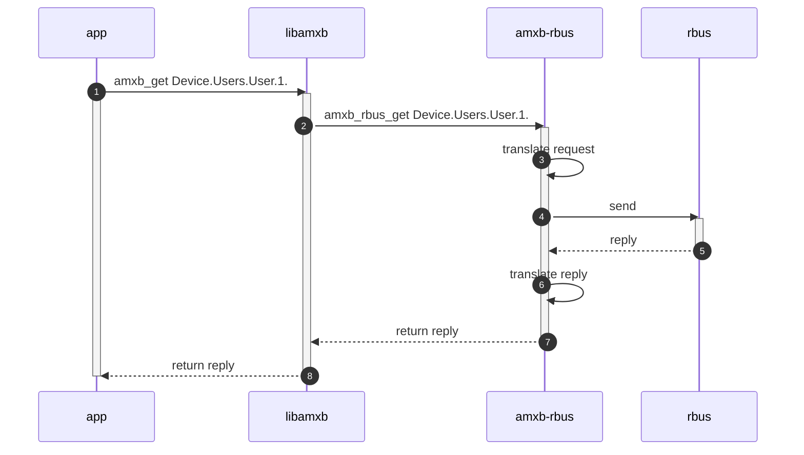
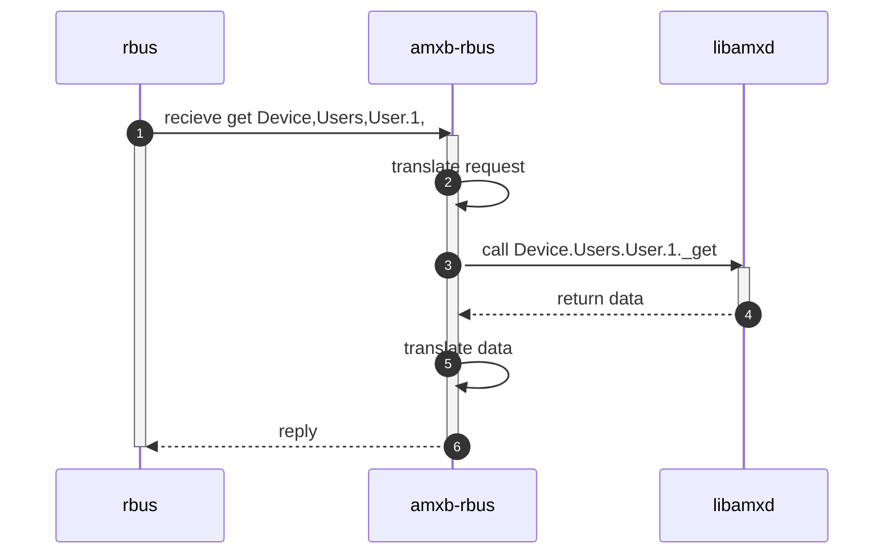
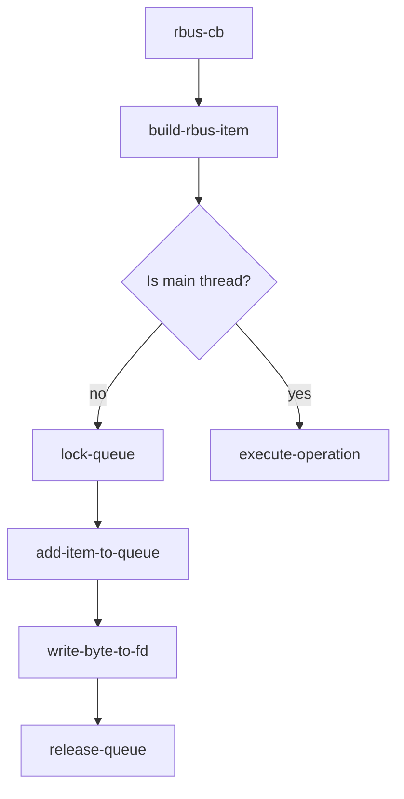
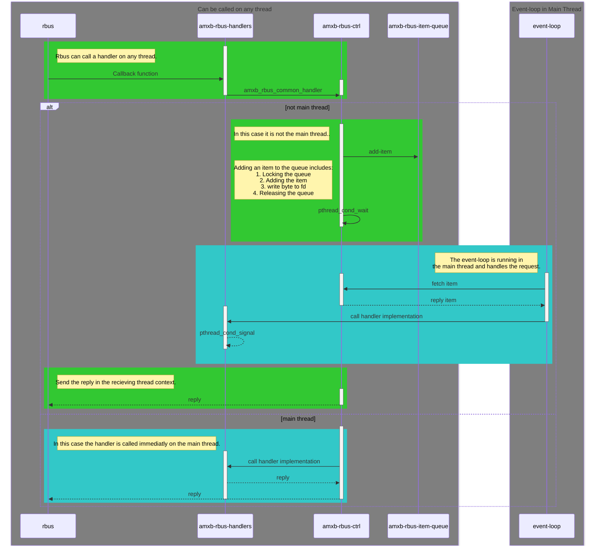

# RBus Backend Internals

## __Table of Contents__  

[[_TOC_]]

## Ambiorix RBus Back-ends Introduction

A back-end is responsible of translating libamxb requests into bus-specific requests, in this case translate to rbus messages or translate bus-specific messages into data structures and ambiorix function calls. 

There are three major-parts in a back-end implementation:
- Client side (data model consumer) functionality
- Server side (data model provider) functionality.
- Common functionality - connect/disconnect from the bus system, provide filedescriptor and a callback function for event-loops (which is called when data is available for read on the provided filedescriptor)

The common part, is implemented in `src/amxb_rbus.c` and provides following back-end interface functions:

- `amxb_rbus_connect` - allocates back-end specific data structure, which is used to store connection specific and internal management data, connects to the bus system and in the case of rbus provides a socket pair so the connection can be added to an event-loop.
- `amxb_rbus_disconnect` - clean-up of connection specific data and disconnects from the bus system.
- `amxb_rbus_get_fd`- returns the file descriptor that can be used by an event-loop implementation.
- `amxb_rbus_read` - will be called when data is available on the provided file descriptor. Typically this function will be called by the event-loop implementation (indirectly through `amxb_read`).
- `amxb_rbus_set_config` - An application can provide back-end specific configuration options. These can be set by calling `amxb_set_config`. Libamxb will pass the correct sub-section of the configuration to the correct back-end. It will use the name of the backend to find the correct back-end config section in the applications configuration settings.

The common part is used by data model providers and data model consumers.

The server side part, is implemented in the files `src/amxb_rbus_handle_get.c`, `src/amxb_rbus_handle_set.c`, `src/amxb_rbus_handler_call.c`, `src/amxb_rbus_handle_subscribe.c`, `src/amxb_rbus_handler_row.c` and `src/amxb_rbus_register.c`.

The only back-end interface function provided in these source files is `amxb_rbus_register`, most other functions are bus specific and are typically registered as callback functions to the bus using the bus specific APIs (in this case librbus).

All the registered callback functions will be called by the bus system, and most of them are taking the provided data, translates them into libamxd function calls and translate the result back into bus specific data structures. It is up to the bus system to send the data back to the requester.

The last part of a back-end implementation is the client side implementation, which back-end interface methods needs to be implemented is highly dependant on the bus system itself. In case of rbus, most of them will be needed as rbus itself is providing a data model. The client side interface functions are mostly called throught the libamxb functions like `amxb_set`, `amxb_get`, `amxb_add`, `amxb_del`, ...

When requesting something from a data model, the application will use libamxb API functions, libamxb will pass the data and request information to the back-end which will make sure that the correct message is send using the bus system (in this case RBus). When a reply is recieved, the recieved data must be translated back into ambiorix data (typically a amxc_var_t). It is important that the data stored in the returned variant(s) is always matching the expected structure and can be different depending on the type of request.

The following sequence diagrams illustrates this:



For a data model provider, typically some information must be registered to the bus system and some callbacks must be provided to the bus specific bus API. The callbacks will be called when needed.
In the case of rbus the full supported data model must be registered. This includes parameters, events, methods. Depening on the registration type different callback methods can be provided. It is the back-ends repsonsibility to do the registration to the bus system when requested and when the provided callback functions are called, translate the provided data and information into data structures and function calls. Typically libamxd (Data model engine) functions will be called. The back-end must translate the result back into something the bus system can understand.

The following sequence diagrams illustrates this:



## Multi-threading

RBus uses multi-threading to handle I/O operations (read & write). It starts a dedicated reader thread for opened connections. When messages are recieved it will parse the message and call one of the registered callback functions in the context of the reader thread or any other arbitrary thread.

As everything in the ambiorix framework is designed to work single-threaded and event driven, handling these messages in an arbitrary thread context will lead to unspecified behaviour as data models and internal structures can be modified by multiple threads at once.

### Solving Concurency

To avoid this concurrency all received messages are added to a message queue and will be handled in the main thread by the event-loop. The implementation chosen is based on the producers-consumer pattern. Many threads can create data and only one thread will handle them in a controlled manner.

This removes the need of protection with mutexes and locks all over the code, the only part the needs protection is the queue where the parsed messages are added in.

The source file `src/amxb_rbus_ctrl.c` handles the queue.

The even-loop is mainly watching file descriptors and uses a system call (like select or poll) to monitor if data is available on any of the watched file descriptors. The event-loop is implemented using [libevent](https://libevent.org/). For each file descriptor that is added to the event-loop to be watched a callback functions is added. Whenever data is available on one of the file descriptors, the correct callback function is called. It is the reponsability of the callback function to read (all) data from the file descriptor and if needed do the dispatching.

As the queue were the recieved rbus messages are stored isn't related to any file descriptor, the event-loop will not be triggered when an item is added to the queue. Therefor a socket-pair is created (can be replaced with a pipe as well) were one socket is the read-end and the other socket is the write-end. Each time when a new item is added to the queue, a byte is written to the write-end of the socket pair. This will trigger the event-loop and will call the registered callback function, in this case that is `amxb_rbus_read`, which will call the `amxb_rbus_ctrl_read` function. The `amxb_rbus_ctrl_read` function will read exactly one byte from the read-end socket and pulls one item from the queue. This item will then be handled in the main thread.

The file descriptor representing the read-end of the socket pair is returned by `amxb_rbus_get_fd` and will be added to the event-loop.

Following flowchart illustrates what is done when rbus calls a callback function to execute an data model operations:


This flowchart gives more details



### Asynchronous Calls

---
> **NOTE**
> The current draft implementation of `amxb_rbus_async_invoke`, `amxb_rbus_close_request`, `amxb_rbus_wait_request` needs ro be revised, still under investigation.
---

RBus provides an API to call RPC methods (data model methods) in an asynchronous way. The API is `rbusMethod_InvokeAsync`. It is possible to provide a callback function, which will be called when the RPC method is done, with the final result.

However there are some issues with this API function:
- It can not be stopped afterwards
- It is not possible to wait until it finishes at a later point.

This API is not compatible with the ambiorix `amxb_async_call`. This API returns a pointer which represents the asynchronous RPC request. When the caller wants to stop (cancel) the call or wants to wait until it has finished, libamxb provides two functions `amxb_close_request` and `amxb_wait_for_request`. The top level ambiorix functions will call the matching real implementation of the back-end, but in this case it is not possible using the RBus API.

To work around this issue a thread is started which will invoke the RPC method in a synchronous way, the thread by itself is blocking, the main will continue. The same mechanism with the RBus item queue is used to pass the result back to the main thread. Using the pthread functions `pthread_cancel` and `pthread_timedjoin_np` can be used to cancel the thread (which corresponds with canceling the asynchronous operations) and waiting with a time-out until the thread finishes.

## Data Models

### Data Model Provider Register

The RBus backend provides a function that is used to register the loaded data model to RBus: `amxb_rbus_register`. This function is provided in the back-end function table and is an optional function. If the function pointer is set to NULL in the function table, the RBus back-end will not be able to register a data model.

The RBus back-end can register the data model immediatly or can delay registration until the event `app:start` is recieved. When it is delayed and the `app:start` event is not triggered the data model will not get registered to the RBus daemon.

The RBus back-end will go over the full supported data model definition and registers all objects encountered, expcept objects that are marked as `private` or `protected`. Private objects are for internal use only and should not be made available on the bus system.

If the object is a multi-instance object (aka table) the following callback are provide to RBus:
- `amxb_rbus_add_row` - will be called when a new instance must be created, this callback will not be set when the table is defined as read-only.
- `amxb_rbus_remove_row` - will be called when an instance must be deleted, this callback will not be set when the table is defined as read-only.
- `amxb_rbus_row_subscribe_handler` - will be called when a subscription is taken on the table or a specific row.

All public defined parameters in the supported data model are registered as well and for each parameter two callbacks are given to RBus:
- `amxb_rbus_get_value` - will be called when the current value needs to be retrieved.
- `amxb_rbus_set_value` - will be called when the value needs to be changed, this callback will not be set when the parameter is defined as read-only.

All defined events in the supported data model are registered to RBus and one callback function is provided: `amxb_rbus_row_subscribe_handler`. This callback function is called when a data model consumer subscribes for this event. Besides the defined events in the data model an extra event is registered for each object in the supported data model: `amx_notify!`. This event is used to send Ambiorix data model events like `dm:object-changed`, `dm:instance-added`, `dm:instance-deleted`, ....
Although Rbus provides changed, add and delete events, the Ambiorix specific event is added as the RBus native events are lacking information. To make all Ambiorix based services and applications work without the need to change them and to keep them bus-agnostic that extra information is needed.

All public and protected defined methods in the data model are registered to Rbus daemon, for each method a callback function is provided to RBus `amxb_rbus_call_method`.
The registered methods include the internal ambiorix data model methods that are available. These internal methods all start with an `_` and can be ignored by a consumer.
These methods are: `_get`, `_set`, `_add`, `_del`, `_get_instances`, _`get_supported`,  `_list`, `_describe`, `_exec`. These methods are provided in the ambiorix data model engine and provides an easy way to circumvent limitations of bus systems. All bus systems have one major thing in common (the ones supported anyway), they all support remote procedure calls.

It is possible to turn off registration of the `protected` methods (that includes the internal ambiorix methods), by setting the `use-amx-calls` in the configuration to false.

If during registration of tables (in the supported data model) rows (instances) are encountered for that table, these instances (rows) are registered using `rbus_table_register_row`. This will inform the rbus-deamon that these rows exits.

If singleton objects (not a table) are encountered in the supported data model, all parameters, events, methods of that object are registered as well, these objects will not provide any extra callback function to RBus.

The data model tree is always registered top-down.

The full registration process is implemented in `src/amxb_rbus_register.c`

The callback functions `amxb_rbus_row`, `amxb_bus_remove_row` are implemented in file `src/amxb_rbus_handler_row.c` and `amxb_rbus_row_subscribe_handler` can be found in `src/amxb_rbus_subscriber.c`. The callback function `amxb_rbus_get_value` is implemented in `src/amxb_rbus_handler_get.c` and callback function `amxb_rbus_set_value` is implemented in `src/amxb_rbus_handler_set.c`.

### Data Model Provider Handling Requests

**TODO**

#### GET Requests

**TODO**

#### SET Requests

**TODO**

#### ADD Requests (add-row)

**TODO**

#### DEL Requests (del-row)

**TODO**

#### CALL Requests (invoke method)

**TODO**

### Data Model Consumer

**TODO**

#### GET Requests

**TODO**

#### SET Requests

**TODO**

#### ADD Requests (add-row)

**TODO**

#### DEL Requests (del-row)

**TODO**

#### CALL Requests (invoke method)

**TODO**

#### GET SUPPORTED

**TODO**

#### GET INSTANCES

**TODO**

#### Ambriorix Specific - Data Model Introspection

**TODO**

##### List

**TODO**

##### Describe

**TODO**

##### Has

**TODO**

## Open Topics & Issues

### 01 - Memory Leak 

A memory leak is found in the rbus code @ https://github.com/rdkcentral/rbus/blob/b72b95bc140394514ec138a278e85181c19c5240/src/rbus/rbus.c#L5838

Out params are allocated using rbusObject_Init but is is never released. This happens when a NULL pointer is passed to the function `rbusMethod_SendAsyncResponse` , according to the documentation it is valid to do so.
The documentation states that the caller is responsible for releasing the out_params, but as it is allocated within the function the caller can not release it. Current work=around: always allocate and initialize the out_params even when it is not needed, so it can be passed as a not NULL pointer and release it afterwards. When passing a not NULL pointer the function will not allocate it by itself.

This is the implementation, anotations added in comments
```C
rbusError_t rbusMethod_SendAsyncResponse(
    rbusMethodAsyncHandle_t asyncHandle,
    rbusError_t error,
    rbusObject_t outParams)
{
    rbusMessage response;

    VERIFY_NULL(asyncHandle);
    rbusValue_t value1, value2;

    rbusValue_Init(&value1);
    rbusValue_Init(&value2);

    rbusMessage_Init(&response);
    rbusMessage_SetInt32(response, error);
    if ((error != RBUS_ERROR_SUCCESS) && (outParams == NULL)) // Check is done if outParams is NULL
    {
        // Assume error != RBUS_ERROR_SUCCESS and outParams == NULL
        rbusObject_Init(&outParams, NULL); // <= Allocates memory for outParams
        rbusValue_SetInt32(value1, error);
        rbusValue_SetString(value2, rbusError_ToString(error));
        rbusObject_SetValue(outParams, "error_code", value1);
        rbusObject_SetValue(outParams, "error_string", value2);
    }
    rbusObject_appendToMessage(outParams, response);
    rbus_sendResponse(&asyncHandle->hdr, response);
    rbusValue_Release(value1);
    rbusValue_Release(value2);
    free(asyncHandle);
    // No release done for outParams. For the caller outParams is still NULL, so the caller can not 
    // release the memory !!!!! 
    return RBUS_ERROR_SUCCESS;

    // No memory leak when:
    // error == RBUS_ERROR_SUCCESS
    // outParams != NULL
}
```

**RDKM Ticket**: https://jira.rdkcentral.com/jira/browse/RDKBSUP-1481

**RDKM Response**:  The API documentation says the outParams should be initialized but it can be NULL.  Which means the outParams needs to be initialized and can have value zero. Not like we can pass NULL as a 3rd argument to this function.

**Follow-Up Question**: If it is not possible to pass NULL as a 3rd argument then why is the following check in the code:
```
    if ((error != RBUS_ERROR_SUCCESS) && (outParams == NULL))
```
According to this it is possible to pass in a NULL as 3rd argument and when done it is handeled in a different way. 
The condition to trigger the memory leak is:
1. Pass as 2nd argument an error code which is not `RBUS_ERROR_SUCCESS`
2. Pass as 3rd argument a NULL.

### 02 - Usage of Uninitialsed Memory

Once in a while valgrind reports this `warning`
```
==2984426== Thread 3:
==2984426== Syscall param sendmsg(msg.msg_iov[1]) points to uninitialised byte(s)
==2984426==    at 0x498BF3D: __libc_sendmsg (sendmsg.c:28)
==2984426==    by 0x498BF3D: sendmsg (sendmsg.c:25)
==2984426==    by 0x51085FB: rtConnection_SendInternal.constprop.0 (in /usr/local/lib/librtMessage.so.2.0.5)
==2984426==    by 0x51099CE: rtConnection_SendBinaryResponse (in /usr/local/lib/librtMessage.so.2.0.5)
==2984426==    by 0x50F775B: rbus_sendResponse (in /usr/local/lib/librbuscore.so.2.0.5)
==2984426==    by 0x50F903B: dispatch_method_call (in /usr/local/lib/librbuscore.so.2.0.5)
==2984426==    by 0x50F90F6: onMessage (in /usr/local/lib/librbuscore.so.2.0.5)
==2984426==    by 0x5107F62: rtConnection_CallbackThread (in /usr/local/lib/librtMessage.so.2.0.5)
==2984426==    by 0x4B67EA6: start_thread (pthread_create.c:477)
==2984426==    by 0x498AA2E: clone (clone.S:95)
==2984426==  Address 0x6620de9 is 201 bytes inside a block of size 8,192 alloc'd
==2984426==    at 0x48386AF: malloc (vg_replace_malloc.c:306)
==2984426==    by 0x483ADE7: realloc (vg_replace_malloc.c:834)
==2984426==    by 0x50FA05B: msgpack_sbuffer_write (in /usr/local/lib/librbuscore.so.2.0.5)
==2984426==    by 0x50FA936: rbusMessage_SetInt32 (in /usr/local/lib/librbuscore.so.2.0.5)
==2984426==    by 0x50CD8ED: _callback_handler (in /usr/local/lib/librbus.so.2.0.5)
==2984426==    by 0x50F9022: dispatch_method_call (in /usr/local/lib/librbuscore.so.2.0.5)
==2984426==    by 0x50F90F6: onMessage (in /usr/local/lib/librbuscore.so.2.0.5)
==2984426==    by 0x5107F62: rtConnection_CallbackThread (in /usr/local/lib/librtMessage.so.2.0.5)
==2984426==    by 0x4B67EA6: start_thread (pthread_create.c:477)
==2984426==    by 0x498AA2E: clone (clone.S:95)
==2984426== 
```

The given warning is mostly harmless, but if the unititialized memory is used in expressions (like if, while, ...) it could lead to random behavior.

**NOTE**: not observed anymore.

### 03 - RBus Set on multiple parameters

Using the rbus function `rbus_set` in sequence it is possible to change multiple values at once, when setting the commit flag for all of them to false and only to true on the last `rbus_set`. It is the resposibiliy of the caller that:

- A correct session id is provided.
- The last set of a session sets the commit.

If no session id is provided, but the commit flag is set to false, the ambiorix rbus backend will just add to parameters to a single transaction, when the set is recieved that contains the commit flag to true, all of them will be applied. So it is possible if no session id is provided by the caller all parameters end up in the same transaction on ambiorix side, this may not be the intention.

If the commit flag is never set to true, the transaction is never closed. The ambiorix rbus backend will keep the transaction until the commit is recieved.

**NOTE**: ambiorix-rbus backend is now using rbus_setMulti instead of rbus_set with session id.

### 04 - RBus set on multiple providers

Some unexpected behavior is noticed when using `rbus_set` in sequence (with commit flag) or `rbus_setMulti` to set multiple parameters provided by different providers. If an invalid value is provided for one of the parameters, the ambiorix rbus backend will do a rollback of the created transaction for the data model provider it is running in and returns an error back to the rbus daemon. 

The unexpected behaviour here is that it seems that the rbus daemon is ignoring this error and commits the values of the other providers. In that regard the `rbus_setMulti` or `rbus_set` multiple times act as `allow-partial` is set as specified in the USP specification. 

The end result is that all parameters for the failing provider are not set, all parameters for the other providers are set. 

The main issues is that the caller (data model consumer) is not informed of any failure to set the value(s), so it seems that the `rbus_setMulti` call was successfull.

The question is: Is this the inteded behavior or not?

This behavior can not be changed in the ambiorix rbus back-end itself. 

**RDKM Ticket**: https://jira.rdkcentral.com/jira/browse/RDKBSUP-1487

### 05 - Not possible to call methods on tables

When methods are registered on tables (multi-instance) object, it will not be possible to call these methods on the table itself, they can only be called on rows (instance objects) or sngleton objects. 

For the internal ambiorix method `_add` this is an issue, as it should be called on the table itself, so it can add a new row.

The functions `amxb_rbus_invoke` and `amxb_rbus_async_invoke` are able to detect that the call is done on a table, if that is the case the object one-level up in the hierarchy is used, and the `rel_path` argument is set. If the method called is not one of the internal methods the call is transformed into `_exec` which takes the `rel_path` and `method` as arguments. RBus doesn't allow or support that data model methods are callen on tables.

**NOTE**: Is a nice to have, but not a real issue.

### 06 - Not possible to provide parameter values with `rbusTable_addRow`

In the rbus api documentation is stated clearly (quote from the documentation):

> Any additional properties on the row must be updated separately using set operations.

In most cases this is not a real issue, it can be an issue for ambiorix multi-instance objects (tables) that have key parameters defined. The key parameters can be unique keys where each idividual value must be unique within that table or can be a comnbined key where the combination of the values must be unique within the table. Typically key parameters are write-once and can only be set during creation. 

Creating a row and then setting the parameters will not work for these tables (multi-instance objects). A possible work-around is to define the key parameters as "mutable" so that they can be changed afterwards.

Keep in mind that creating two instances (rows) after each other without setting these key parameters will end-up in a duplicate instance (row). The second row creation will fail beacuse of this.

### 07 - Timeouts for blocking requests

All blocking calls in libamxb have a timeout argument (amxb_get, amxb_set, amxb_add, amxb_del, ...).

RBus has internal timeouts for blocking calls. The API and data structure to get these timeouts are defined in the file: `rbus_config.h`. The timeouts are defined hardcoded in the file `rbus_config.c`

```C
#define RBUS_TMP_DIRECTORY      "/tmp"      /*temp directory where persistent data can be stored*/
#define RBUS_SUBSCRIBE_TIMEOUT   600000     /*subscribe retry timeout in miliseconds*/
#define RBUS_SUBSCRIBE_MAXWAIT   60000      /*subscribe retry max wait between retries in miliseconds*/
#define RBUS_VALUECHANGE_PERIOD  2000       /*polling period for valuechange detector*/
#define RBUS_GET_DEFAULT_TIMEOUT 15000      /* default timeout in miliseconds for GET API */
#define RBUS_SET_DEFAULT_TIMEOUT 15000      /* default timeout in miliseconds for SET API */
#define RBUS_GET_TIMEOUT_OVERRIDE "/tmp/rbus_timeout_get"
#define RBUS_SET_TIMEOUT_OVERRIDE "/tmp/rbus_timeout_set"
```

It is possible to change the GET and SET timeout by writing a value to the files `/tmp/rbus_timeout_get` and `/tmp/rbus_timeout_set` but this would introduce extra I/O operations for each request initiated by amxb calls in which a timeout is provided.

The header file `rbus_config.h` is not publicly available and can only be used by the librbus itself, the function to get a pointer to the structure containing all timeouts is exported by the lib. 

As a workouraround the the data structure and the function to get the pointer of the data structure are redefined in the amxb-rbus backend. Each time a timeout needs to be set, the timeouts are modified just before calling the rbus function. The implementation can be found in `src/amxb_rbus_timeouts.c`.

**NOTE**: It would be nice if real public APIs are added to RBus lib to change the timeouts, currently a work-arround has been defined and implemented.

### 08 - Asynchronous calls using amxb consumer api

Currently the `asynchronous` RPC call is not canceled when calling `amxb_close_request`, but the internal data structure is reset, which will cause the thread to keep running until the RPC method returns, but no callback is called. Often it is not possible to stop the RPC call anyway (as it is executed in another proces). An improvement would be that the thread is really canceled, but for now it is easier to keep it running without side-effects (unless it never ends).

Questions: 
- is it possible to wait until an asynchronous call is done which was started with `rbusMethod_InvokeAsync`?
- is it possible to cancel an asynchronous call that was started with `rbusMethod_InvokeAsync`?

**RDKM Ticket**: https://jira.rdkcentral.com/jira/browse/RDKBSUP-1486<br>
**RDKM Response**: <br>
> ***Waiting for an asynchronous call to complete***:<br>
> The function rbusMethod_InvokeAsync does not provide a mechanism to wait for the completion of the asynchronous call within its implementation. It creates a detached thread that runs independently. To wait for the asynchronous call to complete, you would need to implement a synchronization mechanism, such as a semaphore or a condition variable, that the callback function signals upon completion.<br>
> ***Canceling an asynchronous call***:<br>
> The function rbusMethod_InvokeAsync does not support canceling the asynchronous call once it has been started. The thread runs independently, and there is no built-in mechanism to stop it. To implement cancellation, you would need to modify the function to accept a CancellationToken or similar construct that the thread checks periodically to determine if it should terminate early.

### 09 - Add & delete rows initiated by rbus consumer

When a add row or delete row is initiated by a data model consumer to an ambiorix data model provider, the ambiorix data model provider will emit an event (add or delete event). The amxb-rbus back-end is listening for these events to be able to register or unregister rows to/from rbus. This is fine for rows that were added or deleted by the provider itself, but not when it was initiated by a consumer. 

When handeling the instance delete event which was caused by handling a delete row request started by a rbus data model consumer and calling `rbusTable_unregisterRow` a segmentation fault occurs in librbus or the application just blocks idenfinitly (probably a dead-lock).

When handeling the instance added event which was caused by handling a add row request started by a rbus data model consumer and calling `amxb_rbus_register_row` the row can occur twice in the list of available rows.

To avoid that the deletes or adds are done double, once by the consumer and once by the provider, the amxb-rbus keeps track which instances are added or deleted by a request from rbus and ignores the event in these cases.

When a ambiorix multi-instance object (table) has an alias key and a new instance is created (row is added), but the data model consumer that initiated the request doesn't provide a value for the alias, the ambiorix data model provider will choose the value. It is currently not possible to inform rbus daemon what the alias is of the new row. When fetching the rows of a table, the alias will be empty.

**RDKM Ticket**: https://jira.rdkcentral.com/jira/browse/RDKBSUP-1492

### 10 - Date/Time value conversions

Date time values are now correctly passed, still an issue with TR181 `unknown time` and `inifinite time` as specified in TR-106 (https://www.broadband-forum.org/pdfs/tr-106-1-13-0.pdf) section 3.2.1 Date and Time Rules.

When unknown time or infinite time are passed to RBus they become a valid time:

Example:

Unknown time "0001-01-01T00:00:00Z" becomes in RBus "1970-01-01T00:00:00Z"

### 11 - Some times memory leak reported in unit-tests

Sometimes (approx 1 out of 5 runs) a memory leak is observed at exit of a unit-test.

```
==3015333== 
==3015333== HEAP SUMMARY:
==3015333==     in use at exit: 65,848 bytes in 1 blocks
==3015333==   total heap usage: 1,055 allocs, 1,054 frees, 4,985,757 bytes allocated
==3015333== 
==3015333== 65,848 bytes in 1 blocks are definitely lost in loss record 1 of 1
==3015333==    at 0x483877F: malloc (vg_replace_malloc.c:307)
==3015333==    by 0x4B4AA9D: rt_malloc_at (in /usr/local/lib/librtMessage.so.2.0.5)
==3015333==    by 0x4B43208: rtConnection_ReaderThread (in /usr/local/lib/librtMessage.so.2.0.5)
==3015333==    by 0x492EEA6: start_thread (pthread_create.c:477)
==3015333==    by 0x4A44A2E: clone (clone.S:95)
==3015333== 
==3015333== 
==3015333== Exit program on first error (--exit-on-first-error=yes)
```

Seems to be related to librtMessage or a false possitive.

When valgrind detects a memory leak it will make the unit-test fail.
A valgrind suppression file is added to ignore this specific memory leak error report.

### 12 - Memory Leak in rbus_discoverRegisteredComponents

In function `rbus_discoverRegisteredComponents` (rbuscore.c @ line 2204) `rtMessage_Create` is called at line 2210. The function `rtMessage_create` allocates memory and that pointer is stored in the `out` variable. At line 2220 `rtConnection_SendRequest` is called but when this call fails (returns something differen then `RT_OK`), the memory is never freed again. 

When the call to `rtConnection_SendRequest` returns `RT_OK` the allocated memory is freed again at line 2261 in the function `rbus_discoverRegisteredComponents`.

This can be solve by moving the call to free the memor `rtMessage_Release(out);` out of the if or also call it in the else branch. 

```
==2367378== 
==2367378== HEAP SUMMARY:
==2367378==     in use at exit: 150 bytes in 4 blocks
==2367378==   total heap usage: 65,730 allocs, 65,726 frees, 3,761,938,448 bytes allocated
==2367378== 
==2367378== 150 (16 direct, 134 indirect) bytes in 1 blocks are definitely lost in loss record 4 of 4
==2367378==    at 0x483877F: malloc (vg_replace_malloc.c:307)
==2367378==    by 0x501DA9D: rt_malloc_at (in /usr/local/lib/librtMessage.so.2.0.5)
==2367378==    by 0x5018E80: rtMessage_Create (in /usr/local/lib/librtMessage.so.2.0.5)
==2367378==    by 0x500444D: rbus_discoverRegisteredComponents (in /usr/local/lib/librbuscore.so.2.0.5)
==2367378==    by 0x4FB8857: amxb_rbus_list_collect_root (amxb_rbus_list.c:113)
==2367378==    by 0x4FB8D00: amxb_rbus_list (amxb_rbus_list.c:228)
==2367378==    by 0x4F47EFA: amxb_list (amxb_ba_op_list.c:215)
==2367378==    by 0x4F34F19: mod_pcb_cli_list_all (mod_pcb_cli_cmd_list.c:180)
==2367378==    by 0x4F4A8B8: amxb_be_invoke_on_all_connections (amxb_backend_mngr.c:142)
==2367378==    by 0x4F4B9C9: amxb_be_for_all_connections (amxb_backend_mngr.c:618)
==2367378==    by 0x4F34FE2: mod_pcb_cli_cmd_list (mod_pcb_cli_cmd_list.c:205)
==2367378==    by 0x4919D4E: amxm_module_execute_function (amxm_module.c:238)
==2367378== 
==2367378== LEAK SUMMARY:
==2367378==    definitely lost: 16 bytes in 1 blocks
==2367378==    indirectly lost: 134 bytes in 3 blocks
==2367378==      possibly lost: 0 bytes in 0 blocks
==2367378==    still reachable: 0 bytes in 0 blocks
==2367378==         suppressed: 0 bytes in 0 blocks
==2367378== 
==2367378== For lists of detected and suppressed errors, rerun with: -s
==2367378== ERROR SUMMARY: 1 errors from 1 contexts (suppressed: 0 from 0)
```

**RDKM Ticket**: https://jira.rdkcentral.com/jira/browse/RDKBSUP-1481<br>
**RDKM Response**: They had confirmed it as a bug and will be fixing on their side. Timeline for the fix was not known.

### 13 - Wrong information returned by RBus

When discovering elements in rbuscli some objects are mentioned as a table when using `discelements component` command.

Exmaple:
```
rbuscli -i
rbuscli> disce eRT.com.cisco.spvtg.ccsp.wifi

...
        Element 79: Device.WiFi.Radio.{i}.Enable
        Element 80: Device.WiFi.Radio.{i}.X_RDK_OffChannelTscan
        Element 81: Device.WiFi.Radio.{i}.X_RDK_OffChannelNscan
        Element 82: Device.WiFi.Radio.{i}.X_RDK_OffChannelNchannel
        Element 83: Device.WiFi.Radio.{i}.X_RDK_OffChannelTidle
        Element 84: Device.WiFi.Radio.{i}.Status
        Element 85: Device.WiFi.Radio.{i}.Alias
        Element 86: Device.WiFi.Radio.{i}.Name
...

```
In above output a `{i}` is put behind Radio object, indicating it is a table but when using `getnames path [nextLevel]` it is indicated as an `object` and not as a `Table`

Exmaple:

```
rbuscli -i
rbuscli> getn Device.WiFi.Radio. false

Component eRT.com.cisco.spvtg.ccsp.wifi:
Element    1:
              Name  : Device.WiFi.Radio.
              Type  : Object
              Writable: ReadOnly
              Access Flags: 100000
...

```

Here the type is `Object` where `Table` is expected.

Extract from the rbuscli code (rbuscli.c @ 1575)

```C

...
                printf ("Element   %2d:\n\r", index++);
                printf ("              Name  : %s\n\r", elem->name);
                printf ("              Type  : %s\n\r",
                    elem->type == RBUS_ELEMENT_TYPE_PROPERTY ? "Property" :
                    (elem->type == RBUS_ELEMENT_TYPE_TABLE ?   "Table" :
                    (elem->type == RBUS_ELEMENT_TYPE_EVENT ?   "Event" :
                    (elem->type == RBUS_ELEMENT_TYPE_METHOD ?  "Method" :
                                                               "Object"))));
...

```

So it seems that RBus is not filling the element type correcty (in this case 0 is provided as type), the type `RBUS_ELEMENT_TYPE_TABLE` (2) is expected.

The amxb-rbus backend is relying on the element type for data model introspection, if the type is not correctly provided, the amxb-rbus introspection on native RBus data models will not work correctly.

**Question**: Is this a problem in general with RBus or is it a problem only in some of the data model providers?

### 14 - USP incompatibilities when using RBus

#### ADD

1. When using `rbusTable_addRow` it is not possilbe to pass parameter values (see 6)
1. `rbusTable_addRow` is not returning key parameter values when a new row has been added.
1. When no alias is provided in the call to `rbusTable_addRow` the data model provider must select it's own value for the `alias`, but it is not possible to register that `alias` to rbus. Calling `rbusTable_registerRow` when handeling an `add row` request in the provider results in undefined behavior (crash or duplicate instance in RBus).

#### DEL

1. When using a search path or wildcard path to delete instances, it is possible not all instances are deleted. RBus is not providing any feedback about which instances failed to be deleted.

#### SET

1. When setting parameters using a search path or wildcard path, and applying the values on one of the matching objects fails will result in a partial set. The set on multiple objects using a search path or wildcard path will always be like the `allow partial` flag has been set.

