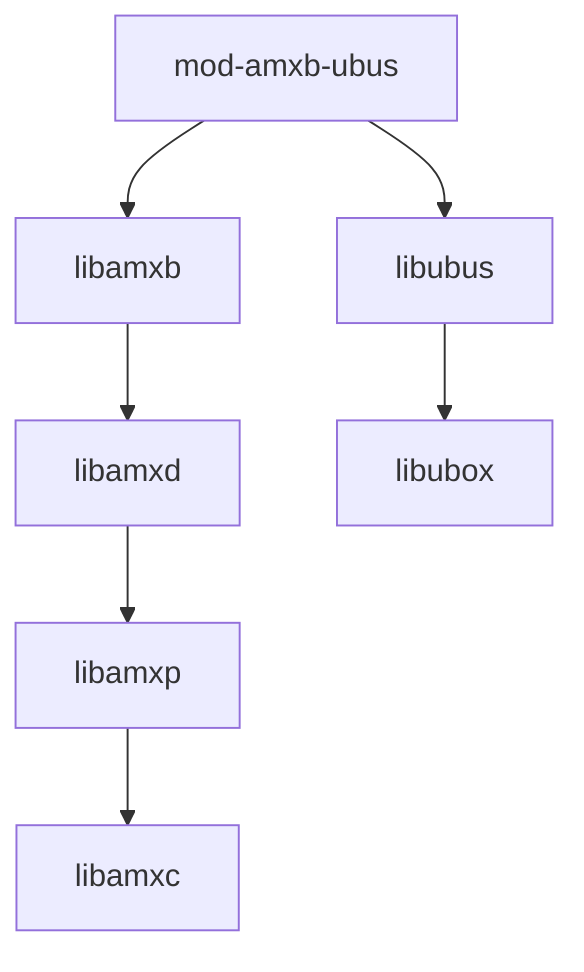
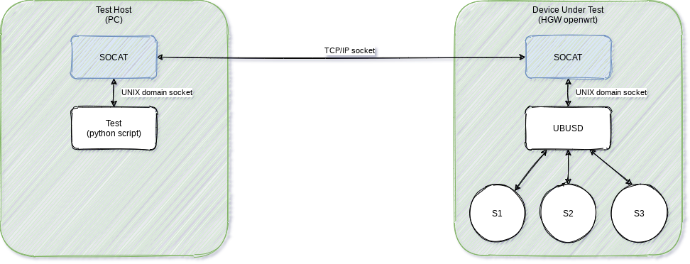

# Ubus baapi back-end  

[[_TOC_]]

## Introduction

UBus implementation for the bus agnostic api. This back-end can be loaded using the `amxb_be_load` function which is implemented in [libamxb](https://gitlab.com/prpl-foundation/components/ambiorix/libraries/libamxb).

## Building, installing and testing

### Docker container

You could install all tools needed for testing and developing on your local machine, but it is easier to just use a pre-configured environment. Such an environment is already prepared for you as a docker container.

1. Install docker

    Docker must be installed on your system.

    If you have no clue how to do this here are some links that could help you:

    - [Get Docker Engine - Community for Ubuntu](https://docs.docker.com/install/linux/docker-ce/ubuntu/)
    - [Get Docker Engine - Community for Debian](https://docs.docker.com/install/linux/docker-ce/debian/)
    - [Get Docker Engine - Community for Fedora](https://docs.docker.com/install/linux/docker-ce/fedora/)
    - [Get Docker Engine - Community for CentOS](https://docs.docker.com/install/linux/docker-ce/centos/)  <br /><br />
    
    Make sure you user id is added to the docker group:

    ```
    sudo usermod -aG docker $USER
    ```

1. Fetch the container image

    To get access to the pre-configured environment, all you need to do is pull the image and launch a container.

    Pull the image:

    ```bash
    docker pull registry.gitlab.com/soft.at.home/docker/oss-dbg:latest
    ```

    Before launching the container, you should create a directory which will be shared between your local machine and the container.

    ```bash
    mkdir -p ~/amx_project/modules/amxb_backends/
    ```

    Launch the container:

    ```bash
    docker run -ti -d --name oss-dbg --restart always --cap-add=SYS_PTRACE --sysctl net.ipv6.conf.all.disable_ipv6=1 -e "USER=$USER" -e "UID=$(id -u)" -e "GID=$(id -g)" -v ~/amx_project/:/home/$USER/amx_project/ registry.gitlab.com/soft.at.home/docker/oss-dbg:latest
    ```

    The `-v` option bind mounts the local directory for the ambiorix project in the container, at the exact same place.
    The `-e` options create environment variables in the container. These variables are used to create a user name with exactly the same user id and group id in the container as on your local host (user mapping).

    You can open as many terminals/consoles as you like:

    ```bash
    docker exec -ti --user $USER oss-dbg /bin/bash
    ```

### Building

#### Prerequisites

- [libamxc](https://gitlab.com/prpl-foundation/components/ambiorix/libraries/libamxc) - Generic C api for common data containers
- [libamxp](https://gitlab.com/prpl-foundation/components/ambiorix/libraries/libamxp) - Common patterns implementation
- [libamxb](https://gitlab.com/prpl-foundation/components/ambiorix/libraries/libamxb) - PCB backend implementation for bus agnostic API
- [libamxd](https://gitlab.com/prpl-foundation/components/ambiorix/libraries/libamxd) - Data Model Manager
- [libubox](https://git.openwrt.org/?p=project/libubox.git;a=summary) - C utility functions for OpenWrt
- [ubus](https://git.openwrt.org/?p=project/ubus.git;a=summary) - OpenWrt system message/RPC bus

---
Dependency graph - libraries needed by mod-amxb-ubus.
For graph simplicity direct dependencies which are also an indirect dependency are not shown.


---

#### Build amxb_ubus

1. Clone the git repository

    To be able to build it, you need the source code. So open the directory just created for the ambiorix project and clone this library in it (on your local machine).

    ```bash
    cd ~/amx_project/modules/amxb_backends/
    git clone git@gitlab.com:prpl-foundation/components/ambiorix/modules/amxb_backends/amxb_ubus.git
    ``` 

1. Install dependencies

    Although the container will contain all tools needed for building, it does not contain the libraries needed for building `amxb_ubus`. To be able to build `amxb_ubus` you need `libamxc`, `libamxp` and `libamxb`. These libraries can be installed in the container.

    ```bash
    sudo apt update
    sudo apt install libamxc
    sudo apt install libamxb
    ```

    Note that you do not need to install all components explicitly. Some components will be installed automatically because the other components depend on them. Some of the components are allready preinstalled in the container.

1. Build it

    ```bash
    cd ~/amx_project/modules/amxb_backends/amxb_ubus
    make
    ```

### Installing

#### Using make target install

You can install your own compiled version easily in the container by running the install target.

```bash
cd ~/amx_project/modules/amxb_backends/amxb_ubus
sudo -E make install
```

#### Using package

From within the container you can create packages.

```bash
cd ~/amx_project/modules/amxb_backends/amxb_ubus
make package
```

The packages generated are:

```
~/amx_project/modules/amxb_backends/amxb_ubus/mod-amxb-ubus-<VERSION>.tar.gz
~/amx_project/modules/amxb_backends/amxb_ubus/mod-amxb-ubus-<VERSION>.deb
```

You can copy these packages and extract/install them.

For ubuntu or debian distributions use dpkg:

```bash
sudo dpkg -i ~/amx_project/modules/amxb_backends/amxb_ubus/mod-amxb-ubus-<VERSION>.deb
```

### Testing

#### Prerequisites

- [libamxj](https://gitlab.com/prpl-foundation/components/ambiorix/libraries/libamxj) - JSON parser & generator using yajl and libamxc variants
- [psmisc](https://packages.debian.org/buster/psmisc)
- [libyajl-dev](https://packages.debian.org/buster/libyajl-dev)

#### Run tests

1. Install dependencies

    Most of the packages needed for testing are allready preinstalled in the container. To be able to test `amxb_pcb` you need to extra install `libamxj`.

    ```bash
    sudo apt update
    sudo apt install libamxj
    ```

1. Run tests

    You can run the tests by executing the following command.

    ```bash
    cd ~/amx_project/modules/amxb_backends/amxb_ubus/tests
    sudo make
    ```

    Or this command if you also want the coverage tests to run:

    ```bash
    cd ~/amx_project/modules/amxb_backends/amxb_ubus/tests
    make run coverage
    ```

#### Coverage reports

The coverage target will generate coverage reports using [gcov](https://gcc.gnu.org/onlinedocs/gcc/Gcov.html) and [gcovr](https://gcovr.com/en/stable/guide.html).

A summary for each file (*.c files) is printed in your console after the tests are run.
A HTML version of the coverage reports is also generated. These reports are available in the output directory of the compiler used.
Example: using native gcc
When the output of `gcc -dumpmachine` is `x86_64-linux-gnu`, the HTML coverage reports can be found at `~/amx_project/modules/amxb_backends/amxb_ubus/output/x86_64-linux-gnu/coverage/report.`

You can easily access the reports in your browser.
In the container start a python3 http server in background.

```bash
cd ~/amx_project/
python3 -m http.server 8080 &
```

Use the following url to access the reports `http://<IP ADDRESS OF YOUR CONTAINER>:8080/modules/amxb_backends/amxb_ubus/output/<MACHINE>/coverage/report`
You can find the ip address of your container by using the `ip` command in the container.

Example:

```bash
USER@<CID>:~/amx_project/modules/amxb_backends/amxb_ubus$ ip a
1: lo: <LOOPBACK,UP,LOWER_UP> mtu 65536 qdisc noqueue state UNKNOWN group default qlen 1
    link/loopback 00:00:00:00:00:00 brd 00:00:00:00:00:00
    inet 127.0.0.1/8 scope host lo
       valid_lft forever preferred_lft forever
    inet6 ::1/128 scope host 
       valid_lft forever preferred_lft forever
173: eth0@if174: <BROADCAST,MULTICAST,UP,LOWER_UP> mtu 1500 qdisc noqueue state UP group default 
    link/ether 02:42:ac:11:00:07 brd ff:ff:ff:ff:ff:ff link-netnsid 0
    inet 172.17.0.7/16 scope global eth0
       valid_lft forever preferred_lft forever
    inet6 2001:db8:1::242:ac11:7/64 scope global nodad 
       valid_lft forever preferred_lft forever
    inet6 fe80::42:acff:fe11:7/64 scope link 
       valid_lft forever preferred_lft forever
```

in this case the ip address of the container is `172.17.0.7`.
So the uri you should use is: `http://172.17.0.7:8080/modules/amxb_backends/amxb_ubus/output/x86_64-linux-gnu/coverage/report/`

## uBus odl config options

The behavior of the ubus back-end can be modified using config options. These config options can be set in an odl `%config` section. All ubus back-end config options must be put in a table with the name `ubus`.

Example:
```
%config {
    // Application name
    name = "greeter";

    ubus = {
        register-on-start-event = true
    };
}
```

Available config options:

- `register-on-start-event`: Register all known data model objects to ubus daemon when `app:start` event is received. This event is send right before the event loop is started. When this option is not set the data model objects are registered to the ubus daemon just before the entry-points are called.
- `watch-ubus-events`: listen for ubusd events. When this is enabled, the auto re-subscribe feature can work on ubusd.

## Tips And Tricks

### Remote Access to ubusd (ubus over TCP/IP)

During development or automated tests it can be handy to be able to access to ubus objects from a remote machine. As ubusd doesn't support TCP/IP connections two scripts are installed by this component.

The scripts use [socat](https://openwrt.org/packages/pkgdata/socat) to create a relay to a TCP/IP socket.



On the target (HGW or device under test) the script `forward_ubus_server.sh` must be used to create a TCP/IP listen socket. For each new connection a forked process is started which will act as relay between the TCP/IP socket and a socket to the ubusd.

All traffic coming from the TCP/IP socket will be forwarded to the ubusd, and all replies will be send on the TCP/IP socket.

On the PC (here called test host) the script `forward_ubus_client.sh` must be used to create a UNIX domain listen socket and to create a connection to the TCP/IP listen socket on the target. All ubus clients or tests using the ubus protocol can then connect to the UNIX domain listen socket. All traffic coming from an ubus client will then be forwarded to the TCP/IP socket.

Here is a small demonstration of these scripts using the localhost.


---
> **NOTE**<br>
> When creating this set-up using a HGW (device under test) and another machine (the test host), it is possible you need to disable or configure the firewall on the HGW.
---

### Accessing uBus from process not running as root user

In the directory `/usr/share/acl.d/` create for each user name that needs access to ubsus a json file. 
 
The filename should end on `.json`.
The file should contain the following json data structure:

```JSON
{
  "user": "<USER>",
  "access": {
    "*": {
      "methods": [
        "*"
      ]
    }
  },
  "send": [
    "*"
  ],
  "subscribe": [
    "*"
  ],
  "publish": [
    "*"
  ]
}
```


The above example will make everything available for the user specified in the field "user". It is possible to restrict which objects and methods the user can access.

Example:
```JSON
{
  "user": "<USER>",
  "access": {
    "Greeter.": {
      "methods": [
        "_get",
        "_list",
        "_describe",
        "say"
      ]
    },
    "NetModel": {
        "methods": [
            "*"
        ]
    }
  },
  "send": [
    "*"
  ],
  "subscribe": [
    "*"
  ],
  "publish": [
    "*"
  ]
}
```

---
> **NOTE**<br>
> Use opening access to objects in ubus with care in production environments.
---
