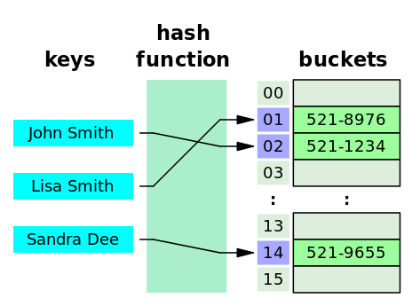

# Ambiorix Hash Table

Estimated Time Needed: 60 - 75 minutes.

[[_TOC_]]

## Introduction

Wikipedia [Hash Table](https://en.wikipedia.org/wiki/Hash_table)

> In computing, a hash table (hash map) is a data structure that implements an associative array abstract data type, a structure that can map keys to values. A hash table uses a hash function to compute an index, also called a hash code, into an array of buckets or slots, from which the desired value can be found. During lookup, the key is hashed and the resulting hash indicates where the corresponding value is stored.

---

 

[Figure 1]:<br>
Figure 1<br>
A small phone book as a hash table

---

## Goal 

The goal of this tutorial is to explain:

- how the Ambiorix hash table is working
- how to use the Ambiorix hash table API

It is not the intention of this tutorial to explain the Ambiorix API's in depth, it will provide you links and pointers that will help you to get more information, and of course all sources are available in gitlab.

## Prerequisites

- You finished the [Getting Started](https://gitlab.com/prpl-foundation/components/ambiorix/tutorials/getting-started/-/blob/main/README.md) tutorial
- Basic knowledge of C
- Basic knowledge of git

## Hash Tables

### Generating a hash

Generating a hash from a key is very important when using a hash table. The hash is used to identify the bucket where the data is/can be stored. A hash is calculated from a key and the result of the calculation should be an integer. Using the integer modulo the number of buckets available provides the index of the bucket.

One of the problems here is that multiple keys could lead to the same index, this is called a collision. Collisions can be solved in different ways. One of them is using a linked list, and whenever a collisions occurs the new data is added to the end of the linked list.

The hash algorithm is also of importance when calculating the hash. Not all possible hash algorithms give a good distribution, depending on the keys used. To make a hash table implementation generic and re-usable, it must support the possibility to use a different hash algorithm.

The Ambiorix library `libamxc` already provides a set of hash algorithms, all implemented in a separate function.

The hash algorithms available are:

- [amxc_RS_hash](https://gitlab.com/prpl-foundation/components/ambiorix/libraries/libamxc/-/blob/main/src/amxc_hash_func.c#L63) - Sedgwicks Algorithms 
- [amxc_JS_hash](https://gitlab.com/prpl-foundation/components/ambiorix/libraries/libamxc/-/blob/main/src/amxc_hash_func.c#L77) - Justin Sobel's hash function
- [amxc_PJW_hash](https://gitlab.com/prpl-foundation/components/ambiorix/libraries/libamxc/-/blob/main/src/amxc_hash_func.c#L88) - Peter J. Weinberger's Algorithm (AT&T Bell) 
- [amxc_ELF_hash](https://gitlab.com/prpl-foundation/components/ambiorix/libraries/libamxc/-/blob/main/src/amxc_hash_func.c#L108) - [PJW Hash function (ELF hash)](https://en.wikipedia.org/wiki/PJW_hash_function) 
- [amxc_BKDR_hash](https://gitlab.com/prpl-foundation/components/ambiorix/libraries/libamxc/-/blob/main/src/amxc_hash_func.c#L124) - Brian Kernighan and Dennis Ritchie's hash function 
- [amxc_SDBM_hash](https://gitlab.com/prpl-foundation/components/ambiorix/libraries/libamxc/-/blob/main/src/amxc_hash_func.c#L136) - SDBM hash function from the SDBM project
- [amxc_DJB_hash](https://gitlab.com/prpl-foundation/components/ambiorix/libraries/libamxc/-/blob/main/src/amxc_hash_func.c#L147) - [Daniel J. Bernstein's hash algorithm](https://en.wikipedia.org/wiki/Daniel_J._Bernstein) 
- [amxc_DEK_hash](https://gitlab.com/prpl-foundation/components/ambiorix/libraries/libamxc/-/blob/main/src/amxc_hash_func.c#L158) - DEK hash (Robert Sedgwicks Algorithms in C book) 
- [amxc_BP_hash](https://gitlab.com/prpl-foundation/components/ambiorix/libraries/libamxc/-/blob/main/src/amxc_hash_func.c#L168) - BP hash (Donald E. Knuth in The Art Of Computer Programming Volume 3) 
-  [amxc_FNV_hash](https://gitlab.com/prpl-foundation/components/ambiorix/libraries/libamxc/-/blob/main/src/amxc_hash_func.c#L178) - FNV hash (Robert Sedgwicks Algorithms in C book)
- [amxc_AP_hash](https://gitlab.com/prpl-foundation/components/ambiorix/libraries/libamxc/-/blob/main/src/amxc_hash_func.c#L191) - AP hash (Arash Partow)

You can look at the implementations of these hash function in the file [amxc_hash.c](https://gitlab.com/prpl-foundation/components/ambiorix/libraries/libamxc/-/blob/main/src/amxc_hash_func.c)

Ofcourse you can implement your own hash function that provides maybe a better distribution for your case. 

The function can be used by the Ambiorix hash table implementation as long as it fits this signature:

```C
typedef unsigned int (* amxc_htable_hash_func_t) (const char* key, const unsigned int len);
```

After creation or initialization of the hash table you can change the hash function used for that table by calling:

```C
void amxc_htable_set_hash_func(amxc_htable_t* const htable, amxc_htable_hash_func_t func);
```

---

> Note<br>
Do not change the hash function when the hash table already contains items. Changing the hash function does not recalculate all indexes for the items in the table.
>
>Only set the hash function after creating or initializing the hash table.

---

### Number Of Buckets

The number of buckets available is also important, as it can have some influence on the efficiency of the hash table. When the number of buckets is too small, the number of possible collisions can get high. When the number of buckets is too big, the memory overhead of the hash table increases (many empty buckets).

It is not always possible to predict the number of items that will be stored in the hash table, so it is important that the size of the hash table (number of available buckets) can be modified, manually or automatically.

When the number of items in the Ambiorix hash table exceeds 75% of the number of available buckets, the number of buckets is increased. When this happens the index of each item in the hash table is recalculated and the item can get re-positioned. 

### What can be put in a hash table?

Any data structure can be added to the hash table, the only limitation is that the key always must be a string. 

To make a data structure ready to be used with a hash table it must contain a `amxc_htable_it_t` member. This is the `hash table iterator`

Example:

```C
typedef struct person {
    char* first_name;
    char* last_name;
    gender_t gender;
    uint32_t age;
    char* email;
    char* phone;
    marital_status_t mstatus;
    amxc_htable_it_t it;
} person_t;
```

All Ambiorix hash table API functions work either with a `amxc_htable_t` or a `amxc_htable_it_t`. Fetching an item from the hash table will give you a pointer to `amxc_htable_it_t`, using this pointer and `offsetof` macro (through `amxc_container_of`), the address of the containing structure is calculated.

## Ambiorix Hash Table API

The full hash table API - structures, macros and functions - is documented. <br>

- In the header file [amxc_htable.h](https://gitlab.com/prpl-foundation/components/ambiorix/libraries/libamxc/-/blob/main/include/amxc/amxc_htable.h)
- As a [web page](https://soft.at.home.gitlab.io/ambiorix/libraries/libamxc/doxygen)

### Hash Table structures

The Ambiorix library `libamxc` contains two structures and a set of functions with which you can create data independent linked lists.

The first structure is the `hash table iterator` structure:

```C
struct _amxc_htable_it {
    amxc_array_it_t* ait;
    char* key;
    amxc_htable_it_t* next;
};
```

The second structure is the `hash table` main structure:

```C
typedef struct _amxc_htable {
    amxc_array_t table;
    size_t items;
    amxc_htable_hash_func_t hfunc;
    amxc_htable_it_delete_t it_del;
} amxc_htable_t;
```
Although it is possible to manipulate the members of these structures it is recommended to use the API functions to do that.

### Hash Table Functions

In this tutorial not all available hash table API functions will be handled, only the most commonly used.

#### Constructing and Initializing a hash table

```C
int amxc_htable_new(amxc_htable_t** htable, const size_t reserve);
int amxc_htable_init(amxc_htable_t* const htable, const size_t reserve);
```

When you need to allocate a hash table on the heap use `amxc_htable_new`, initializing a hash table on the stack is done by using `amxc_htable_init`. Please note that when allocating a hash table structure on the heap with `amxc_htable_new` it is already initialized, so there is no need to call `amxc_htable_init`.

When creating a hash table, the size of the table must be specified. This size will be used to allocate the buckets. A hash table in Ambiorix is not fixed in size, when adding more items in the hash table the hash table will grow in size when needed. 

#### Destructing and clean-up

```C
void amxc_htable_delete(amxc_htable_t** htable, amxc_htable_it_delete_t func);
int amxc_htable_clean(amxc_htable_t* const htable, amxc_htable_it_delete_t func);
```

Items in the hash table can be allocated on the heap, and therefor the allocated memory of those items must be freed when not needed anymore. Often when cleaning up the hash table itself, the items must be cleaned-up as well. 

It is possible to create a loop that does exactly that, remove each item from the hash table and free memory as needed. As this is a very common use case and mostly all items in the hash table are of the same type, a `delete` callback function can be provided. This callback function will be called for each item in the hash table.

#### Adding An Item

```C
int amxc_htable_insert(amxc_htable_t* const htable, const char* const key, amxc_htable_it_t* const it);
```

Using this function a key-value pair is added to the hash table, the hash table iterator pointer `amxc_htable_it_t` is pointing to the item (data). Each iterator can only be added to a hash table once. Setting the same iterator to another hash table will result in removal from the first hash table.

Hash tables allow duplicate keys, so the keys do not need to be unique. But keep in mind that adding many duplicate keys in the hash table, will reduce the efficiency of the hash table. 

#### Getting An Item

```C
amxc_htable_it_t* amxc_htable_get(const amxc_htable_t* const htable, const char* const key);
amxc_htable_it_t* amxc_htable_it_get_next_key(const amxc_htable_it_t* const reference);
```

Using the key you can get an `hash table iterator` from the hash table itself. When no item is stored with the given key, this function will return a NULL pointer. When items with duplicate keys are stored in the hash table, the first occurrence is returned. To get the next item with the same key, use `amxc_htable_it_get_next_key`. 

#### Removing An Item

```C
amxc_htable_it_t* amxc_htable_take(amxc_htable_t* const htable, const char* const key);
```

This function will remove the first item with the given key from the hash table, but will not delete the item. The item's hash table iterator is returned. Use `amxc_container_of` macro to get the pointer to the data structure.

Be careful when the hash table contains duplicate keys, it will not remove all items with that key, just the first one.

#### Iterating All Items

```C
#define amxc_htable_for_each(it, htable)
#define amxc_htable_iterate(it, htable)
```

These are macros that can be used to iterate over all items in a hash table. 

Keep in mind that iterating over all items in a hash table is not very efficient. When using these macros you are accessing the hash table like a linked list.

Both macros should be used as a `for` loop:

```C
amxc_htable_for_each(ht_it, my_hash_table) {
    // do something here
}
```

The differences between both macros is that with `amxc_htable_for_each` it is possible to remove the current `it` from the hash table, but it is not possible to embed another `amxc_htable_for_each` in the loop.

The macro `amxc_htable_iterate` doesn't allow that the hash table is modified while iterating, but it is possible to embed others `amxc_llist_iterate` in the loop.

## Practical Labs

Before you start these labs, make sure you have the `Ambiorix Debug & Development` container installed and are able to open a terminal in this container. If you don't have the container running with all Ambiorix libraries installed, please read [Getting Started](https://gitlab.com/prpl-foundation/components/ambiorix/tutorials/getting-started/-/blob/main/README.md) before continuing. 

All commands provided in these labs must be executed in a container terminal.

To open a terminal in the container use following command

```bash
docker exec -ti -u $USER amxdev /bin/bash
```

---

>Note: <br>
You can open multiple terminals to the same container. 

---

Before you continue, you need to clone this git repository.<br>
You can do this by using a terminal on your local machine or -if you configured the container correctly- you can do the clone from a terminal in your container.

Execute these shell commands in a container terminal (or a terminal on your host machine)

```bash
mkdir -p ~/workspace/ambiorix/tutorials/collections/
cd ~/workspace/ambiorix/tutorials/collections/
git clone git@gitlab.com:prpl-foundation/components/ambiorix/tutorials/collections/hash-tables.git
```

### Lab1 - Search a word in a dictionary

Using a hash table it is easy to do lookups using a key. In this practical lab we build a dictionary which contains some words, it is the intention to search a word and print the word and it's explanation to the standard output.

It is up to you to implement the search function and the clean-up function

To implement the functions about 8 lines of code must be added.

The application can be compiled with this command:

```bash
cd ~/workspace/ambiorix/tutorials/collections/hash-tables/labs/lab1
gcc main.c -lamxc -o lab1
```

---

> **NOTE**
> When items are stored in a hash table using its hash table iterator, freeing the allocated memory of the item will leave you with an invalid hash table.
> By freeing the memory the pointer to this item is not removed from the hash table, so the hash table contains a `dangling` pointer (that is a pointer to a memory block that has been freed, so it is an invalid pointer).
> Always remove the item from the table before freeing the memory block that was allocated for it. Removing an item from a hash table can be done using its hash table iterator and function
> ```C
> void amxc_htable_it_take(amxc_htable_it_t *const 	it);	
> ```
>  
> Removing an item from a hash table without freeing it will lead to a memory leak, that is a block of memory where no more refences to that block are available. When removing an item and you don't need it anymore, also free the allocated memory.
---

When the functions are implemented the output should look like this:

```bash
$ ./lab1 unfortunate
unfortunate : not fortunate: such as having bad luck
```

To verify that each allocated memory block is freed, run the application under valgrind:

```bash
$ valgrind ./lab1 unfortunate
==32597== Memcheck, a memory error detector
==32597== Copyright (C) 2002-2017, and GNU GPL d, by Julian Seward et al.
==32597== Using Valgrind-3.14.0 and LibVEX; rerun with -h for copyright info
==32597== Command: ./lab1 unfortunate
==32597== 
unfortunate : not fortunate: such as having bad luck
==32597== 
==32597== HEAP SUMMARY:
==32597==     in use at exit: 0 bytes in 0 blocks
==32597==   total heap usage: 308 allocs, 308 frees, 9,538 bytes allocated
==32597== 
==32597== All heap blocks were freed -- no leaks are possible
==32597== 
==32597== For counts of detected and suppressed errors, rerun with: -v
==32597== ERROR SUMMARY: 0 errors from 0 contexts (suppressed: 0 from 0)
```

### Lab2 - Iterating a hash table

Most of the time you will access items in a hash table by their keys, which is the most efficient way to access the data in a hash table, but sometimes it is required to loop over all items available. Using an Ambiorix hash table this is possible.

In this practical lab we will use the dictionary from lab1 and print all words available in the hash table.

It is up to you to implement the function that loops over all items available and print the key.

To implement the function about 4 lines of code must be added.

The application can be compiled with this command:

```bash
cd ~/workspace/ambiorix/tutorials/collections/hash-tables/labs/lab2
gcc main.c -lamxc -o lab2
```

When the function is implemented the output should look like this:

```bash
$ ./lab2
absent
unfortunate
paraphrase
dangerous
```

---

>Note:<br>
Altough all items are added in alphabetic order, they are not stored in alphabetic order. A hash-table is an unordered map, the position of the items in the hash table depends on the calculated hash. Using the function `amxc_htable_get_sorted_keys` a sorted array of the keys can be obtained.

---

### Lab3 - Hash table of Contacts

 In real world situations more complex data structures will be used. In this lab we are going to build a hash table of contacts, each contact will contain these fields:

- first_name - Contains the first name
- last_name - Contains the last name
- gender - Contains the gender (enum)
- age - The age as an integer
- email - one e-mail address
- phone = one phone number.

The field `last_name` will be used as a key to store the contact information in the hash table.

The records are provided as a string, containing comma separated values.

Example:

```Text
Violet,Elliott,Female,25,v.elliott@randatmail.com,896-3242-73
```

Using other Ambiorix functions these strings are splitted into a linked list, using "," as a separator. For each `person record` a structure is allocated and added to the hash table.

It is up to you to implement the search function. As the `last_name` is not an unique key, it is possible that multiple contacts will match your search.
Implement the search function so that when a person_t pointer is given (not NULL), the next matching person_t structure is returned.

To implement the function about 11 lines of code must be added.

The application can be compiled with this command:

```bash
cd ~/workspace/ambiorix/tutorials/collections/hash-tables/labs/lab3
gcc main.c -lamxc -o lab3
```

When the function is implemented the output should look like this:

```bash
$ ./lab3 Elliott                                                                                        
Person : James Elliott
        Gender = Male
        Age    = 23
        E-Mail = j.elliott@randatmail.com
        Phone  = 412-8887-99
Person : Max Elliott
        Gender = Male
        Age    = 25
        E-Mail = m.elliott@randatmail.com
        Phone  = 406-1711-61
Person : Violet Elliott
        Gender = Female
        Age    = 25
        E-Mail = v.elliott@randatmail.com
        Phone  = 896-3242-73

$ ./lab3 Cole
Person : Deanna Cole
        Gender = Female
        Age    = 30
        E-Mail = d.cole@randatmail.com
        Phone  = 929-0326-86
```

## Example - amx-htable-contacts

A more complete example is available at<br>
https://gitlab.com/prpl-foundation/components/ambiorix/examples/collections/htable_contacts

This example is documented and explained in the [README.md](https://gitlab.com/prpl-foundation/components/ambiorix/examples/collections/htable_contacts/-/blob/main/README.md) file.

## Conclusion

After completing this tutorial you have learned:

- How to use the Ambiorix Hash Table API
- To build and manipulate a hash table
- Where to find the API documentation

## References

- Ambiorix Tutorials - Getting Started<br>
https://gitlab.com/prpl-foundation/components/ambiorix/tutorials/getting-started/-/blob/main/README.md
- Wikipedia - Hash Table<br> 
https://en.wikipedia.org/wiki/Hash_table
- Wikipedia - Hash Functions<br>
https://en.wikipedia.org/wiki/List_of_hash_functions
- Online Linux man pages - offesetof<br>
https://www.man7.org/linux/man-pages/man3/offsetof.3.html
- libamxc - API documentation<br>
https://soft.at.home.gitlab.io/ambiorix/libraries/libamxc/doxygen 
- amxc-htable-contacts example<br>
https://gitlab.com/prpl-foundation/components/ambiorix/examples/collections/htable_contacts
- Valgrind<br>
https://valgrind.org/
