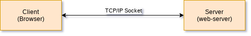
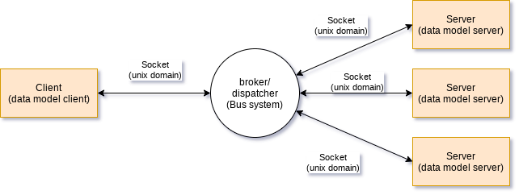

# Ambiorix Data Models - Simple Client

Time needed: 45 - 60 minutes.

[[_TOC_]]

## Introduction

Services and applications can `publish` a data model that can act as the public interface of these services and applications. Typically these data models are `published` through a software bus system and provide configuration options or the current status of these services and applications. Other applications (aka clients), can interact with them. The interaction is done using `standard` operators like get, set, add, delete, ...

Interacting with a `public` data model can either be done using the `native` bus system tools and API. A disadvantage of using the `native` API is that your `client` application is not exchangeable between different `Software Platforms`, so you need to `port` your application and provide support for all possible `Software Platforms`. This can lead into maintenance hell.

The Ambiorix framework provides an API that can work on top of many bus systems, if an `Ambiorix Bus Back-end` is implemented for that bus system. Using this API (aka BAAPI), will make your application exchangeable between different `Software Platforms` or `Distributions`.

## Goal

The goal of this tutorial is to explain:

- how to use the Bus Agnostic API (BAAPI - libamxb).
- how to connect to a `native` bus system
- how to interact with services and applications that expose a data model

It is not the intention of this tutorial to explain the Ambiorix API's in depth, it will provide you links and pointers that will help you to get more information, and of course all sources are available in gitlab.

This tutorial explains how you can interact with an application that exposes a data model that is build using the Ambiorix Framework. It is possible to interact with services and applications that are system `native`, that is an application that exposes an interface using the `native` bus and uses the `native` bus API to implement that interface. How to interact with `native` services using BAAPI is explained in another tutorial.

To explain the basics of the client side `Bus Agnostic` API no [event loop](https://en.wikipedia.org/wiki/Event_loop) is needed. How to create an event driven client application is explained in another tutorial.

## Prerequisites

- You finished the [Getting Started](https://gitlab.com/prpl-foundation/components/ambiorix/tutorials/getting-started/-/blob/main/README.md) tutorial
- You finished the [Data Model Server  - Define and Publish](https://gitlab.com/prpl-foundation/components/ambiorix/tutorials/datamodels/server/define-publish/-/blob/main/README.md) tutorial
- Basic knowledge of `Ambiorix Variants`, see also [Ambiorix Data Collections/Containers - Variants](https://gitlab.com/prpl-foundation/components/ambiorix/tutorials/collections/variants) tutorial 
- You have a good understanding of the data model concepts as defined by `Broadband Forum`
- Basic knowledge of C
- Basic knowledge of git

## BAAPI - libamxb API

The full API - structures, macros and functions - is documented. <br>

The documentation can be consulted:

- In the header files 
    - [amxb_connect.h](https://gitlab.com/prpl-foundation/components/ambiorix/libraries/libamxb/-/blob/main/include/amxb/amxb_connect.h)
    - [amxb_operators.h](https://gitlab.com/prpl-foundation/components/ambiorix/libraries/libamxb/-/blob/main/include/amxb/amxb_operators.h)
- As a [web page](https://soft.at.home.gitlab.io/ambiorix/libraries/libamxb/doxygen) 

### Loading Back-ends

Ambiorix by itself does not provide a protocol or messaging system, it provides an API that is protocol or message independent and relies on a `back-end` to send and receive messages.

The `Bus Agnostic API` provides API's that allow you to load one or more back-ends or even to unload them. These API's don't implement some magical thing, they just use a standard mechanism known as [Dynamically Loaded (DL) Libraries](https://tldp.org/HOWTO/Program-Library-HOWTO/dl-libraries.html)

To load a bus/protocol back-end use:

```C
int amxb_be_load(const char* path_name);
```

The `path_name` argument must be an absolute or relative path including the filename and extension to a shared object file that implements an Ambiorix BAAPI back-end interface. When the shared object is loaded using [dlopen](https://linux.die.net/man/3/dlopen), some checks are performed:

1. Does this shared object implement a BAAPI back-end interface?
1. Is the implemented interface compatible with the interface version in the currently used libamxb?
1. Are all mandatory functions available?

If any of these checks fail, the shared object will be unloaded again and can not be used as a back-end.

Multiple back-ends can be loaded at a single point in time.

To unload or remove a back-end use:

```C
int amxb_be_remove(const char* backend_name);
void amxb_be_remove_all(void);
```

The function `amxb_be_remove_all` is typically used when the application is exiting.

Also note that when removing a back-end, all connections created with that back-end will be closed.

Example code:

```C
    const char* ba_backend = getenv("AMXB_BACKEND");
    int retval = amxb_be_load(ba_backend);
    if (retval != 0) {
        printf("Failed to load back-end [%s]\n", ba_backend);
        printf("Return code = %d\n", retval);
        exit(2);
    }
```

### Creating A Connection

To be able to communicate with other processes a `connection` must be created to them, to make it possible to exchange messages. A similar mechanism is used when you access a web-page in your browser. Your browser will translate the provided URI into an IP address, creates a connection with the web-server using this IP address and then your browser starts exchanging messages with the server (using the HTTP on top of TCP/IP).

Such a connection between two endpoints is called a socket. With a socket bi-directional communication is possible.

Simplified this can be expressed with this simple drawing:



Here two applications are connected to each using a TCP/IP socket. The same can be achieved when the two applications are running on the same machine, they can set-up a connection to each other using a TCP/IP socket and use the `local host` address.  

In Linux (or unix like systems) another kind of socket can be created between two applications, these sockets are called `Unix Domain Sockets`. 

Most Software platforms (openWrt, prplWrt, SAH sop, ...) also provide a kind of message broker/dispatcher process which is mostly referred to as the `software bus`. The responsibility of such a `software bus` is dispatching the messages to the correct application or service. Often these `bus systems` use Unix Domain sockets.



The advantage of having a `software bus` in between is that you only need one single socket to be able to communicate and exchange messages between your application and all other applications connected to the same `bus system`.

The Ambiorix `Bus Agnostic API`, implemented in libamxb, provides functions that help in creating connections between your application and the `bus system` or between individual applications, or closing these connections when you don't need them anymore.

```C
int amxb_connect(amxb_bus_ctx_t** ctx, const char* uri);
int amxb_disconnect(amxb_bus_ctx_t* ctx);
```

To establish a connection you need a [Uniform Resource Identifier](https://en.wikipedia.org/wiki/Uniform_Resource_Identifier) or short a URI. 

Examples of URIs are:

- http://www.google.com
- ftp://myftp.ftp-service.com

And you probably already used these kind of URIs when browsing the world wide web using your favorite browser.

The full syntax of a URI is:

```text
scheme:[//authority]path[?query][#fragment]
```

The function `amxb_connect` needs such a URI to know how to create the socket and most of all to know which back-end must be used.

The `scheme` of the URI is used to identify the back-end.

For instance, if you want to connect to `ubusd` (on openWrt), you need a URI that starts with `ubus:`. If you want to connect to `pcb_sysbus` you need a URI that starts with `pcb:`

Looking at the syntax of a URI, you will see that only two parts are mandatory:

- scheme
- path

A `Unix Domain sockets` is represented by a file in the file system, which has a path (including a file name).

The URIs for `ubus` and `PCB` can then be written as:

```text
ubus:/var/run/ubus/ubus.sock
pcb:/var/run/pcb_sys
```

--- 

>**NOTE**<br>
Depending on the `distribution` used or `build` used, these `Unix Domain` sockets can have other names or be in different directories

---

Example code:

```C
    amxb_bus_ctx_t* bus_ctx = NULL;
    int retval = amxb_connect(&bus_ctx, "pcb:/var/run/pcb_sys");
    if(retval != 0) {
        printf("Failed to connect to [%s]\n", uri);
        printf("Return code = %d\n", retval);
        exit(3);
    }
```
 
### Data Model Operators

To interact with an application or service that exposes a data model, more is needed than only a connection. We must be able to send `requests` or messages to these applications or services.

The [TR-369 USP Broadband Forum specification](https://www.broadband-forum.org/download/TR-369.pdf) describes operations that can be performed on a data model, the basic operations are:

- add - adds an instance to a multi-instance (table) object.
- delete - deletes an instance from a multi-instance (table) object.
- set - changes values of parameters.
- get - requests the current values of parameters of one or more objects.

For each of these operations a function is available in the `Bus Agnostic API` and is implemented in libamxb:

```C
int amxb_add(amxb_bus_ctx_t* const bus_ctx, const char* object, uint32_t index, const char* name, amxc_var_t* values, amxc_var_t* ret, int timeout);
int amxb_del(amxb_bus_ctx_t* const bus_ctx, const char* object, uint32_t index, const char* name, amxc_var_t* ret, int timeout);
int amxb_set(amxb_bus_ctx_t* const bus_ctx, const char* object, amxc_var_t* values, amxc_var_t* ret, int timeout);
int amxb_get(amxb_bus_ctx_t* const bus_ctx, const char* object, int32_t depth, amxc_var_t* ret, int timeout);
```

All of these functions take as first argument a `bus context`, this is the connection you have created using `amxb_connect`. 

The second argument is a path and is referring to one or more objects in the `remote` data model, depending on the operator this can be one of:

- Object path: This is a `Path Name` of either a singleton Object, or the `Path
Name` to an multi-instance Object. An Object Path ends in a “.”
- Object Instance Path - This is a `Path Name` to a an instance object of a multi-instance object. It uses an `Instance Identifier` to address a particular Instance of the multi-instance object. An `Object Instance Path` ends in a “.”
- Parameter Path - This is a `Path Name` of a particular parameter of an object.
- Search Path - This is a `Path Name` that contains search criteria for addressing a set of instance objects and/or their Parameters. A Search Path may contain a `Search Expression` or
`Wildcard`.

All of the functions have a `ret` argument, which is a `Ambiorix Variant` and will contain the response if the function execution did not fail. 

## Practical Labs

Before you start these labs, make sure you have the `Ambiorix Debug & Development` container installed and are able to open terminal in this container. If you haven't the container running with all Ambiorix libraries installed, please read [Getting Started](https://gitlab.com/prpl-foundation/components/ambiorix/tutorials/getting-started/-/blob/main/README.md) before continuing. 

All commands provided in these labs must be executed in a container terminal.

To open a terminal in the container use following command

```bash
docker exec -ti -u $USER amxdev /bin/bash
```

---

>Note: <br>
You can open multiple terminals to the same container. 

---

Also make sure that you have completed [data model server - define and publish lab 1](https://gitlab.com/prpl-foundation/components/ambiorix/tutorials/datamodels/server/define-publish/-/blob/main/README.md#lab1-complete-phonebook-data-model) as these labs will use the phonebook data model.

Before you continue, you need to clone this git repository.<br>
You can do this using a terminal on your local machine or if you configured the container correctly you can do the clone from a terminal in your container.

Execute these shell commands in a container terminal (or a terminal on your host machine)

```bash
mkdir -p ~/workspace/ambiorix/tutorials/datamodels/client
cd ~/workspace/ambiorix/tutorials/datamodels/client/
git clone git@gitlab.com:prpl-foundation/components/ambiorix/tutorials/datamodels/client/simple-client.git
```
### Lab 1 - Adding Contacts

In [Lab 1](https://gitlab.com/prpl-foundation/components/ambiorix/tutorials/datamodels/server/define-publish/-/blob/master/README.md#lab1-complete-phonebook-data-model) of [data models server - define and publish](https://gitlab.com/prpl-foundation/components/ambiorix/tutorials/datamodels/server/define-publish/-/blob/main/README.md) tutorial you have created a phonebook data model that can contain contact information.

In this lab we are going to use this data model and add contacts to it.

The application takes 4 arguments:

1. First name
2. Last name
3. E-Mail
4. Phone Number

Before starting the application two environment variables must be defined.

If you want to use `PCB bus system`

```bash
export AMXB_BACKEND=/usr/bin/mods/amxb/mod-amxb-pcb.so
export AMXB_URI=pcb:/var/run/pcb_sys
```

If you want to use `ubus bus system`:

```bash
export AMXB_BACKEND=/usr/bin/mods/amxb/mod-amxb-ubus.so
export AMXB_URI=ubus:/var/run/ubus/ubus.sock
```

These environment variables are used by the application, in the function `app_initialize`

It is up to you to complete the functions:

- `app_initialize` - Load a back-end and create a connection. When no error occurred the function should return 0. (between 7 - 11 lines of code with error handling)
- `app_add_contact` - Add the contact to the data model and return the `Instance Number` of the newly created instance. (about 7 lines of code including error handling)

---

> **TIP**
> To create a new instance of a multi-instance object for a client applications you can use `amxb_add` function.
>
> The sixth argument of this function is a pointer to an initialized variant, the data and information of the newly created instance is stored in that variant and the data structure looks like:
>
> ```text
> [
>     {
>         index = 1,
>         name = "1",
>         object = "Phonebook.Contact.1.",
>         parameters = {
>         },
>         path = "Phonebook.Contact.1."
>     }
> ]
> ```
>
> To retrieve data from that variant you can make use of the libamxc variant API.
> Example, to get the index (variant) from that composite variant you could use:
>
> ```C
> amxc_var_get_path(&ret, "0.index", AMXC_VAR_FLAG_DEFAULT); 
> ```

---

To build the code:

```bash
cd ~/workspace/ambiorix/tutorials/datamodels/client/simple-client/labs/lab1
gcc main.c -lamxc -lamxb -o lab1
```

---

>**NOTE**
>
>When using ubus, you must start your application as `root` user. Otherwise connecting to ubus fails. You can open a terminal in the container as `root` user:
>
>```bash
>docker exec -ti amxdev /bin/bash
>```
>
>Or switch to `root` user in your current container.
>
>```bash
>sudo -E su -
>export LD_LIBRARY_PATH=/usr/local/lib
>```

---

When you completed the two functions, first launch the phonebook data model, if you do not remember how, see [Data Model Server - Define and Publish](https://gitlab.com/prpl-foundation/components/ambiorix/tutorials/datamodels/server/define-publish/-/blob/main/README.md) tutorial.

Execute these lines:

```bash
./lab1 "John" "Doe" "john.d@ambiorix.com" "(+032)0477 555 451"
./lab1 "Jane" "Doe" "jane.d@ambiorix.com" "(+032)0476 328 555"
./lab1 "Eva" "Elliott" "eva.e@ambiorix.com" "(+031)0499 275 558"
```

Use `pcb_cli` to verify that your phonebook data model:

```bash
pcb_cli Phonebook?
$ pcb_cli Phonebook?
Phonebook
Phonebook.Contact
Phonebook.Contact.1
Phonebook.Contact.1.LastName=Doe
Phonebook.Contact.1.FirstName=John
Phonebook.Contact.1.PhoneNumber
Phonebook.Contact.1.PhoneNumber.1
Phonebook.Contact.1.PhoneNumber.1.Phone=(+032)0477 555 451
Phonebook.Contact.1.E-Mail
Phonebook.Contact.1.E-Mail.1
Phonebook.Contact.1.E-Mail.1.E-Mail=john.d@ambiorix.com
Phonebook.Contact.2
Phonebook.Contact.2.LastName=Doe
Phonebook.Contact.2.FirstName=Jane
Phonebook.Contact.2.PhoneNumber
Phonebook.Contact.2.PhoneNumber.1
Phonebook.Contact.2.PhoneNumber.1.Phone=(+032)0476 328 555
Phonebook.Contact.2.E-Mail
Phonebook.Contact.2.E-Mail.1
Phonebook.Contact.2.E-Mail.1.E-Mail=jane.d@ambiorix.com
Phonebook.Contact.3
Phonebook.Contact.3.LastName=Elliott
Phonebook.Contact.3.FirstName=Eva
Phonebook.Contact.3.PhoneNumber
Phonebook.Contact.3.PhoneNumber.1
Phonebook.Contact.3.PhoneNumber.1.Phone=(+031)0499 275 558
Phonebook.Contact.3.E-Mail
Phonebook.Contact.3.E-Mail.1
Phonebook.Contact.3.E-Mail.1.E-Mail=eva.e@ambiorix.com
```

### Lab 2 - Fetching Objects

Now that you are able to add contacts, it would be nice if you also can retrieve that data stored in the data model. 

This can be done using `amxb_get` function.

The application takes 1 argument, the `search path` or `object path`.

As in `Lab 1` this application uses two environment variables, used to load a bus back-end and to create a connection to the `bus system`.

It is up to you to complete function `app_get` (about 5 lines of code).

To build the code:

```bash
cd ~/workspace/ambiorix/tutorials/datamodels/client/simple-client/labs/lab2
gcc main.c -lamxc -lamxb -o lab2
```

When you completed the implementation and you still have the phonebook data model running and filled with the example data from `Lab 1`, you could use this application to retrieve the contact information.

By using the full object path to a single contact instance object:

```bash
$ ./lab2 Phonebook.Contact.1.
[
    {
        Phonebook.Contact.1. = {
            FirstName = "John"
            LastName = "Doe",
        }
    }
]
```

By using a wildcard to retrieve all contacts:

```bash
$ ./lab2 Phonebook.Contact.*.
[
    {
        Phonebook.Contact.1. = {
            FirstName = "John"
            LastName = "Doe",
        },
        Phonebook.Contact.2. = {
            FirstName = "Jane"
            LastName = "Doe",
        },
        Phonebook.Contact.3. = {
            FirstName = "Eva"
            LastName = "Elliott",
        }
    }
]
```

By using a search path to retrieve some contacts:

```bash
$ ./lab2 "Phonebook.Contact.[FirstName == 'Jane']."
[
    {
        Phonebook.Contact.2. = {
            FirstName = "Jane"
            LastName = "Doe",
        }
    }
]

$ ./lab2 "Phonebook.Contact.[LastName == 'Doe']."
[
    {
        Phonebook.Contact.1. = {
            FirstName = "John"
            LastName = "Doe",
        },
        Phonebook.Contact.2. = {
            FirstName = "Jane"
            LastName = "Doe",
        }
    }
]

$ ./lab2 "Phonebook.Contact.[LastName == 'Smith']."
Failed to get [Phonebook.Contact.[LastName == 'Smith'].]

```

## Conclusion

After finishing this tutorial you have learned:

- How to load/unload `bus` back-ends.
- How to create a connection to a `bus system`.
- How to interact with an Ambiorix based data model using the `Bus Agnostic API`

## References

- Getting Started<br>
https://gitlab.com/prpl-foundation/components/ambiorix/tutorials/getting-started
- Data Model Server - Define and Publish<br>
https://gitlab.com/prpl-foundation/components/ambiorix/tutorials/datamodels/server/define-publish/-/blob/main/README.md
- Wikipedia - Uniform Resource Identifier<br>
https://en.wikipedia.org/wiki/Uniform_Resource_Identifier
- Dynamically Loaded (DL) Libraries<br>
https://tldp.org/HOWTO/Program-Library-HOWTO/dl-libraries.html
- Online Linux man pages - dlopen<br>
https://linux.die.net/man/3/dlopen
- Wikipedia Event Loop<br>
https://en.wikipedia.org/wiki/Event_loop
- Broadband Forum TR-369 USP<br>
https://www.broadband-forum.org/download/TR-369.pdf
- Ambiorix Data Collections/Containers - Variants<br>
https://gitlab.com/prpl-foundation/components/ambiorix/tutorials/collections/variants
- BAAPI libamxb API documentation<br>
https://soft.at.home.gitlab.io/ambiorix/libraries/libamxb/doxygen
