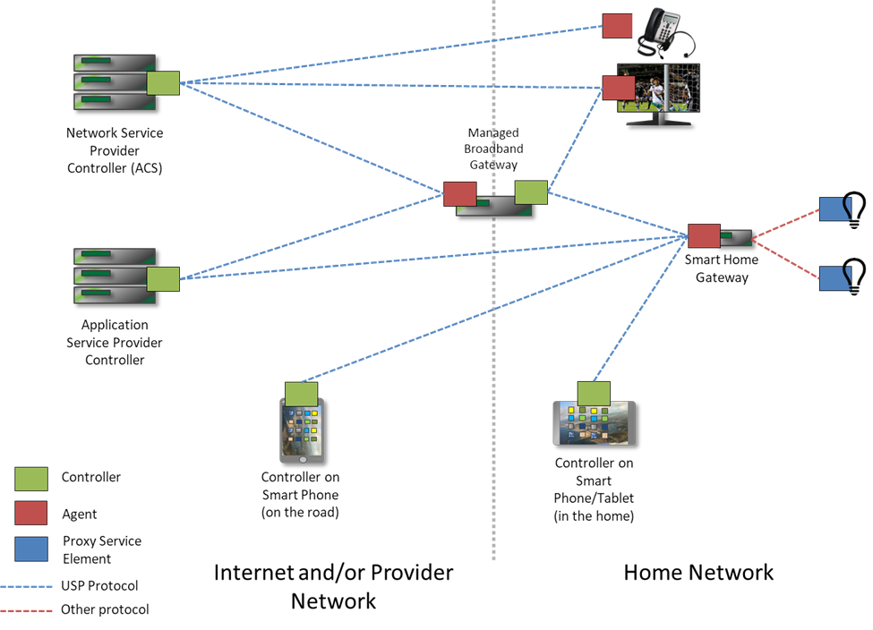

# Ambiorix Data Models

Estimated Time Needed: 45 - 60 minutes.

[[_TOC_]]

## Introduction

In modern homes multiple devices are available, which all connect to the internet. These homes are often referred to as `Connected Homes` or `Smart Homes`. Some of these devices are part of a service provided by `Service Providers` or  `Broadband Operators`. These devices are mostly `managed` and `controlled` by these `Service Providers`. One simple mechanism is needed to be able to manage all these devices. As it would become very difficult to configure and manage all of these devices and software on these devices if they would all use a different protocol or mechanism to interact.

The `Broadband Forum` is the communications industry’s leading organization focused on accelerating broadband innovation, standards, and ecosystem development. It is an open, non-profit industry organization composed of the industry’s leading broadband operators, vendors, and thought leaders who are shaping the future of broadband.

One set of standards defined by the `Broadband Forum` are data models and protocols which can be used to manage and control devices of `Service Provides` and `Broadband Operators` like -but not limited to- `Home Gateways`, `Set-Top Boxes`.

It is important to support these standards and to be part of the eco-system created by the `Broadband Forum`. The Ambiorix framework embraces these standards and provides a set of libraries and tools that enables software developers to easily create `Data Models` that can be accessed by the defined protocols in these standards. 

## Goal

The goal of this tutorial is to explain:

- What are data models ?
- The concepts of data models.
- Some of the `Broadband Forum` standards (TR-181, TR-369, TR-069) and provide links to them.
- The different software platforms availabe (open-source and proprietary)
- How the Ambriorix framework can contribute in implementing the standard data models

This tutorial is not going into technical depth and is not explaining in detail how the Ambiorix data models are working. However, to give you some overview, the design and different software components involved are explained at a high level.

It is the intention to provide a good overview of the standards available and the Ambiorix components available that can help in implementing the `Data model` standards.

## Prerequisites

- You finished the [Getting Started](https://gitlab.com/prpl-foundation/components/ambiorix/tutorials/getting-started/-/blob/main/README.md) tutorial
- Basic knowledge of git

## Standard Protocols

`Broadband forum` defines two standard protocols that enable remote management of devices. Although these protocols are not part of the Ambiorix framework by themselves, many features and functionality is related to these protocols. To give a good overview these are mentioned here with sufficient links, so you are able to find more detailed information about these protocols.

### CWMP (TR-069)

TR-069 describes the CPE WAN Management Protocol, intended for communication
between Customer-Premises Equipment (CPE) and Auto-Configuration Server (ACS). The CPE WAN Management
Protocol defines a mechanism that encompasses secure auto-configuration of a CPE, and
also incorporates other CPE management functions into a common framework.

If you want more information about this protocol please read the [TR-069 CPE WAN Management Protocol Technical Specification Issue 1 Amendment 6](https://www.broadband-forum.org/download/TR-069_Amendment-6.pdf). 

#### Positioning in the End-to-End Architecture

The ACS is a server that resides in the network and manages devices in or at the
subscriber premises. The CPE WAN Management Protocol may be used to manage both
DSL B-NTs and other types of CPE, including stand-alone routers and LAN-side client
devices. It is agnostic to the specific access medium utilized by the service provider,
although it does depend on IP-layer connectivity having been established by the device.

 

#### Supported Operators (RPC Methods)

To be able to configure a remote device or perform a query to get data from the device the TR-069 protocol defines some operators (RPC methods). More details about these RPC methods can be found in appendix A of [TR-069](https://www.broadband-forum.org/download/TR-069_Amendment-6.pdf).

Here are the most commonly used operators: 

- `SetParameterValues`: This method MAY be used by an ACS to modify the value of one or more CPE Parameters.  
- `GetParameterValues`: This method MAY be used by an ACS to obtain the value of one or more CPE Parameters. 
- `GetParameterNames`: This method MAY be used by an ACS to discover the Parameters accessible on a particular CPE.
- `SetParameterAttributes`: This method MAY be used by an ACS to modify attributes associated with one or more CPE Parameter.
- `GetParameterAttributes`: This method MAY be used by an ACS to read the attributes associated with one or more CPE Parameter.
- `AddObject`: This method MAY be used by the ACS to create a new instance of a Multi-Instance Object. 
- `DeleteObject`: This method is used to remove a particular instance of an Object.

#### Supported Data Models

As the RPC methods must operate on data, there are also data models defined that can be used in combination with TR-069. The data models are provided by the devices, depending on the type of the device, some (or some parts) of these data models must be `implemented`.

- TR-098: Internet Gateway Device Data Model for TR-069 (DEPRECATED)
- [TR-104: Provisioning Parameters for VoIP CPE](https://cwmp-data-models.broadband-forum.org/tr-104-1-1-0.html)
- [TR-135: Data Model for a TR-069 Enabled STB](https://cwmp-data-models.broadband-forum.org/tr-135-1-1-1.html)
- [TR-140: TR-069 Data Model for Storage Service Enabled Devices](https://cwmp-data-models.broadband-forum.org/tr-140-1-2-0.html)
- [TR-143: Enabling Network Throughput Performance Tests and Statistical Monitoring](https://cwmp-data-models.broadband-forum.org/tr-143-1-1-0.html)
- [TR-157: Component Objects for CWMP](https://cwmp-data-models.broadband-forum.org/tr-157-1-6-0.html)
- [TR-181: Device Data Model for TR-069](https://cwmp-data-models.broadband-forum.org/tr-181-2-11-0.html)
- [TR-196: Femto Access Point Service Data Model](https://cwmp-data-models.broadband-forum.org/tr-196-2-0-0.html)

### USP (TR-369)

From [User Services Platform Introduction](https://usp.technology/specification/#introduction)
> The term “connected device” is a broad one, applying to the vast array of network connected CPE, consumer electronics, and computing resources that today’s consumers are using at an increasing rate. With the advent of “smart” platforms (phones, tablets, and wearables) plus the emerging Internet of Things, the number of connected devices the average user or household contains is growing by several orders of magnitude.

> In addition, users of the fixed and mobile broadband network are hungry for advanced broadband and intelligent cloud services. As this desire increases, users are turning towards over-the-top providers to consume the entertainment, productivity, and storage applications they want.

> These realities have created an opportunity for consumer electronics vendors, application developers, and broadband and mobile network providers. These connected devices and services need to be managed, monitored, troubleshot, and controlled in an easy to develop and interoperable way. A unified framework for these is attractive if we want to enable providers, developers, and vendors to create value for the end user. The goal should be to create system for developing, deploying, and supporting these services for end users on the platform created by their connectivity and components, that is, to be able to treat the connected user herself as a platform for applications.

For more and detailed information you can read the full [TR-369 User Services Platform](https://www.broadband-forum.org/download/TR-369.pdf) specification.

#### Positioning in the End-to-End Architecture

The User Services Platform is made of a network of USP Controllers and USP Agents to allow applications to manipulate service elements (i.e. objects). It represents the evolution of CWMP into the following use cases:

- Improvements on TR-069 based on deployment experience
- Multi-tenant management of a given endpoint (that is, manipulation by multiple controllers)
- Application to additional market spaces, including consumer electronics and the Internet of Things

An agent exposes service elements to one or more controllers, either directly or by proxy. An application could use a Controller to manage a provider controlled system, as in a CWMP ACS, or to act as a user portal in the cloud, on a gateway, or accessed through a smart phone. Agents and controllers can also be used in tandem to create a peer-to-peer network of smart applications, such as an automated smart home.

 

USP was designed in a modular manner, and can make use of the CWMP data model and data model schema in order to represent an evolution of CWMP into the world of consumer electronics, virtual services, and the Internet of Things.

#### Supported Operators

To be able to configure a remote device or perform a query to get data from the device the TR-369 protocol defines some operators (messages). More details about these messages can be found in chapter 13 of [TR-369](https://www.broadband-forum.org/download/TR-369.pdf).

Here are the most commonly used messages:

- `Get` message - The basic Get message is used to retrieve the values of a set of Object’s parameters in order to learn the current state
- `Set` message - The Set Message is used to update the Parameters of existing Objects in the Instantiated Data Model.
- `Add` message - The Add message is used to create new Instances of Multi-Instance Objects in the Instantiated Data Model.
- `Delete` message - The Delete Message is used to remove Instances of Multi-Instance Objects in the Instantiated Data Model.
- `Get Supported DM` message - The GetSupportedDM message is used to retrieve the Objects, Parameters, Events, and Commands in the Supported Data Model. 
- `Get Instances` message - The GetInstances message takes a Path Name to an Object and requests that the device returns the Instances of that Object that exist and possibly any Multi-Instance sub-Objects that exist as well as their Instances. 

#### Supported Data Models

As with the CWMP protocol, the USP protocol also relies on data models. The same data models as defined in TR-069 can be used, but as USP provides more features and possibilities other data models are defined as well, or some of the existing are extended to provide better support towards the USP eco-system. 

The most commonly used data model is an extension to the TR-181 data model.

- [TR-181: Device Data Model for TR-369](https://usp-data-models.broadband-forum.org/tr-181-2-13-0-usp.html)

## Data Models

As data models are important for both remote management protocols (CWMP & USP) and play a central role in remote management it is important to have a good understanding of the data model concepts.

### Concepts

This is a short glossary of the most commonly used concepts. More are defined in the `Broadband Forum` standards.

If you want to learn all of them please consult these documents:

- [TR-369 Chapter 4.2.1 Data Models](https://www.broadband-forum.org/download/TR-369.pdf)
- [TR-069 Chapter 1.6 Terminology](https://www.broadband-forum.org/download/TR-069_Amendment-6.pdf)

#### Service Element

Service element is a general term referring to the set of Objects, sub-Objects, commands, events,
and parameters that comprise a set of functionality that is manipulated by a Controller on an Agent.

#### Data Model

A data model is a hierarchical set of Objects, Parameters, Commands and/or Events that define the managed Objects accessible via a particular Agent.

Sometimes a differentiation is made between the kind of data model:

- Supported Data Model - this is the data model that is supported by the device (Agent). Basically this is a list of objects that is supported by the device.
- Instantiated Data Model - this is the data model currently in use by the device (Agent). This data model is used to configure the device or to query it's current state.

#### Object

An internal node in the name hierarchy, i.e., a node that can have Object, Parameter, Command and/or Event children. An Object name is a Path Name.

There are different kind of objects in a data model:

- singleton objects - these objects are available (or not) and can not be instantiated.
- multi-instance objects - is an object that can have multiple instances, all of which are located at the same level within the name hierarchy. Multi-instance objects are also known as `template objects` or `table objects`
- instance objects - is an instance of a multi-instance object. Each instance is identified by an instance number and can be identified by an instance identifier (often the Alias).

#### Instance Number

A read-only positive integer (>=1) that uniquely identifies an instance within a Multi-Instance Object.

#### Instance Identifier

A value that uniquely identifies an instance within a Multi-Instance Object.

Often the instance identifier is the `Alias` (the name of the instance).

Instances can also be identified using one or more unique key parameters or using compound keys (multiple parameters of which the combined values are unique).

#### Parameter

A name-value pair that represents part of a CPE or USP Agent’s configuration or status. A Parameter name is a Path Name.

## Software Platforms

Besides the standards defined by `Broadband Forum` there are multiple Linux based software platforms available, some of them are open source and fully backed and supported by an open-source community, some of them are proprietary.

All of them (or most) have one thing in common, they all provide some mechanism to make it possible for services/applications to communicate with each other in some way, mostly using a software bus system.

From wikipedia - [Software bus](https://en.wikipedia.org/wiki/Software_bus)
> A software bus is a software architecture model where a shared communication channel facilitates connections and communication between software modules. This makes software buses conceptually similar to the bus term used in computer hardware for interconnecting pathways.

So typically when using a software bus to connect services and applications to each other you can represent it by this simple drawing:


Each service connects to the bus system and registers it's `interface`. Other services can then interact through the bus system with that `interface`. 

Interfaces can be discovered using introspection mechanism or are will defined and published.

Now look at two software bus systems.

### openWrt

openWrt (and other openWrt based solutions) are using [ubus](https://openwrt.org/docs/techref/ubus). It consists of several parts including bus daemon (ubusd), library (libubus) and some extra helpers (ubus).

The main features of ubus are:

- Register/unregister `objects` which can contain multiple RPC methods.
- RPC method calling
- Eventing

The `objects` as defined in ubus are not similar to objects defined in the `Broadband forum` data models. The ubus objects don't have any relation to each other, while in the `Broadband forum` defined data models there is always a hierarchical relation between in objects (except the root objects of course).

The biggest advantage of ubus is that it is simple and easy to use. The biggest disadvantage is you need to write a lot of code each time (and often similar code), to publish an `interface` to the `ubus` daemon.

### PCB (SoftAtHome)

The `SAH` software stack uses `Process Communication Bus`. This software bus system consists of several parts including a bus daemon (pcb_sysbus), several libraries (libpcbsl, libpcbdm, ...) and some extra helpers and tools (pcb_cli, pcb_app, ...).

With one of these libraries it is possible to create `Broadband Forum` like data models.

PCB can support multiple communication protocols as well, but that mechanism is not flexible enough to make it usable with different bus systems. Currently PCB supports a proprietary binary communication protocol (ddw) and can handle incoming HTTP requests.

The main features of pcb are:

- Describing `data models` using a descriptive domain specific language, these described data models can represent standard `Broadband forum` data models or can be very domain/problem specific.
- Register/unregister data models to the bus system
- Reading/Writing values from/to data model parameters.
- Eventing, including `standard` events like, changed, added, deleted

With PCB it is possible to create `data models` as described in the `Broadband Forum` data model specifications.

The biggest disadvantage of PCB is that it is mainly proprietary and contains many domain/problem specific code, which makes it hard for third party software developers to use it.

## Ambiorix

Where does the `Ambiorix Framework` fit in all this? 

This question is easy to answer and difficult to answer at the same time.

First of all let us have a look at the `Broadband forum` standards from a high level perspective and define some requirements for a framework:

The framework must:

- Make it possible to define and maintain `Broadband forum` data models.
- Support the most common operators on a data model like `get`, `set`, `add`, `delete`, ...
- Where possible, provide functionality that closely matches functionally or features as described in some of the non data model specifications of the `Broadband forum` (like USP).

Secondly as it is not interesting for any company or organization to implement certain services multiple times (or write parts of a service multiple times), it is interesting that such a framework can provide some abstraction layer so it is possible to re-use the application or service written as is on other software platforms. 

This adds a new requirement:

- Make it possible to register/unregister an `interface` (in our case the data model) to different software bus systems (ubus, pcb, ...).

In short the framework must embrace the `Broadband forum` standards as much as possible and also provide support for existing software systems as much as possible.

### Ambiorix And Data Models

Data models are major and central part in `Broadband Forum` specifications and standards. Ambiorix provides a domain specific language which enables you to describe a data model that can be fully compatible with the `Broadband forum` data model standards. 

As data models are often not static in nature and can change during their lifetime, the domain specific data model language has support to connect function implementations with the data model. Besides that a full data model API is available that makes it possible for developers to manipulate the data model.

The domain specific language is called: `Object Definition Language`. If you are familiar with `PCB` then the `Object Definition Language` of `Ambiorix` will be very recognizable. The `Ambiorix` implementation is an improved version of the `PCB Object Definition Language`. In most cases `PCB` odl files can be re-used and interpreted using the `Ambiorix Object Definition Language` parser.

The Ambiorix `Object Definition Language` parser is implemented in [libamxo](https://gitlab.com/prpl-foundation/components/ambiorix/libraries/libamxo). Besides parsing odl files, it provides an API that can be used to `load` and `save` odl files or extend the language with extra functionality. 

--- 

***Ambiorix Data Model ODL Example:***

Using the `Object Definition Language` we can describe the `MQTT.Client` data model as defined in the `Broadband Forum` [TR-181](https://cwmp-data-models.broadband-forum.org/tr-181-2-11-0.html#D.Device:2.Device.MQTT.Client.{i}.) data model.

```odl
%define {
    object MQTT {
        object Capabilities {
            %read-only csv_string ProtocolVersionsSupported = "3.1,3.1.1,5.0";
            %read-only csv_string TransportProtocolSupported = "TCP/IP,TLS,WebSocket";
        }
        object Client[] {
            counted with ClientNumberOfEntries;
            on action validate call mqtt_instance_is_valid;
            on action destroy call mqtt_instance_cleanup;

            event "mqtt:message";

            %unique %key string Alias;
            string Name {
                on action validate call check_maximum_length 64;
            }
            bool Enable = false;
            %read-only string Status {
                default "Disabled";
                on action validate call check_enum 
                    ["Disabled", "Connecting", "Connected",
                     "Error_Misconfigured", "Error_BrokerUnreachable",
                     "Error"];
            }
            string ProtocolVersion {
                default "5.0";
                on action validate call check_is_in "MQTT.Capabilities.ProtocolVersionsSupported";
            }
            string BrokerAddress {
                on action validate call check_maximum_length 256;
            }
            uint32 BrokerPort = 1883;
            string TransportProtocol {
                default "TCP/IP";
                on action validate call check_is_in "MQTT.Capabilities.TransportProtocolSupported";
            } 
            bool CleanSession = true;
            bool CleanStart = true;
            uint32 KeepAliveTime = 60;
            string ClientId {
                on action validate call check_maximum_length 65535;
            }
            string Username {
                on action validate call check_maximum_length 256;
            }
            string Password {
                on action validate call check_maximum_length 256;
                on action read call hide_value;
            }
            uint32 MessageRetryTime {
                default 5;
                on action validate call check_minimum 1;
            }
            uint32 ConnectRetryTime {
                default 5;
                on action validate call check_minimum 1;
            }
            uint32 ConnectRetryIntervalMultiplier {
                default 2000;
                on action validate call check_range [1000, 65535];
            }
            uint32 ConnectRetryMaxInterval {
                default 30720;
                on action validate call check_minimum 1;
            }
            %read-only string ResponseInformation {
                on action validate call check_maximum_length 65535;
            }

            void ForceReconnect();

            object Subscription[] {
                counted with SubscriptionNumberOfEntries;
                on action destroy call mqtt_subscription_cleanup;

                %unique %key string Alias;
                bool Enable = false;
                %read-only string Status {
                    default "Unsubscribed";
                    on action validate call check_enum 
                        ["Unsubscribed", "Subscribed",
                         "Subscribing", "Unsubscribing", "Error"];
                }
                string Topic;
                uint32 QoS {
                    default 0;
                    on action validate call check_range [0, 2];
                }
            }

            object Stats {
                %read-only datetime BrokerConnectionEstablished;
                %read-only datetime LastPublishMessageSent;
                %read-only datetime LastPublishMessageReceived;

                on action read call stats_read;
                on action list call stats_list;
                on action describe call stats_describe;
            }
        }
    }
}
```

---

### Ambiorix And Software Bus Systems

As described in [Software Platforms](#software-platforms), most of the existing systems provide a certain `Software Bus System`. When creating a service or application often it needs information of the existing system and so it must be compatible with the available inter-process communication mechanism. Ambiorix provides an abstraction layer that can be used on different `software bus systems` or even different `protocols`.

With a classical software bus system the overall architecture can be represented as follows:


One of the problems here is that every services is using the bus specific API, which makes it impossible to use the same service on a different software platform with a different IPC mechanism. 

Ambiorix provides an abstraction layer which can be used to solve this problem. Instead of using the bus specific API, the Ambiorix abstraction API is used.

. 

The Ambiorix abstraction layer will use a bus specific adaptor/mediator plug-in which is calling the bus specific API. These `adaptor/mediator` plug-ins are called `bus back-ends`. 

Multiple bus-backends can be in use by a single service at any time. The bus-backends are not limited to using existing bus API's, it is also possible to implement a protocol in a backend.

In Ambiorix [libamxb](https://gitlab.com/prpl-foundation/components/ambiorix/libraries/libamxb) provides the `bus agnostic` API which is used by the services. This API provides functions that can perform the most common `data model` operations as defined in the `Broadband forum` specifications.

The following diagram shows the different parts involved:


At the top is the Ambiorix `Bus Agnostic API`, that is the API that will be used in the services and enables them to communicate with any of the available bus systems. In the middle there is the `back-end` manager. The back-end manager provides a public API that allows developers to load or remove bus or protocol specific back-ends.

At the bottom one or more back-ends can be available, each of them using a bus specific API or implementing a protocol. The back-ends have two roles:

1. They are an adapter
1. They are a mediator

A system that can be extended with extra functionality at run-time is called an `add-on` system (aka plug-in system). Linux by default supports the creation of `add-ons` by using shared-objects that can be loaded using [dlopen](https://linux.die.net/man/3/dlopen) and symbols in those shared-objects can be resolved using [dlsym](https://linux.die.net/man/3/dlopen). Do not confuse add-ons/plug-ins with libraries.

More information about software `add-on` systems can be found in this wikipedia page [Plug-in (computing)](https://en.wikipedia.org/wiki/Plug-in_(computing))

### Ambiorix And USP

The `User Services Platform` eco-system defines a network of end-points where an end-point can be an `Agent` (data model provider) or a `Controller` or even both at the same time. The USP messages can be transported using different `transport protocols`.

The TR-369 standard describes a very flexible and dynamical design. The standards is mainly focused on making it possible to make devices interact with each other, the same mechanism and design can be used on a much smaller scale, make software services interact with each other. 

We can consider each service, that exposes an interface (data model) to other applications and services as a mini Agent, and each service or application that reads or changes settings using the exposed interfaces (data models) as a mini Controller.

Basically what we get is a network of interconnected services:


In this architecture/design there is no system bus or broker available. The same messages as defined in the `USP` standard can be used, the only thing missing is a `Message Transfer Protocol`.

Although the Ambiorix framework does not provide any functionality to set-up such interacting services and application, it is possible to build such a `network` of software applications. An `Bus Agnostic API` is already available, if a `back-end` is implemented that fully supports the `libamxb` interface and a `message transfer protocol` is added to it, it will be possible to switch over all services and applications which are using `Ambiorix BAAPI` to this architecture, almost without any effort.

An example of such a back-end implementation:

- The [IMTP TLV USP](https://gitlab.com/prpl-foundation/components/ambiorix/modules/amxb_backends/amxb_usp) back-end.

## Conclusion

After completing this tutorial you:

- learned the basic concepts of a data model
- known were to find more detailed information about the standards.
- understand the high-level software design/architecture of Ambiorix framework
- understand how the Ambiorix framework provides an `abstraction` layer on top of the different software platforms.

## References

- Broadband forum<br>
https://www.broadband-forum.org/
- CPE WAN Management Protocol<br>
https://www.broadband-forum.org/download/TR-069_Amendment-6.pdf
- User Services Platform Introduction<br>
https://usp.technology/specification/#introduction
- User Services Platform (USP)<br>
https://www.broadband-forum.org/download/TR-369.pdf
- TR-104: Provisioning Parameters for VoIP CPE<br>
https://cwmp-data-models.broadband-forum.org/tr-104-1-1-0.html
- TR-135: Data Model for a TR-069 Enabled STB<br>
https://cwmp-data-models.broadband-forum.org/tr-135-1-1-1.html
- TR-143: Enabling Network Throughput Performance Tests and Statistical Monitoring<br>
https://cwmp-data-models.broadband-forum.org/tr-143-1-1-0.html
- TR-157: Component Objects for CWMP<br>
https://cwmp-data-models.broadband-forum.org/tr-157-1-6-0.html
- TR-181: Device Data Model for TR-069<br>
https://cwmp-data-models.broadband-forum.org/tr-181-2-11-0.html
- TR-196: Femto Access Point Service Data Model<br>
https://cwmp-data-models.broadband-forum.org/tr-196-2-0-0.html
- Wikipedia - Software bus<br>
https://openwrt.org/docs/techref/ubus
- TR-181 MQTT.Client.{i}. data model<br>
https://cwmp-data-models.broadband-forum.org/tr-181-2-11-0.html#D.Device:2.Device.MQTT.Client.{i}.
- openWrt ubus<br>
https://openwrt.org/docs/techref/ubus
- Object Definition Language Parser & API<br>
https://gitlab.com/prpl-foundation/components/ambiorix/libraries/libamxo
- Object Definition Language Syntax<br>
https://gitlab.com/prpl-foundation/components/ambiorix/libraries/libamxo/-/blob/main/doc/odl.md
- Bus Agnostic API - libamxb<br>
https://gitlab.com/prpl-foundation/components/ambiorix/libraries/libamxb
- Wikipedia - plug-in (computing)<br>
https://en.wikipedia.org/wiki/Plug-in_(computing)
- Online man page - dlopen/dlsym<br>
https://linux.die.net/man/3/dlopen
