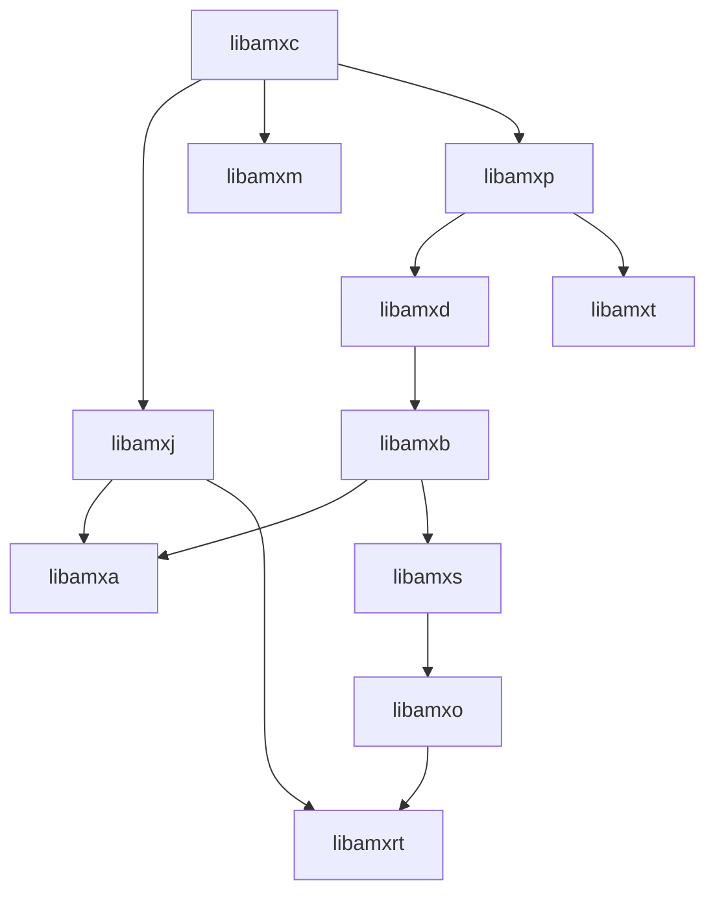

# Getting Started

Estimated Time Needed: 45 - 60 minutes.

[[_TOC_]]

---
> A `quick-start` which summerizes some usefull commands can be found [here](https://gitlab.com/prpl-foundation/components/ambiorix/tutorials/getting-started/-/blob/main/quick-start.md)
---

## Introduction

For years, desktop distributions have settled on D-Bus and systemd. In the embedded
world this is not yet the case. Many bus systems exist. Even in the opensource home gateway world, there are already at least 2 busses being used:

- ubus (OpenWRT)
- D-Bus (RDK-B)

And some companies provide their own proprietary bus system as well:

- PCB (SoftAtHome)

This makes it very hard to develop services and applications that can run on all distributions without rewriting (extending) them for the targeted software distribution.

The Ambiorix framework tries to solve this problem by providing adapters/mediators for each of the bus systems with on top of that a common API (aka BAAPI - Bus Agnostic Application Programmers Interface).

Another issue is the language used to create these services and applications. They are mostly written in C, a powerful but poor language. As already known many standard C library functions are not safe to use and the C library does not provide the commonly needed functionalities either. Some C libraries (e.g. GNU C library) provide extensions that solves some of the gaps, but not all.

One of the major things missing in the C language or C libraries are data containers and data collections. Although it is possible to create your own data collections, using C libraries, the implementations available are often very domain specific and can not be used in a general manner, resulting in many different implementations for the same problem over and over again.

The Ambiorix framework tries to fill in the gaps by providing generic data containers and data collections, and some common patterns (observer pattern, command pattern, ...).

Almost all API's provided by Ambiorix are Object Oriented inspired and written in C.

The focus of the Ambiorix framework is to provide API's that work well in an event driven single threaded application. As the API's are designed for a single threaded environment none of them are `thread safe`, no locking or waits are used.

## Goal

The goal of this tutorial is to explain how to create and set-up a development environment in which it is easy to:

- Build the Ambiorix framework.
- Build your own applications and services on top of the Ambiorix framework.
- Start your applications and let them connect to one or more bus system.

To make it easier to reproduce certain problems or provide support (by the support team), it is recommended that -where possible- the same environment is used. Although the final goal of each service/application is to be run on an embedded device, it is in most cases possible to develop/test/debug your service or application in an X86 (AMD64) Linux environment.

This is not the case when you have hardware dependencies. But even then, when the design of your service or application is good, it will be easy to abstract this hardware dependency.

## The Development Environment

As there are many different Linux distributions available (embedded and non-embedded), it is not possible to give a full description of what you need to install on your system. Luckily containers are available. 

Linux containers, in short, contain applications in a way that keep them isolated from the host system that they run on. So instead of adding and installing tools to your system, a container is used that contains the full development environment.

### Install Docker Engine

Before a container can be used, a container engine is needed. The most common available container engine is `Docker`.

How to install the `Docker Engine` depends on the Linux distribution you are using. 

- [Get Docker Engine - Community for Ubuntu](https://docs.docker.com/install/linux/docker-ce/ubuntu)
- [Get Docker Engine - Community for Debian](https://docs.docker.com/install/linux/docker-ce/debian/)
- [Get Docker Engine - Community for Fedora](https://docs.docker.com/install/linux/docker-ce/fedora/)
- [Get Docker Engine - Community for CentOS](https://docs.docker.com/install/linux/docker-ce/centos/)

If your distribution is not mentioned in the list above, you can look at this alternative:

- [Install from binaries](https://docs.docker.com/engine/install/binaries/)

Or search on the internet on how to install the docker engine for your distribution.

Please read [Post-installation steps for Linux](https://docs.docker.com/engine/install/linux-postinstall/) after you installed the docker engine.

### Fetch Container Image

Once the docker engine is installed you can fetch the `Ambiorix Dev&Dbg` container image. The image can be fetched using the docker command: [docker pull](https://docs.docker.com/engine/reference/commandline/pull/).

Fetch the image:

```shell
docker pull registry.gitlab.com/soft.at.home/docker/oss-dbg:latest
```

Once you pulled the image, you are ready to set-up your workspace and create your container.

### Set-up A Workspace

A workspace is a directory where you put all your sources. This workspace is shared between your container and you host system. This allows you to edit or work with the sources using your favorite editor or IDE.

For this tutorial we assume that the workspace directory is called `~/workspace/`

---

Note:<br>
All other tutorials assume that your shared directory is `~/workspace` and the name of the directory is the same on your host machine and in the container.

---

Just create this directory, it will be empty for now.

```shell
mkdir -p ~/workspace/
```

### Launch Container

Launching a container is done with a single docker command [docker run](https://docs.docker.com/engine/reference/commandline/run/).

This command has a huge set of command line options, so depending on what you need/want in the container other options can/must be provided.

In most use cases the following command and options should be sufficient:

```shell
docker run -ti -d --name amxdev --restart always --cap-add=SYS_PTRACE --sysctl net.ipv6.conf.all.disable_ipv6=1 -e "USER=$USER" -e "UID=$(id -u)" -e "GID=$(id -g)" -v ~/workspace:/home/$USER/workspace registry.gitlab.com/soft.at.home/docker/oss-dbg:latest
```

The above command creates and launches a container with a `pseudo-TTY` allocated (option `-t`) which can be used interactive (option `-i`). The container will be detached (option `-d`), so it will run in background. When you reboot the host system, the container will be relaunched at start-up of your host system (option `--restart-always`), if you don't want this behavior the option `--restart-always` can be omitted. As we want to be able to start debug sessions extra capabilities must be enabled (option `--cap-add=SYS_PTRACE`). In this case IPv6 is disabled in the container (option `--sysctl net.ipv6.conf.all.disable_ipv6=1`), note the IPv6 on your host system is not affected by this.

To make your user name and user id available in the container itself some environment variables are mapped into the container (options `-e "USER=$USER"`, `-e "UID=$(id -u)"`, `-e "GID=$(id -g)"`). Last but not least the workspace is shared between your host system and the container (option `-v ~/workspace:/home/$USER/workspace`): the directory before the `:` is the directory on your host system, the directory behind the `:` is the directory in the container. These directories can be different, but it is recommended to keep the same names, as it will improve the usage experience.

---

Note:<br>
Make sure that the directory name of your host system is correct. If the directory doesn't exist, the docker engine will create the directory in the container anyway, but then it is not shared between the host system and container. The permissions will also be incorrect and you will encounter `permission denied` errors when continuing with this tutorial.

---

The name of the created container in this example is `amxdev` (option `--name amxdev`), but the name can be freely chosen as long no other container has already been created with that name. In the remainder of this tutorial it is assumed that the created container is named `amxdev`.

To test that the container is working correctly execute the following command:

```shell
docker exec -ti -u $USER amxdev /bin/bash
```

This should open a terminal in your running container. The shared workspace directory should be available.

For the remainder of this tutorial all commands provided should be executed in the container and not on your host system, unless otherwise specified.

### Configure Container

To be able to pull and push sources from gitlab it is recommended that you configure your git account in the container. This step is optional, but will improve the experience as all tasks can be performed from within the container itself, except editing or modifying the source files which will be done using your favorite editor or IDE on your host.

The easiest way to work with git is to register a ssh key with your account. If later you want to block the container from accessing sources with your account you can just delete the key from your account.

Create a key-pair (public/private), invoke following command from with the container (so first open a terminal)

```shell
ssh-keygen -N "" -t rsa -b 2048 -C "<YOUR EMAIL HERE>" -f ~/.ssh/id_rsa
```
The above command will generate two files in `~/.ssh/`:

1. id_rsa
2. id_rsa.pub

The first one contains your private key (for the container) and the second one the public key (for the container)

The content of your public key must be added to your gitlab account. If you have no clue how to do this, please read  [adding an ssh key to your gitlab account](https://docs.gitlab.com/ee/user/ssh.html#add-an-ssh-key-to-your-gitlab-account)

Then set the following global git configurations in the container

```shell
git config --global user.email "<YOUR EMAIL HERE>"
git config --global user.name "<YOUR FULL NAME HERE>"
```

## Ambiorix Framework

We are almost there. When you have finished the previous chapter you should have a container up and running. The only thing left is to fetch the sources, build & install them, and try to run an example.

### Fetch Sources

As the Ambiorix framework consists of a set of git repositories we use a tool to manage this set. This tool is called `repo` tool and is already installed in the container. 

Open a terminal to your container if you didn't do that already, execute on your host system

```shell
docker exec -ti -u $USER amxdev /bin/bash
```

In that terminal set the current working directory to your workspace directory:

```shell
cd ~/workspace
```
And create a directory for the Ambiorix sources:

```shell
mkdir ambiorix
cd ambiorix
```

Now you have an empty directory. The first thing we need to do is initialize the repo tool, which will help to manage all the different git repositories with one command.

```shell
repo init -u git@gitlab.com:prpl-foundation/components/ambiorix/ambiorix.git
```

Now fetch the source and populate your workspace:

```shell
repo sync
```

Now you should have the latest releases of the Ambiorix git repositories available in your workspace directory. You can verify this using the tool `tree`

```shell
$ tree -d .
.
├── applications
│   ├── amxb-inspect
│   │   ├── include_priv
│   │   ├── packages
│   │   │   └── package_debian
│   │   └── src
│   ├── amx-cli
│   │   ├── config
│   │   ├── include_priv
│   │   ├── packages
│   │   │   └── package_debian
│   │   └── src
│   ├── amxo-cg
│   │   ├── include_priv
│   │   ├── packages
│   │   │   └── package_debian
│   │   └── src
│   └── amxrt
│       ├── include_priv
│       ├── packages
│       │   └── package_debian
│       ├── src

....

```

#### Directories

The following directories should be available:

```bash
$ ls -la
total 40
drwxrwxr-x 10 matthias matthias 4096 Mär  2 16:29 .
drwxrwxr-x  4 matthias matthias 4096 Mär  2 16:29 ..
drwxrwxr-x  9 matthias matthias 4096 Mär  2 16:29 applications
drwxrwxr-x  4 matthias matthias 4096 Mär  2 16:29 bindings
drwxrwxr-x  5 matthias matthias 4096 Mär  2 16:29 bus_adaptors
drwxrwxr-x  4 matthias matthias 4096 Mär  2 16:29 cli_extensions
drwxrwxr-x  5 matthias matthias 4096 Mär  2 16:29 dockers
drwxrwxr-x  7 matthias matthias 4096 Mär  2 16:29 examples
drwxrwxr-x 12 matthias matthias 4096 Mär  2 16:29 libraries
drwxrwxr-x  7 matthias matthias 4096 Mär  2 16:29 .repo
```

- `libraries` contains all Ambiorix library git repositories
- `applications` contains all Ambiorix tools and application git repositories
- `bus_adaptors` contains all Ambiorix bus backend git repositories (aka bus back-ends)
- `examples` contains a set of Ambiorix example code git repositories
- `tutorials` contains all Ambiorix tutorial git repositories
- `dockers` contains all Ambiorix docker container git repositories
- `cli_extensions` contains all Ambiorix amx_cli add-on git repositories

### Compile & Install

Let's compile the Ambiorix sources and install them in the container. 

#### Manual

You can cd in every single repository and run the following commands to compile and install a component:

```shell
make
sudo -E make install
```

The Ambiorix libraries must be compiled and installed in a specific order, because of the existing interdependencies between the libraries. These dependencies are visualized in the dependency graph:



#### Using predefined commands

The ambiorix repo contains a script that contains some functions to make it easy to (re)compile the Ambiorix libraries and tools. These commands are:

- `amx_rebuild_libs` - (re)compile & install all libraries
- `amx_rebuild_bus_backends` - (re)compile & install the bus adapters & mediators
- `amx_rebuild_apps` - (re)compile & install all Ambiorix tools
- `amx_rebuild_examples` - (re)compile & install all examples
- `amx_rebuild_all` - (re)compile & install all Ambiorix repositories

These commands should all be invoked from the workspace root directory.

Source the scripts so these functions can be used:

```
source .repo/manifests/scripts/local_commands.sh
```

We need to compile & install everything - so let's start:

```shell
amx_rebuild_all
```

Depending on your machine this will take between 1 minute and 1 minute 30 seconds.

If all goes well, no errors occur and everything is installed in the container.

### Run Example

All sources are now compiled and installed, so it's time to run an example.

Before we start one of the examples we need to start a bus system. The container you have created contains two bus systems, pcb and ubus, both can be started simultaneous.

---

Note:<br>
The software busses and the example must be started as `root` user in the container. Do not worry, the `root` user in the container is not the same as the `root` user of your host system. The container `root` user has totally no access to your host system, except to the shared `workspace` directory.

---

From your host system start a new container terminal:

```shell
docker exec -ti amxdev /bin/bash
```

After that you should have a terminal open, running in your container as `root` user. 

Let us start the PCB system bus:

```shell
pcb_sysbus
```

And now start the ubus daemon:

```shell
ubusd &
```

And last but not least, start the `greeter` example:

```shell
greeter -D
```

It is possible you will see some output generated by the `greeter` example, but you can ignore that for now.

If all went well you should be able to see the `greeter` example's data model when invoking the following ubus command:

```shell
ubus list
```

The output you will get should be simular to:

```shell
root@811203fdc548:~# ubus list
Greeter
Greeter.History
Greeter.History.1
Greeter.Statistics
```

With the `pcb_cli` tool, the data model of the `greeter` example should be visible as well:

```shell
root@811203fdc548:~# pcb_cli Greeter?
Greeter
Greeter.MaxHistory=10
Greeter.State=Idle
Greeter.HistorySize=1
Greeter.History
Greeter.History.1
Greeter.History.1.Message=Welcome to the Greeter App
Greeter.History.1.Retain=1
Greeter.History.1.From=odl parser
Greeter.Statistics
Greeter.Statistics.EventCount=2
Greeter.Statistics.DelHistoryCount=0
Greeter.Statistics.AddHistoryCount=0
```

## Recommended Reading

### Coding Guidelines

When creating a new software component (or contributing to an existing component), it is recommended that the Ambiorix coding guide lines are followed, as described in [Ambiorix Coding Guidelines](https://gitlab.com/prpl-foundation/components/ambiorix/ambiorix/-/blob/main/doc/CODING_GUIDELINES.md)
### Contributing

All contributions are welcome. Before contributing read the CONTRIBUTING.md of the software component you want to contribute to.

Example: [libamxb CONTRIBUTING.md](https://gitlab.com/prpl-foundation/components/ambiorix/libraries/libamxb/-/blob/main/CONTRIBUTING.md)

And also read the [CODE_OF_CONDUCT](https://gitlab.com/prpl-foundation/components/ambiorix/ambiorix/-/blob/main/doc/CODE_OF_CONDUCT.md)

### Docker 

Learn the `basic` docker commands, these will help you in managing your local docker containers and images.

- [docker pull](https://docs.docker.com/engine/reference/commandline/pull/) - Pull an image 
- [docker run](https://docs.docker.com/engine/reference/run/) - launch a container
- [docker exec](https://docs.docker.com/engine/reference/commandline/exec/) - Run a command in a running container
- [docker start](https://docs.docker.com/engine/reference/commandline/start/) - Start one or more stopped containers
- [docker stop](https://docs.docker.com/engine/reference/commandline/stop/) - Stop one or more running containers
- [docker rm](https://docs.docker.com/engine/reference/commandline/rm/) - Remove one or more containers
- [docker images](https://docs.docker.com/engine/reference/commandline/images/) - List images 
- [docker rmi](https://docs.docker.com/engine/reference/commandline/rmi/) - Remove one or more images

## Conclusion

After going through this tutorial you should be able to:

- Create a Development & Debug container
- Fetch, build & install the Ambiorix sources in the container
- Start the bus systems (ubus & pcb) in the container
- Run a Ambiorix data model (example) plug-in and interact with using the bus specific tools.

## Where to go next?

Other tutorials are available as well, each tutorial handles one specific topic. The recommended order is:

1. [Getting Started](https://gitlab.com/prpl-foundation/components/ambiorix/tutorials/getting-started/-/blob/main/README.md)<br>
   You are in this tutorial
1. [Data Models - Introduction](https://gitlab.com/prpl-foundation/components/ambiorix/tutorials/datamodels/introduction/-/blob/main/README.md)<br>
   What are data models? Where are they coming fom?<br>
   This tutorial provides answers to these questions and explains where Ambiorix is fitting in the picture.
1. [Data Models (server) - Define And Publish](https://gitlab.com/prpl-foundation/components/ambiorix/tutorials/datamodels/server/define-publish/-/blob/main/README.md)<br>
   How to define a data model and how to make it available on different bus systems.<br>
1. [Collections - Variants](https://gitlab.com/prpl-foundation/components/ambiorix/tutorials/collections/variants/-/blob/main/README.md)<br>
   Common data containers and collections. Variants are used a lot in Ambiorix data models. If you understand variants and how to use them, the other tutorials will be easier to understand.

    Ambiorix provides other data containers and collections as well. You can do these tutorials as well.
    1. [Linked List](https://gitlab.com/prpl-foundation/components/ambiorix/tutorials/collections/linked-lists/-/blob/main/README.md)<br>
       Explains the Ambriorix Linked List API
    1. [Hash Table](https://gitlab.com/prpl-foundation/components/ambiorix/tutorials/collections/hash-tables/-/blob/main/README.md)<br>
       Explains the Ambiorix Hash table API
    
1. [Data Models (client) - Simple Client](https://gitlab.com/prpl-foundation/components/ambiorix/tutorials/datamodels/client/simple-client/-/blob/main/README.md)<br>
   Explains how you can create a simple application that connects to a bus system and interacts with a data model.
1. [Data Models (server) - Validation](https://gitlab.com/prpl-foundation/components/ambiorix/tutorials/datamodels/server/validation/-/blob/main/README.md)<br>
   Explains how to validate the parameter values and the objects in your data model.
1. [Data Models (client) - Subscriptions](https://gitlab.com/prpl-foundation/components/ambiorix/tutorials/datamodels/client/subscriptions/-/blob/main/README.md)<br>
   Explains how a client application can subscribe and get events from a application that exposes a data model.
1. [Data Models (server) - Events](https://gitlab.com/prpl-foundation/components/ambiorix/tutorials/datamodels/server/events/-/blob/main/README.md)<br>
   Explains how you can act on changes in your data model and how to create and send custom events.
1. [Data Models (server) - MIBS](https://gitlab.com/prpl-foundation/components/ambiorix/tutorials/datamodels/server/mibs/-/blob/main/README.md)<br>
   Explains Modularity Information Blocks - how to extend your data model.
1. [Tools - amxrt](https://gitlab.com/prpl-foundation/components/ambiorix/tutorials/tools/amxrt/-/blob/main/README.md)<br>
   Explains the Ambiorix Run Time application and the configuration section in an odl file
1. [Data Models (server) - RPC methods](https://gitlab.com/prpl-foundation/components/ambiorix/tutorials/datamodels/server/rpc-methods/-/blob/main/README.md)<br>
   Explains how to implement data model RPC methods.
1. [Data Models (server) - Private data](https://gitlab.com/prpl-foundation/components/ambiorix/tutorials/datamodels/server/private-data/-/blob/main/README.md)<br>
   How to add private data structures to your data model


## References

- quick-start guide<br>
https://gitlab.com/prpl-foundation/components/ambiorix/tutorials/getting-started/-/blob/main/quick-start.md
- Docker<br>
https://docs.docker.com/
- Docker Command Line<br>
https://docs.docker.com/engine/reference/commandline/docker/
- Ambiorix Dev&Dbg container<br>
https://gitlab.com/soft.at.home/docker/oss-dbg/-/blob/main/README.md
- repo tool<br>
https://gerrit.googlesource.com/git-repo/+/refs/heads/master/README.md
- repo Command Line<br>
https://source.android.com/setup/develop/repo
- Ambiorix gitlab<br>
https://gitlab.com/prpl-foundation/components/ambiorix
- SAH Greeter Plug-in Example<br>
https://gitlab.com/prpl-foundation/components/ambiorix/examples/datamodel/greeter_plugin
- Ambiorix Coding Guidelines<br>
https://gitlab.com/prpl-foundation/components/ambiorix/ambiorix/-/blob/main/doc/CODING_GUIDELINES.md
- Code Of Condut<br>
https://gitlab.com/prpl-foundation/components/ambiorix/ambiorix/-/blob/main/doc/CODE_OF_CONDUCT.md
